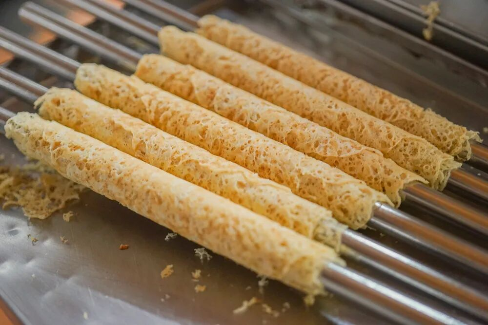
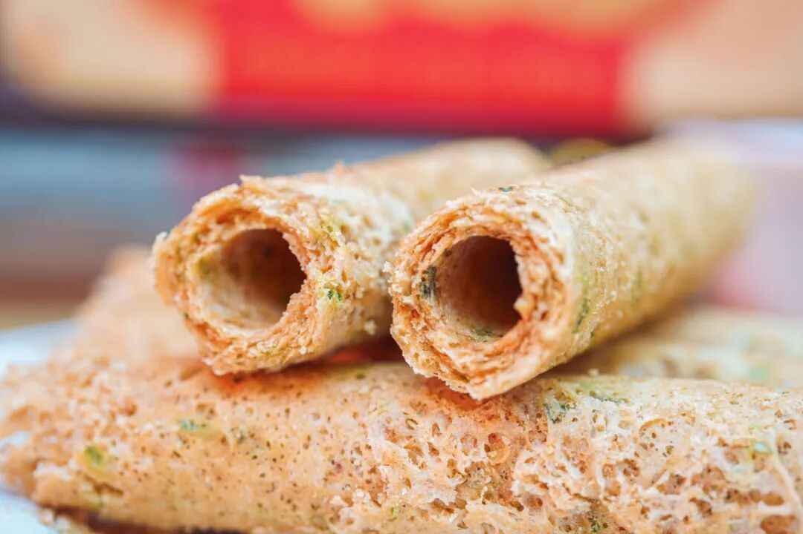
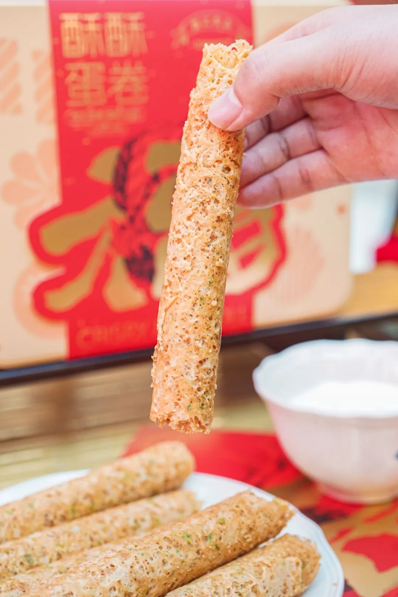
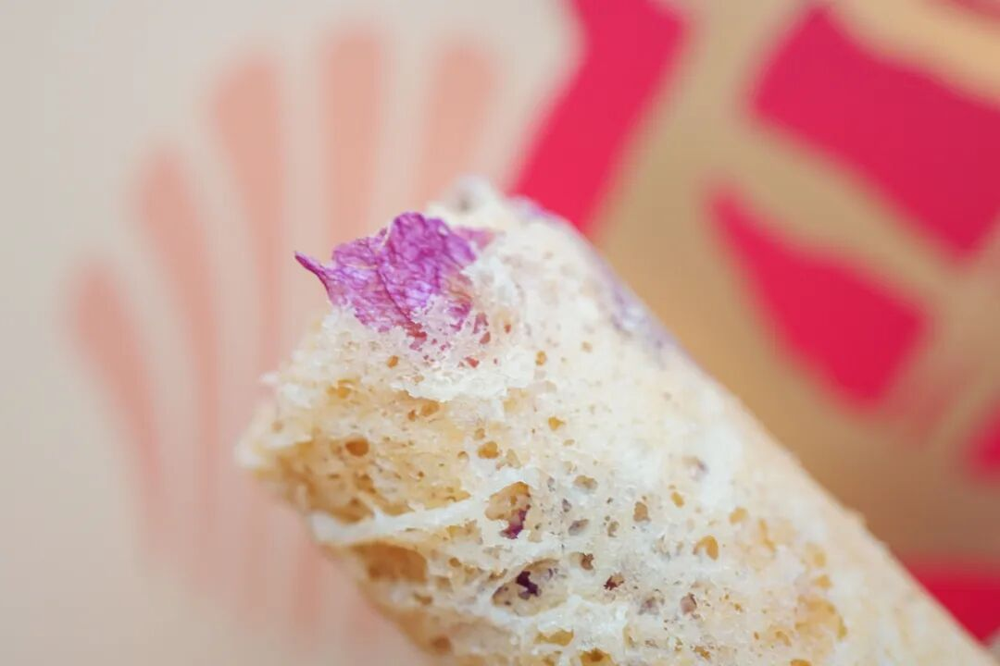
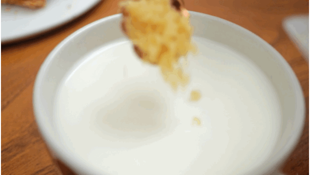
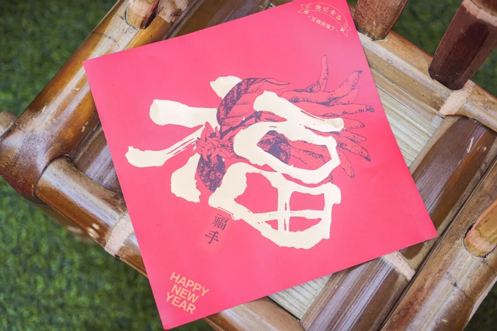
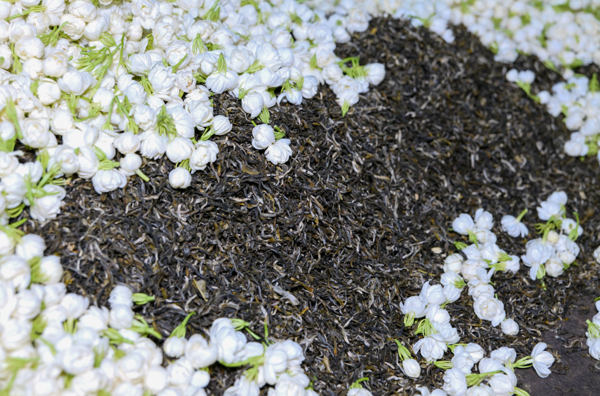
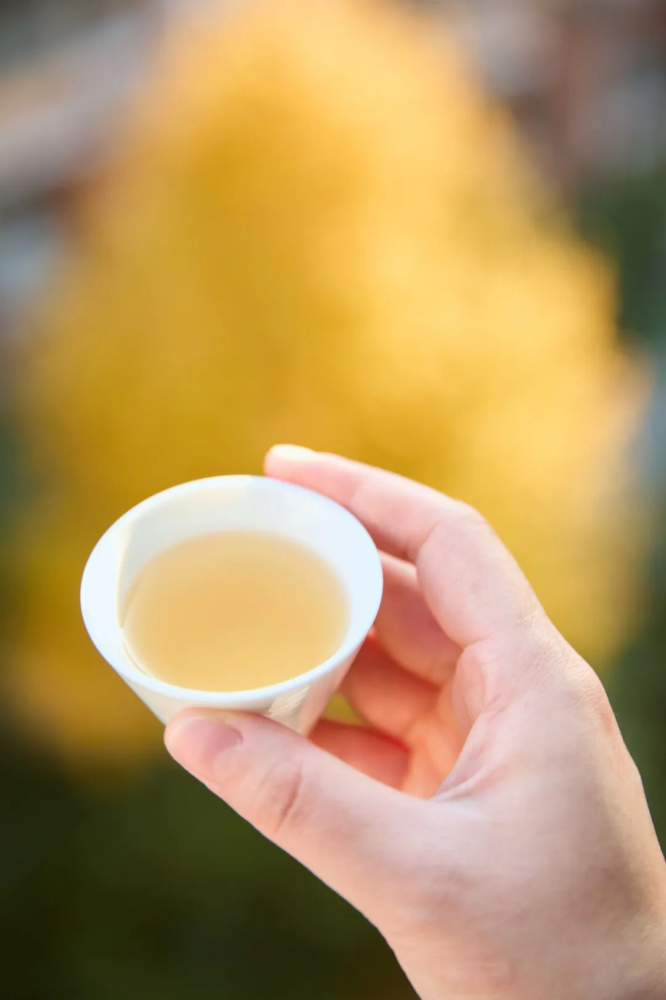
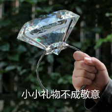

# 渣是真渣，爱也是真爱

- 原文链接: https://mp.weixin.qq.com/s?__biz=MjM5NTYxODQyMA==&mid=2653465720&idx=1&sn=2b062b3bec8b61ac28b0653248964134&chksm=bc6a0bdf53641395e280963fe816be8a86eef58ce828afc25cb60c6e14737b6e9e5baee8db3f&scene=27#wechat_redirect
- 浏览量: N/A
- 点赞数: N/A
- 评论数: N/A
- 转发数: N/A

## 正文

令人上头！！

一个尽情安利自我的公众号

以下是没事干研究院的风物研究报告请放心食用
大家好，已经无心上班了！今天这篇稿子，是被我司最卷的产品同事催的。两样新的好东西，由此人千辛万苦卷出来，说超适合买回去当年货啊啊啊啊！

年货好东西其一：回到童年的新春限定·酥酥蛋卷！

是儿时记忆里的年味铁盒，超大一罐，
打开是小袋的独立包装，（谁看了不说一句贴心？适合全家分着吃。吃完了还能像小时候那样放着收纳。

老朋友们可能会知道，此蛋卷大有来头。

香酥，极其香酥，

好吃的秘诀无它，

就是舍得下料，手工制作！

新鲜鸡蛋含量大于 24 %，入口化沙。

都是广东镇上老师傅手工卷制，6 层蛋皮酥，周身布满迷人的蕾丝纹理，咬一口便簌簌地往下掉。

车间里坐满了专业卷蛋卷的阿姨，一人两台机器重复着手工卷的这道工序。

当地依然保持着传统的手作工艺，调好浆，卷成筒，放凉，就出炉了～

三种口味！原味&南乳香葱味是老朋友了。原味香甜酥脆。

南乳香葱味是饱记定制！

外面根本买不到！

真实添加南乳和香葱，一口下去咸甜适中！

新增的玫瑰风味，真实添加了重瓣玫瑰，入口花香馥郁自然，又清新又淡雅，美啊～～～

过年下午茶甚至当早餐，
怎么样都好吃！
蘸着吃👇

舀着吃👇

拌着吃👇

老板大手一挥，

今年又让设计同事出了

绝美「福」字。

每单都会附赠一张哦！

带着福字的佛手，

寓意新年福寿安康、如意吉祥！

贴门上、贴墙上，

都出彩又特别嘿嘿～

好了，

剩下的你们看详情页吧。

老规矩，

限时早鸟 86 折！！

总而言之，

这蛋卷老少没有不爱的！

饱记·新春限定酥酥蛋卷购买方式如下限时早鸟 86 折！！！
戳图购买👇

先别走！年货好东西其二：入口有冰糖韵的小金罐·六窨茉莉花茶👇

福州乃茉莉花茶的发源地，

我司特地委托了

家中五代制茶的福州老茶人，

以传统古法窨制正宗茉莉花茶！

先要在夏季鲜采数百斤茉莉花，

因为那个时节温度高但雨水少，

茉莉花柔和鲜灵，

运回后再仔细拣选，

只留花苞、颜色、大小合适的茉莉花

与茶叶拼和。

再精选明前茶坯，

六窨一提传统窨制，

下花量高达 350 斤

这还没完！

福州古法做花茶，

见花香不见花，

茉莉花窨完后还要以手工挑除，

只留茶叶与花香～

道道反复工序，

才有最后的舌尖一点冰糖韵，

抿一口茶汤，扑鼻香气～

鲜灵得让人神清气爽，

甘爽醇和，舌尖回甘，

过年聚餐饭后喝喝正合适啊！

升级小金罐包装，

拎着当伴手礼，

也显得咱大大方方儿的！

同样老规矩，

限时早鸟 86 折！！

冲它！！！

饱记·六窨茉莉花茶购买方式如下限时早鸟 86 折！！！
戳图购买👇

题 外

敲锣打鼓，

千呼万唤的饱记年货礼盒，

天🐱有赞同折扣！

限时单盒立减 58 元！

双盒立减 126 元！

今年冬天的富平柿饼现货中！

新年限时 85 折！

很厉害的海鲜礼盒，

舟山渔场野生海捕，

也有新年限时 86 折！

其他适合空调房吃吃的水果看这里👇

难得一寻的蜜蜜甜冬日葡萄，

有浓郁花香味的云南露天葡萄，

这俩都有限时早鸟 86 折！

拿过金奖的上海白鹤红颜草莓，

来自广西融安的脆蜜金桔。足以颠覆自小到大的金桔风味印象！

还有今年份的象山红美人，

入口似果冻般嫩嫩滑滑～

现在都有限时 9 折！

此外刚补货的 75% 木姜子黑巧克力，

90 天短保质期的大师凤梨酥，

还有刚补货新到的饱记腊味们，

也都有限时 9 折冲冲！

饱记·年货礼盒

单盒立减 58 元

双盒立减 126 元

戳图下单购买👇

饱记·富平柿饼

购买方式如下

年货节限时 85 折！！！

戳图购买👇

饱记·2025 海鲜礼盒购买方式如下限时早鸟 86 折！！！

戳图购买👇

饱记·冬日蜜蜜甜葡萄

限时 9 折！！！

新年紫气东来！！！

戳图购买👇

饱记·云南高原蓝莓

限时 9 折！！！

新年莓开眼笑！！！

戳图购买👇

饱记·红颜草莓限时吃水果 9 折！！！新年莓有烦恼！！
戳图购买👇

饱记·融安脆蜜金桔限时吃水果 9 折！！！新年大桔大利！！！
戳图购买👇

饱记·象山红美人柑橘限时吃水果 9 折！！！
戳图购买👇

饱记·新鲜到货凤梨酥

限时 9 折！！！
戳图购买👇

饱记·云南木姜子75%黑巧克力

购买方式如下

限时 9 折！！

戳图下单购买👇

或🍑🍑🍑搜索

「艾格吃饱了」

饱记·手工腊肠

购买方式如下👇

限时全年地板价

戳图下单购买👇

或🍑🍑🍑搜索

「艾格吃饱了」

饱记·玫瑰露酒腊肉&腊排骨

购买方式如下👇

限时全年地板价

戳图下单购买👇

或🍑🍑🍑搜索

「艾格吃饱了」

本文的研究员

薯角多吃点，好过冬

用好吃的方式吃一生

祖国各地好风物

文章转载请加微信「baojiclub」

