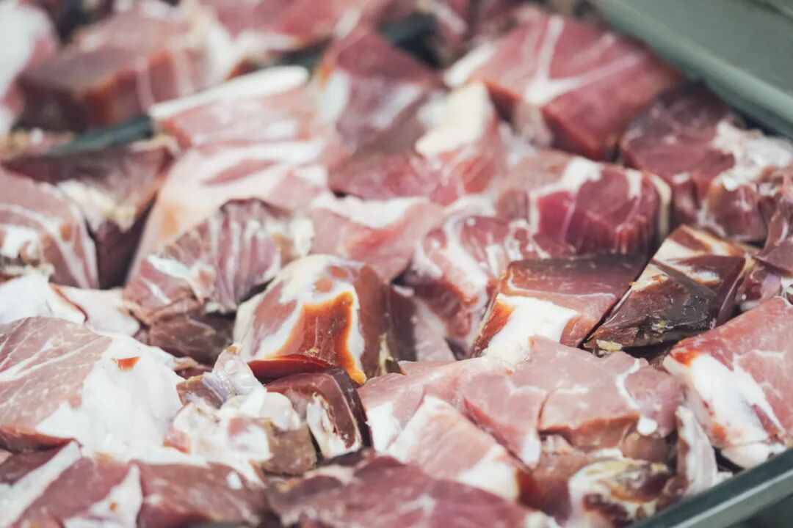
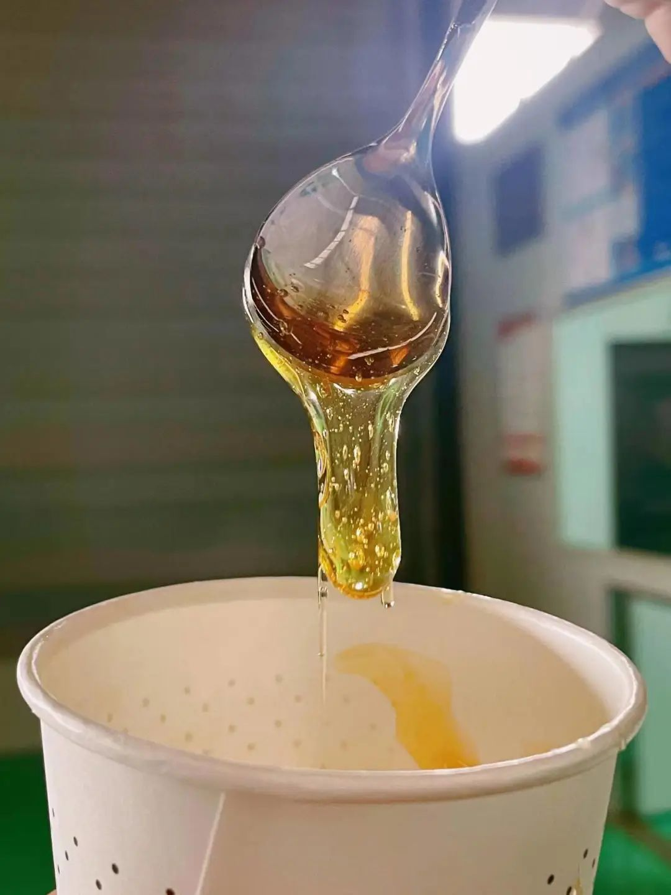
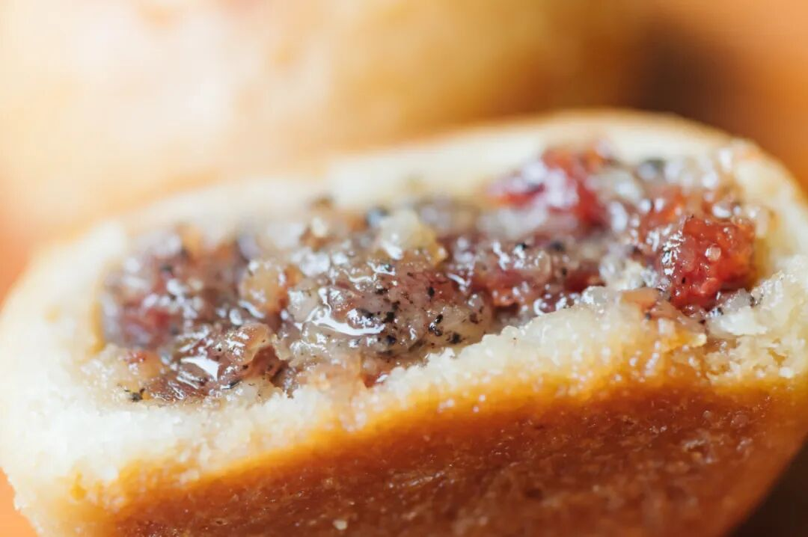
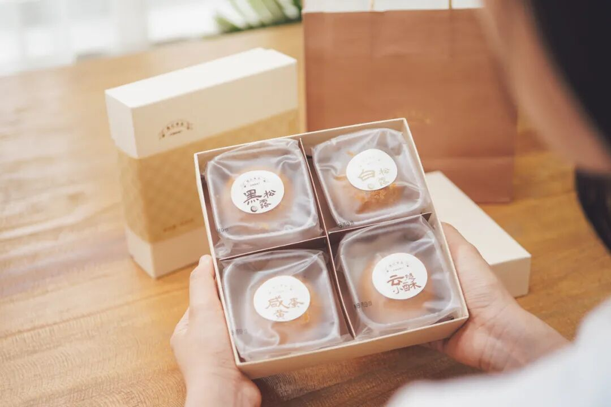
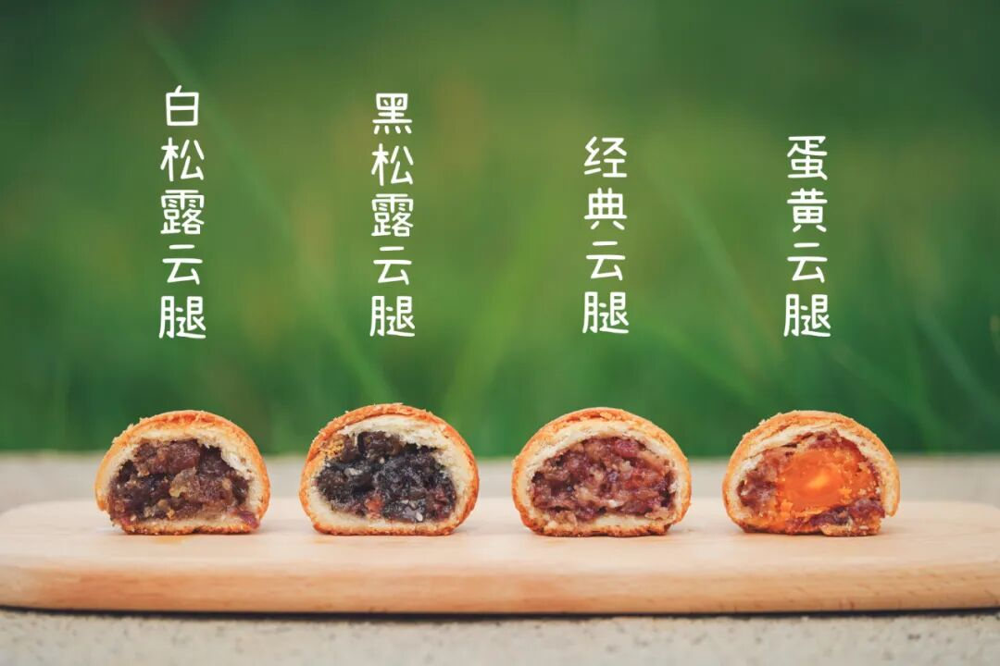
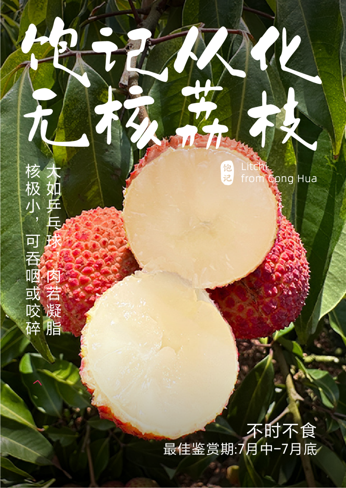

# 白松露和肉的味道，香迷糊了

- 原文链接: https://mp.weixin.qq.com/s?__biz=MjM5NTYxODQyMA==&mid=2653456625&idx=1&sn=55601775ab40dae0f4098339b4c03c46&chksm=bc72fecc27ca010e89eaf2b337350f934df15b3e6e0879418d50f856cf13de75fe284dcb340d&scene=27#wechat_redirect
- 浏览量: N/A
- 点赞数: N/A
- 评论数: N/A
- 转发数: N/A

## 正文

白松露的味道我知道

一个尽情安利自我的公众号

以下是没事干研究院的风物研究报告请放心食用

周五了！！！

离下班只差临门一脚。

既然你已经点了进来

不如顺道帮薯角我完成一个 kpi！

客官，请往下看👇

今天就讲这一枚，卷里卷气的云腿酥，时隔一年，终于归来。

一口下去，酥晕了！香死了！鲜甜交织的口感，不敢想象我要是在烤箱旁，
一天得炫上几个？

在宣威海拔 1800 米左右的仓库里自然发酵的腿👇

配上云南当地采的杂花蜂蜜（自带浓郁花香

佐以欧洲米其林餐厅常用的黑、白松露酱，浓郁地拌出不同口味的馅儿。

这样的云腿酥，约等于在吃肉。越嚼越香，谁还想得起来上班啊～

强势安利全家福组合，四种口味！黑松露+白松露+蛋黄，
当然还有经典原味，一盒总共 8 枚。

好了，以上。

赶在老板冲去直播之前，

薅来一个早鸟 86 折！！

（还得是我啊～

大家多多下单，

助力薯角早早下班！！

还可以边吃边去📕看我老板上班～

（详见今日次条！！

饱记·滇式云腿小酥
预售中！！！早鸟价 86 折！！！购买方式如下

传统滇味经典，

新鲜手作，浓情四溢。

🥮四个口味：

经典云腿、蛋黄云腿，

黑松露云腿、白松露云腿。

🥮三种规格：

云腿酥礼盒全家福

（四个口味各 2 枚）

云腿酥礼盒双拼

（经典云腿小酥*4 枚+蛋黄云腿小酥*4 枚）

云腿酥礼盒囤货装

（经典云腿小酥*30 枚）

现在是预售！

预计 7 月底到 8 月初发货！

戳图买它👇

题 外

本薯昨晚的加班成果大家看到了吗？

悄悄上了今年的夏黑葡萄！

来自马陆镇，

人称上海吐鲁番。

拿过铜奖，是高甜的爆汁小炸弹，

限时早鸟 86 折！！

尾声的阳山·湖景水蜜桃，

也有最后的 9 折！！

个大高甜的从化无核荔枝，

可搭配增城荔枝尝尝鲜！

今年因为天气原因巨贵！！

所以，打不起折hhhh

吃完这几天就没啦！

饱记·马陆夏黑葡萄购买方式如下早鸟价！！86 折！！

马陆是上海的王牌葡萄产地，
获得了国家农产品地理标志，
饱记选择的果园曾于 2021 年获葡萄评比铜奖。
果肉饱满，风味浓郁。外皮紫黑，皮薄少籽。高甜！！！
🍇「饱记·马陆夏黑葡萄」两个规格：两串装·2.5 斤四串装·5 斤

建议放入冰箱冷藏，3 天内食用完。

戳下图购买👇

饱记·阳山湖景水蜜桃

购买方式如下

9 折！！！

阳山桃中比较晚熟的品种，

花了更多时间在果园里积蓄养分，

接班白凤水蜜桃，

更为香甜多汁！

🍑「无锡阳山·湖景水蜜桃」

两个规格：

特级·阳山湖景水蜜桃

单果 6～7 两，

一箱共计 8 颗。

优级·阳山湖景水蜜桃

单果 5～6 两，

一箱共计 8 颗。

不建议放入冰箱冷藏，

会容易影响口感。

阴凉通风处保存，优先食用软桃。

戳图买它👇或🍑🍑🍑搜索「艾格吃饱了」

饱记·从化无核荔枝

购买方式如下

来自广东从化，

地处北回归线，

气候温和，黄土壤居多，

更适宜荔枝生长～

并蒂双生果核，自然退化，核小且软，可吞咽或咬碎，剥开皆是水灵灵果肉。
凌晨采摘，放冷藏预冷，
当天直接从果园冷链车运输到机场，减少荔枝脱温时间，为的就是新鲜～
五种规格：双拼：无核荔枝 1.5 斤+糯米糍 1.5 斤
无核荔枝 1.5 斤+仙进奉 1.5 斤
糯米糍 1.5 斤+仙进奉 1.5 斤三拼：无核荔枝 1 斤+糯米糍 1 斤+仙进奉 1 斤单品种：无核荔枝 3 斤装
下单后 5 天内发～
戳图买它👇

饱记·增城荔枝仙进奉+糯米糍！！！
购买方式如下
一骑红尘妃子笑，说的就是增城！自古以来的岭南荔枝名产地～
🍚想一颗就吃爽的选「糯米糍」；💦喜欢特别嫩多汁的选「仙进奉」；最后的数天，
吃完一起许愿明年好天气！别那么贵了你！！！
三种规格：双拼：糯米糍 1.5 斤+仙进奉 1.5 斤单品种：糯米糍 3 斤装
仙进奉 3 斤装
下单后 5 天内发～
戳图买它👇

本文的研究员

薯角我不胖谁胖？

用好吃的方式吃一生

祖国各地好风物

文章转载请加微信「baojiclub」

