# 白白香香甜甜，同事连干两碗。。。

- 原文链接: https://mp.weixin.qq.com/s?__biz=MjM5NTYxODQyMA==&mid=2653469437&idx=1&sn=e0d20a8e3d05150019b28f0d9475cbf3&chksm=bceab8206030af30c0530e7b42b911956ccba21f4361223e66064a41235797757cf92df2ffbd&scene=27#wechat_redirect
- 浏览量: N/A
- 点赞数: N/A
- 评论数: N/A
- 转发数: N/A

## 正文

囤零食时间到

一个尽情安利自我的公众号

以下是没事干研究院的风物研究报告请放心食用
开门见山！就是打折！一些卷里卷气的好东西，被落在架上。周末自家吃吃完全不影响啊！现在小🍊序直接6 折和 7 折专区走起！效期也给大家标注了，介意慎拍哦！

此外，产品同事从仓库里翻出了两样年货节口碑好物！来自大兴安岭的浓香大米，适合下酒的岭南陈皮花生，（往底部滑！！同样给大家清仓 7 折！！

1.饱记·手工腊肠效期至 25 年 5 月/7月

我饱记腊肠，

想必不用多说了吧。。。

都是真材实料！用的纯黑猪肉，产品同事说现在外面很多电商腊肠，都会加入部分大豆蛋白，和猪肉比起来简直成本可忽略不计。而这种添加甚至可以在配料表上并不体现。。。

除了猪肉，腊肠的肠衣也有讲究！饱记就是用中国人民几百年晒腊肠用的，猪肠衣。成本高，但是架不住口感好！嚼起来 Q 弹有韧劲，最后又会在口腔里化开。而便宜货可以用科技品：胶原蛋白肠衣。就是蒸完嚼不大烂可以整条脱下来吐出来的那种！

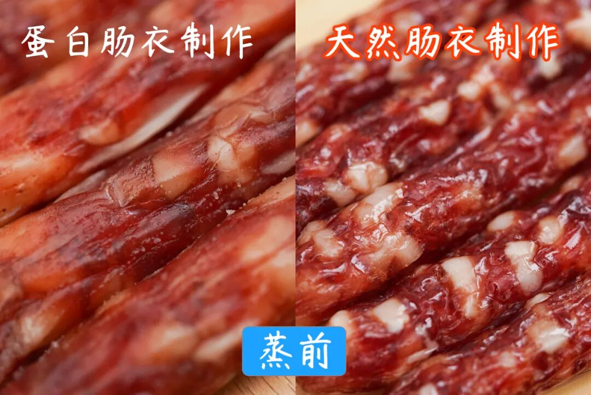

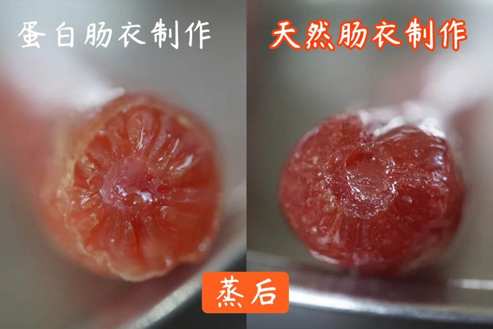

天然肠衣一眼就能看出来，比较薄和透

一共三种选择！口味一：手工广式腊肠，

有四六和二八这两个肥瘦比例可选。

效期至 25 年 7 月

口味二：滇式腊肠

用了不少贵价的辛香料，各种香味在唇齿间乱窜。亲测怕辣的人也能吃！

效期至 25 年 5 月！

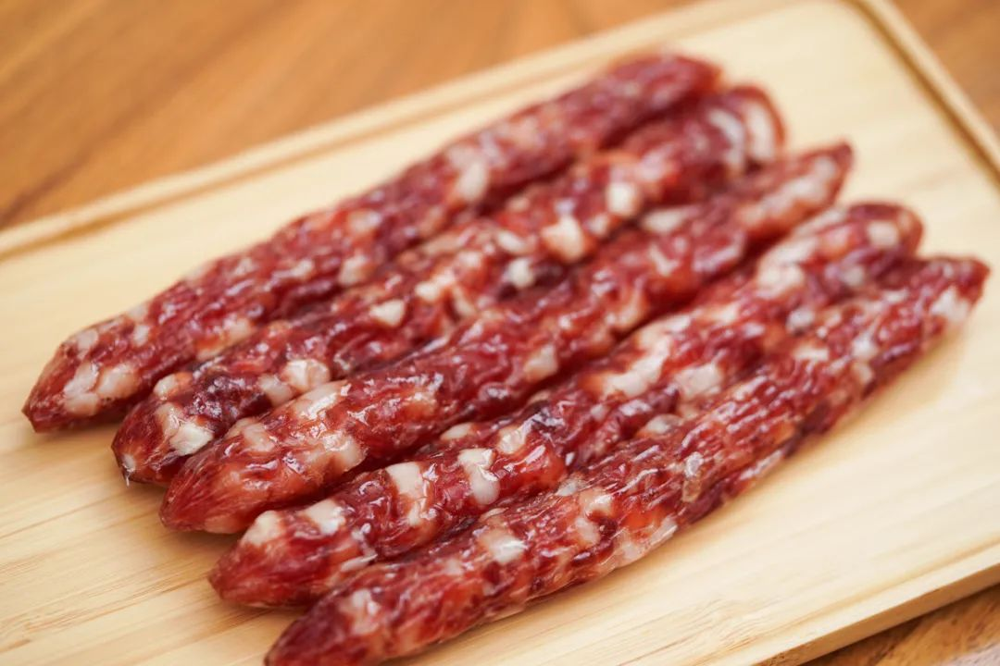

2.玫瑰露酒腊肉&腊排骨效期至 25 年 6 月/7 月
除了腊肠，
产品同事老藏着掖着的还有我司卷生卷死的

玫瑰露酒腊肉👇

效期至 25 年 6 月。

这腊肉用料实在，但好吃不贵！
腌肉用的玫瑰露酒。
找了好久，
才选中天津老字号金星的玫瑰露酒，花香酒香协调且纯正，可以给肉带来一股自然的玫瑰香！

肉呢，用的带软骨的猪肋排，每头猪仅能产出两条，非常矜贵。

每 100 斤肉就要用掉 7-8 斤玫瑰露酒，并用草绳一一吊挂，腌制 4 小时以上。最后用当地特有的长竹竿整排吊挂，经过 3 天的风干锤炼，才变成了一条条成色隽美的腊肉。

如果你跟本薯一样，不喜欢很重的糖度或略呛人的白酒味，买饱记的这款腊肉就是有福了！我司相应减少了糖的比例，更能突出肉的原香👇

饱记：酒肉与肉香交织，能尝到猪肉的原香。网购：酒味盖住了肉香，调味整体偏甜。

别急，还有！

这道腊排骨火锅，

是地道的云南丽江美食。

不到百元，教你在家复刻！

就是把腊排骨放锅里炖煮 1 个半小时，

直到炖煮到这样的浓汤。

加入韭黄番茄大葱玉米，

腊排骨的汤底就完成了！

其他和吃火锅一样，

想涮什么下什么，

菌类啦蔬菜啦都很好，

还能带来一点甜味。

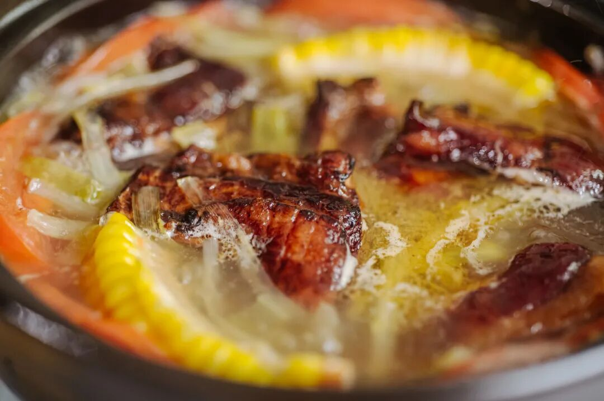

最好再调一个蘸水！

云南风味的灵魂！

蒜泥+香菜+辣椒粉+腐乳+线椒，

最后淋上一点腊排骨的汁即可。

提醒一下，

排骨提前浸泡 3-4 个小时再下锅煮，

否则会太咸。总之，

不需要任何厨艺，

不到一百块钱，

你就能做出这样的冬日暖锅！

效期至 25 年 7 月。

冲！

3.手剥红松子效期至 25 年 5 月
看图，品相看的见哦，果肉饱满，粒粒大颗，轻松就能手剥。果仁自带松子油脂的醇香，吃得满嘴生香，快乐停不下来。

松子来自长白山原始森林红松树，15 年结果，两年果实才能成熟，经五道筛选工序，开口率高达约 96%。

4.四川小麻花（芝麻&黑糖）效期至 25 年 5 月/6月
这个四川传统小零食：小麻花，是好吃到让我们一个自家做糕点酥类的大厂供应商都好奇的程度。

用的进口一级大豆油，和特制高筋粉。一共两个口味打折：
唇齿留香的芝麻麻花，效期至 25 年 5 月。用手工熬黑糖裹制的黑糖麻花，
效期至 25 年 6月。都不硬不腻不粘牙！

确实是市面上少见，重点是酥，脆，甜却不腻口，面粉配比讲究得很，别看就卖你十几块，有功夫在身上的。一定要去买！

5.酥酥纸盒蛋卷&铁盒蛋卷效期至 25 年 6 月
极其香酥的酥酥蛋卷！分为纸盒装和铁盒装。

好吃的秘诀无它，

就是舍得下料，手工制作！

新鲜鸡蛋含量大于 24 %，入口化沙。

纸盒装两种种口味！原味&南乳香葱味是老朋友了。原味香甜酥脆。南乳香葱味是饱记定制！

外面根本买不到！

铁盒装里有新增的玫瑰风味，真实添加了重瓣玫瑰，入口花香馥郁自然，又清新又淡雅。

6.馋嘴牛肉五香味效期至 25 年 6 月

五香的咸香味浓，

打游戏爱吃！

7.酸梅汤效期至 25 年 7 月

酸梅汤，咱们中华儿女都熟。

这款用到了八味配料：

乌梅、橘皮、山楂、薄荷，

玫瑰茄（洛神花）、甘草、桂花，

还加了一点冰糖中和酸味！

没有乱七八糟的硫熏和色素，

即使是同某堂的师傅来看，

也是服气的。

做了免煮的三角包设计，

操作难度零颗星，

加热水让冰糖融化，

再静候几分钟即可。

冰镇后加点冰块，

酸甜清爽，咕咚咕咚一大杯！

8.蜜桔干效期至 25 年 8 月

产自世界柑橘始祖地之一的台州黄岩，10斤蜜桔才能出一斤蜜桔干，选的无核品种、酸酸甜甜，可以配茶吃。

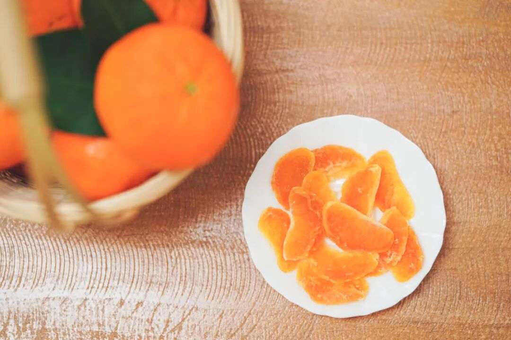

这迷人的橘子芬芳，这酸甜可口的味道，吃了它，大鱼大肉我还能再战三百回合！

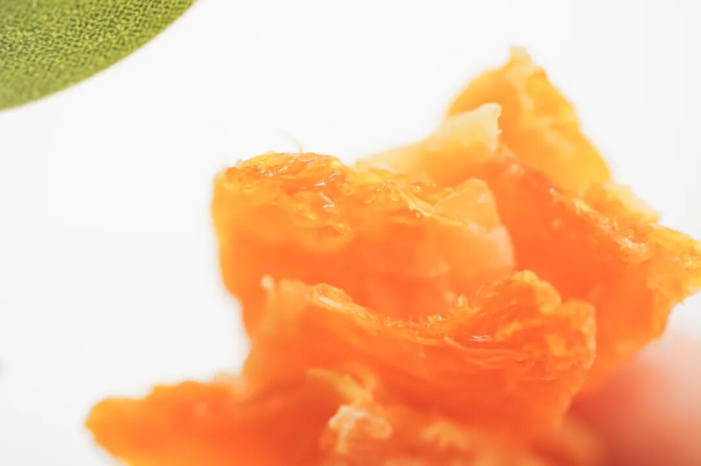

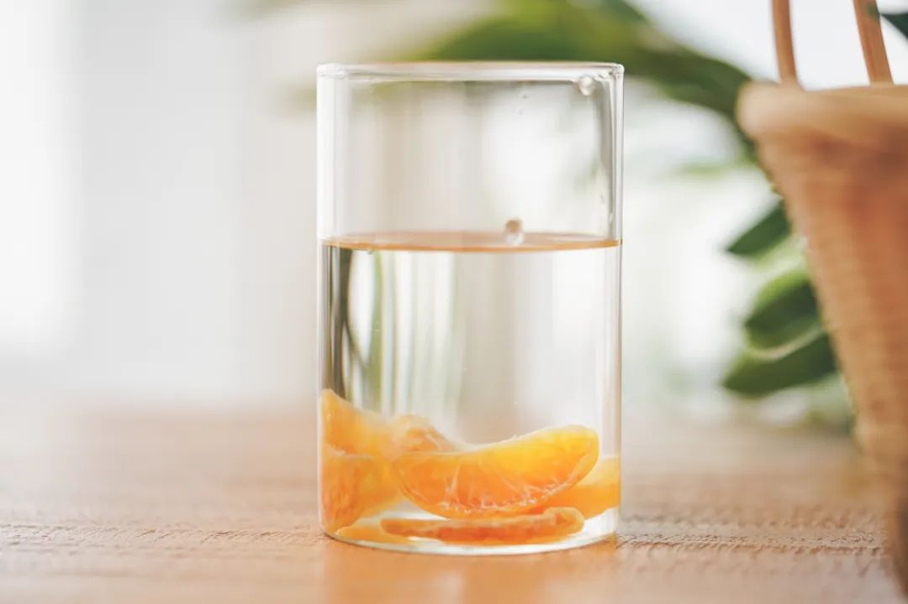

以上都地板价走起，

临期清仓 6 折！

约等于半价了，自家吃吃完全不影响，

介意的注意看一下效期哦！

饱记·6 折临期清仓专区

购买方式如下

介意效期慎拍哦！！

戳图下单购买👇

产品同事近期盘库存，

发现两样年货节口碑好物

还有剩余库存，

今天也巨折亏本清仓出！

临期清仓 7 折！

数量有限，先到先得。

1.岭南陈皮花生效期至 25 年 9 月

新会陈皮与农家花生，

经过传统工艺，

使得陈皮的香味渗透于花生之中。

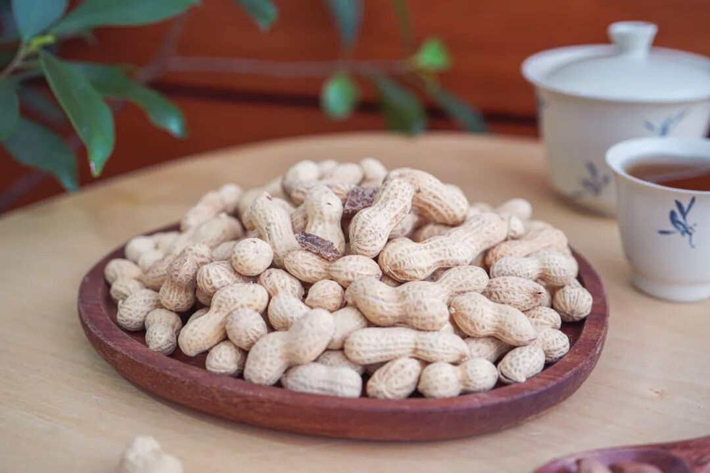

酥香脆甜，不失为追剧好搭子啊！

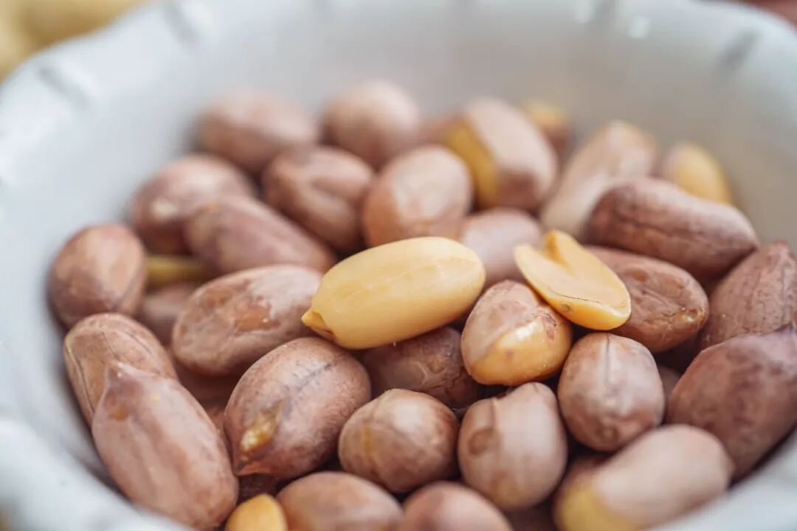

2.兴安盟大米效期至 26 年 2 月

来自大兴安岭南麓的兴安盟大米，

地处北纬46°，

是国家公认的寒地水稻黄金种植带，

生态基础条件好，

因而米质超好！

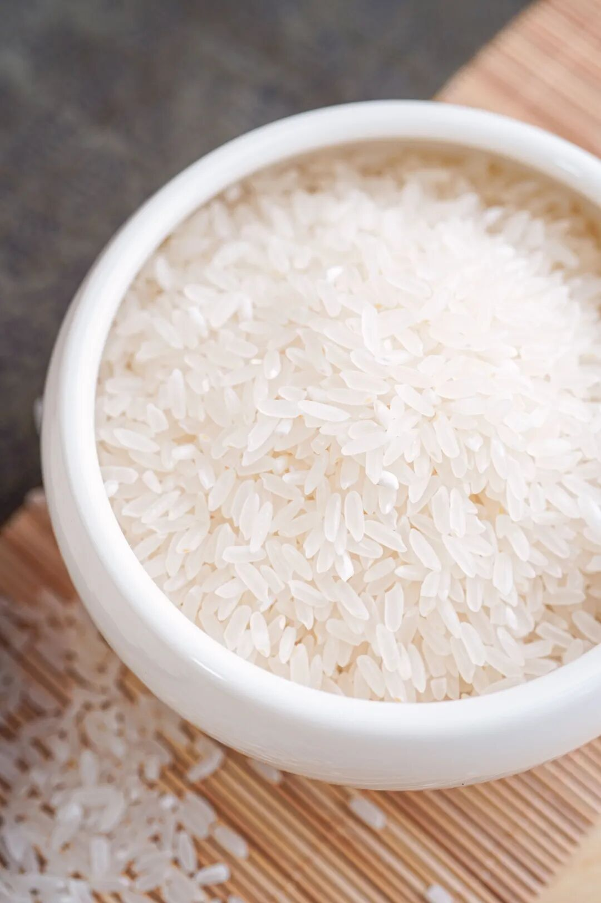

米粒饱满，

色泽青白有光泽。

煮熟后比一般大米更为香浓，

入口绵软微甜，略有韧性，

冷却后也 QQ 弹弹～

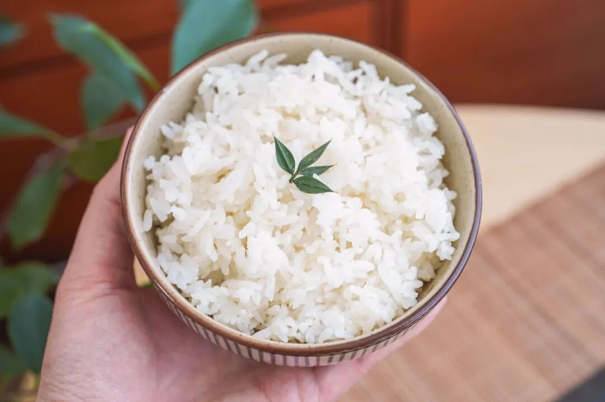

3.午餐肉片效期至 25 年 7 月

超多肉！！看得见的那种，

只选优质去皮猪后腿精瘦肉，

鲜香弹牙，没有面粉感！

随时随地大满足，

是常温储存的。

从此，你就可以坐在工位上啃肉了。

（但更好的生活方式还是六点就下班回去

你可以这么吃：

这么吃：

这么吃：

（都来自我的亲手制作，我不会下厨

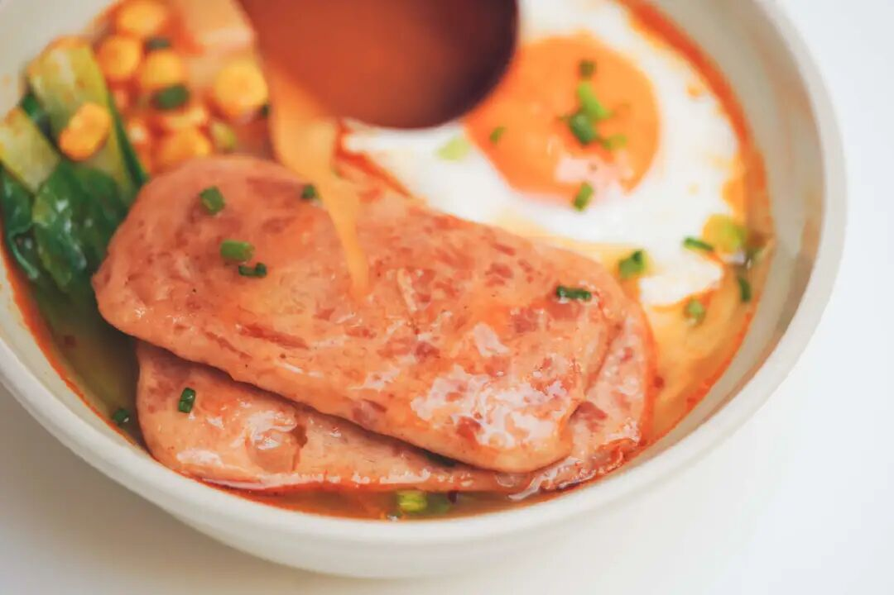

饱记·7 折临期清仓专区

购买方式如下

介意效期慎拍哦！！

戳图下单购买👇

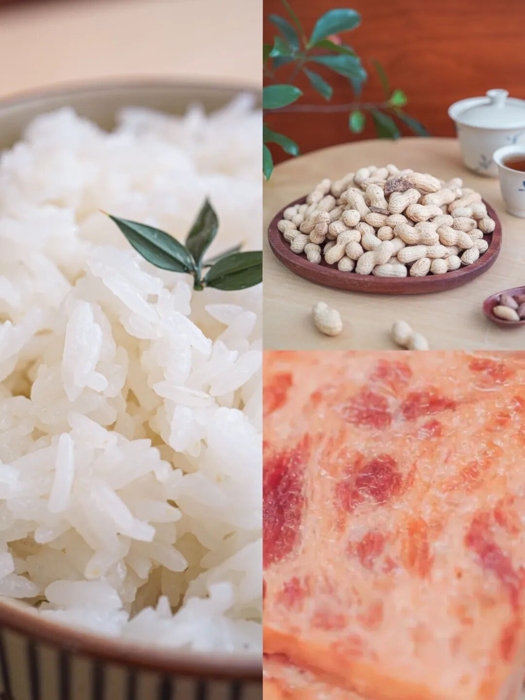

题 外

朋友们江南已是春光好，

其他一些时令好风味，大家一起吃起来！

难得回归的金山鸡，

这批还有最后几十只一年老母鸡，想当包邮区大孝子的速冲！限时 7 折！

再不吃就没了的临安天目山雷笋，

米其林餐厅师傅第三年回购，

不焯水就鲜甜！

现在有限时 9 折！

昨天刚上的饱记·舟山野生海鲜盲盒！

舟山码头鲜捕现发，都是冰鲜发货！

当地人都买不到的品质，

来自湛江的红膏青蟹。不仅有红膏，而且满到了蟹壳的角角落落。

都有限时早鸟 86 折！

其他的东海野生海鲜，

还有肥美的银鲳和红膏梭子蟹，

都是高级餐厅水平！

限时吃海鲜 9 折！

春季茶中硬通货西湖龙井，今年照旧是「梅家坞」和「狮峰」两款，一款性价比之选自家喝不心疼，一款上好龙井送人包体面，

也是限时早鸟 86 折！

还有些只有最近这一阵可吃的水果👇

甜蜜嘎嘣脆的花香小弹珠蓝莓，

无渣不麻嘴的海南金钻凤梨，

连盐水都不用泡。

难得回归的泰国超甜多汁金柚，

卷中卷红玉芒果，

来自湖北的超甜晚熟红橙，

娇艳可人的雷州木瓜，

来自精品小果园的云南沃柑，

好吃不怕胖的广西芭乐，

人称「水果冰淇淋」的凤梨释迦！

现在也有限时 9 折！

饱记·云南稀有品种瓢鸡限时吃鸡 7 折！！！
戳图下单购买👇

饱记·2025 临安天目山雷笋

降价了！！！

限时尾声 9 折！！！

戳图购买👇

饱记·舟山野生海鲜盲盒购买方式如下限时早鸟 86 折！！！
戳图下单购买👇

饱记·湛江红膏青蟹购买方式如下限时早鸟 86 折！！！
戳图下单购买👇

饱记·东海冰鲜鲳鱼购买方式如下限时 9 折！！！
戳图下单购买👇

饱记·东海春季红膏梭子蟹购买方式如下限时 9 折！！！
戳图下单购买👇

饱记·梅家坞西湖龙井

限时早鸟 86 折！！！

戳图下单购买👇

饱记·狮峰头采明前龙井购买方式如下👇限时早鸟 86 折！！！
戳图下单购买👇

饱记·花香脆甜蓝莓

购买方式如下

限时吃水果 9 折！！

戳图购买👇

饱记·海南金钻凤梨

购买方式如下

限时吃水果 9 折！！

戳图购买👇

饱记·多汁泰国金柚

购买方式如下

限时吃水果 9 折！！

戳图购买👇

饱记·海南红玉芒果购买方式如下限时吃水果 9 折！！！
戳图购买👇

饱记·晚熟超甜红橙购买方式如下限时吃水果 9 折！！！
戳图购买👇

饱记·湛江雷州木瓜

购买方式如下

限时吃水果 9 折！！

戳图购买👇

饱记·凤梨释迦购买方式如下限时吃水果 9 折！！！
戳图购买👇

饱记·云南晚熟沃柑购买方式如下限时吃水果 9 折！！！
戳图购买👇

饱记·广西芭乐

双拼&奶油芭乐

限时吃水果 9 折！！

戳图购买👇

本文的研究员

薯角我想我知道春天的味道

用好吃的方式吃一生

祖国各地好风物

文章转载请加微信「baojiclub」

