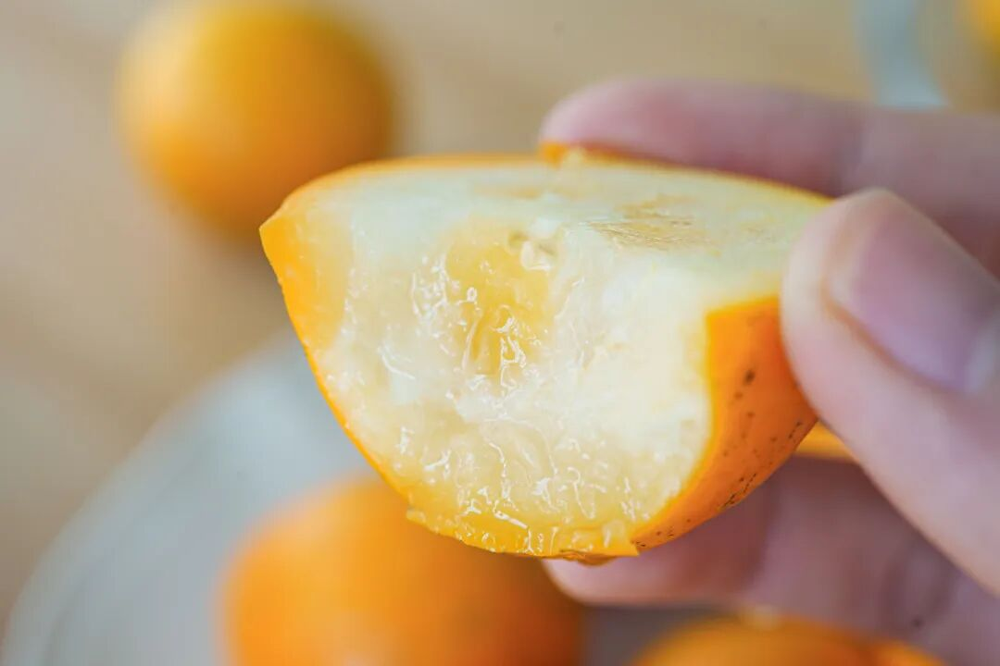
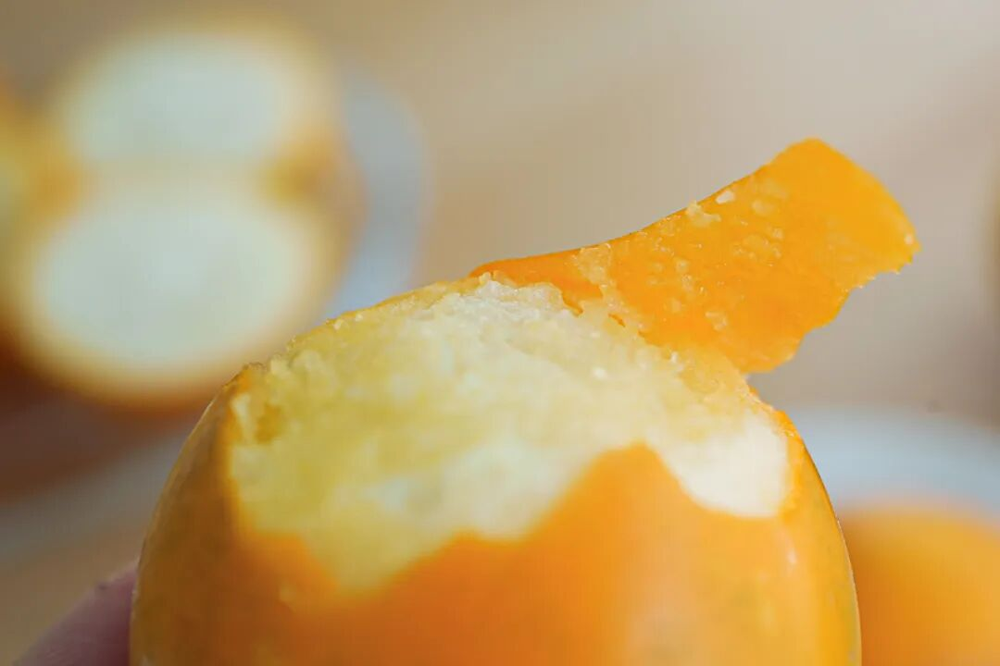
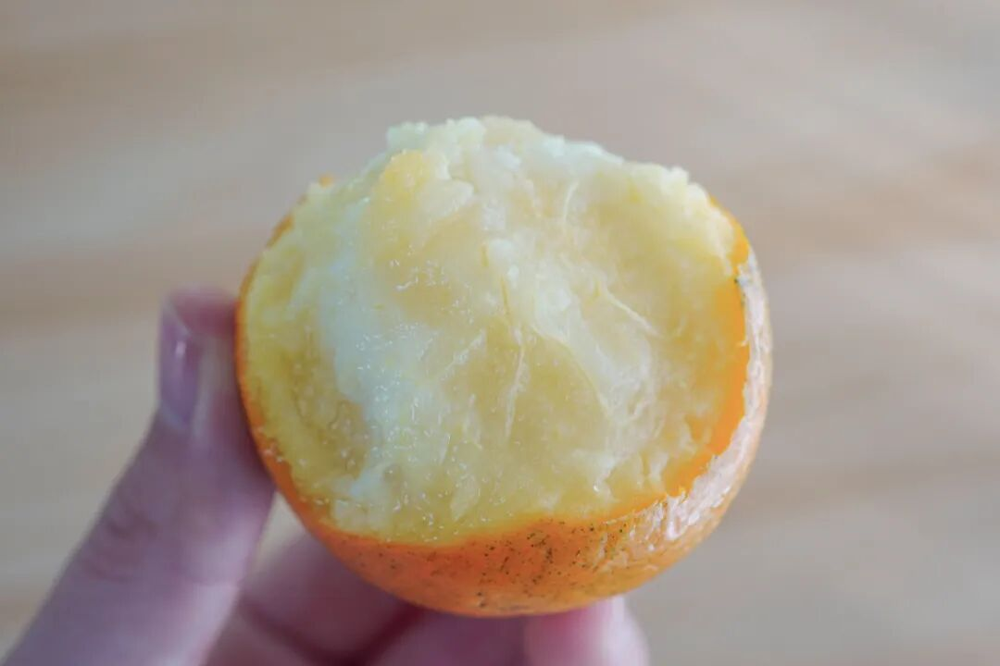
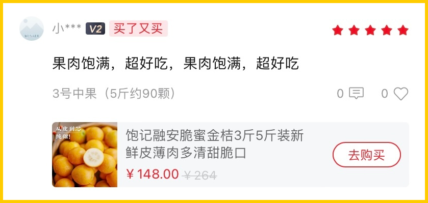
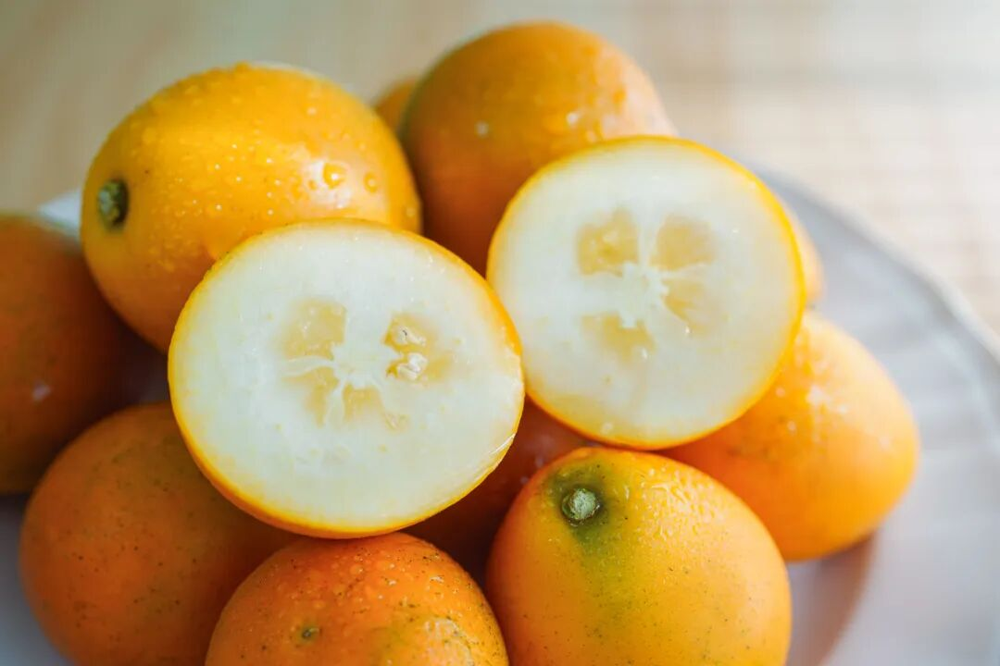
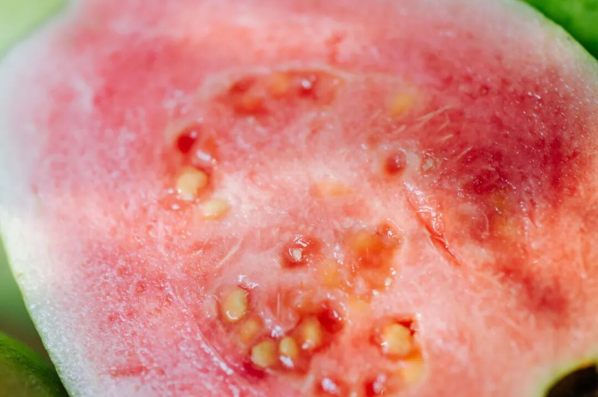
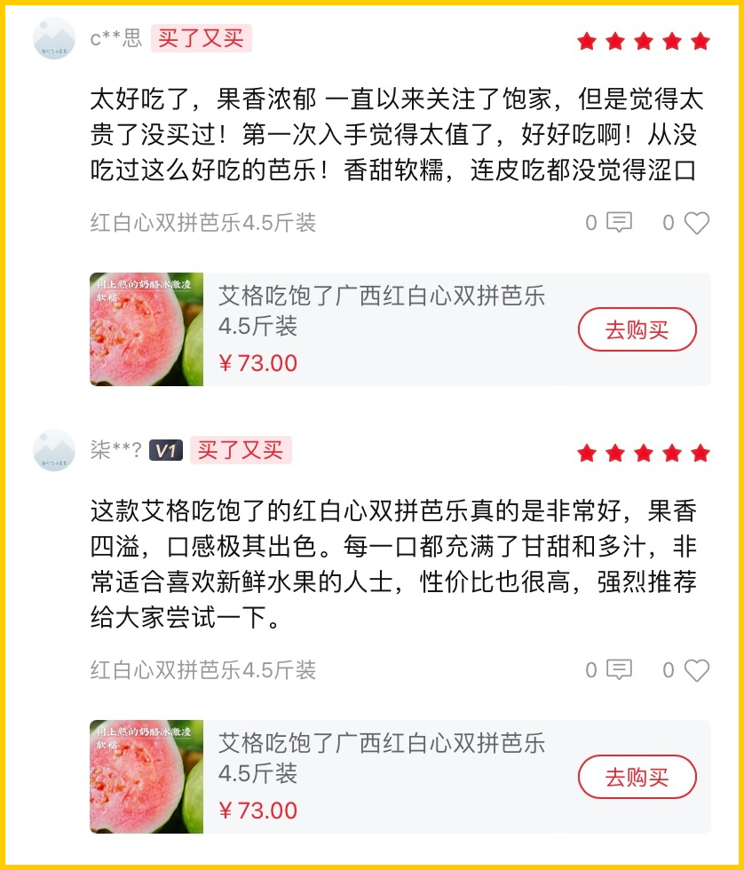
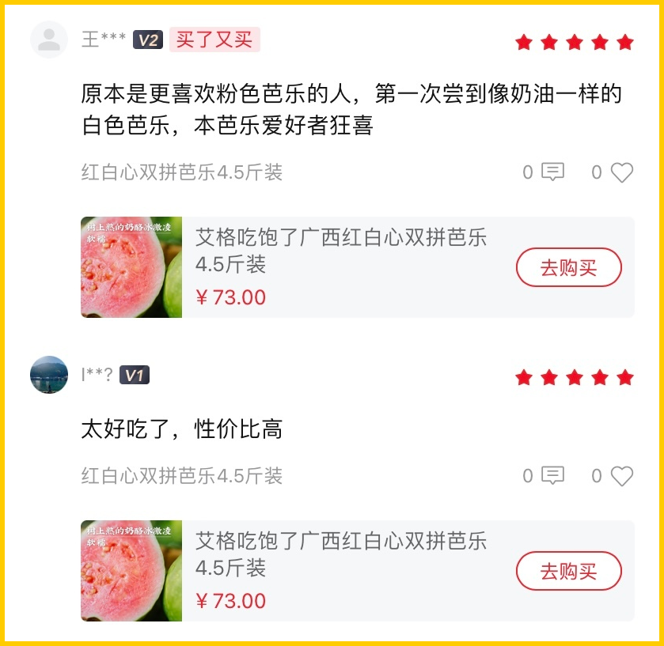

# 皮薄肉甜，岭南冬天最妙的水果（之二

- 原文链接: https://mp.weixin.qq.com/s?__biz=MjM5NTYxODQyMA==&mid=2653464211&idx=1&sn=76593a99db7e8c6dfcc4945d038e2e31&chksm=bcca7bea8aa148420f84acb8470803d81ca7734c660ae4885e0c3af8cb047381d4c750712c90&scene=27#wechat_redirect
- 浏览量: N/A
- 点赞数: N/A
- 评论数: N/A
- 转发数: N/A

## 正文

天凉好过冬！

一个尽情安利自我的公众号

以下是没事干研究院的风物研究报告请放心食用
开门见山！今天推荐两样神仙水果，来自远在南边的广西，尤其适合这口干舌燥的冬天啊～

首先这一枚来自广西融安的脆蜜金桔。足以颠覆自小到大的金桔风味印象！不麻嘴，不涩口，
从皮到芯都纯甜！

金桔界的第三代稀有品种，
个头大，我司选定四种规格，最大的 0 号果王大过鸡蛋！
送礼显得咱大方又体面。最小的 3 号中果都有乒乓球大小，自家吃吃或招待客人也没在输嘿嘿～

这果子不仅长得实诚，口感和以往吃过的也都不同，没有入口就让人龇牙咧嘴的桔皮味，从芯子到脆皮都是蜜蜜甜的，随手一测糖度都能达 18！

皮脆薄，肉厚，且无核化渣！
一咬 biu 汁，超鲜爽，像在啃冰糖心的小苹果，越吃越稀罕~

不是薯角我自夸，第一批吃上的人已经在复购了👇

还是骄傲地说，饱记的生鲜水果，是一定要保持所有渠道随便比的程度！我司永远会去卷产地，只卷核心产区的精品果园！融安金桔这家能入选，也是因其风土、品种与管理。

获得过柳州市脆蜜金桔优质果品质量评比“特等奖”。

它是融安县第一个

成功种出脆蜜金桔的果园（母本园），

果园里都是 8+ 年老树，

保证品种纯正果味浓。

老树果园平时都得上锁，以防被盗，这枝条在外一斤能卖 ¥1000！因为非母本园的果子，

就有更大的可能性不甜麻嘴、无水分。

自家吃推荐乒乓球一般的 3 号果，性价比高！多啃不心疼！给大家吆喝来限时 9 折，只到本周五！这果子好吃还有好寓意，送礼自留两相宜，买它！！！

饱记·融安脆蜜金桔限时吃水果 9 折！！！只到本周五！！
戳图购买👇

广西神仙水果其二：

内外兼修的双拼芭乐！

好看，好吃，且吃了不胖，尤其适合这个季节的空调房、暖气房，

有人爱它美貌，有人爱它独有香气，更多的是贪图那一口：可以大口啃的丝滑！

好吃的芭乐难寻，但我司在生鲜水果上，一向没在怕的！这芭乐产自广西玉林民乐镇，
是国家首批生态家园建设示范点。（不用我说，国家认可的好山好水好环境！施农家肥，物理防虫，吃的就是一个原生态~

双拼，一次可以吃两种。奶油白心芭乐的几乎无酸，草莓红心芭乐更香。（个人感觉可以当天然香氛用吃起来都是扎实的冰激凌球口感，滑滑糯糯~

后台已经涌入一些花式夸奖👇写得比本薯好多了。。。

没来这司之前，

本薯还以为这种好评都是买的，

没想到大家完全真情实感啊！

随赠酸梅粉哦，广西酸嘢吃法，还可以蘸辣椒盐。（推荐亮爷辣椒盐，这篇里有最近想买的便宜货（无广

饱记·广西双拼芭乐限时吃水果 9 折！！！只到本周五！！
戳图购买👇

·    题 外

敲锣打鼓，

几样本薯较少吆喝的好东西在临期清仓，

6 到 7 折！自家吃吃不妨碍啊！

超过瘾的手撕鸭脖效期至明年 1 月，

紫苏梅饼效期至明年 3 月，

最后 4 盒西湖龙井茶效期至明年 3 月，

介意慎拍哦！！

以及今年冬天的富平柿饼预售了！

趁还没发货给一个地板价！

限时 8 折！只剩两天！！

后台千呼万唤喊着补货的

75% 木姜子巧克力，

现在还有限时 9 折！

其他适合空调房吃吃的水果也看这里👇

今年份的象山红美人，

入口似果冻般嫩嫩滑滑～

此外已到尾声的大闸蟹，

今年包邮区两个宝藏产区！

苏南蟹标杆美味：太湖流域大闸蟹

苏北蟹宝藏性价比之选：洪泽湖大闸蟹我司卷中卷产品，
拿到外面去都能打得很！

饱记·临期零食清仓专区

6 到 7 折！！！介意慎拍～
戳图购买👇

饱记·富平柿饼

预售中！！！

25 号起按顺序发！！

限时早鸟 8 折！！！
戳图购买👇

饱记·云南木姜子75%黑巧克力购买方式如下限时 9 折！！
戳图下单购买👇或🍑🍑🍑搜索「艾格吃饱了」

饱记·象山红美人柑橘购买方式如下戳图购买👇

饱记·太湖流域大闸蟹

购买方式如下

三种搭配：

满足装，

3-3.4 两母蟹，4-4.4 两公蟹，

吃过解馋。

劲爽装，

3.5-3.9 两母蟹，4.5-4.9 两公蟹，

可以拍照发朋友圈争奇斗艳。

尊享装，

4-4.4 两母蟹，5-5.4 两公蟹，

顶格水准，适合送礼。

人工精挑，

上岸后静养一两日更鲜美，

每日限量 50 箱。

拼的就是手速。

顺丰快递发货，

新鲜看得见。

戳图下单购买👇或🍑🍑🍑搜索「艾格吃饱了」

饱记·洪泽湖大闸蟹

购买方式如下

满足装洪泽湖大闸蟹：

3 两母蟹，4 两公蟹。

性价比之选！

劲爽装洪泽湖大闸蟹：

3.5 两母蟹，4.5 两公蟹。

饱记热销款。

尊享装洪泽湖大闸蟹：

4 两母蟹，5 两公蟹；

或 5 两母蟹，6 两公蟹。

实际超重，量极极极少，送礼佳品。

人工精挑，

上岸后静养一两日更鲜美，

每日限量 100 箱。

顺丰快递发货，新鲜看得见。

戳图下单购买👇或🍑🍑🍑搜索「艾格吃饱了」

本文的研究员

薯角多吃点，好过冬

用好吃的方式吃一生

祖国各地好风物

文章转载请加微信「baojiclub」

