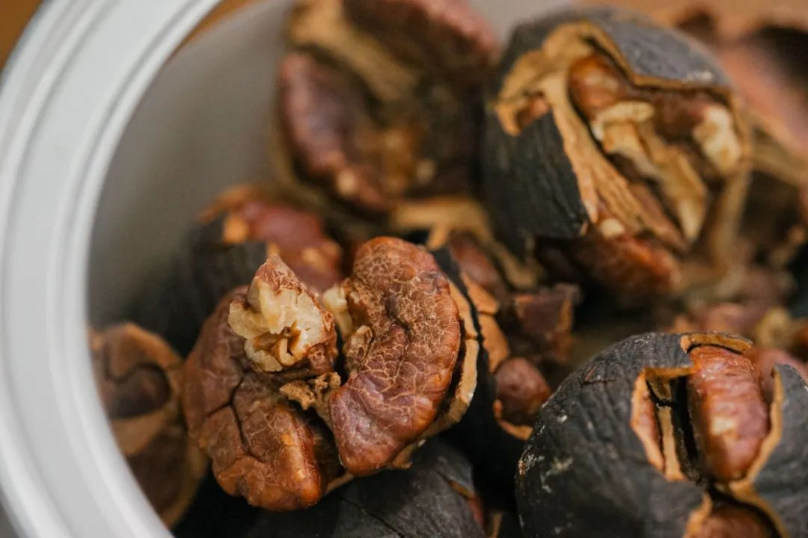
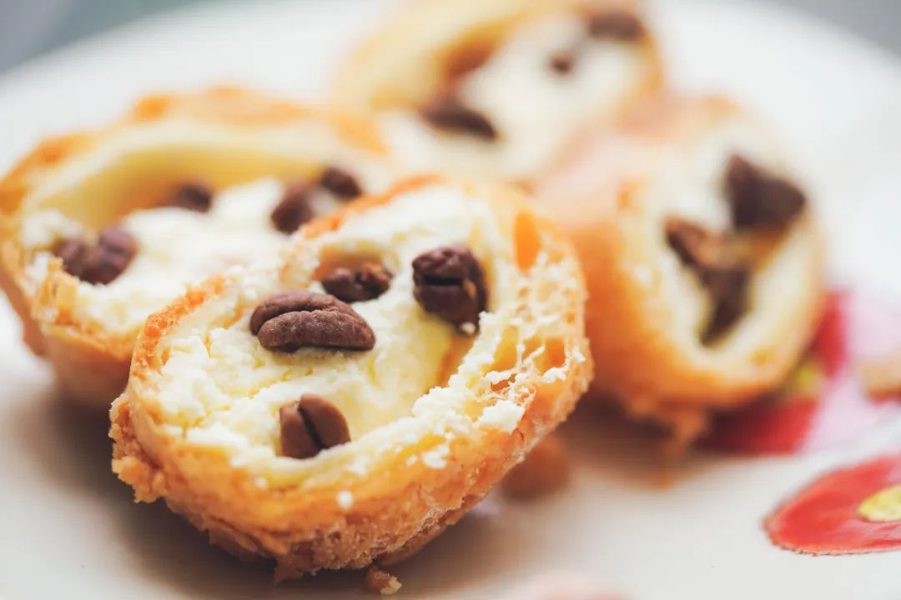
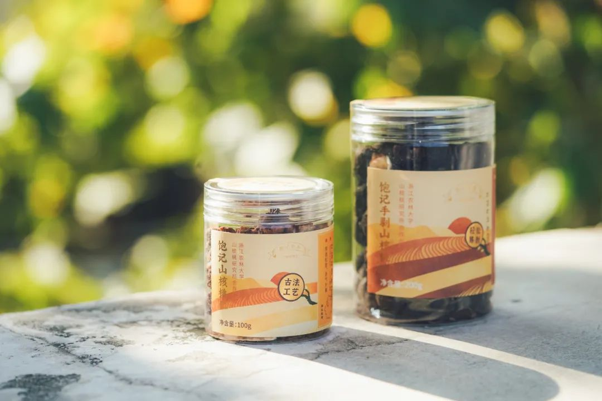

# 真是好东西啊。。。难怪红了十一年

- 原文链接: https://mp.weixin.qq.com/s?__biz=MjM5NTYxODQyMA==&mid=2653462517&idx=1&sn=f3a1d8a50fa8c36d21334f9ee2324cb9&chksm=bc575972bc89aa93775abac7cfe83eb87e8d5f5cee0b38e5fed921f210698792864cf23a3d56&scene=27#wechat_redirect
- 浏览量: N/A
- 点赞数: N/A
- 评论数: N/A
- 转发数: N/A

## 正文

王牌产品来袭

一个尽情安利自我的公众号

以下是没事干研究院的风物研究报告请放心食用
前阵子在后台，看到一条十年老客人的评论，感人🥹🥹🥹🥹🥹

说的正是我司这款打遍天下都不怕的口碑临安山核桃，一转眼竟已卖到了第十一年！（比薯角我的工龄还长。。。

这山核桃能长期当顶流也是有原因的，
首先香得不得了。本薯入冬尤其喜欢拿它配茶，又脆又酥，还有坚果本身那种油脂和回甘！配一壶红茶或者乌龙都美得不得了～

遥想十一年前，老板自己都还在打工，

因为觉得市面上的临安山核桃不行，

就找到浙江农林大山核桃系科班开发这款。

我可以淡定地说，

打遍天下无敌手。

不仅是我为了写稿子买了二三十种市面货觉得没有饱记的好吃，山核桃系的老师有一年开全国专家会时也盲买市面上二三十种全部撕掉标签盲测，还是自家的第一。

列出证据之前，本薯先给大家看看后台真情实感的客观好评们，根本数不过来！

没来这司之前还以为这些是买的，没想到大家伙儿人好啊！都来真的

偶尔还有一些和某马、某姆的对比，不必麻烦大家！我司可以淡定地说：比过市面其他，堪称无敌手！

为啥敢说它打遍天下无敌手呢？老师们都怕说出去不好。。。但我不怕说，给我完成销售 KPI 的我都说！

亮点一：超新鲜，都是当季新货！

为了让每位客人都尝到最好口感，产品经理严格把每个批次生产日期，控制在最新鲜的 45 天内！每次都是小批量上货。

亮点二：农大合作出品，靠谱！我们商定用临安山核桃品种。从小吃到大的杭州人（比如我老板）都只认临安产的。

农林大校址就在临安。

直径、克重和日晒时间都有山核桃系本系的专业要求，浙江农林大信誉保证！

足斤足两，超克重：不是看淘宝上的「问大家」，我还不知道卖山核桃会有短斤缺两这种事。。。。

亮点三：调味轻，保留原香！市场上一些山核桃普遍靠糖撑重量。我司这样做损耗增加、成本上升。因为必须山核桃本身风味超级足，原料好味道香，才能经得住这种调味。如果掺一点陈货或者外区的原料进去，立即就藏不住了！

盐添加很少，糖也添加很少，爸妈吃了都要说好！问了一下老板才知道，
这山核桃早在十一年前产品开发阶段，就已经开始要求轻调味。多轻呢？每 100 斤只给放 1.5 斤糖，因为健康。

调味轻了，糖少了，核桃仁容易碎。而带壳的呢，需要把原料日晒到比同行更多的时间，减少水分，「浓缩」风味。这样才架得住轻调味。于是，本来就挺贵的核心产区山核桃原料，首先重量上就比同行产生近多 1/3 的损耗。

为此，农林大在和我们合作中花了好几年来改进机器的效率。

总之，这样讲究着炒出来的山核桃，果仁吃起来才是焦香松脆，饱满油润，无陈味薅味。

我同事安利我，最嚣张的吃法是蘸泡芙里吃，果真又奶又香，好吃极了！

两种选择！

可以买手剥版一颗一颗剥着吃，

又原始又清香！

当然也可以直接上懒人版，

简单省事的山核桃仁，

一把一把往嘴里丢！

不过，

今年山核桃产量因为天气原因，
只有去年的四分之一！

农户那边原料价格大涨，
像我司这种不掺外地籽和陈货的

影响就很大。。。

没办法，价格比去年贵一些。

（之前有客户说涨价，其实还是因为原料大涨，

我司今年让利卖。。。

一年仅此一季的美味，

还是值得！

本薯还给大家薅一个

限时三天的心意折扣！

单罐限时 9 折！

双罐限时 8.5 折！

这么红的顶流产品，

遇到你就买了吧！

饱记·临安山核桃

双十一同价

单罐限时 9 折！

双罐限时 8.5 折！

戳图买它👇

或到🍑🍑🍑

搜索「艾格吃饱了」

题 外

大家好，

这个时节好东西不少（单押

双十一过后的心意返场折扣直接来！

不用凑单不用研究！

外面买不到的金山瓢鸡，

这批卖完下次得等半年了！

苏南蟹标杆美味：太湖流域大闸蟹苏北蟹宝藏性价比之选：洪泽湖大闸蟹
坚持真材实料、天然肠衣的手工腊肠，
能做煲仔饭和火锅的玫瑰露酒腊肉&腊排骨

有小时候番茄味的云南西红柿（快没了，

我司卷中卷产品，
拿到外面去都能打得很！具体你们看商详，最重要是还有些限时返场折扣再薅老板一回！冲！

饱记·云南稀有品种瓢鸡

购买方式如下

限时早鸟价 7 折！！

规格第一档：6 月龄公鸡净重 3.4 斤以上 70 只，6 月龄母鸡净重 2.5 斤以上 140 只。规格第二档：
6 月龄公鸡净重 3 斤以上 160 只，6 月龄公鸡净重 2 斤以上 140 只。
下单前请注意：此鸡蛋白质含量丰富，宰杀时已尽量放血，但少量余血开包时气味仍会比较大，请冲洗再食用！鸡皮不发粘，就绝非变质～～～

戳图下单购买👇

或🍑🍑🍑搜索「艾格吃饱了」

饱记·云南西红柿购买方式如下双十一同价 86 折！！
戳图购买👇

饱记·手工腊肠

购买方式如下👇

限时三天 9 折！！

戳图下单购买👇

或🍑🍑🍑搜索

「艾格吃饱了」

饱记·玫瑰露酒腊肉&腊排骨

购买方式如下👇

限时三天 9 折！！

戳图下单购买👇

或🍑🍑🍑搜索

「艾格吃饱了」

饱记·洪泽湖大闸蟹购买方式如下👇限时 9 折
戳图下单购买👇或🍑🍑🍑搜索「艾格吃饱了」

饱记·太湖流域大闸蟹购买方式如下👇限时 9 折
戳图下单购买👇或🍑🍑🍑搜索「艾格吃饱了」

本文的研究员

薯角冻成冰角了

用好吃的方式吃一生

祖国各地好风物

文章转载请加微信「baojiclub」

