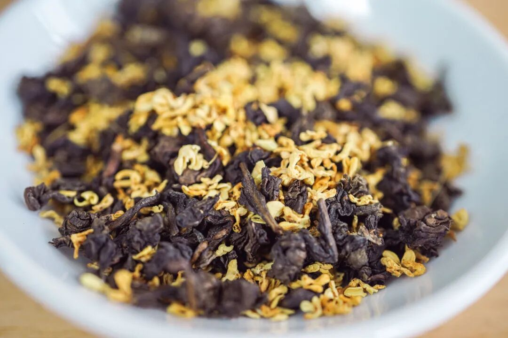
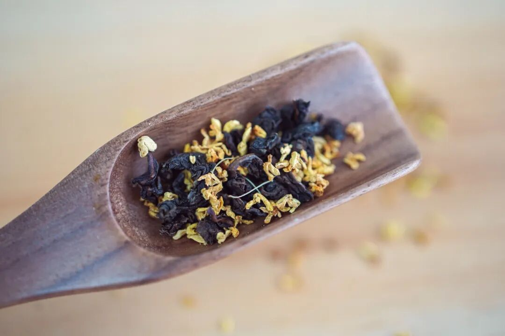
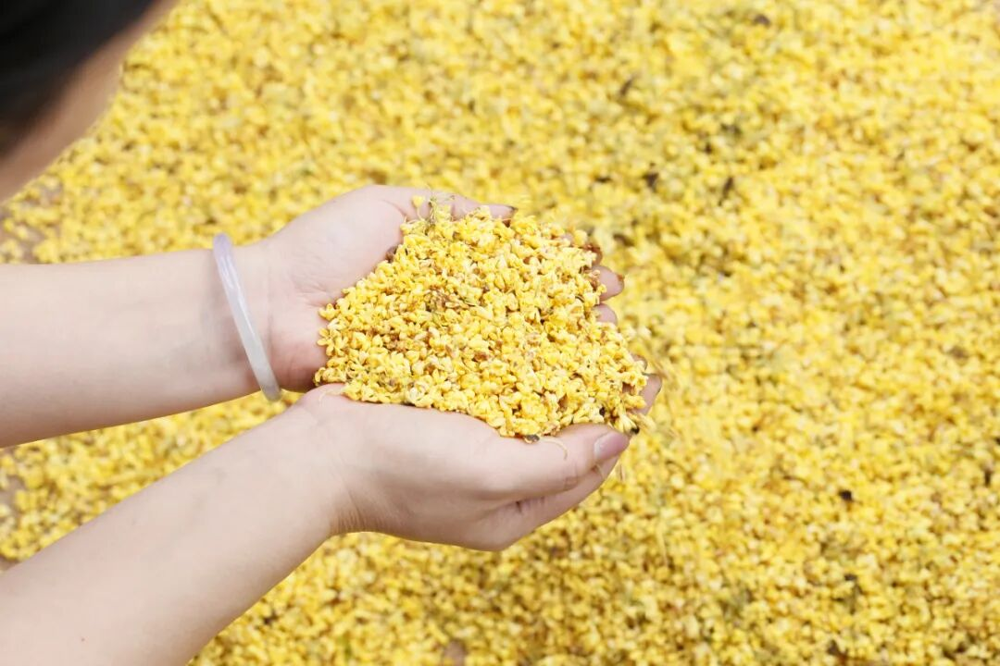
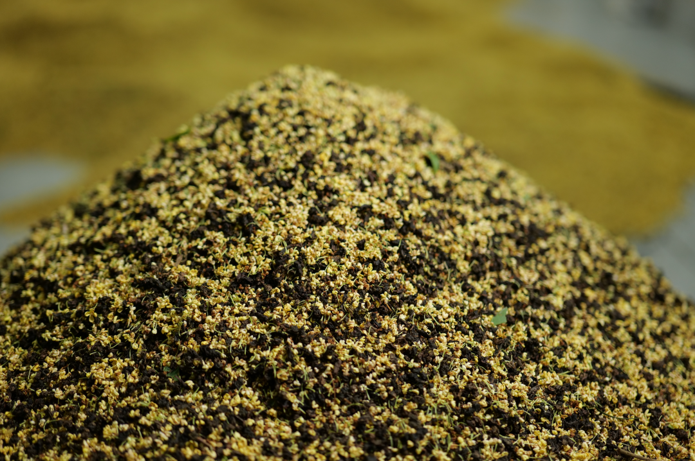
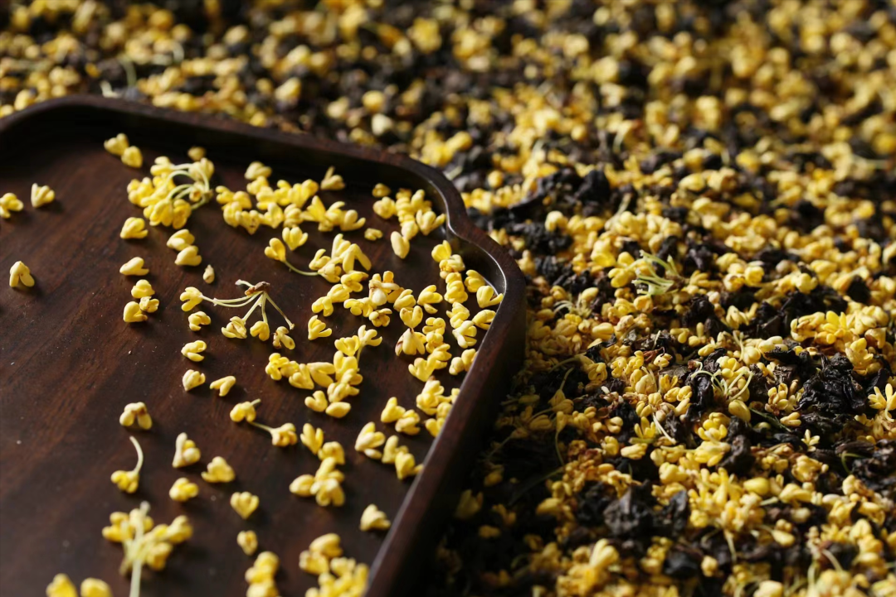
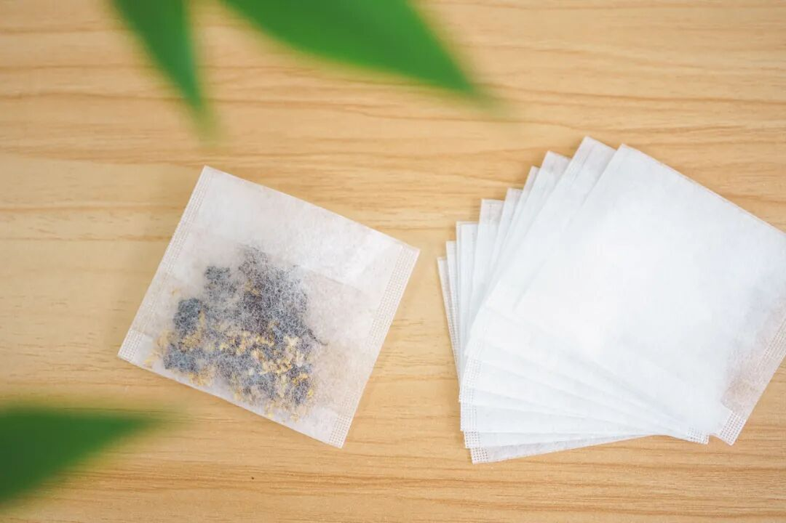
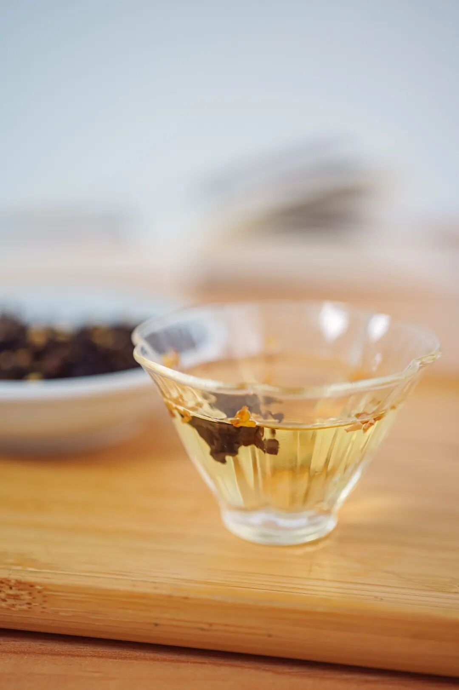
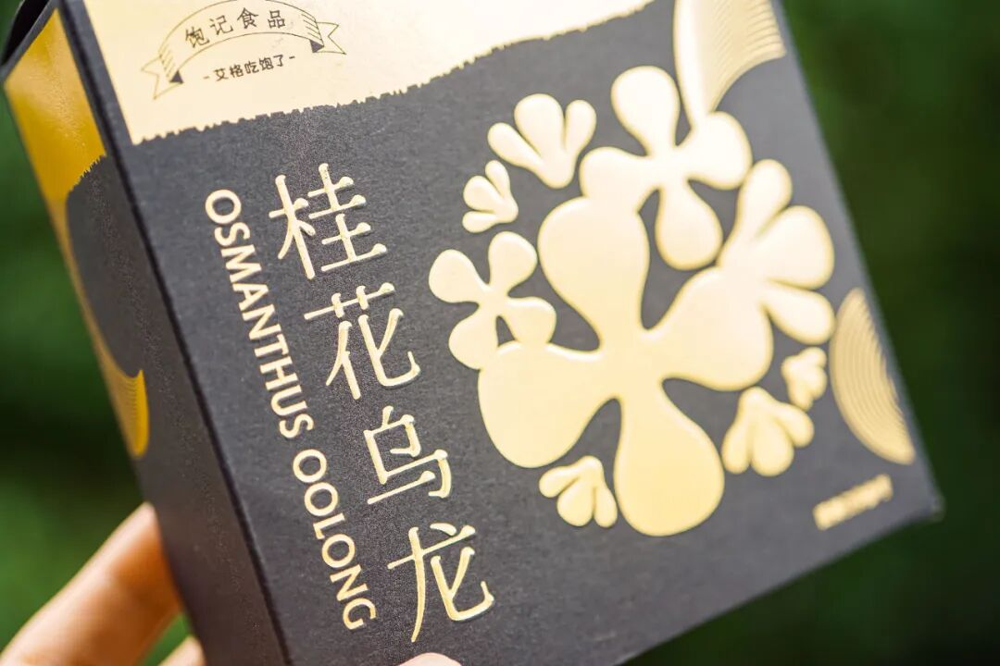

# 秋天的味道，原来我一直喝错了。。。

- 原文链接: https://mp.weixin.qq.com/s?__biz=MjM5NTYxODQyMA==&mid=2653459616&idx=1&sn=990e9826e3f802bc339cad575808ffa2&chksm=bc635886919c405c34864ac7b23fb0a80b099d1ef6bea9aa0ef09f5da4550fd441db2b26109e&scene=27#wechat_redirect
- 浏览量: N/A
- 点赞数: N/A
- 评论数: N/A
- 转发数: N/A

## 正文

秋天的仪式感

一个尽情安利自我的公众号

以下是没事干研究院的风物研究报告请放心食用

上海的秋天真好呀，

空气里的湿度逐渐褪去，

每一阵风里都带着干燥的凉意，

吹得薯角我只想大喊一声：

老板我不想上班！

来自福州的产品同事转头：

做梦暂停，

先帮我品一杯秋天的茶！

嗯？什么茶，

还要我薯角亲自品？？

原来是——

非常适合早秋的桂花乌龙！

按福州同事的原话，

这茶完全经得起盖碗的考验！

和市面上都是细末的调味茶不是一回事，

必须细细品味！

好嘛，毕竟是喝花茶长大的福州人，薯角我且信一回！
翻出家里的盖碗，怎么泡铁观音就怎么泡它。揭盖一闻，哇～桂花的香气完全被激发，直窜入鼻尖！带着一点花的自然甜味～

入口茶汤微稠，舌侧香气余韵不绝，观音茶的回甘源源不断！总之，闻起来是甜的，喝起来却有烤过的醇厚滋味！本当它是办公茶叶，没想到茶底这么好，还耐泡得很！
立即决定囤几罐在家！

这茶要好，
没什么捷径，全靠真材实料。

茶叶用的是六年陈炭焙铁观音，

同事专程跑到福建安溪，在平均海拔超过 1200 米的戴云山脉深处卷出来。

茶农用铁芒萁灰覆盖于炭火上，分三次焙火逼出茶香，又慢慢转化出熟果香、蜜香和焦糖香。最后陈放六年，耐心等待火气褪去，把蜜韵养足～

金桂，是每年寒露前后新鲜打的，早上五六点日出前打下来，运回后剔除花梗树叶，仔细拣选后才可与茶叶拼和。

然后请来福州当地家中五代制茶的老茶人，以传统古法窨制，一层金桂一层茶～

早期刚开始，我们做的是一窨一提（下花量 70 斤），后来再到两窨一提（下花量 230 斤），这次老板下了血本，直接做了三道窨制的（下花量300斤）！100 斤的茶要用300 斤桂花分三次窨制！！

（洒的不是花，是钱。。。

但懂的都懂，老福州人做花茶，讲究见花香不见花，饱记也是同样标准，桂花萎蔫后都会以手工挑除，只在烘干后额外洒入干桂花～费时费力得很！

（这么好看，不要命啦？

同事说这次茶叶用得太好，不舍得做袋装茶，怕减损风味。但每盒里都附赠了十枚茶泡袋，还是可以自行组装～

傻瓜式操作，包教包会！喜欢喝浓一点、淡一点，都可以自己酌情去调整。贴心得很！

花香浓，回甘厚，入口温润甜醇，性价比极高的好茶，买了不会后悔！

再给这次的小金罐来个特写，
抗得出镜头的美貌！金光闪闪，低调中带一点矜贵，可以自己喝，也适合送好友。

还可以搭着柚子小种红茶买！组合更划算！用的是武夷山的花香小种红茶。

茶叶鲜度很高，传统手工精制，一芽一叶，自带的鲜叶汁水也更丰富。深红色，成紧细均匀的外形。

泡出来是这样的，远远都能闻到饱满的柚子香气！冷热皆可。但同样最推荐盖碗泡法！

当然你也可以像董洁一样，（是的它可是上了董洁直播间！一个人的时候拿出喜欢的杯子品品，
给自己小小的仪式感？总之优雅永不过时

打工不易，转眼也是到了喝茶的年纪，这两款经我薯角亲测，都入股不亏。
大人们！请用茶吧！

饱记·桂花乌龙（小金罐）购买方式如下👇
升级版小金罐，送礼自留都满足。
两种规格：单罐装：桂花乌龙（1盒）组合装：
桂花乌龙（1盒）+柚子小种红茶（1盒）
戳图即可购买👇或打开 🍑🍑🍑 搜索「艾格吃饱了」

题 外

前两天新上的紫薯吃了吗？

来自云南建水！在沙土地里长大，

带一点微微的红枣香气！

还有来自云南石林核心产区的

不一样人参果，

清甜多汁，还带着浓郁奶香。

最后是云南30年老树上的

绿籽石榴，

果味极浓且层次丰富！

都还有限时早鸟 86 折！

跟老板多薅了几天，
折扣就到节前！最后 3 天！快冲！

饱记·云南沙地紫薯

购买方式如下！

限时早鸟 86 折！
戳图买它！！👇

饱记·云南不一样人参果

购买方式如下限时早鸟 86 折！！！
戳图买它！！👇

饱记·云南老树绿籽石榴
购买方式如下限时早鸟 86 折！！！
戳图买它！！👇

本文的研究员

薯角好喝好喝好喝

用好吃的方式吃一生

祖国各地好风物

文章转载请加微信「baojiclub」

