# 突如其来的大促，也不知道为什么这么便宜。。。

- 原文链接: https://mp.weixin.qq.com/s?__biz=MjM5NTYxODQyMA==&mid=2653470296&idx=1&sn=c9e1ee1f411b2f31602e0cbd300f1d69&chksm=bc7f55d5032154e11456f6ba259ee5c000d4241030184233865c7475ae8786cfc262bf218fc7&scene=27#wechat_redirect
- 浏览量: N/A
- 点赞数: N/A
- 评论数: N/A
- 转发数: N/A

## 正文

机不可失

一个尽情安利自我的公众号

以下是没事干研究院的风物研究报告请放心食用

不是，

现在天🐱怎么一不留神就来一个大促？？

同事说：

临期产品折上折，低至 5 折！

其他产品也至少 9 折！

88 会员还有限量消费券！

最后一天！！不薅白不薅啊！

这些临期产品，同样由我司产品同事千辛万苦卷出来，周末自家吃吃完全不影响啊！现在直接 5 折走起！效期也给大家标注了，介意慎拍哦！

1.饱记·手工腊肠效期至 25 年 5 月/7月

我饱记腊肠，

想必不用多说了吧。。。

都是真材实料！用的纯黑猪肉，产品同事说现在外面很多电商腊肠，都会加入部分大豆蛋白，和猪肉比起来简直成本可忽略不计。而这种添加甚至可以在配料表上并不体现。。。

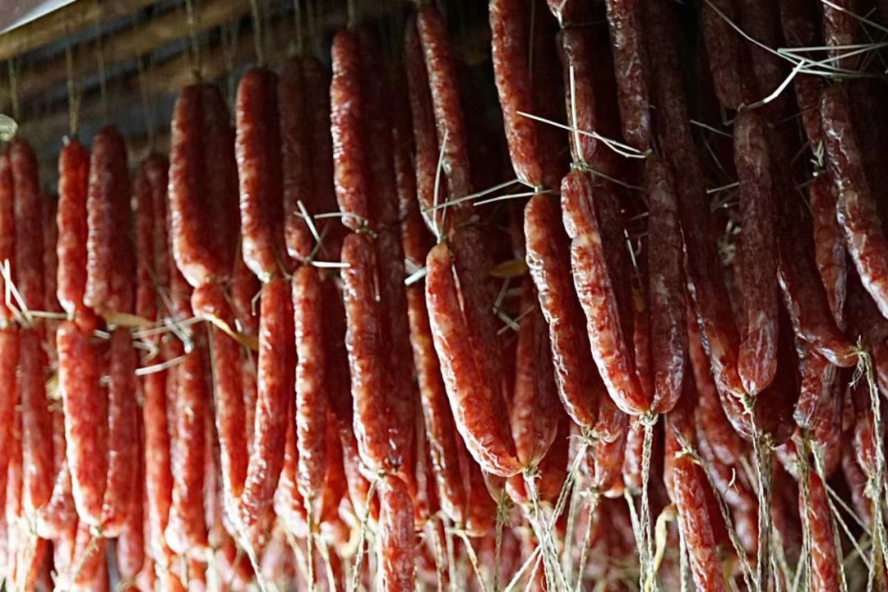

除了猪肉，腊肠的肠衣也有讲究！饱记就是用中国人民几百年晒腊肠用的，猪肠衣。成本高，但是架不住口感好！嚼起来 Q 弹有韧劲，最后又会在口腔里化开。而便宜货可以用科技品：胶原蛋白肠衣。就是蒸完嚼不大烂可以整条脱下来吐出来的那种！

天然肠衣一眼就能看出来，比较薄和透

一共三种选择！口味一：手工广式腊肠，

二八肥瘦比！

效期至 25 年 7 月

口味二：滇式腊肠

用了不少贵价的辛香料，各种香味在唇齿间乱窜。亲测怕辣的人也能吃！

效期至 25 年 5 月！

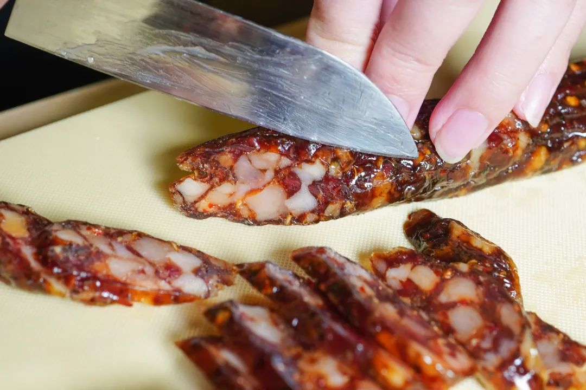

2.玫瑰露酒腊肉&腊排骨效期至 25 年 6 月/7 月
除了腊肠，
产品同事老藏着掖着的还有我司卷生卷死的

玫瑰露酒腊肉👇

效期至 25 年 6 月。

这腊肉用料实在，但好吃不贵！
腌肉用的玫瑰露酒。
找了好久，
才选中天津老字号金星的玫瑰露酒，花香酒香协调且纯正，可以给肉带来一股自然的玫瑰香！

肉呢，用的带软骨的猪肋排，每头猪仅能产出两条，非常矜贵。

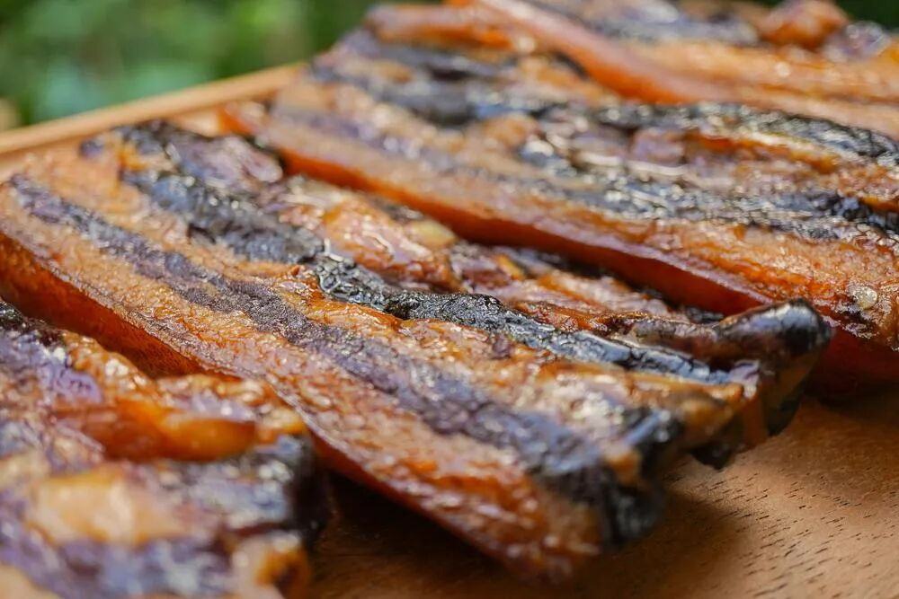

每 100 斤肉就要用掉 7-8 斤玫瑰露酒，并用草绳一一吊挂，腌制 4 小时以上。最后用当地特有的长竹竿整排吊挂，经过 3 天的风干锤炼，才变成了一条条成色隽美的腊肉。

如果你跟本薯一样，不喜欢很重的糖度或略呛人的白酒味，买饱记的这款腊肉就是有福了！我司相应减少了糖的比例，更能突出肉的原香👇

饱记：酒肉与肉香交织，能尝到猪肉的原香。网购：酒味盖住了肉香，调味整体偏甜。

别急，还有！

这道腊排骨火锅，

是地道的云南丽江美食。

不到百元，教你在家复刻！

就是把腊排骨放锅里炖煮 1 个半小时，

直到炖煮到这样的浓汤。

加入韭黄番茄大葱玉米，

腊排骨的汤底就完成了！

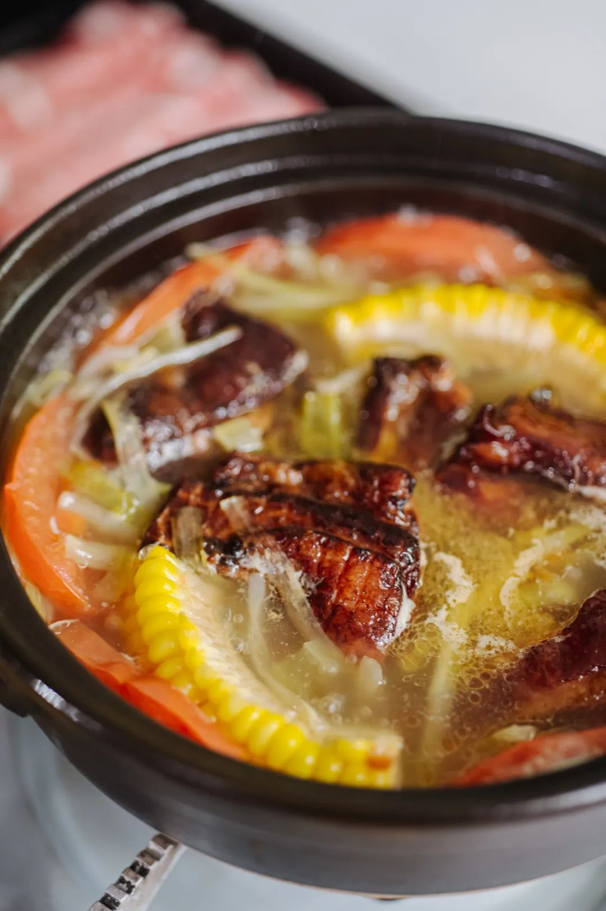

其他和吃火锅一样，

想涮什么下什么，

菌类啦蔬菜啦都很好，

还能带来一点甜味。

最好再调一个蘸水！

云南风味的灵魂！

蒜泥+香菜+辣椒粉+腐乳+线椒，

最后淋上一点腊排骨的汁即可。

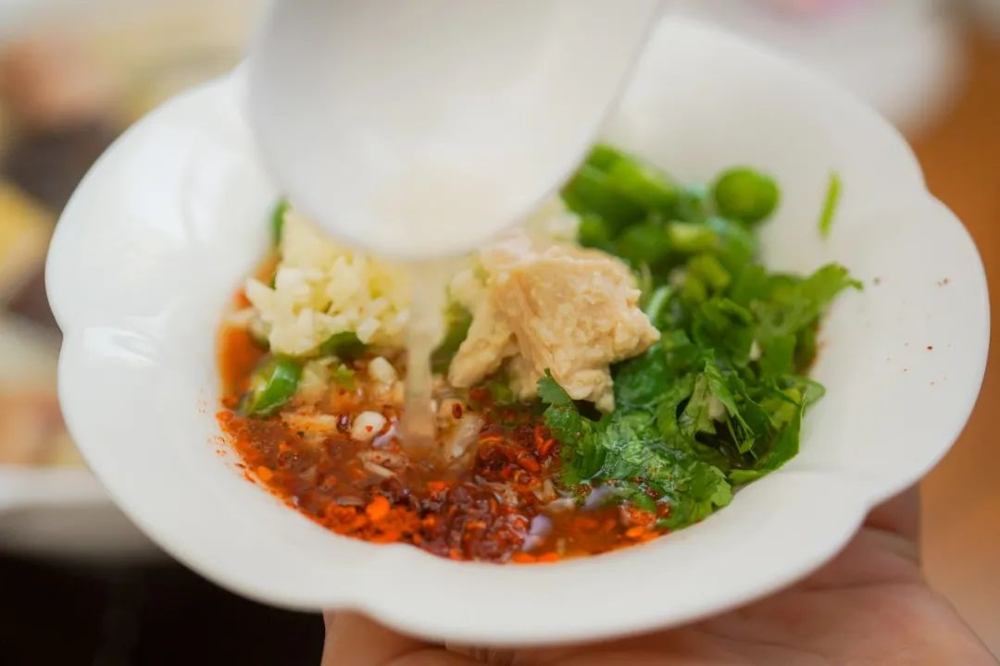

提醒一下，

排骨提前浸泡 3-4 个小时再下锅煮，

否则会太咸。总之，

不需要任何厨艺，

不到一百块钱，

你就能做出这样的冬日暖锅！

效期至 25 年 7 月。

冲！

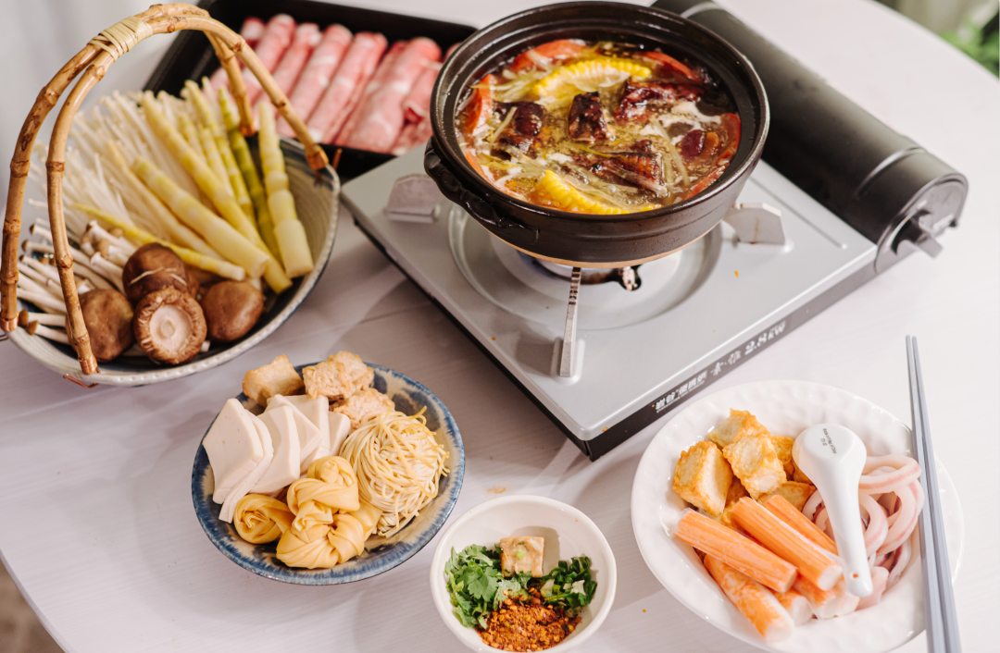

3.酥酥纸盒蛋卷&铁盒蛋卷效期至 25 年 6 月
极其香酥的酥酥蛋卷！分为纸盒装和铁盒装。

好吃的秘诀无它，

就是舍得下料，手工制作！

新鲜鸡蛋含量大于 24 %，入口化沙。

纸盒装两种种口味！原味&南乳香葱味是老朋友了。原味香甜酥脆。南乳香葱味是饱记定制！

外面根本买不到！

铁盒装里有新增的玫瑰风味，真实添加了重瓣玫瑰，入口花香馥郁自然，又清新又淡雅。

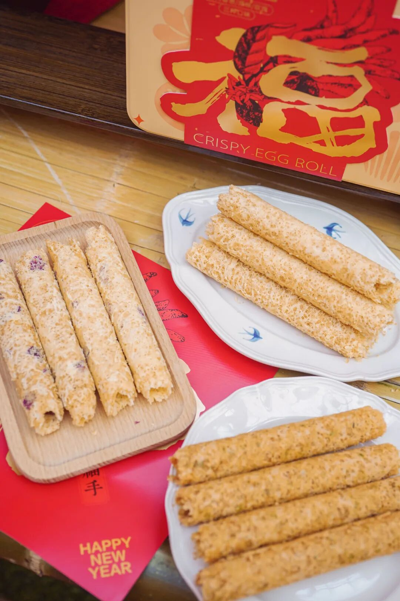

4.酸梅汤效期至 25 年 7 月

酸梅汤，咱们中华儿女都熟。

这款用到了八味配料：

乌梅、橘皮、山楂、薄荷，

玫瑰茄（洛神花）、甘草、桂花，

还加了一点冰糖中和酸味！

没有乱七八糟的硫熏和色素，

即使是同某堂的师傅来看，

也是服气的。

做了免煮的三角包设计，

操作难度零颗星，

加热水让冰糖融化，

再静候几分钟即可。

冰镇后加点冰块，

酸甜清爽，咕咚咕咚一大杯！

5.蜜桔干效期至 25 年 8 月

产自世界柑橘始祖地之一的台州黄岩，10斤蜜桔才能出一斤蜜桔干，选的无核品种、酸酸甜甜，可以配茶吃。

这迷人的橘子芬芳，这酸甜可口的味道，吃了它，大鱼大肉我还能再战三百回合！

6.午餐肉片效期至 25 年 7 月

超多肉！！看得见的那种，

只选优质去皮猪后腿精瘦肉，

鲜香弹牙，没有面粉感！

随时随地大满足，

是常温储存的。

从此，你就可以坐在工位上啃肉了。

（但更好的生活方式还是六点就下班回去

你可以这么吃：

这么吃：

这么吃：

（都来自我的亲手制作，我不会下厨

以上都地板价走起，

临期清仓 5 折！

约等于半价了，自家吃吃完全不影响，

介意的注意看一下效期哦！

饱记·5 折临期清仓专区

购买方式如下

介意效期慎拍哦！！

戳图下单购买👇或在🍑🍑🍑「艾格吃饱了」搜索相关产品

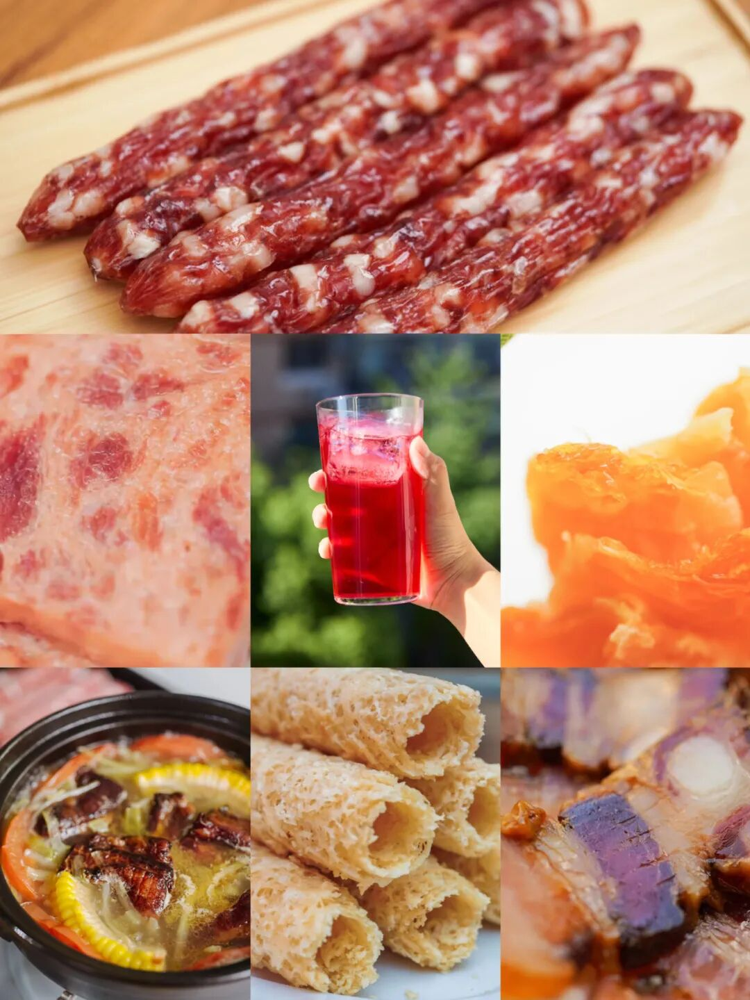

除了临期产品，再给大家说几款「刮油」好茶，都又香又甜又润，

凑热闹也给到一个

限时 9 折！

信我！春天必须喝起来！

折扣好茶其一：入口有冰糖韵的小金罐·六窨茉莉花茶👇

福州乃茉莉花茶的发源地，

我司特地委托了

家中五代制茶的福州老茶人，

以传统古法窨制正宗茉莉花茶！

先要在夏季鲜采数百斤茉莉花，

因为那个时节温度高但雨水少，

茉莉花柔和鲜灵，

运回后再仔细拣选，

只留花苞、颜色、大小合适的茉莉花

与茶叶拼和。

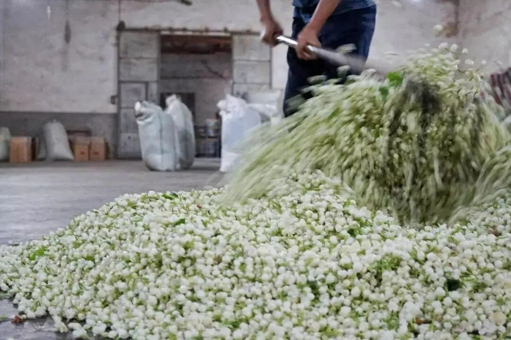

再精选明前茶坯，

六窨一提传统窨制，

下花量高达 350 斤

这还没完！

福州古法做花茶，

见花香不见花，

茉莉花窨完后还要以手工挑除，

只留茶叶与花香～

道道反复工序，

才有最后的舌尖一点冰糖韵，

抿一口茶汤，扑鼻香气～

鲜灵得让人神清气爽，

甘爽醇和，舌尖回甘，

饭后喝喝正合适啊！

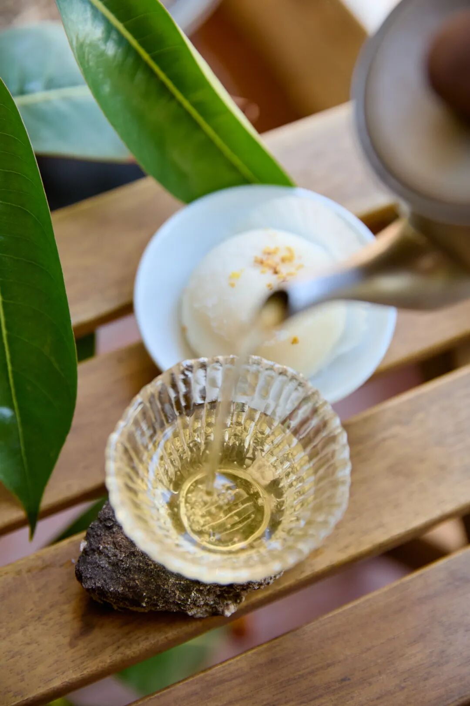

折扣好茶其二：

我司回购率极高的桂花乌龙小金罐！

福州同事的原话：

这茶完全经得起盖碗的考验！

和市面上都是细末的调味茶不是一回事，

必须细细品味！

来自后台用户的

真实反馈👇

茶叶用的是六年陈炭焙铁观音，

同事专程跑到福建安溪，在平均海拔超过 1200 米的戴云山脉深处卷出来。茶农分三次焙火逼出茶香，最后陈放六年，耐心等待火气褪去，把蜜韵养足～

金桂，是每年寒露前后新鲜打的，早上五六点日出前打下来，运回后剔除花梗树叶，仔细拣选后才可与茶叶拼和。

然后请来福州当地家中五代制茶的老茶人，以传统古法窨制，一层金桂一层茶～

早期刚开始，我们做的是一窨一提（下花量 70 斤），后来再到两窨一提（下花量 230 斤），这次老板下了血本，直接做了三道窨制的（下花量300斤）！100 斤的茶要用300 斤桂花分三次窨制！！

（洒的不是花，是钱。。。
但懂的都懂，老福州人做花茶，讲究见花香不见花，饱记也是同样标准，桂花萎蔫后都会以手工挑除，只在烘干后额外洒入干桂花～费时费力得很！

（这么好看，不要命啦？
用盖碗泡，哇～桂花的香气完全被激发，直窜入鼻尖！带着一点花的自然甜味～入口茶汤微稠，舌侧香气余韵不绝，观音茶的回甘源源不断！

总之，闻起来是甜的，喝起来却有烤过的醇厚滋味！本当它是办公茶叶，没想到茶底这么好，还耐泡得很！立即决定囤几罐在家！

还可以搭着柚子小种红茶买！组合更划算！用的是武夷山的花香小种红茶。茶叶鲜度很高，传统手工精制，一芽一叶。

泡出来是这样的，远远都能闻到饱满的柚子香气！冷热皆可。但同样最推荐盖碗泡法！

当然你也可以像董洁一样，（是的它可是上了董洁直播间！一个人的时候拿出喜欢的杯子品品，给自己小小的仪式感？总之优雅永不过时

饱记·小金罐好茶专区购买方式如下👇限时 9 折起！！
戳图即可购买👇或打开 🍑🍑🍑 搜索「艾格吃饱了」

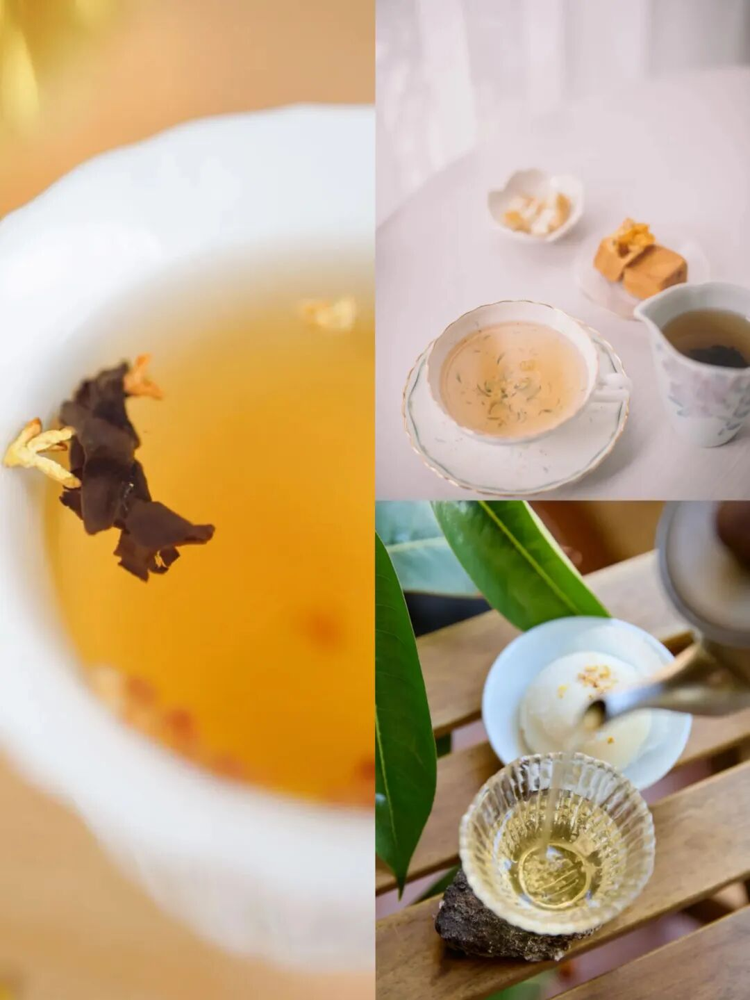

题 外

朋友们！！！

今年的饱记粽子！买了吗？？除了经典四个口味湖州大粽，还有用了现榨葱油、葱酥的闽南肉粽！泉州妈妈配方！地道得不得了～现在都有限时早鸟 88 折！回归的金山鸡这批还有最后 20 只一年老母鸡，想当包邮区大孝子的速冲！限时 7 折！时令新鲜的春季茶中「梅家坞」和「蒙顶甘露」性价比高！自家喝不心疼！限时单件 86 折/双件 8 折！上好的「狮峰龙井」送人包体面！限时喝春茶 9 折来自湛江的红膏青蟹。不仅有红膏，而且满到蟹壳角角落落。

其他的东海野生海鲜，

肥美银鲳和红膏梭子蟹，

都是高级餐厅水平！

限时吃海鲜 9 折！

还有些只有最近这一阵可吃的水果👇

拿过上海金奖的金山小番茄，

限时早鸟 86 折！

找了七八年才满意的大连蜜甜樱桃，

瓜肉软糯的翡翠冰淇淋甜瓜，

难得回归的泰国超甜多汁金柚，

无渣不麻嘴的海南金钻凤梨，

连盐水都不用泡。

卷中卷红玉芒果，

娇艳可人的雷州木瓜，

现在也有限时 9 折！

饱记·口碑湖州大粽&闽南葱香肉粽

预售中！！

4.30 左右按顺序发货！

限时早鸟价 88 折！！！！

戳图买它👇

饱记·云南稀有品种瓢鸡限时吃鸡 7 折！！！
戳图下单购买👇

饱记·梅家坞龙井&蒙顶甘露

限时单件 86 折！！！

两件 8 折！！

戳图购买👇

饱记·狮峰头采明前龙井

购买方式如下👇

限时喝春茶 9 折！！！

戳图下单购买👇

饱记·金山五彩小番茄购买方式如下限时早鸟 86 折！！
戳图购买👇

饱记·大连蜜甜红樱桃购买方式如下限时吃水果 9 折！！
戳图购买👇

饱记·翡翠冰淇淋甜瓜购买方式如下限时吃水果 9 折！！
戳图购买👇

饱记·花香脆甜蓝莓购买方式如下限时吃水果 9 折！！
戳图购买👇

饱记·多汁泰国金柚购买方式如下限时吃水果 9 折！！
戳图购买👇

饱记·湛江红膏青蟹购买方式如下限时吃海鲜 9 折！！！
戳图下单购买👇

饱记·东海冰鲜鲳鱼购买方式如下限时 9 折！！！
戳图下单购买👇

饱记·东海春季红膏梭子蟹购买方式如下限时 9 折！！！
戳图下单购买👇

饱记·海南金钻凤梨

购买方式如下

限时吃水果 9 折！！

戳图购买👇

饱记·海南红玉芒果购买方式如下限时吃水果 9 折！！！
戳图购买👇

饱记·湛江雷州木瓜

购买方式如下

限时吃水果 9 折！！

戳图购买👇

本文的研究员

薯角我想我知道春天的味道

用好吃的方式吃一生

祖国各地好风物

文章转载请加微信「baojiclub」

