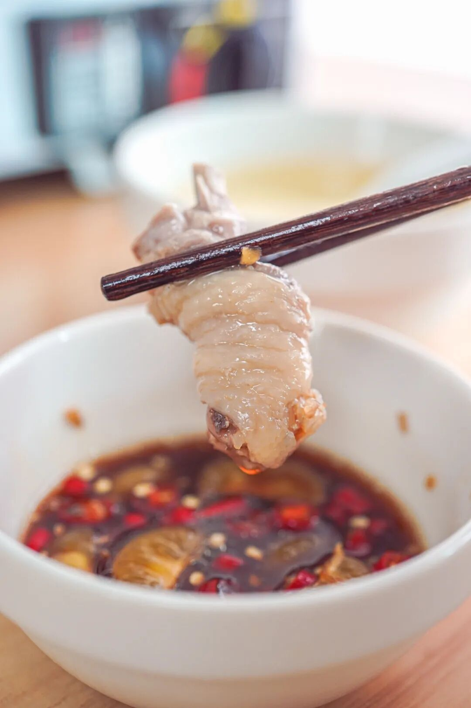
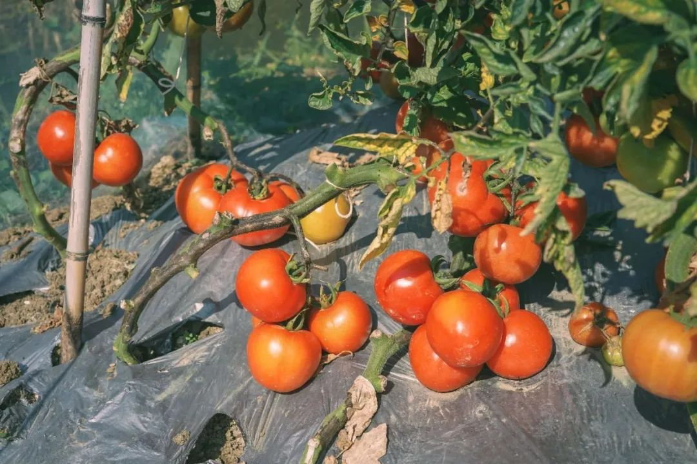
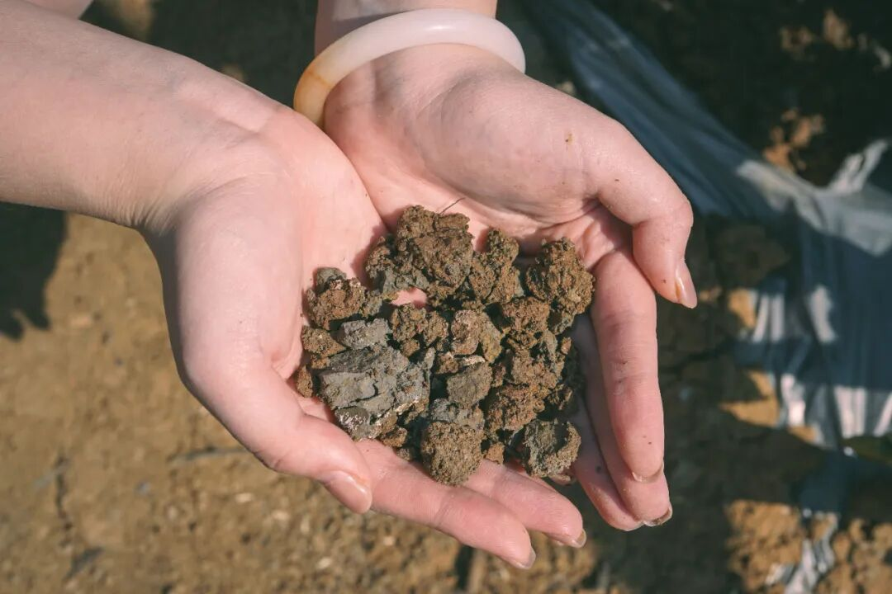
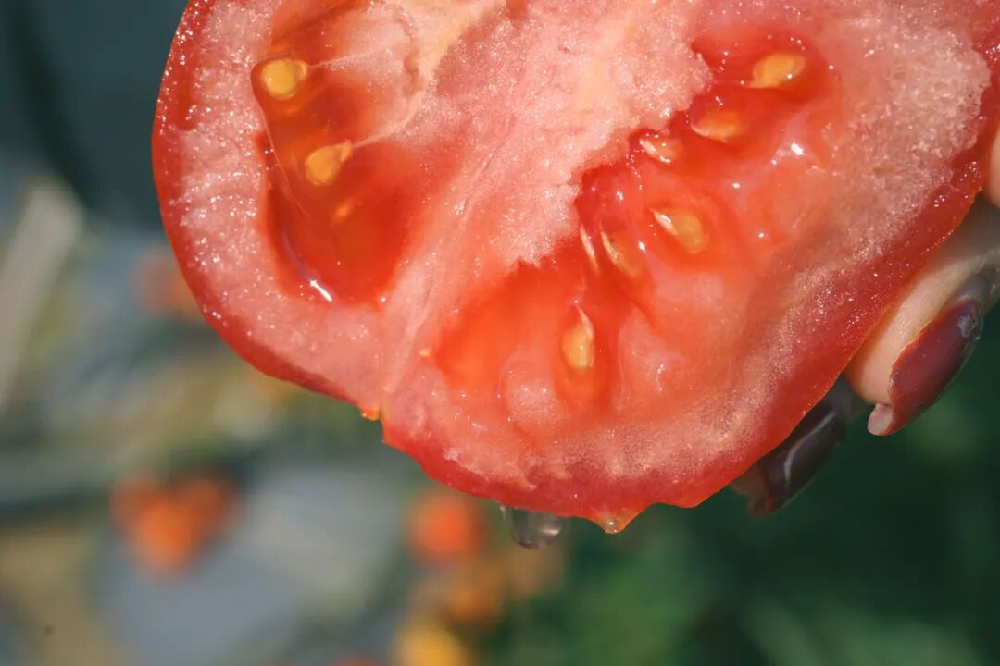
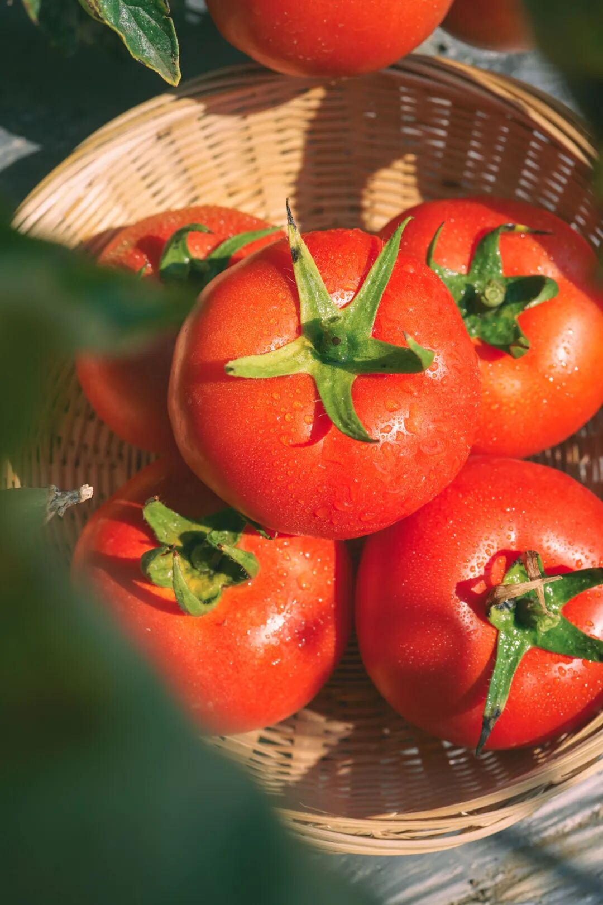

# 立冬了，发现一些吃不腻的菜

- 原文链接: https://mp.weixin.qq.com/s?__biz=MjM5NTYxODQyMA==&mid=2653461795&idx=1&sn=540fdf810b70ddb6b6030613e2f58154&chksm=bc074a74996bd96e1e7ff6cb1b1a2041959fb43e06cce10a255ba392009bf922e2a881083cc2&scene=27#wechat_redirect
- 浏览量: N/A
- 点赞数: N/A
- 评论数: N/A
- 转发数: N/A

## 正文

热腾腾暖乎乎！

一个尽情安利自我的公众号

以下是没事干研究院的风物研究报告请放心食用
嚯！转眼又到一年立冬，贴心如我薯角，这不又从同事那里搜出来一些好货，只为给大家送上天凉时的温暖！
（谄媚脸

比如这一锅热腾腾、暖乎乎，清甜得能连喝三五碗的饱记·海南椰子鸡！

看着其貌不扬的，实际上外面的大路货根本比不了！产品同事专门跑到海南文昌找鸡。一锅椰子鸡要好吃，
还得是本土正宗的文昌鸡！皮薄、肉嫩，吃起来弹牙爽滑，有鲜美鸡味的同时没有腥气。这样倒椰子水煮出来的汤，
才有淡香回甘的清甜！

只能说，功夫不负有心人！同事在小岛上吃来吃去，（只听本薯大喝一声：怎么不带我？
最后还真找到了一群特立独行的鸡！

这鸡生活在文昌的田野林间，

先是在外头散养上 100 天，

再关到笼子里养 20 天，

放养的时候增肌，

笼养的时候增肥，

（难道这就是传说中的脂包肌？

最后就是恰到好处的紧实弹嫩！

且给大家保证，

每一只都是活鸡现杀！

再送入 -38 度以下的冷库急速冷冻，

冻实后顺丰空运发出。

也就是说，

这鸡会从田野里送达你的餐桌，

过程里没有长时间的冷冻储存，

到手时还新鲜得不得了

给大家配了

100% 椰子水来煮这个鸡，

可以按 1:1 添加清水，

本薯的口味是一开始先不加！

完全保留椰子水的自然甜。

厨艺方面，也无需担心，

0 难度！

看！啥都给你备好了。

（以下这些箱子里打开都有👇

准备好一口锅，四步就能完成。1.所有食材解冻沥干备用；2.倒椰子水，倒椰肉、马蹄煮开；3.倒鸡肉，煮 5-7 分钟即可食用啦～
4.调一个海南传统风味蘸料！

给大家推荐一个地道调法！青金桔不切开挤汁，
而是剥开后整瓣丢进去！这样做妙在何处呢？就是减少了金桔直接的呛，又保留了果实带来的清新感～（谁发明的？快出来受本薯一拜！

啧啧啧，热气腾腾的冬日锅物，太有抚慰人心的作用。

还能吃到脆脆糯糯的珍珠马蹄，每一颗都清甜有滋味～

重点来了！为了保证新鲜，我司跟鸡场约定，攒够 200 只就给大家当天现杀发货！所以现在还是预售！
限时开始三天闪购！这一批攒够 200 只就给大家现杀发货！预计 11.14 当天能发，快，加入这个文昌吃鸡小队！

饱记·海南椰子鸡

双十一同价 86 折！！！

限时闪购三天！

预计 11.14 起发货

戳图买它👇

另有喜讯一则！！红河蒙自露天生长的老品种西红柿，
它它它突然熟了！！限量 700 份，4 天内发货，冲！！

这次种植成本比上次高一点，每箱涨了几块钱，下次如果下降还会给大家调回来！
仍然超值呀！
就是那种小时候吃的那种番茄，难得有番茄味儿！

长在云南高原上，沐浴着阳光雨露长大，用的是自家改良拼配矿物质含量更高的红沙土，拒绝化肥，羊粪鸡粪天然堆肥长大。

全都是露天果园栽种的老品种，不仅味道和小时候一样，真正还原记忆里的酸甜多汁，

而且种植过程不打农药～

（真的会爆汁。

汁水往下滴。。。。

之前进果园的路上，就看到几只鸡在旁边撒欢。当地的果农大哥，聊着天摘下来就开啃，这要是打了药，谁还敢这么吃啊？

大姐告诉我，其实种番茄不咋挣钱，一开始是不放心外面的品质，为了自己两岁的孩子找的，就一小片。

我们去的那天，大姐也摘了几个回家给孩子做饭
后来发现很多妈妈都有需求，才慢慢扩建到现在十几亩。

都是地里现摘的哦。
但就算是这样，像这种露天自然生长的番茄，产量也有限得很，种几年就得让地休息休息，比不上大棚出产速度快，卖完了，就是没了，没办法补。所以你们赶紧下手！

而且由于我饱记的标准比较高，只要优等果，损耗率也很高。

因为都是都是果园里现摘现发，

所以如果当地下雨，发货时间会顺延！！

云南去年会有连续下十几天雨的，

所以这次也只上有赞！

话不多说！本薯自己也是要抢的！剩下的你们自己看商详，拼手速吧！

饱记·云南西红柿购买方式如下双十一同价 86 折！！
戳图购买👇

题 外

大家好，和我一起跟上老钱的吃喝吧！（实在！
我司这个时节不容错过的：1.苏南蟹标杆美味：太湖流域大闸蟹2.苏北蟹宝藏性价比之选：洪泽湖大闸蟹3.坚持真材实料、天然肠衣的手工腊肠
4.能做煲仔饭和火锅的玫瑰露酒腊肉&腊排骨以上美味，每年都收获一些老钱客人的积极捧场！（谄媚感谢堪称有钱人家的掌门富二代与本薯的共同爱好（？现在还有最后一波双十一折扣！速冲！
饱记·太湖流域大闸蟹购买方式如下双十一同价限时 86 折
戳图下单购买👇或🍑🍑🍑搜索「艾格吃饱了」

饱记·洪泽湖大闸蟹购买方式如下双十一同价限时 86 折
戳图下单购买👇或🍑🍑🍑搜索「艾格吃饱了」

饱记·手工腊肠购买方式如下👇双十一同价 9 折！！
三款口味，各有各的特点。用的黑猪肉、天然肠衣、玫瑰露酒...酒香腊肠，酒香浓郁，
有四六和二八这两个肥瘦比例可选。
滇式腊肠用了不少贵价的辛香料，同事说超适合拿来做西班牙海鲜饭，
试过加辣肠后升华了。
戳图下单购买👇或🍑🍑🍑搜索「艾格吃饱了」

饱记·玫瑰露酒腊肉&腊排骨购买方式如下👇双十一同价 9 折！！
戳图下单购买👇或🍑🍑🍑搜索「艾格吃饱了」

本文的研究员

薯角好冷啊

用好吃的方式吃一生

祖国各地好风物

文章转载请加微信「baojiclub」

