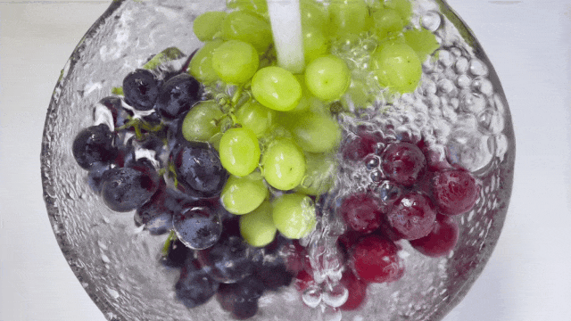
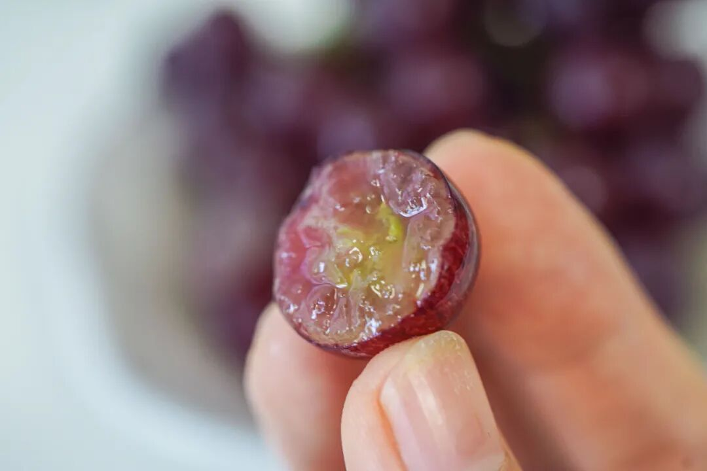
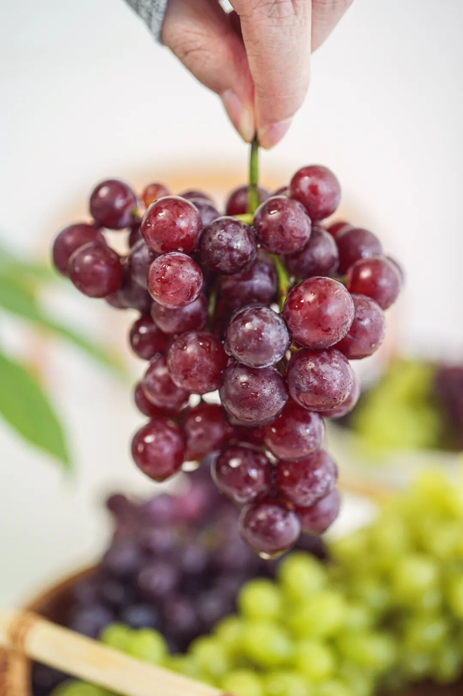
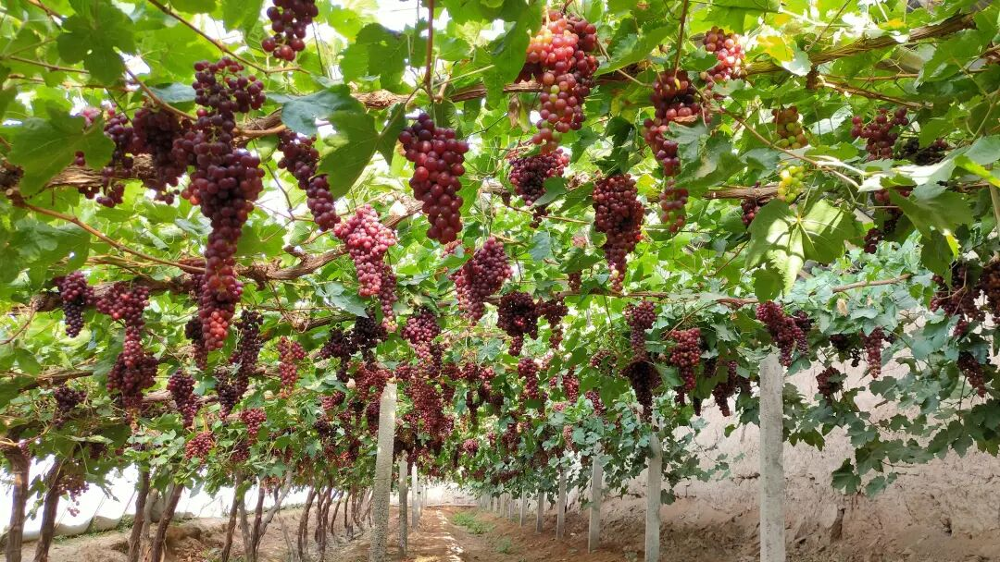
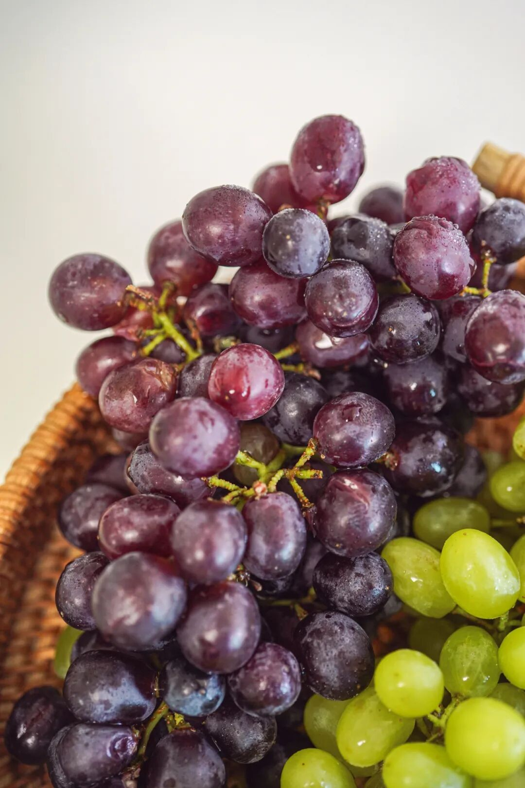
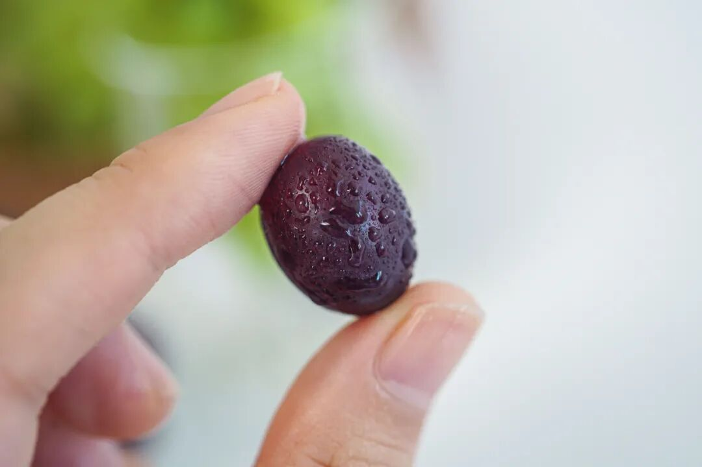
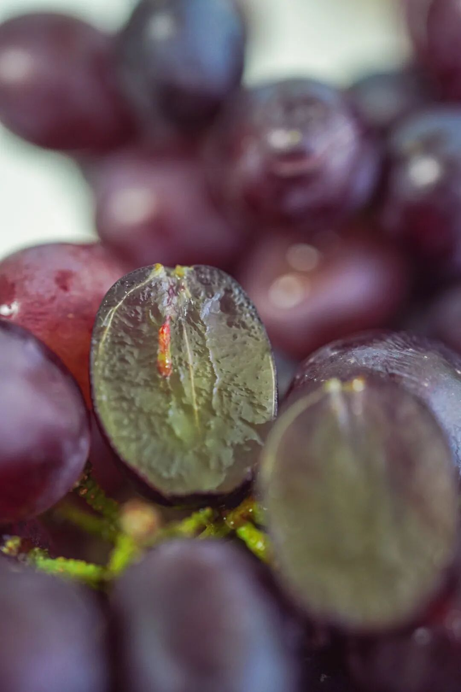
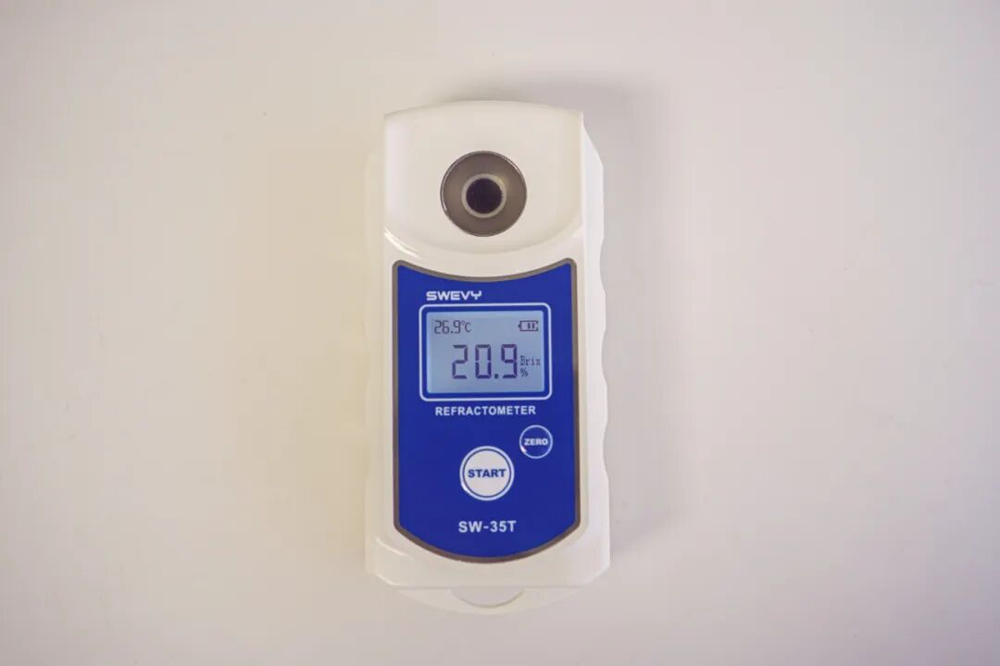
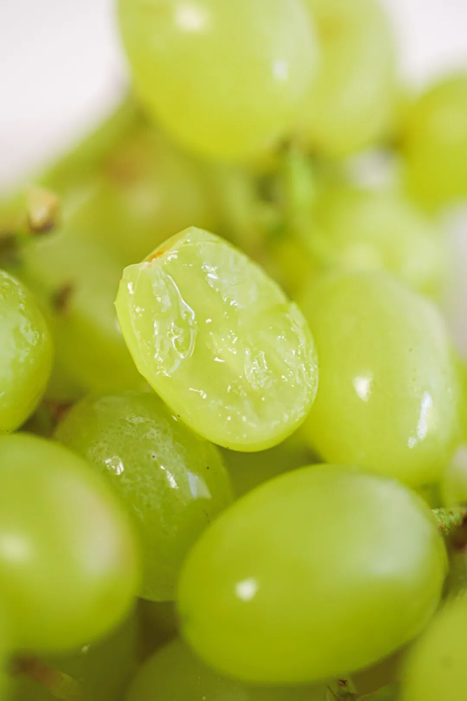
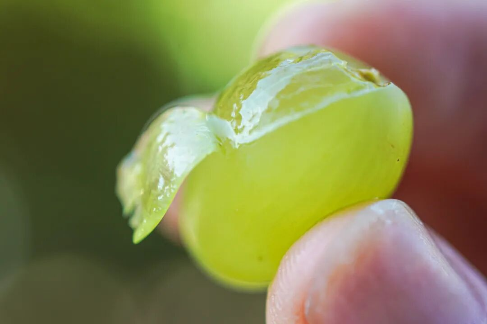

# 立秋之日，接收来自新疆的甜

- 原文链接: https://mp.weixin.qq.com/s?__biz=MjM5NTYxODQyMA==&mid=2653457195&idx=1&sn=d17b2d5e679b9c91f93a693b1d737379&chksm=bca4a62d0b0c8bd03c5fefbb35a22c5454c93e3989d9694efe61413c62493c587d5d83341752&scene=27#wechat_redirect
- 浏览量: N/A
- 点赞数: N/A
- 评论数: N/A
- 转发数: N/A

## 正文

秋天的第一口葡萄

一个尽情安利自我的公众号

以下是没事干研究院的风物研究报告请放心食用

今日立秋🍂

虽然上海仿佛没收到通知似的，

（重新定义中秋：中暑的秋

还是给大家上个新庆祝下！

饱记·新疆三色葡萄，

依次为：玻璃翠、无核紫、无核白，

也可称小红、小紫、小青

三种葡萄拼成一箱，

从酸甜慢慢过渡到纯甜，

全都非常懂事，

没有籽，嘎嘣脆还会爆汁！

一口一把吃到爽～

来自新疆吐鲁番，

都是露天葡萄，

打从一出生就沐浴在阳光中，

再加上得天独厚的昼夜温差，

包甜！

（只是分享新疆风光！不是吐鲁番！

点兵点将时间到，

先说说小红——玻璃翠是也！

名字起得好妙，

听过难忘～

果如其名，

外皮又薄又脆，

如玛瑙一般圆润通透。

咬开是噗呲噗呲的口感，

难得的是水分还超级足👇

到底多好吃呢？

洗两串放果盘里，

奥运选手们还热身呢，

就炫完了，

不够吃啊！！

玻璃翠是吐鲁番最不易运输的葡萄品种之一，

所以市面很少看得到，

通过多年优化升级，

才能发往全国各地，

一饱大家的口福。

快吃！！

再说到小紫——无核紫，

外皮挂着一层果霜，

又被称为自然里的紫宝石👇

果粒呈椭圆形，

皮薄肉厚，

口感偏软嫩～

糖度比玻璃翠高一些，

通常在 20 左右，

以下为我司摄影师实测👇

压轴登场的是小青——无核白，

迷你绿色小珍珠，

入口爽脆。

本薯亲测以后，

强烈建议三色里最先吃它！

甜中带一点酸，

不涩不腻～

老规矩，

限时早鸟 86 折！！

三种葡萄，三重风味，

九分甜，一分酸，

加起来便是超过十分的快乐！

（数学真好

饱记·新疆三色葡萄

购买方式如下

限时早鸟 86 折！！！

来自新疆吐鲁番的甜，

三种葡萄，三重风味，一次拼配。

玻璃翠·无核紫·无核白。

不吐皮不吐籽，

嘎嘣脆还爆汁！

甜度从低到高，

自酸甜过渡到纯甜，

完整体验不同酸甜配比惊喜。

天🐱活动

自今晚 8 点至 11 日 23：59，

全店跨店满 300 减 40，

相当于 86 折，

也可于天🐱下单！！！

戳图下单购买👇

或到🍑🍑🍑

搜索「艾格吃饱了

题 外 一

本周刚上架的两种桃吃了吗？声名在外的炎陵黄桃，有热带芒果香气的芒果油桃，
都是脆软两吃！入口蜜蜜甜～限时早鸟 86 折！！！

饱记·炎陵黄桃饱记·芒果油桃购买方式如下限时早鸟 86 折！！！

脆软两吃！浓甜的桃汁炸弹！
果期短暂，产量少，一年仅有 20 天左右成熟期。还是饱记标准，
只选树上熟，果园现摘现发。
收货后喜欢脆桃直接吃，偏爱软桃亦可常温放置 1-2 天再食用。戳图下单购买👇

题 外 二

近期还有云南专场！！

来自香格里拉的野松茸，

这个季节的天赐美味，

又鲜又灵，且烹饪难度 0 颗星。

太贵！打不起折！！

还有酥香的云腿酥，

拌着黑、白松露酱，

越嚼越香！

早鸟 86 折！！

饱记·香格里拉野生鲜松茸

一口价！打不起折！

购买方式如下

饱记的鲜松茸，

采自海拔 3500 米以上原始松木林。

只发 1-2 级符合出口标准的松茸。

新鲜采下送冷库保鲜，

冰袋+吸水纸保鲜，顺丰发出。

戳图买它👇

或🍑🍑🍑搜索

「艾格吃饱了」

饱记·滇式云腿小酥

预售中！！！

早鸟 86 折！！！

传统滇味经典，

新鲜手作，浓情四溢。

🥮四个口味：

经典云腿、蛋黄云腿，

黑松露云腿、白松露云腿。

🥮三种规格：

云腿酥礼盒全家福

（四个口味各 2 枚）

云腿酥礼盒双拼

（经典云腿小酥*4 枚+蛋黄云腿小酥*4 枚）

云腿酥礼盒囤货装

（经典云腿小酥*30 枚）

现在是预售！

预计 8 月初发货！

戳图买它👇

题 外 三

有时真为一些食物不平，
这么好吃怎么无人问津？？两个口味的招牌梅饼，
天然酸甜的黄桃干与空心山楂球，
越啃越香脆的圆墩墩玉米浪，还有扎扎实实的午餐肉片～以及招牌南乳香葱蛋卷等，含泪临期清仓，都是实打实的折扣！！无需凑满减！⚠️PS：清仓产品临近效期，介意慎拍～

饱记·临期清仓专区
5 折起！

清仓产品临近效期，所以巨折，但自家吃吃没问题！介意慎拍～
「临期清仓」专区，5 折起！！清仓产品临近效期，介意慎拍哦～戳图买它们！！👇

本文的研究员

薯角快买OK？小心我求你

用好吃的方式吃一生

祖国各地好风物

文章转载请加微信「baojiclub」

