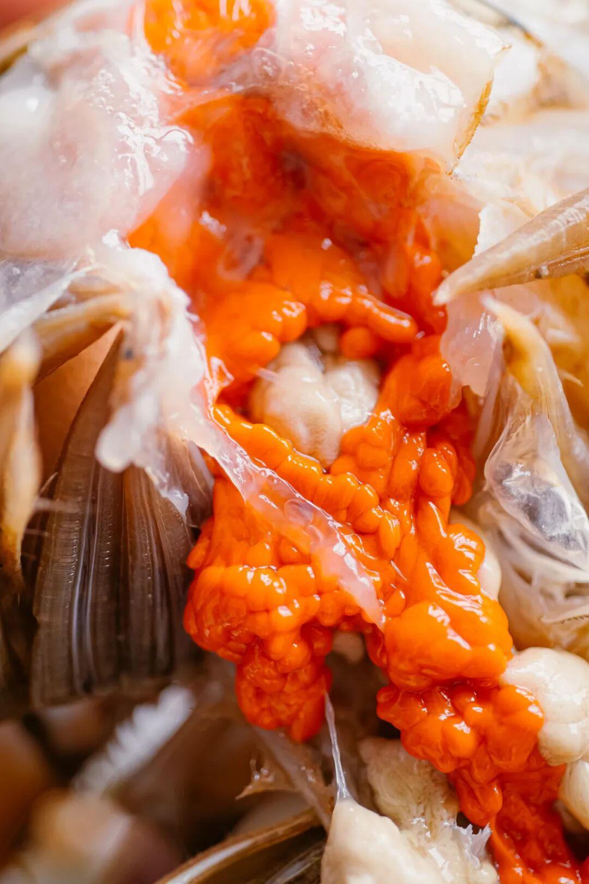
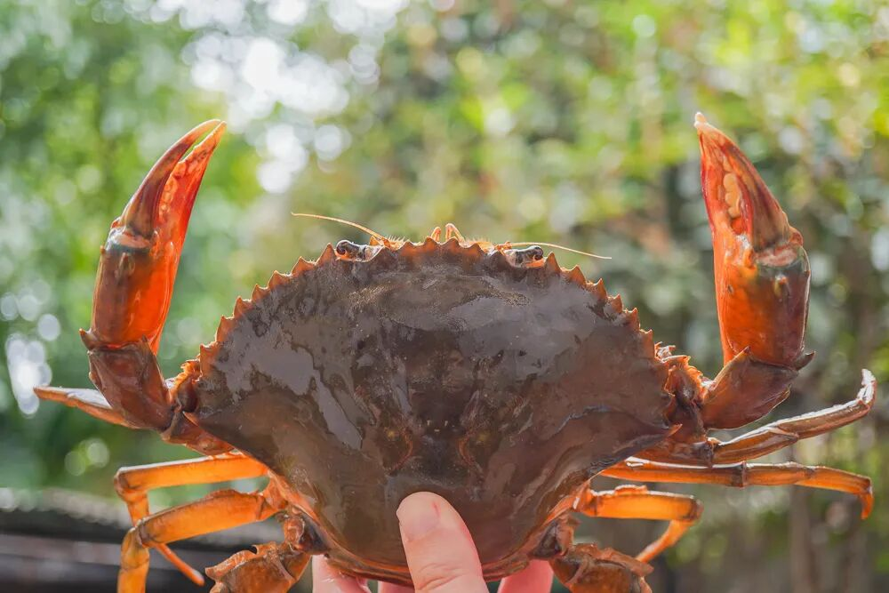
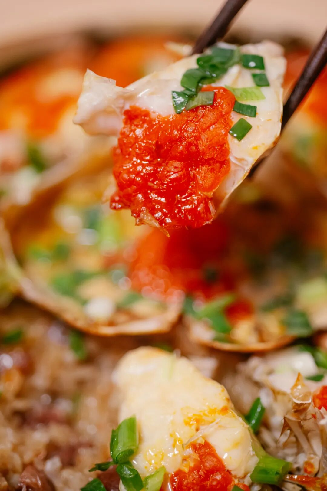
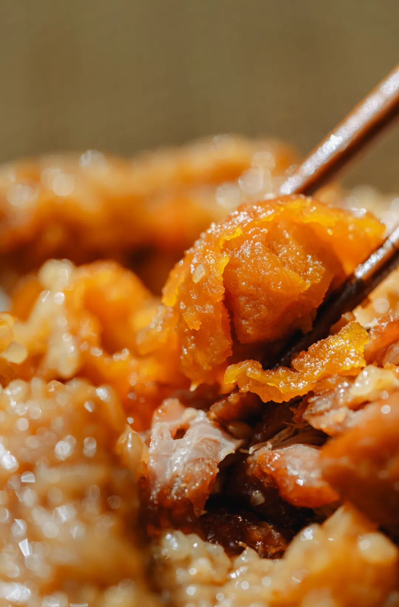
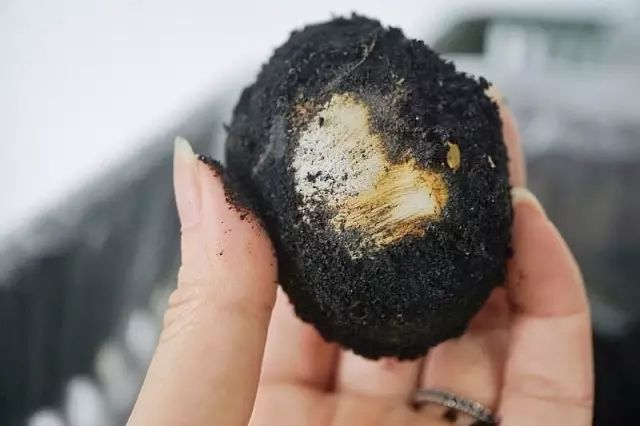
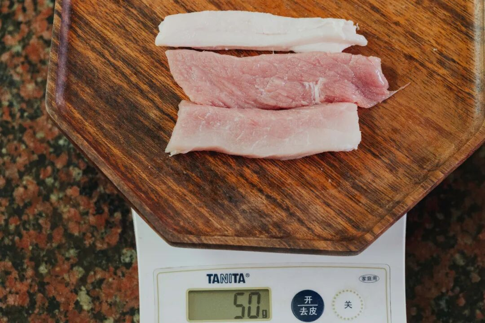
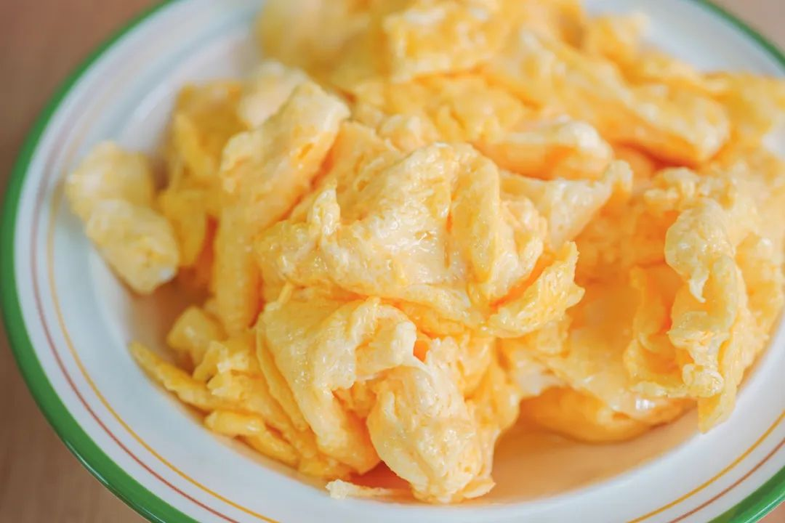
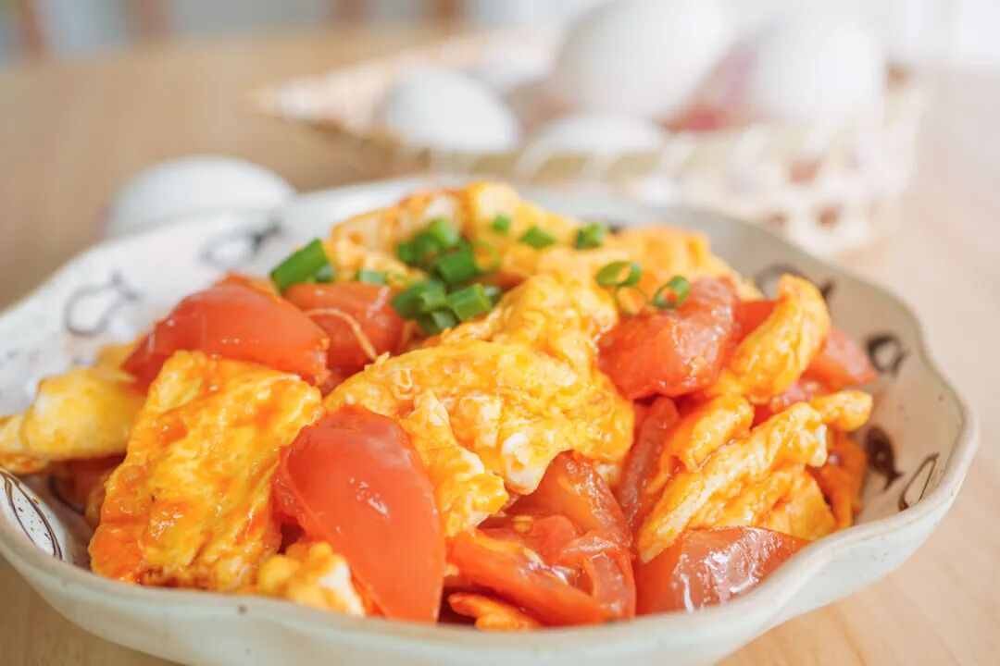
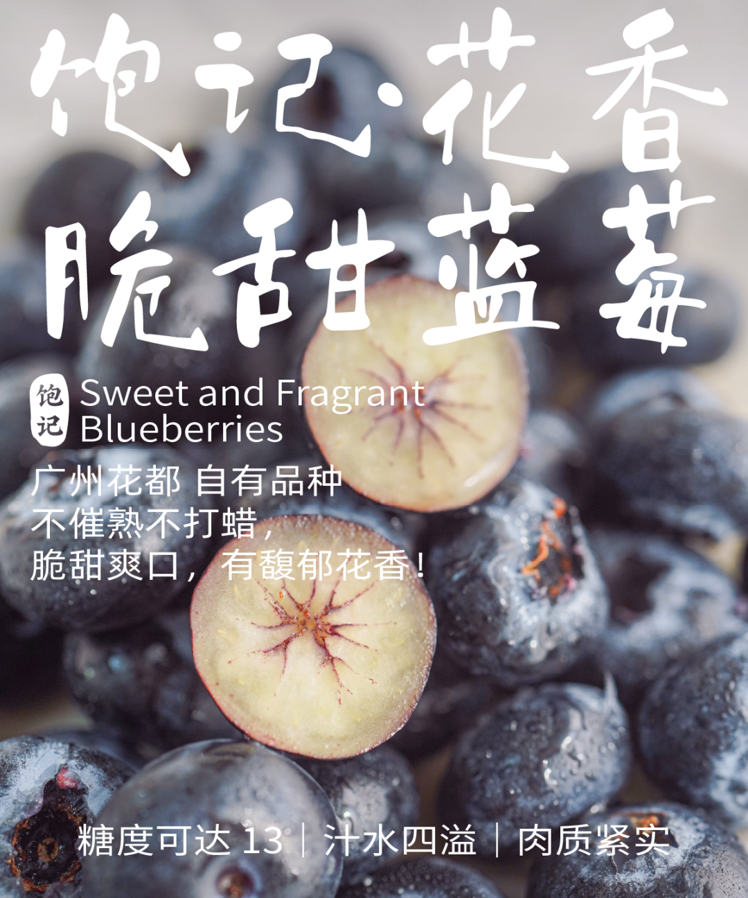

# 端午私藏美食三种，香得流油，可网购：）

- 原文链接: https://mp.weixin.qq.com/s?__biz=MjM5NTYxODQyMA==&mid=2653471111&idx=1&sn=428d54841e651f2e50e069be74441359&chksm=bca23cef7773b306c246635fc7cb3c57e8536cdc43744896276f2f291ae61acc82a09156f6e9&scene=27#wechat_redirect
- 浏览量: N/A
- 点赞数: N/A
- 评论数: N/A
- 转发数: N/A

## 正文

吃美了

一个尽情安利自我的公众号

以下是没事干研究院的风物研究报告请放心食用
啊朋友们，离假期端午仅剩短短两个工作日！贴心如我薯角，给大家献上三种极为应景的美食，个个香得流油，一筷子下去就给你吃美了～

端午美食其一！这个来自湛江的凶猛红膏青蟹。

膏鲜红，黄流心👇

浓郁的鲜味，啊～爽！

不仅有红膏，而且满到了蟹壳的角角落落。

这种叫大红顶角膏蟹，每一只都是挑蟹佬用手电筒照着挑出来的，现在吃最香了。。。

合作伙伴说湛江是祖国大陆最南端，日晒多，蟹熟得快，所以这个时节想吃优质膏蟹，还得看湛江👍

这蟹养在湛江咸淡水交汇的地方，水的咸度刚刚好，蟹才不怎么腥。而且它们从小吃鱼和贝壳长大，伙食没话说，难怪这蟹美味啊。。

一堆一堆的蟹膏，

看得真让人雀跃。

每一只都足斤足两，

鲜捕现发，从原产地发货。

吃吧就！

饱记·湛江红膏青蟹购买方式如下限时吃海鲜 86 折！！
戳图下单购买👇

端午美食其二！做了九年、卖了 90w+ 只的饱记粽子！尤其是里面那一颗流油起沙的咸鸭蛋！

故事要从 2016 年端午，老板心血来潮挖蛋黄讲起。当时我司为了做出一款包邮区之王：高邮咸蛋黄黑猪肉粽，老板就跑到了高邮开始鲜挖蛋黄👇

信不信由你！当时整个包邮区老字号大厂， 就没人做双蛋黄湖州粽，也没人很麻烦地鲜挖蛋黄。（是的这些年他们都是跟风！哼

历史图片：在工厂待清洗的草木灰古法腌制高邮咸蛋，2016 年
直到 9 年后，每年都坚持只用高邮本地品种麻鸭的鲜咸鸭蛋黄一年坚持鲜挖几十万只的，整个包邮区，也没听说有第二家！

肉也有严格限定标准，每一只都要称重黑猪肉，必有两条计 40 克黑猪后腿瘦肉，10 克腰间肥膘，共计一两。

工厂切肉，条条称重，但全手工操作，会有误差，有任何问题可找客服
咸蛋流油起沙，咸味渗入米里。。。
油香混着肉香，
芜湖～起飞～这便是我司引以为傲的
高邮咸蛋黄黑猪肉粽，外面根本买不到～

除此之外，我司粽子还有：陈皮豆沙粽！今年五个口味里的唯一甜粽，
也是老板 2017 年自己搞了两三个月开发出来的！在包邮区，饱记是原创！（好多人不信气晕本薯

还有传统酱香黑猪肉粽，用了三种酱油去浸米，其中一种是包邮区百年老字号日晒夜露的。
和蛋黄肉粽的米配方完全不同！老板说想要小时候土酱油的烟火气～（我只看得见一大块肉🙏

小众复古路线：古法南乳黑猪肉粽，是想致敬包邮区南乳大肉的味道～南乳，就是红腐乳。翻遍包邮区、华北和广东的南乳酱，最后：广东古法南乳酱赛高！米和肉都能吃到咸香带微甜的腐乳味儿：（你看这个红！它是不是寓意着鸿运当头！！（我疯了

最后是今年新做的闽南葱香烧肉粽，

我司产品经理找泉州妈妈要的配方，

料超多，馅超足！

用了泉州现榨红葱油、红葱酥

来炒制糯米，

再包入猪五花肉、干贝、

虾米、卤香菇、卤花生粒！

（快给我数不过来了

鲜香浓郁，

一口下去好满足嘿嘿

好了好了！！最后说下包装，每个口味两只一装，粽子煮熟后，再以 -40℃ 急冻锁鲜技术保存，粽子复煮后完全保留好食材的原汁原味。

普通 -18 度不能冻哦米会被冰晶撑破，要专门急冻设备做
因为天🐱618，现在持平早鸟价！

限时吃粽 88 折！

超划算的！之前催我的朋友们，

立刻给我下单啊啊啊！！

饱记·口碑湖州大粽预售中

现货中！！！

限时吃粽 88 折！！！！

戳图买它👇

端午美食其三！最后是这一颗清香无腥、大有来头的鸭蛋👇

从养鸭子开始管起！选的福建原产白鹜鸭，养在世界候鸟迁徙胜地明溪，

这里曾经是火山爆发口，

鸭子就在遗址周边的水库长大，

每天吃小鱼小虾、喝山泉水～

因此养出了富含硒元素的鸭蛋，是普通鸡蛋的 2 倍之多。没有乱七八糟的激素、色素、抗生素，老人小孩也放心吃，

我司曾央求中国特级烹饪大师毛水生老师给过一道番茄炒蛋方子。拿这次的鸭蛋试了试，
蛋块弹嫩鲜美，清香没有任何腥气，番茄汁水适中，滋味仍然酸而鲜！菜谱在这里👉蕃茄炒蛋，多加一碗饭

老规矩，给大家产地现捡现发，还有限时早鸟 86 折！一盒吃上半个月差不多，也算是端午必备了！

饱记·富硒白鹜鸭蛋

购买方式如下👇

限时吃蛋 86 折！！！！

戳图买它👇

题 外

朋友们！！！

天🐱618活动今晚又开始了！

我司直截了当打折！

🍑平台全场 85 折！

果期极短的苏州东山白玉枇杷，今天最后一天了！限时早鸟 86 折！突然熟了的云南西红柿，配鸭蛋炒正正好，是小时候阳光里长大的浓郁番茄味儿，
限时早鸟 86 折！！

还有些只有最近这一阵可吃的水果👇

拿过上海金奖的金山小皇冠西瓜，

爆汁清甜还有瓜鲜味！

也拿过上海金奖的金山小番茄，

难得回归的泰国超甜多汁金柚，

瓜肉软糯的翡翠冰淇淋甜瓜，

无渣不麻嘴的海南金钻凤梨，

连盐水都不用泡。

卷中卷红玉芒果，

娇艳可人的雷州木瓜，

现在也有限时 86 折！

饱记·苏州东山白玉枇杷

限时早鸟 86 折！！

最后一天！！！

戳图购买👇

饱记·梅家坞龙井&蒙顶甘露限时单件 86 折！！！两件 8 折！！

戳图购买👇

饱记·金山小皇冠西瓜

购买方式如下

限时早鸟 86 折！！！！

戳图买它👇

饱记·云南西红柿

购买方式如下

限时早鸟 86 折！！

戳图购买👇

饱记·多汁泰国金柚

购买方式如下

限时吃水果 86 折！！

戳图购买👇

饱记·金山五彩小番茄购买方式如下限时 86 折！！
戳图购买👇

饱记·翡翠冰淇淋甜瓜购买方式如下限时吃水果 86 折！！
戳图购买👇

饱记·花香脆甜蓝莓购买方式如下限时吃水果 86 折！！
戳图购买👇

饱记·海南金钻凤梨

购买方式如下

限时吃水果 86 折！！

戳图购买👇

饱记·海南红玉芒果购买方式如下限时吃水果 86 折！！！
戳图购买👇

饱记·湛江雷州木瓜

购买方式如下

限时吃水果 86 折！！

戳图购买👇

本文的研究员

薯角我想我知道夏天的味道

用好吃的方式吃一生

祖国各地好风物

文章转载请加微信「baojiclub」

