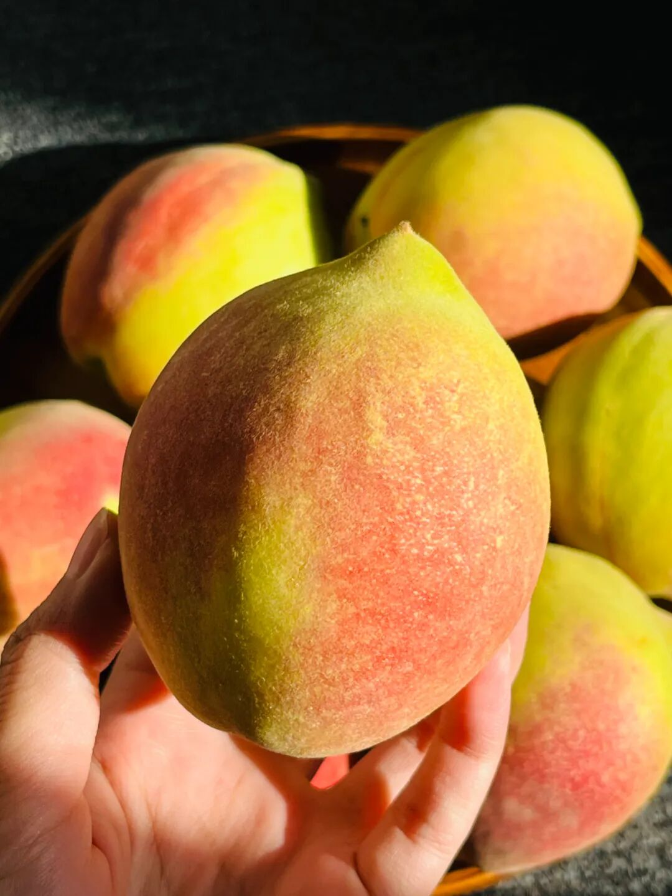
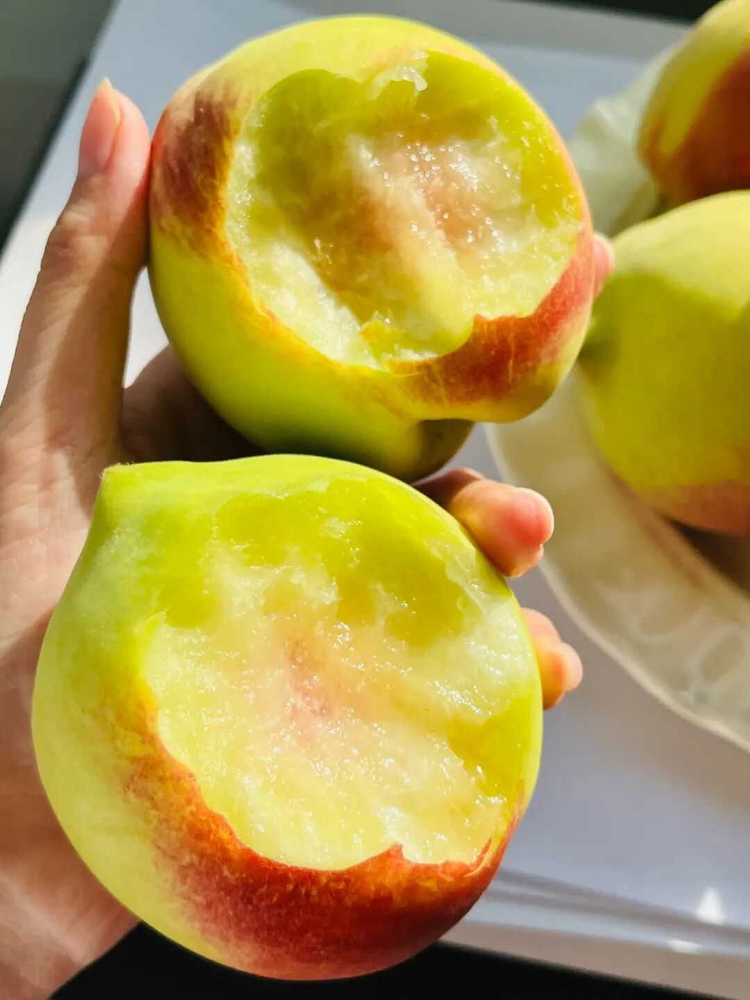
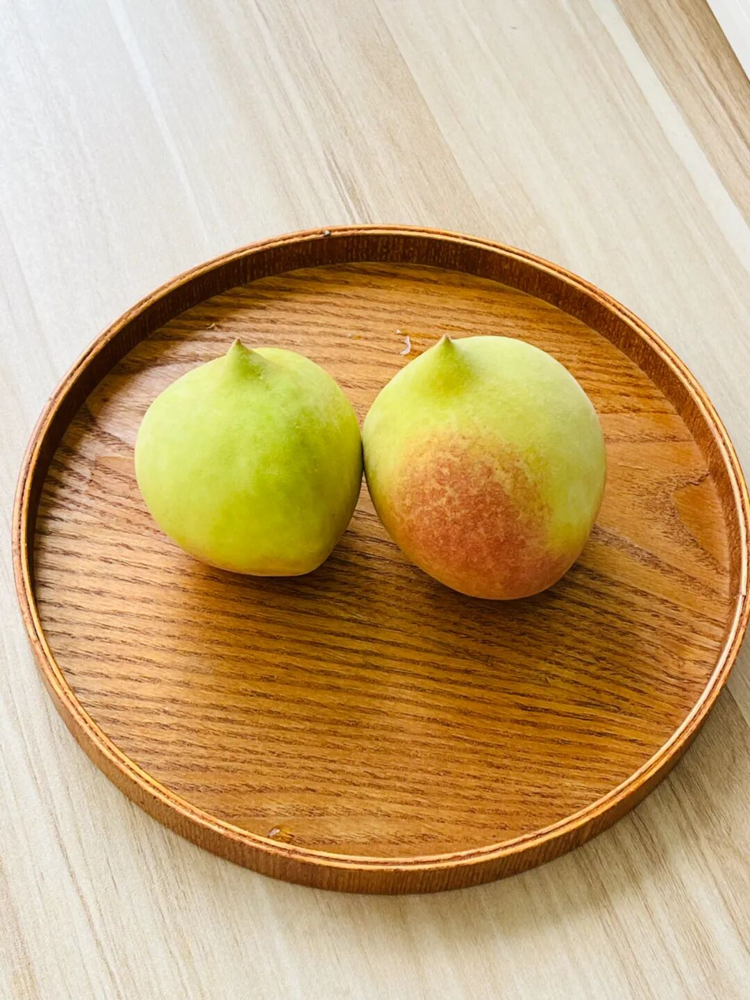
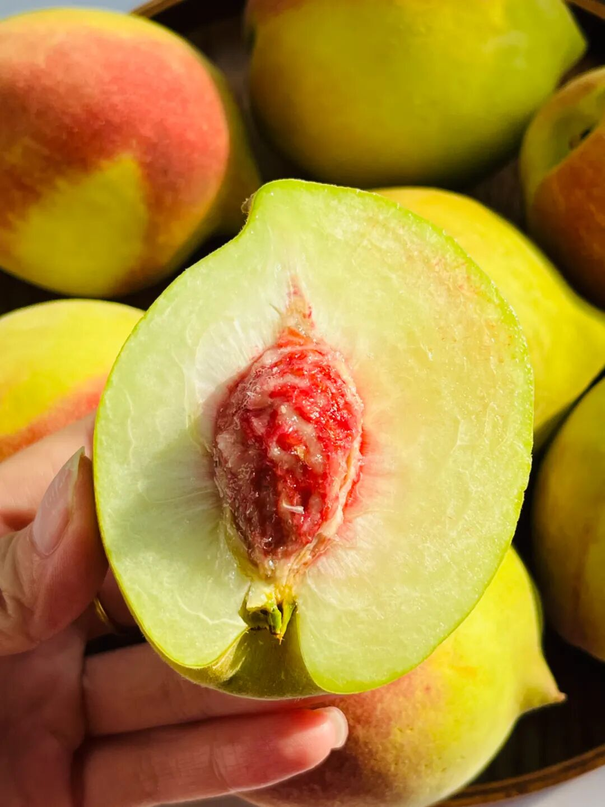
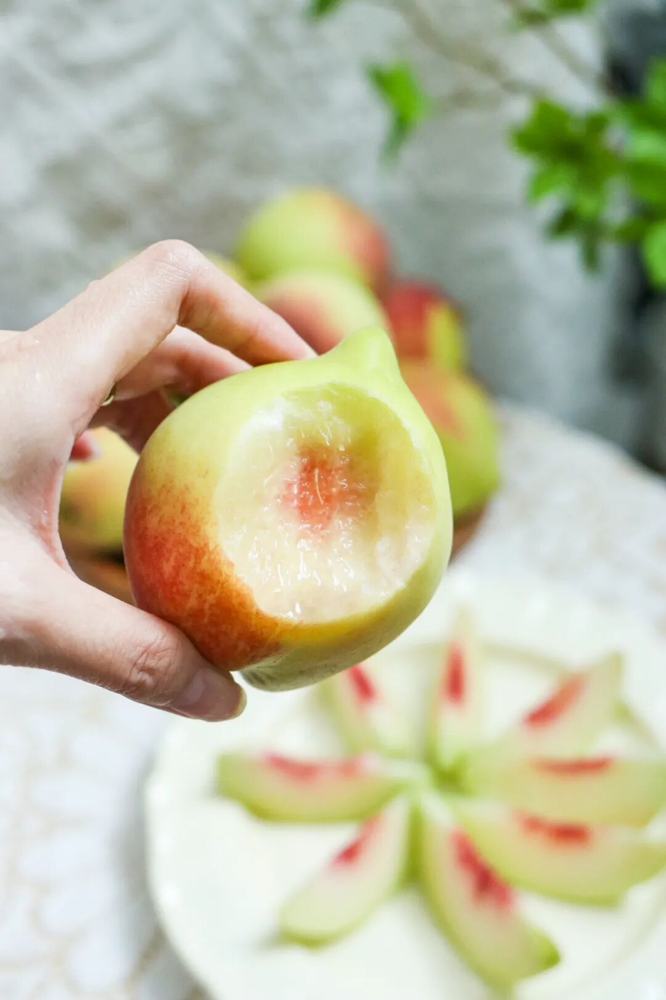
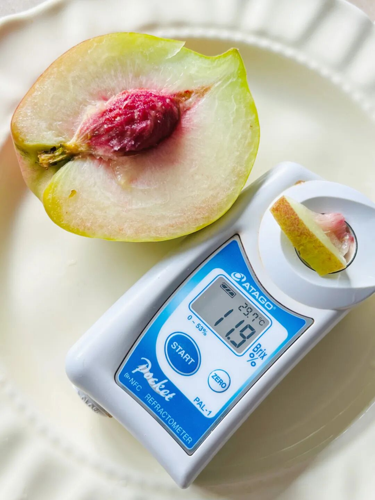
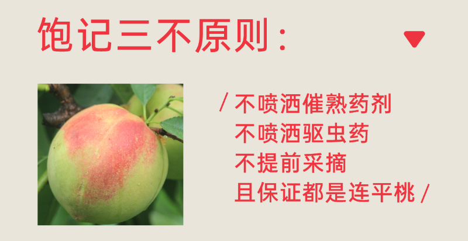
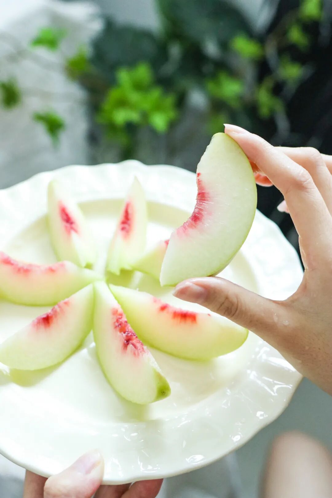
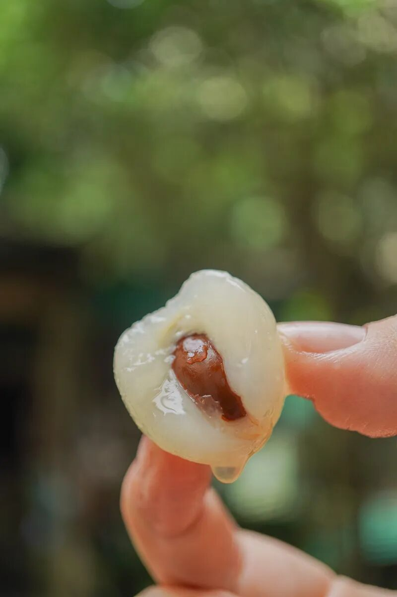
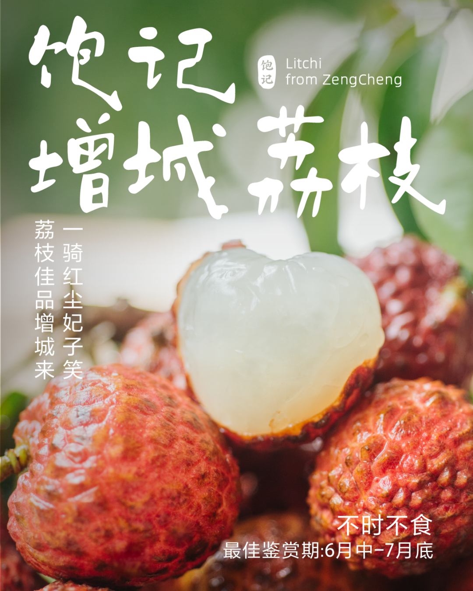

# 脆桃天花板，增城桂味荔枝，尾声响起～

- 原文链接: https://mp.weixin.qq.com/s?__biz=MjM5NTYxODQyMA==&mid=2653456354&idx=2&sn=61feb2897c3225fc5196d4856d62e662&chksm=bc307ea4c13fcd63e6c06e1b6016d91ba5ad1da509365257b4ba2b460986a19879e185158deb&scene=27#wechat_redirect
- 浏览量: N/A
- 点赞数: N/A
- 评论数: N/A
- 转发数: N/A

## 正文

脆门！！！

一个尽情安利自我的公众号

以下是没事干研究院的风物研究报告请放心食用

靠天吃饭

果然不容易，

眼瞧着一周尚未过完，

刚刚上架不久的

广东连平鹰嘴桃！

就被告知已到尾声～

果如其名，

小小一颗跟鹰嘴似的，

可爱得很～

咬上一口：

满嘴桃香，酥脆有味

脆桃党的最爱！！！！

如果你是第一次见到它，

请看本薯此前吃桃的文字回放👇

或者直接点到文末购买，

毕竟今天是 86 折最后一天！！

（再打下去老板就要回沪了

1.

果园骄傲地介绍说，

在广东，夏天没有收到连平鹰嘴桃，

就算混得不好？？？？

真的吗？请广东小伙伴来讲一下！

我们不鼓励过度营销。

2.

2015 年连平鹰嘴桃

选上「岭南十大佳果」。

本薯一边啃脆桃，一边想问，

还有九大是啥呀

3.

一箱脆桃里，

一般糖度都在 12 以上，

很多到手都在 13-14，

耐放。

但也有怎么放都不甜的，

本薯吃着像青苹果，

但是有桃子香香，

可爱～～～糖度测了，10 左右。

至于其它嘛，

不打这个不打那个，

大家看一下意思下，

这些都是饱记出品的基础要求了。。。

（不知道产品经理在商详上吹个啥

但是她把不同产区的脆桃试了半年，

给本薯四五次样品，

确实是这次这个果园的最好！

啊夏天了，脆桃党试一下吧，

饱记·广东连平鹰嘴桃

脆桃党福音！！

86 折！！最后一天！！

广东连平，

岭南有名蜜桃生产基地，

种植历史可以上溯到 400 多年前！

从 110 多种佳果中脱颖而出，

连平鹰嘴蜜桃于 2015 年获得

「岭南十大佳果」殊荣～

形似鹰嘴，小小可爱，

又脆又甜果味浓！

脆桃党抱住不撒手！

规格：

一箱 12 只装，

每只 3～4 两。

限时早鸟 86 折，只剩今天！！

戳图买它👇

或🍑🍑🍑搜索

「艾格吃饱了」

另外，还有今年因为天气原因贵到令人破防的增城荔枝。率先退场的，
竟是满口桂花香的桂味，今天最后一天！！

桂味摸起来比较尖锐，
果壳薄而脆，中间有一道明显的缝隙，吃的时候，从尖顶沿中间的缝隙剥开，就是一颗完整的荔枝。

入口有浓郁的桂花香，直直奔入口腔，闭着眼睛都能分辨出。

已经认准它的，可以直接买 3 斤装！还想尝尝别的，就买双拼、或三拼，
搭着糯米糍、仙进奉。今年吃完，许愿明年迎来大年！不允许你再那么贵了OK？？
饱记·增城荔枝桂味最后一天！！！购买方式如下
一骑红尘妃子笑，说的就是增城！自古以来的岭南荔枝名产地～
🍚想一颗就吃爽的选「糯米糍」；💦喜欢特别嫩多汁的选「仙进奉」；🌸忠于桂花香味的朋友直接选「桂味荔枝」～最后的数天，吃完一起许愿明年好天气！别那么贵了你！！！
五种规格：双拼：桂味 2 斤+糯米糍 1 斤三拼：桂味 1 斤+糯米糍 1 斤+仙进奉 1 斤单品种：桂味 3 斤装糯米糍 3 斤装
仙进奉 3 斤装
PS：桂味荔枝，今天已是最后一天，吃完就没！
戳图即可购买👇

题 外

没了没了都没了！！

脆桃要吃完了！！

桂味荔枝最后一天！！

接班阳山白凤的阳山·湖景水蜜桃，

超甜的新疆阿克苏小红杏，

都要没了！！

本薯能做的，唯有多从老板那里薅点折扣，

让大家应吃尽吃！

湖景水蜜桃， 86 折最后一天！！

小红杏，最后的 9 折！！

饱记·阳山湖景水蜜桃购买方式如下86 折！！最后一天！！

阳山桃中比较晚熟的品种，
花了更多时间在果园里积蓄养分，接班白凤水蜜桃，更为香甜多汁！
🍑「无锡阳山·湖景水蜜桃」两个规格：特级·阳山湖景水蜜桃
单果 6～7 两，一箱共计 8 颗。优级·阳山湖景水蜜桃单果 5～6 两，一箱共计 8 颗。
不建议放入冰箱冷藏，会容易影响口感。阴凉通风处保存，优先食用软桃。

限时早鸟 86 折，到这周五！！

戳图买它👇

或🍑🍑🍑搜索

「艾格吃饱了」

饱记·新疆阿克苏小红杏
购买方式如下最后的 9 折！！！
小白杏根正苗红的接班人！——新疆小红杏，熟成啦！软糯绵甜！！糖度 26 左右，小白杏通常是 19～
长在阿克苏核心产区的小红杏，喝着天山雪水长大，
连肥料都是羔羊粪便混合谷子发酵成的天然农家肥料。
两个规格，都是三斤。家庭装：果子颗数多，但是小一些，单果在 13g 左右；果王装：杏如其名，单果能到 20g！
戳图买它👇

本文的研究员

薯角

这样的脆桃我也可以！！！

用好吃的方式吃一生

祖国各地好风物

文章转载请加微信「baojiclub」

