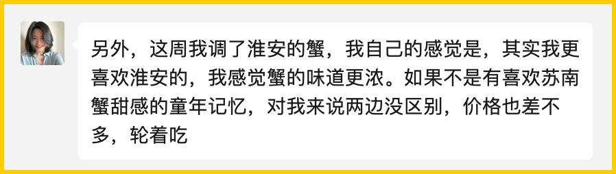
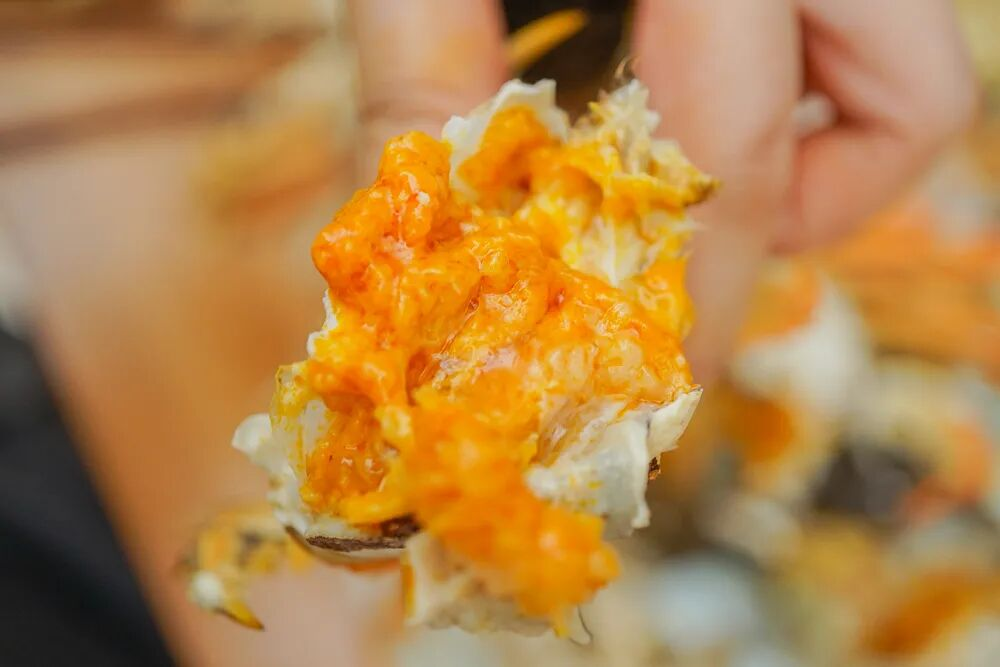
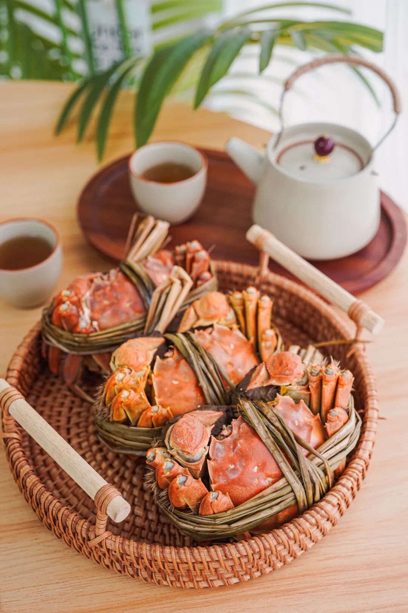
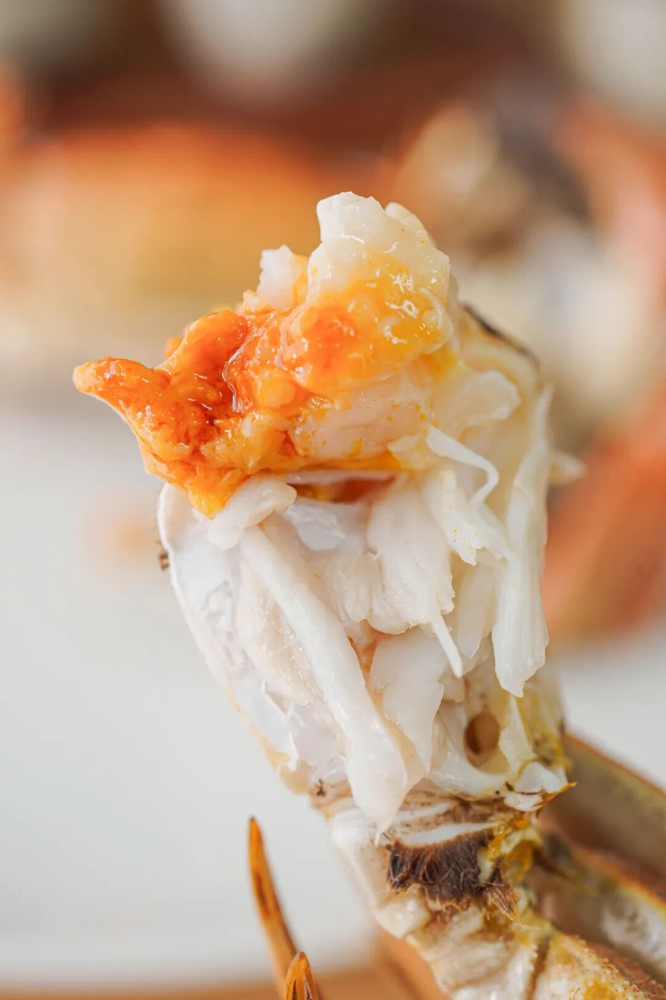
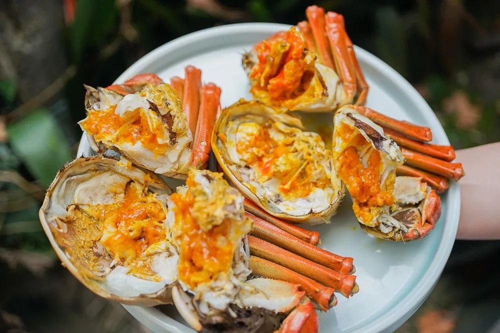

# 苏北怎么你了。。。

- 原文链接: https://mp.weixin.qq.com/s?__biz=MjM5NTYxODQyMA==&mid=2653463460&idx=1&sn=40858621e51c6c72389629b240f79c26&chksm=bc11278643a6d805e9561096009ae8b9760e269d271d0ba128cb71d1cc364efad4587ecd27cc&scene=27#wechat_redirect
- 浏览量: N/A
- 点赞数: N/A
- 评论数: N/A
- 转发数: N/A

## 正文

subo lives matter

一个尽情安利自我的公众号

以下是没事干研究院的风物研究报告请放心食用
遥想从前，
群里有饱记用户说我司大闸蟹是苏北蟹，

老板叫我去解释一下。

我：。。。苏北蟹也不行？？

然而如今，风水轮流转啊啊啊啊啊！淮安洪泽湖大闸蟹今年市场反馈大好！管它苏南还是苏北，
终究得以风味取胜

看这膏肥油黄👆

连我那在包邮区长大的挑嘴会吃老板都发出感叹👇更喜欢淮安洪泽湖产区，
因为蟹味更鲜浓！

「苏北歧视」是时候翻篇！！

口碑第七年，

本薯今天就来讲讲这

宝藏产区

淮安洪泽湖好螃蟹。

好在哪里👇

先来说说饱记为啥挑中洪泽湖呢？

原因很简单，

比起南北问题，

水质问题才是我们最关心的。

图源@洪泽政府网

洪泽湖，中国五大淡水湖里排第四位。

这个产区，湖大水深，风高浪急，

所以这蟹生存不易，

基本上是半野生的状态。

吃起来自带微咸，

蟹味是汹涌的鲜浓。

推荐搭配镇江香醋，把鲜味简单钓出来，就很香很香很香很香很香！

当然了，

每个湖里其实都有好吃的螃蟹。

关键还是得精挑！

我司只要湖里顶尖蟹的前 10%。

合作伙伴同时供货上海国营大酒店，

是行业内专业人士认可的货源！

且饱记要的发货品质比酒店还要更好（骄傲脸

每一只上岸后还要再养几天，

喂喂玉米，

让蟹把苦水吐出来，

这样你们收到后吃就是纯鲜甜～

（虽然成本也变高了。。。

承诺足斤足两发货。规格说是多重，到手一定多重，甚至超重！
你们吃过就知道了，拿在手里都是沉甸甸的。

总之，溢价少，肉质好，性价比高。苏北蟹风味顶流！比那种乱七八糟渠道买的死贵玩意儿，
真是靠谱多了。

看看后台今年真情实感的好评👇

这种只只开出来都爆黄的快乐，我也想让你体验到！

满黄流心啥的都是常规操作！

不多说了👇🏻👇🏻👇🏻

饱记·洪泽湖大闸蟹

购买方式如下

限时三天 88 折

满足装洪泽湖大闸蟹：

3 两母蟹，4 两公蟹。

性价比之选！

劲爽装洪泽湖大闸蟹：

3.5 两母蟹，4.5 两公蟹。

饱记热销款。

尊享装洪泽湖大闸蟹：

4 两母蟹，5 两公蟹；

或 5 两母蟹，6 两公蟹。

实际超重，量极极极少，送礼佳品。

人工精挑，

上岸后静养一两日更鲜美，

每日限量 100 箱。

顺丰快递发货，新鲜看得见。

戳图下单购买👇或🍑🍑🍑搜索「艾格吃饱了」

但如果还是喜欢偏甜的苏南蟹！看看我们苏南蟹标杆美味！太湖流域精挑大闸蟹！

苏州吴江盛泽这块，

产正宗的清水大闸蟹，

如今乃苏南蟹的标杆美味！

送礼包体面的！

连上海老牌吃蟹国营大店王宝和也说

自己的蟹是「太湖流域」。

为什么不追赫赫有名的「阳澄湖」呢？

原因很简单，

阳澄湖不给养啊。。。

现在很多自称阳澄湖的，

其实都是岸上塘养的，

虽然有标，但根本就是塘蟹啊。

一个热知识：大闸蟹分两种——湖蟹和塘蟹，

湖蟹是在天然湖泊中围网养殖，

塘蟹是在人工水塘中养殖。

味道根本比不了。

很多米其林黑珍珠餐厅也都因为阳澄湖禁养，

在用各个流域的蟹，

比如金湖，「太湖流域」等。。。

（因为真正的太湖湖底也禁养了

这蟹在我司指定的 3000 亩湖里长大，

活溪入水，清水整湖放养。

湖底与阳澄湖底类型近似👇

所以不容易有土腥气！

蟹肉、蟹黄吃得出明显的清甜滋味。

我司的信誉，有盛泽当地村里的书记保证！

为了给村民谋福利，

书记不时就去帮咱们亲自视察和监督，

大家现在看到的和最后收到的没啥区别！

「每一只都要挑选，确保万无一失」。

（书记原话👆

当地经验丰富的蟹农挑 2 遍以上，

饱记只要最优秀的前 10%！

壳一定要硬，黄一定要满，

人工一只只掀开看，

确认了膏黄油丰才发货嘿嘿～

和洪泽湖一样，

上岸的螃蟹也要再养几天！

喂一喂玉米吐苦水，

才给大家发哦！

这样收到的螃蟹蒸出来就是甜的！

不苦不腥！

卖了这阵子，

除了少量死蟹，

（签收时联系客服按只赔付

没有风味上的差评！！

什么蟹王府、王宝和，老板通通试过，

真的不如我们嘿嘿～

老板朋友让她鉴定某品牌蟹她的回复👇

总之，

洪泽湖的鲜！

太湖流域的甜！

轮换着吃，都好！

周末给大家都薅来限时三天 88 折！

两种口味大家各取所需！

Peace&love!

饱记·太湖流域大闸蟹

购买方式如下

限时三天 88 折

三种搭配：

满足装，

3-3.4 两母蟹，4-4.4 两公蟹，

吃过解馋。

劲爽装，

3.5-3.9 两母蟹，4.5-4.9 两公蟹，

可以拍照发朋友圈争奇斗艳。

尊享装，

4-4.4 两母蟹，5-5.4 两公蟹，

顶格水准，适合送礼。

人工精挑，

上岸后静养一两日更鲜美，

每日限量 50 箱。

拼的就是手速。

顺丰快递发货，

新鲜看得见。

戳图下单购买👇或🍑🍑🍑搜索「艾格吃饱了」

题 外

还有还有！

昨天刚来的今年份的涌泉蜜桔，

大家买了吗？

米其林同款！但价格却帮大家打了下来！

真正的汁水如泉涌！空调房里吃正合适！

现在还有限时早鸟 86 折！买它！

此外还有今年份的象山红美人，

入口似果冻般嫩嫩滑滑～

外面买不到的金山瓢鸡，

这批卖完下次得等半年了！

有小时候番茄味的云南西红柿（快没了，

还有打遍天下无敌手的山核桃！我司卷中卷产品，拿到外面去都能打得很！具体你们看商详，再薅老板一回！冲！

饱记·云南稀有品种瓢鸡

购买方式如下

限时突破价 7 折！！

规格第一档：6 月龄公鸡净重 3.4 斤以上。6 月龄母鸡净重 2.5 斤以上。规格第二档：
6 月龄公鸡净重 3 斤以上。6 月龄公鸡净重 2 斤以上。
下单前请注意：此鸡蛋白质含量丰富，宰杀时已尽量放血，但少量余血开包时气味仍会比较大，请冲洗再食用！鸡皮不发粘，就绝非变质～～～

戳图下单购买👇

或🍑🍑🍑搜索「艾格吃饱了」

饱记·涌泉蜜桔购买方式如下限时早鸟 86 折！！
戳图购买👇

饱记·象山红美人柑橘购买方式如下
戳图购买👇

饱记·云南西红柿购买方式如下限时 86 折！！
戳图购买👇

饱记·临安山核桃

购买方式如下👇

戳图买它👇

或到🍑🍑🍑

搜索「艾格吃饱了」

本文的研究员

薯角周五周五，敲锣打鼓

用好吃的方式吃一生

祖国各地好风物

文章转载请加微信「baojiclub」

