# 英国黑暗料理的发祥地。。。

- 原文链接: https://mp.weixin.qq.com/s?__biz=MjM5NTYxODQyMA==&mid=2653458044&idx=1&sn=ae0a0ae2e5115b978d194b32ca7dd3c4&chksm=bc308b9fad7930dd2165dc89c3333fc290a1caf90f0732a587d23b016fb5fbd51125c4308a08&scene=27#wechat_redirect
- 浏览量: N/A
- 点赞数: N/A
- 评论数: N/A
- 转发数: N/A

## 正文

又想出去玩了不想上班

每周消费报告
均没有广告软文请放心食用

烤月饼忙到人仰马翻，

来讲一下上次吃的伦敦最古老餐厅，

开业于 1798 的 RULES，

「在这里可以品尝最地道的英国菜」。

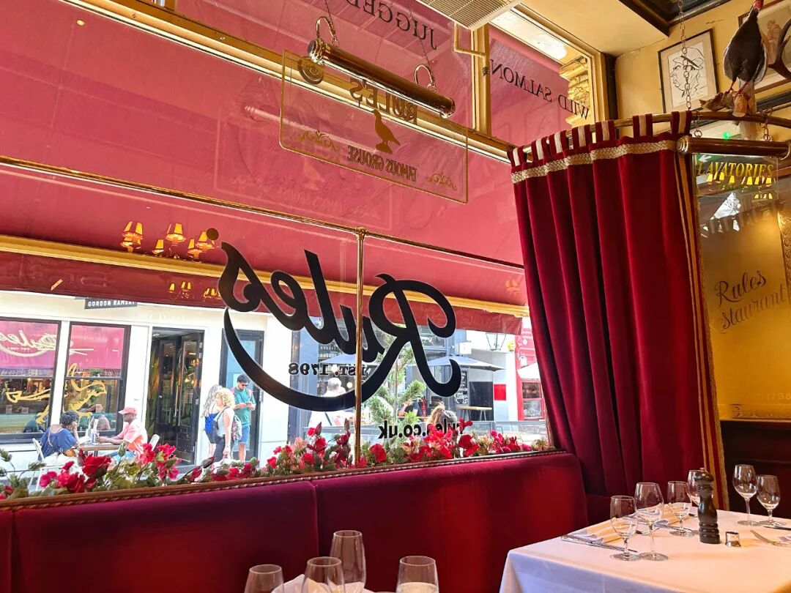

哈哈哈那显然不是炸鱼薯条，

不过话说回来，

英国人炸鱼不咋行，但薯条确实香，

因为英国本土正如出租车司机所说，

「除了土豆啥也不出！！」

蔬菜都比肉贵，而且远远不如我们的水平。

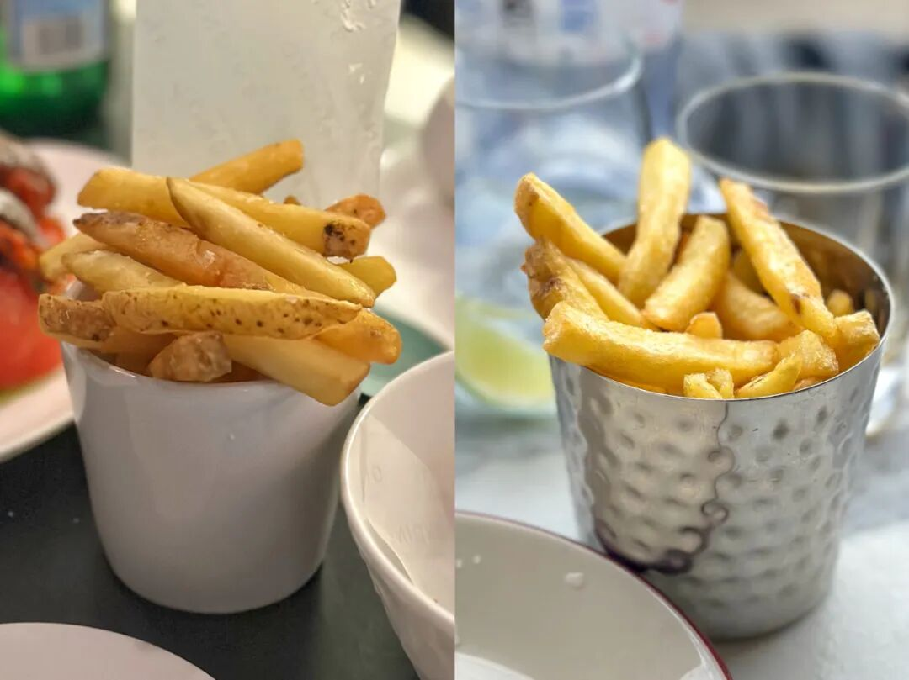

在苏格兰两地吃到的薯条，和时髦乡村 Bruton 吃到的，都非常棒

炸鱼薯条是街头小吃，

RULES 标榜的地道英国大餐，

则是以打猎季节（每年秋天）的野味为主。

其它时间则可以吃苏格兰爱尔兰的生蚝，

苏格兰海域的三文鱼和蚝都相当赞，

而且不怎么运到外面，

都被本地人消化掉了。

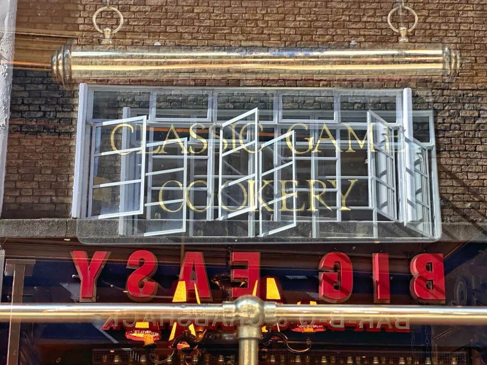

餐厅外写：经典猎季烹饪 Classic Game Cookery

所谓地道英国菜，

我大约十年前在上海采访一位

多次服务女王的大厨，

七年前去伦敦时，

又被朋友带去他的会员俱乐部正餐厅聊了一阵。

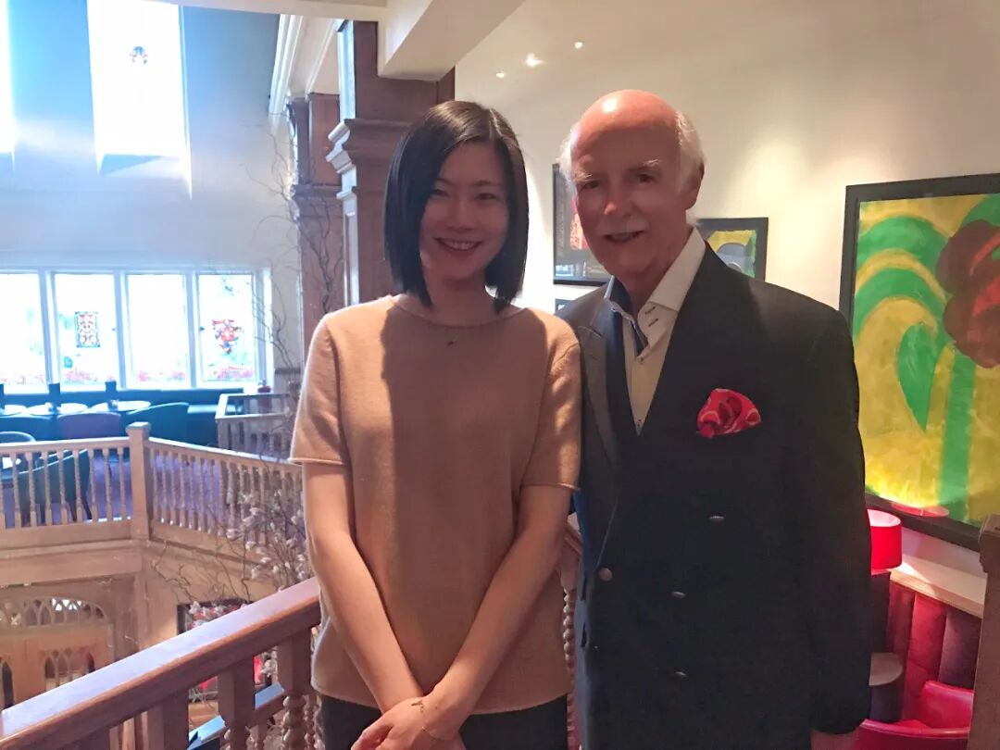

就这大爷hh 当年手机渣图大家凑合看

他说地道的英国菜，

或者说女王用来做国宴的英国菜，

重点不是烹饪方式。

——厨艺上大爷还是挺有资格的，

毕竟他几十年前就在伦敦拿了米其林二星。

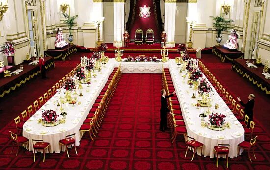

女王宴会餐桌布置。图源：金羊网-《羊城晚报》，2008.7

但是女王的宴会，

看重的是食材：

都得是大不列颠土地上出产的食物才行！

且也和我们中国人一样，不时不食，

女王在最好的季节，吃她领土上最好的食物。

其中苏格兰的三文鱼好吃，

就是那次大厨和我说的。

这次去苏格兰也吃了，确实鲜美！

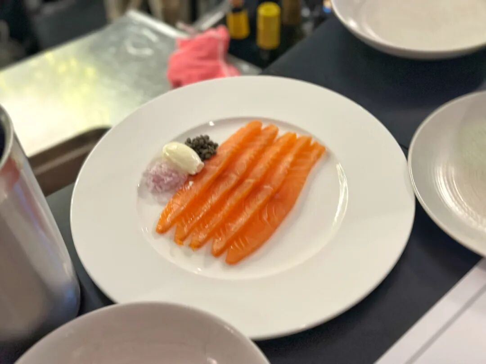

爱丁堡城中热门餐厅海鲜均为苏格兰产，相当好！

而 RULES 做的招牌野味，

就是猎季（Game Season）出产的松鸡。

白天打猎晚上做宴会食材，

这也是很典型的贵族生活方式。

在《唐顿庄园》和《王冠》里我们都看熟了。

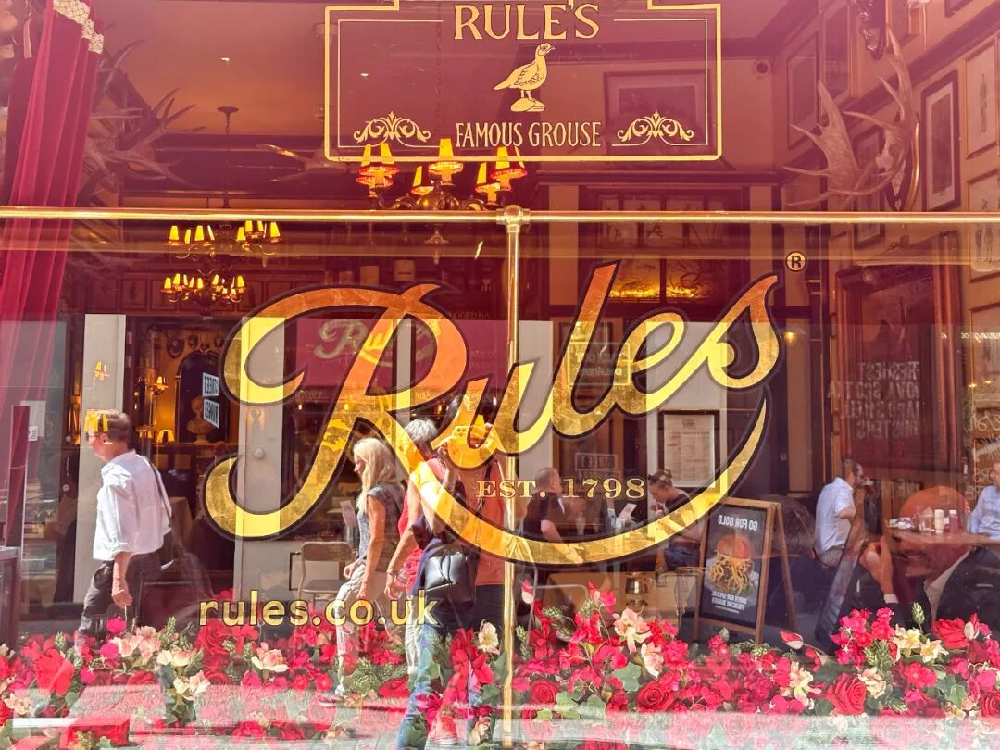

你看招牌上写：驰名松鸡 Famous Grouse

但松鸡腥膻味极大，

质感也很老，

我上次去伦敦在七八家米其林都点过，

结论是再好的英国厨子也打不过松鸡。

这玩意儿真的只有英国人才奉为上品。。。

因为贵族气？

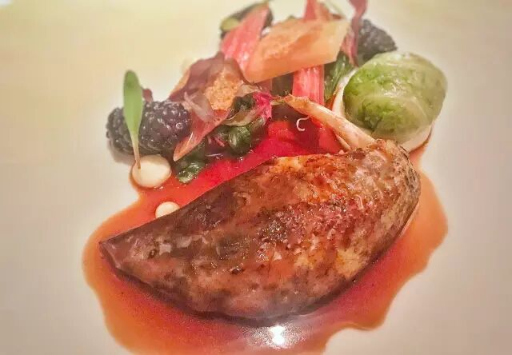

2018 年，伦敦二星 Gordon Ramsay 的松鸡，是我伦敦吃到最好吃了。不过后来在巴黎四季的三星餐厅吃到一份，法国大厨更厉害！但即使这样，也只是克服了松鸡的腥膻味，不值得再点。

我这次去不在猎季，

就点了 RULES 其它很有趣的菜，

比如这个牛肾牛肉派！

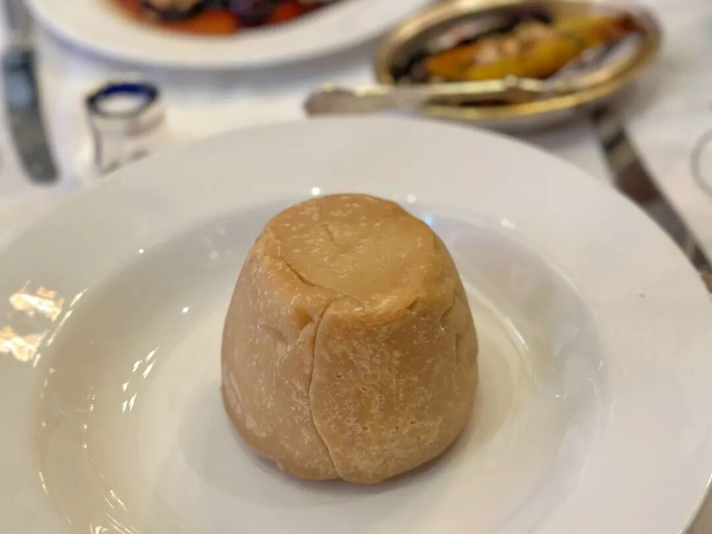

在欧洲，确实很少在菜单上见到 Kidney

上桌：就是牛肉派，非酥皮。

牛肾超级新鲜，

牛肉超级香～

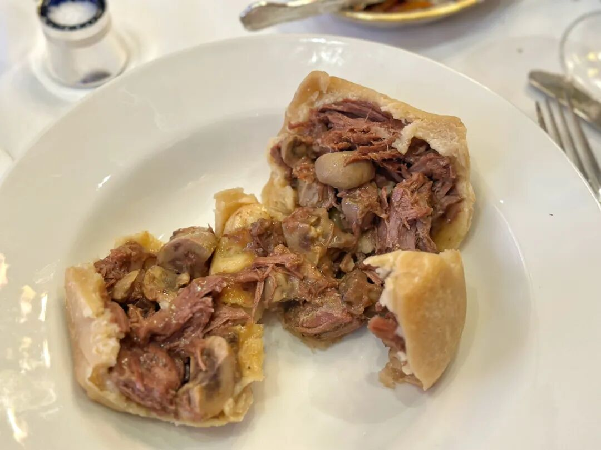

是的英国牛肉也很不错，尤其苏格兰的

但是？？？？？

这家的厨子是完全不想

吸取点法国人的烹饪经验吗？

首先放盐就不对！

新鲜的内脏，

即使是像广东人白粥一烫吃甜感，

也是事先要以油、盐、作料等腌制过的。

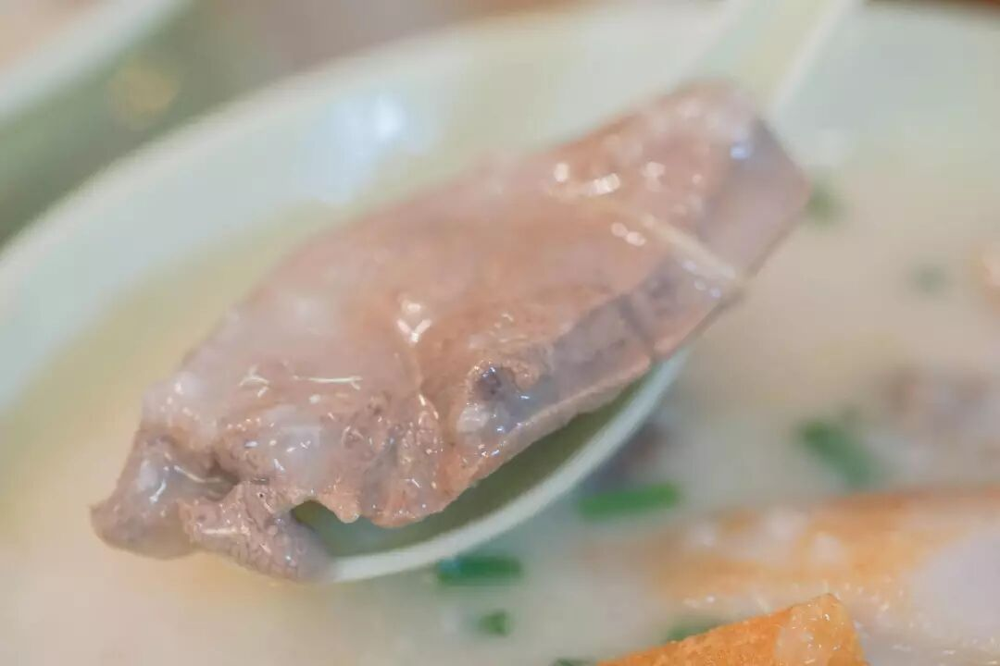

2019 年，上海广东生滚粥小店香江姳苑

不然就得像顺德松记一样，挑剔其品种、

宰杀时间和处理方式，

一整条链路抠细节，

食客才能吃到清水烫烫也好吃的内脏。

2022 年，顺德松记

但是他家，

既不讲究烹饪方式也不放点盐压制腥气，

食材是新鲜，但相当不好吃。

我喝了好几大口红葡萄酒才算镇住。

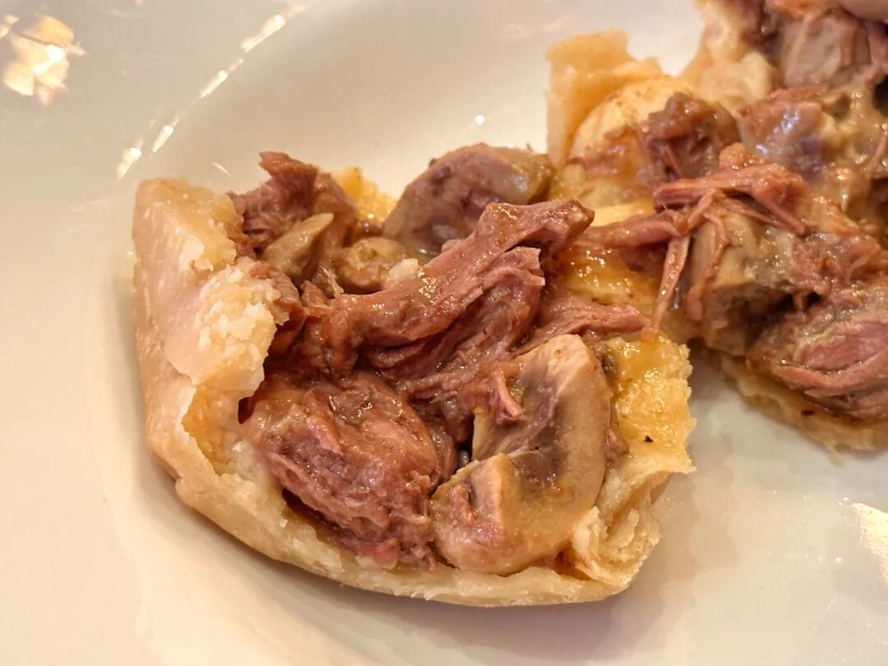

外面的派皮也不好吃，

接近死面，粘牙。

怀念法国人的酥皮肉派。

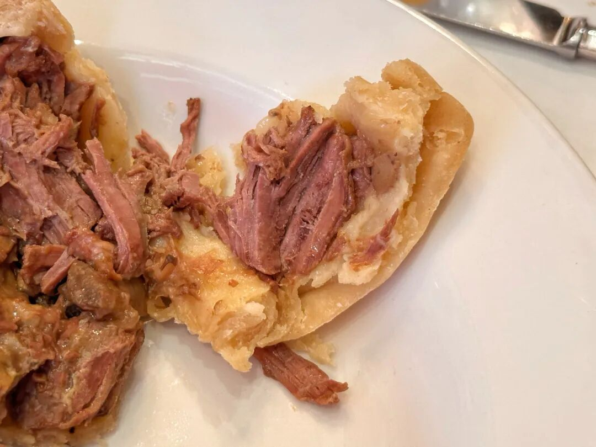

另外点了盘鸭胸，

食材很正点：一看就是整只本地养的大鸭子，

做熟后只切胸部。

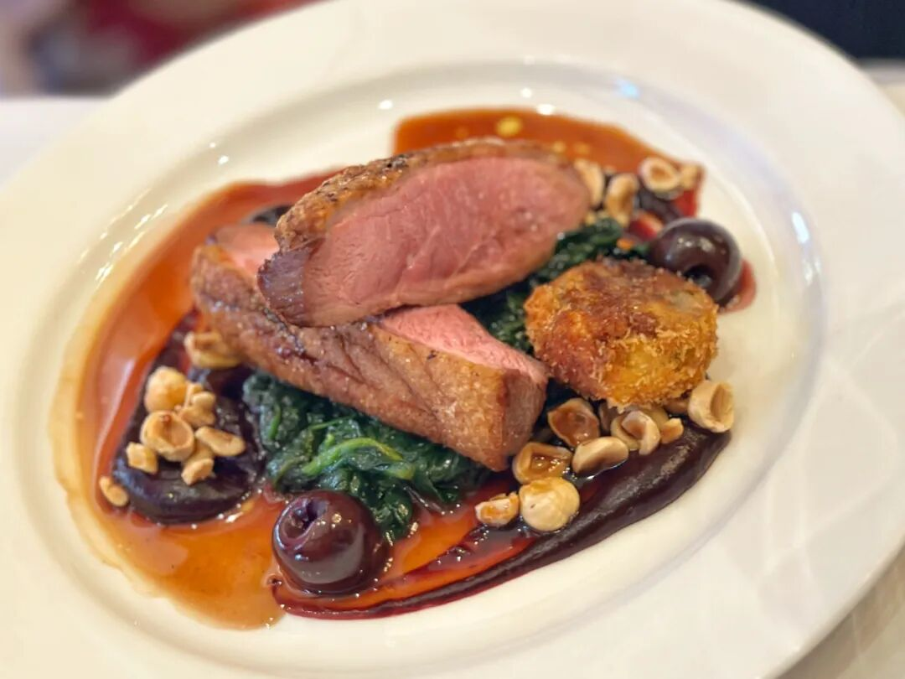

我上次来伦敦吃肥鸭餐厅，

在肥鸭旁边的那家老牌三星餐厅吃过鸭胸，

配本地黄杏酱，很扎实的法餐功底，

真的超好吃。

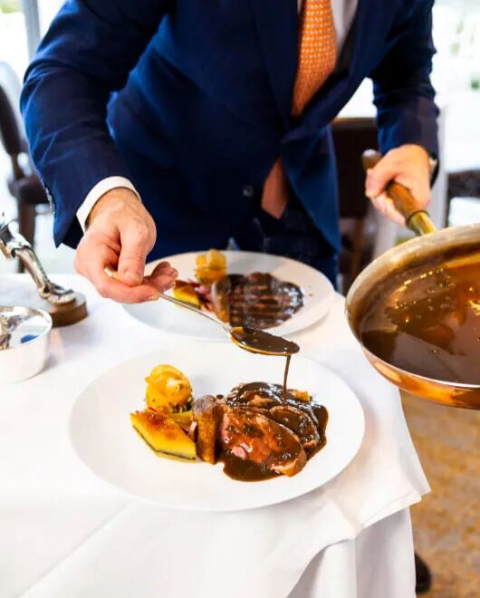

餐厅叫 Waterside Inn，官网图

RULES 这一盘，鸭子肉新鲜又嫩，

火候也好。但还是没怎么放盐！！！

从鸭子到乏味的莓果酱汁到菌菇

都泛着品种多样的腥气：））））

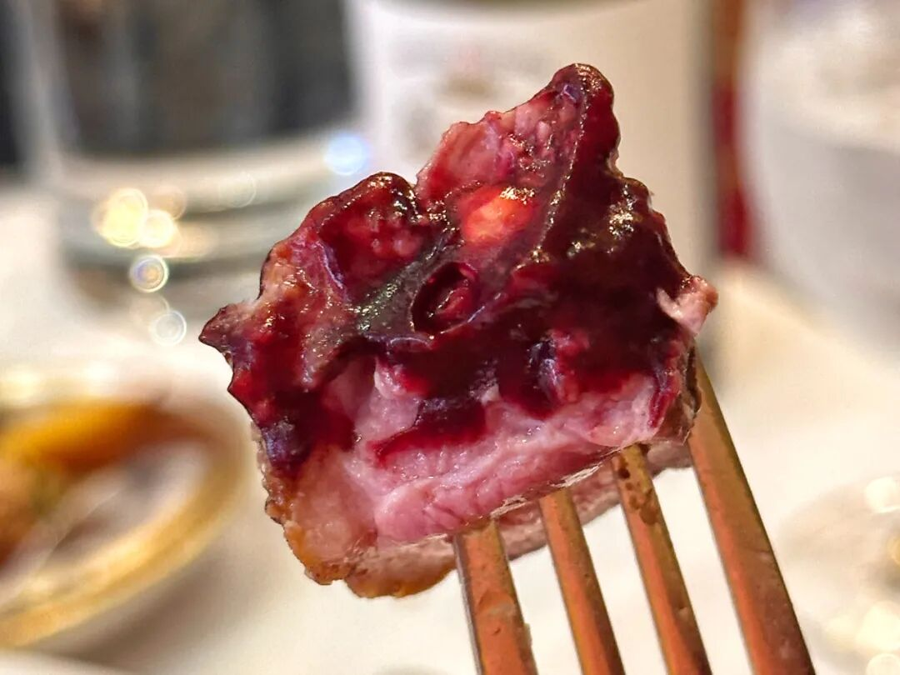

确实，Gordon Ramsay 配松鸡的黑莓酱汁比他不知道好多少

还有一盘，是乡村肉派，

也是食材好但味淡，

巴黎街头随便一家熟食店在调味上秒杀它。

但是这是当天最好吃的菜了。

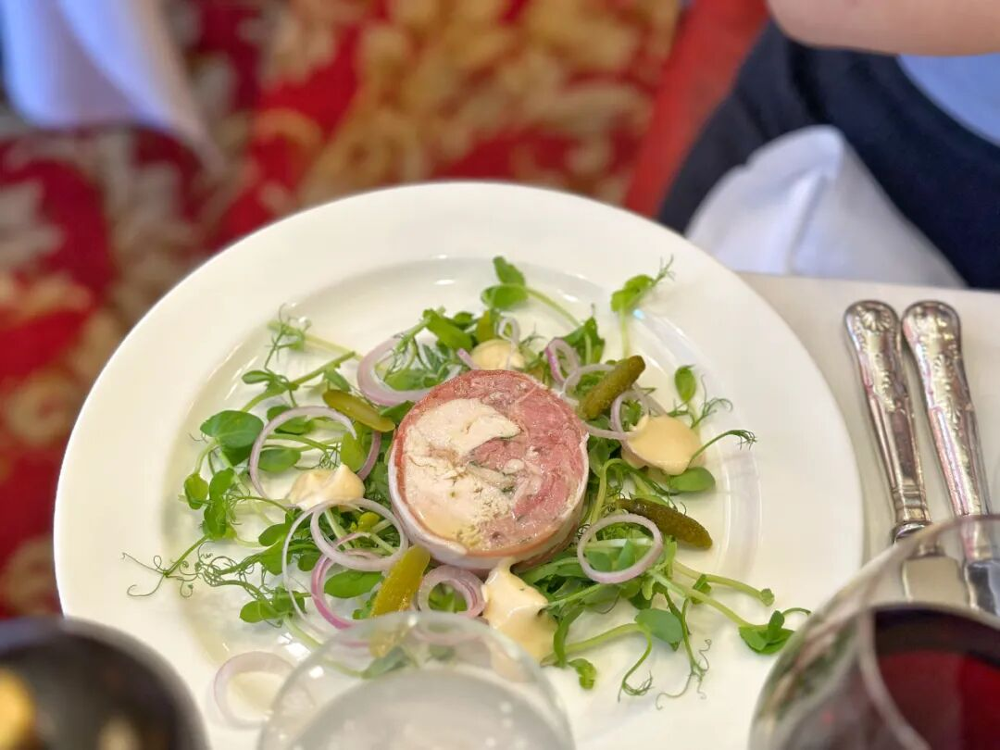

在我看来，其实只需要放盐调味

稍准一些，就绝对不会浪费这些

其实很难得的好食材。

但你说 RULES 的厨子是不会做菜吗？

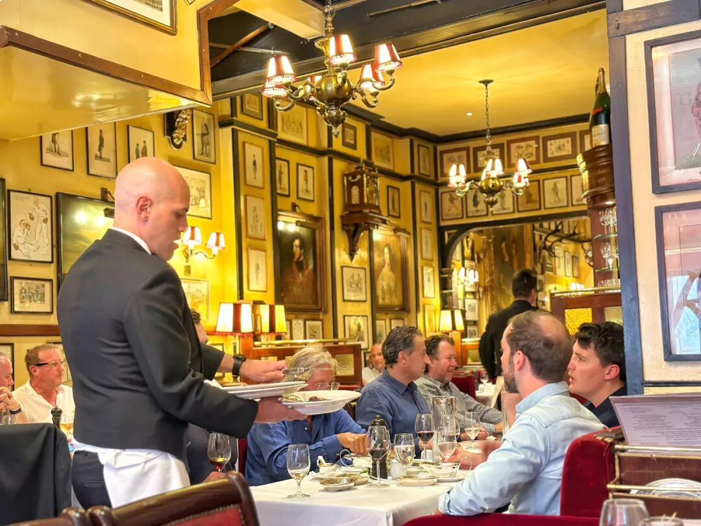

我看服务生和客人都挺体面呐，吃过见过的样子hh

我觉得也不太可能。

因为伦敦的米其林餐厅，

基本都非常好吃！

全球一线大城市，贵餐厅都不会差的。

这家伦敦一星餐厅在我吃过的几百家全球米其林里名列前茅，可惜后来关门了

只能说 RULES 可能是在

坚持【英国烹饪】的功底，

连盐都放不准，

英国人真的是最基本的厨艺研究都没有完成啊啊啊啊

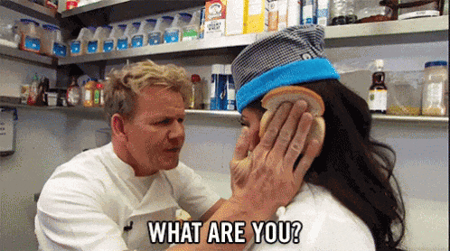

但这家店环境极美，

进门到处挂着野兽的头骨，

说是历代餐厅主人自己也喜欢打猎，

打来在餐厅里给客人吃的。

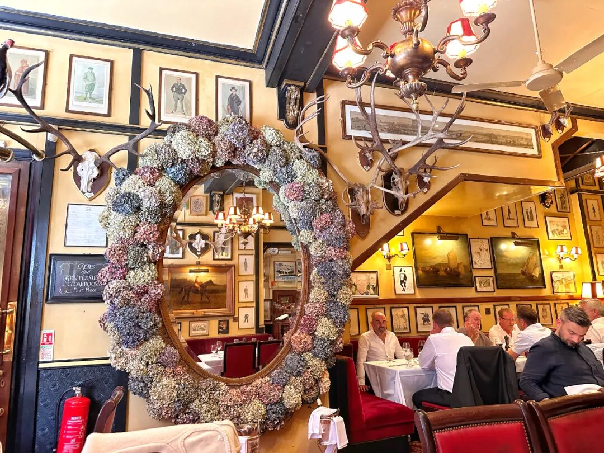

墙上则挂满了过往宾客的照片，

比如狄更斯、卓别林。

二楼还有个沙龙可以喝茶，

美到惊人。

不过我没有预订只能外面看看～

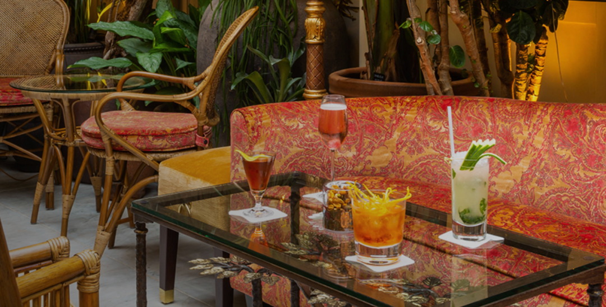

图源：餐厅官网

怎么说呢，我临走和前台唠嗑确认了一下，

他们确实从未服务过王室成员。

因为《王冠》里借演员之口说过

女王最讨厌的事之一，就是 fine dining，

她一辈子只去过一次餐厅。

所谓高级餐厅，

其实打一开始都是中产的享受。

哈哈哈哈此处应有老夫人出场！

总结：

RULES 虽然【坚持不提升】烹饪水平，

（但你别说，英国薯条放盐全是准的hhh

但是体验相当有趣，

甚至可以说是服务中产的现代高级餐厅鼻祖。

顾客都很体面，

值得订个午餐一往！

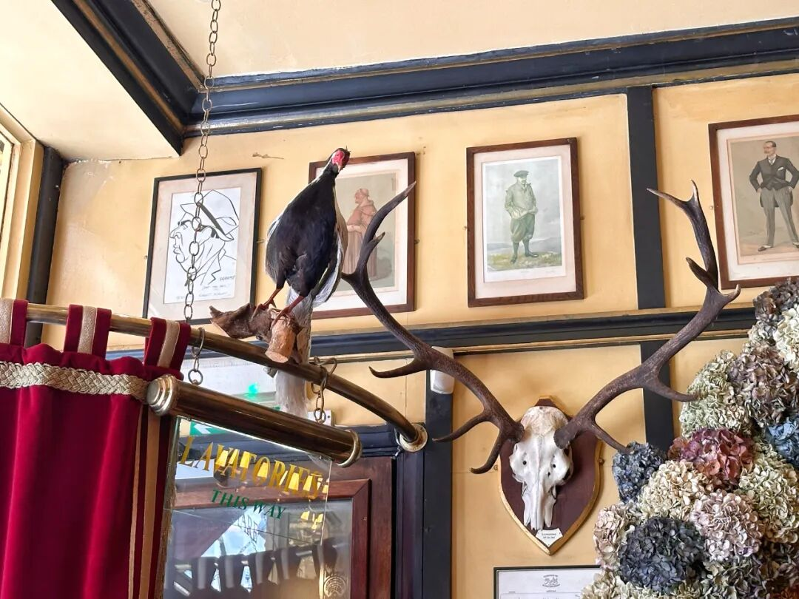

到处是松鸡，还有标本，不过感觉这家松鸡真的会很难吃耶hhhh

另外这次我忘了点，

他们是 Black Velvet 鸡尾酒的发明人！

千万别忘！

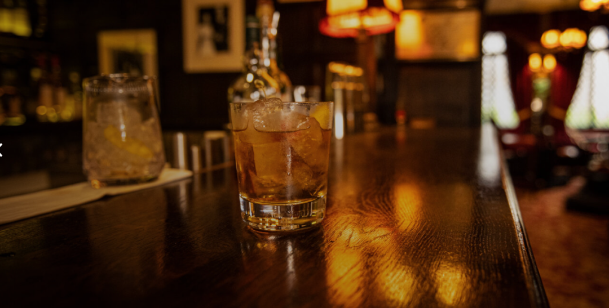

图源：餐厅官网

最后，

在一个保留王室的地方

体会阶层的区别，十分有趣。

下次写写：和瞧不起我的英国人吵架！

哈哈哈哈超好笑，反正我没吵输～

题 外 一

眼见金秋九月就要到来，

薯角我麻溜呈上些时令好风味，

小饼配酒，越喝越有！

外面买不到的奶黄月饼，

半岛嘉某楼奶黄月饼的创始配方，

邀请米其林大厨调整减糖，

这周已经开烤，限时 9 折！！

卷了三年的云腿酥，

嚼得出宣威火腿的鲜甜，

限时 9 折！！！

以及用正宗融安滑皮金桔，
融入四川本地土蜂蜜，浸皮萃取来的金桔蜂蜜酒！好喝又特别，
限时早鸟 86 折！

饱记·奶黄月饼礼盒
预售中！！！限时 9 折！！
饱记独家配方，外面买不到！
🥮 新鲜手作，外皮酥脆，内里奶香浓郁～
每日限量 100 份。预计八月底按下单顺序发货～
戳图买它👇

饱记·滇式云腿小酥
现货！！！限时 9 折！！
传统滇味经典，新鲜手作，浓情四溢。
🥮四个口味：经典云腿、蛋黄云腿，黑松露云腿、白松露云腿。
🥮三种规格：云腿酥礼盒全家福（四个口味各 2 枚）云腿酥礼盒双拼（经典云腿小酥*4 枚+蛋黄云腿小酥*4 枚）
云腿酥礼盒囤货装
（经典云腿小酥*30 枚）
戳图买它👇或到🍑🍑🍑搜索「艾格吃饱了」

饱记·金桔蜂蜜酒购买方式如下限时早鸟 86 折！！
正宗融安滑皮金桔，果脆芯甜，基本无辛辣味，口感纯甜。
饱记从融安自采了 3000 斤拉到四川酒厂，融入四川本地产土蜂蜜，浸皮萃取，带来浓郁柑桔香气。
入口回味悠长，还有金桔的微微辛辣感，好喝得不得了！

戳图买它👇或到🍑🍑🍑搜索「艾格吃饱了」

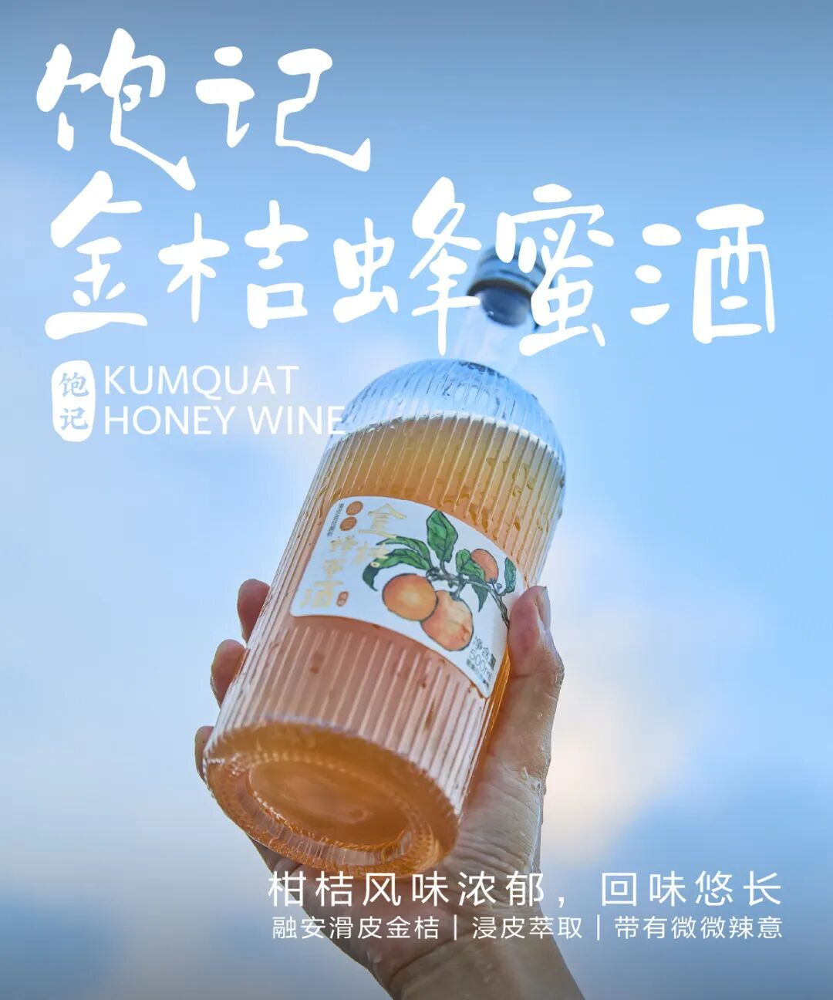

题 外 二

有时真为一些食物不平，
这么好吃怎么无人问津？？两个口味的招牌梅饼，
天然酸甜的黄桃干与空心山楂球，
越啃越香脆的圆墩墩玉米浪，还有扎扎实实的午餐肉片～以及招牌南乳香葱蛋卷等，含泪临期清仓，都是实打实的折扣！！无需凑满减！⚠️PS：清仓产品临近效期，介意慎拍～

饱记·临期清仓专区
5 折起！

清仓产品临近效期，所以巨折，但自家吃吃没问题！介意慎拍～
「临期清仓」专区，5 折起！！清仓产品临近效期，介意慎拍哦～戳图买它们！！👇

本文的研究员

闻 佳就是那个研究院嘴里「挑剔的老板」。关于食物，不是比你懂得更多一些，只是比你花了更多的冤枉钱。

用好吃的方式吃一生

祖国各地好风物

文章转载请加微信「baojiclub」

