# 荔枝两种拼法，今年最后几天

- 原文链接: https://mp.weixin.qq.com/s?__biz=MjM5NTYxODQyMA==&mid=2653456150&idx=1&sn=9a009089e737902fb97555fdeeb3cb58&chksm=bc2e8fafef8955bc71fcf3c9f9ae31cbe7f7c8a39c7e5e96ceb6044fba69d69d194b98db057e&scene=27#wechat_redirect
- 浏览量: N/A
- 点赞数: N/A
- 评论数: N/A
- 转发数: N/A

## 正文

馋有馋的办法

一个尽情安利自我的公众号

以下是没事干研究院的风物研究报告请放心食用
如果你跟我一样，是一个水果 killer。那么想必早已有所耳闻，今年的增城荔枝，怎一个「贵」字了得～

北回归线刚好穿过的广东增城，有着 1700 多年的荔枝种植历史。今年四五月份突发冰雹，临近的茂名还刮起了龙卷风，果树受灾，直接大幅减产。

所以，价格直接比往年翻了一倍

事已至此，还是得想点法子！眼瞧着果期仅剩几天，本薯灵机小动，（老板：又是你？给大家最后整一回双拼及三拼。一份价格，会面多位佳丽！贵得有道理，还得贵得有性价比💅

双拼其一，桂味摸起来比较尖锐，
果壳薄而脆，中间有一道明显的缝隙，吃的时候，从尖顶沿中间的缝隙剥开，就是一颗完整的荔枝。

入口有浓郁的桂花香，直直奔入口腔，闭着眼睛都能分辨出。

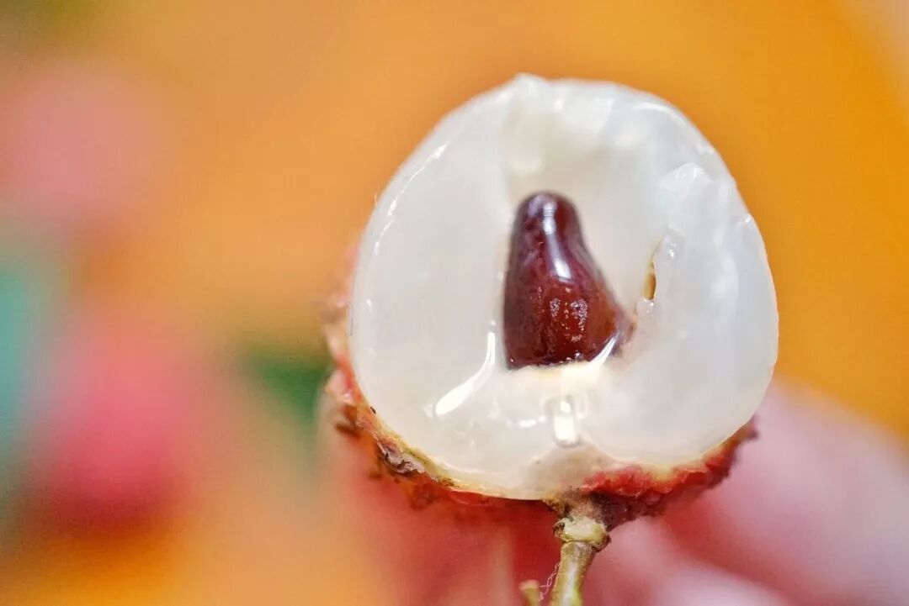

双拼其二，糯米糍味如其名，又甜又润，果肉尤其软糯厚实，咬下去一口爆汁，
特！别！甜！

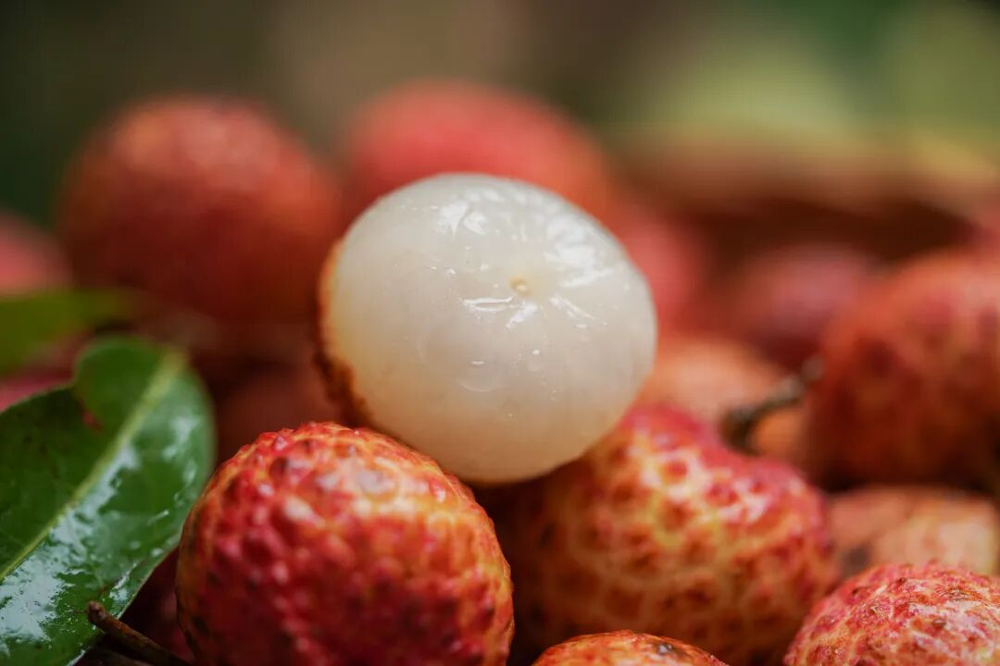

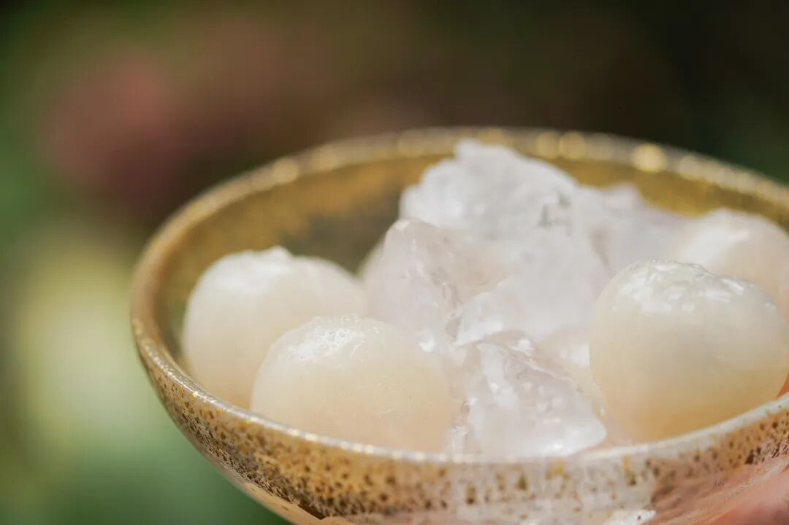

产自增城 40 年以上树龄老树，整体个头更大，送人的话好听又好看！

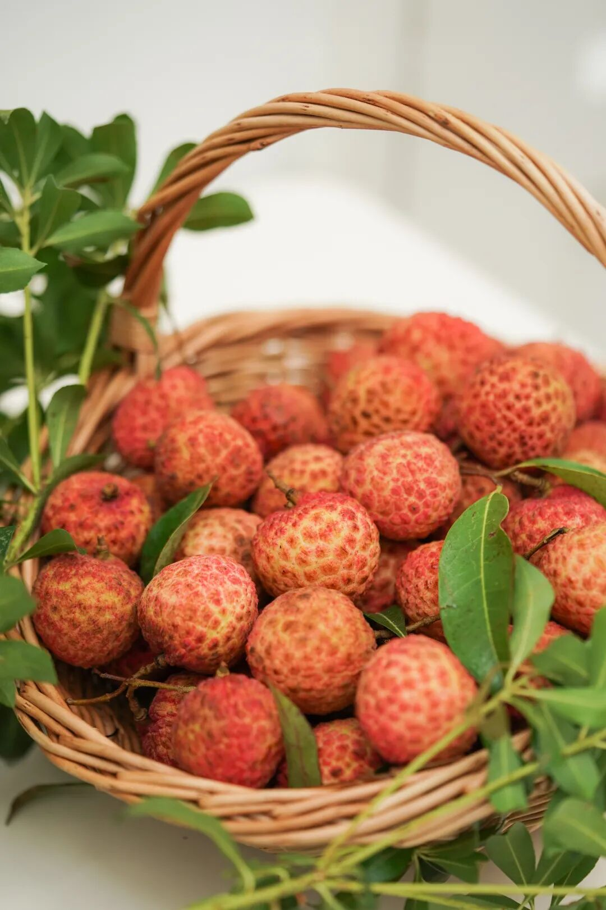

饱记·增城荔枝双拼桂味+糯米糍
购买方式如下
一骑红尘妃子笑，说的就是增城！自古以来的岭南荔枝名产地～
已经认准的直接买单个风味，都是三斤装～无法取舍即可考虑双拼！
桂味 2 斤+糯米糍 1 斤，一次尝到两种滋味～
戳图即可购买👇

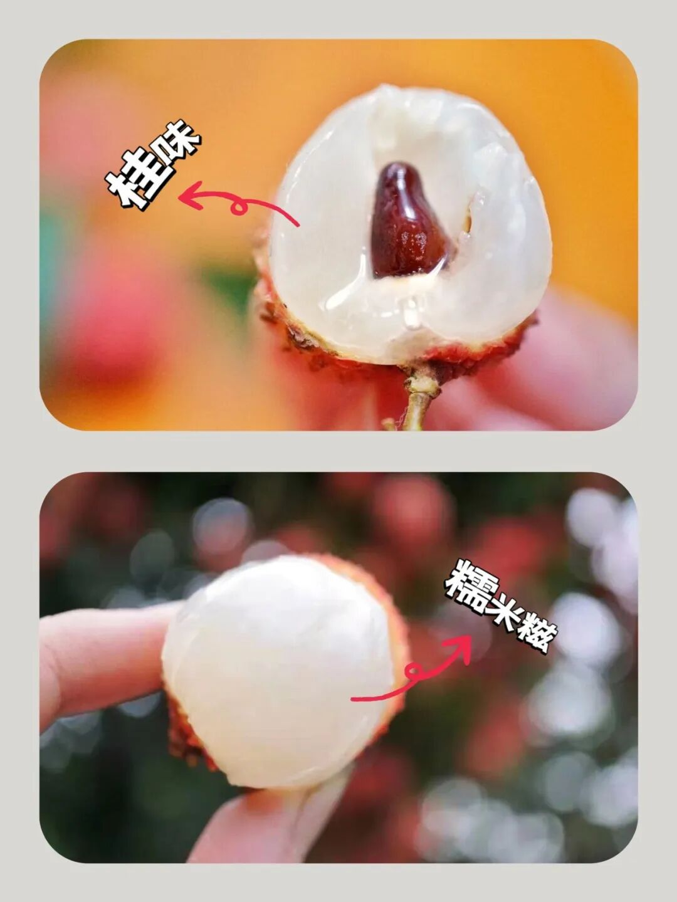

三拼，多了小众些的仙进奉肉眼可见的通透，玉子豆腐一般，来不及嚼就爆汁了！

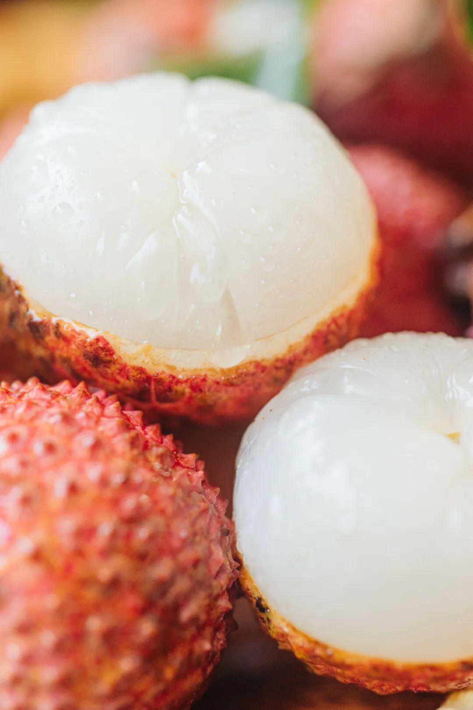

荔枝品种中的优等生，增城本地人超爱，看看后台真情实感的好评👇

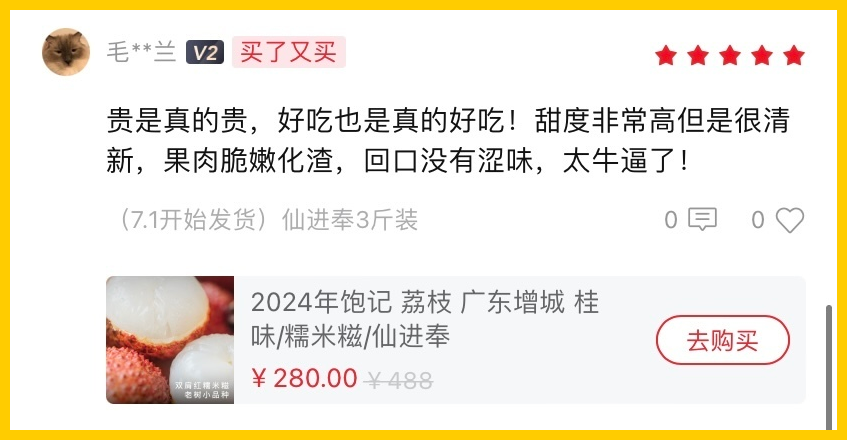

壳软好剥吃起来不扎手肉质莹白，尤其多汁～

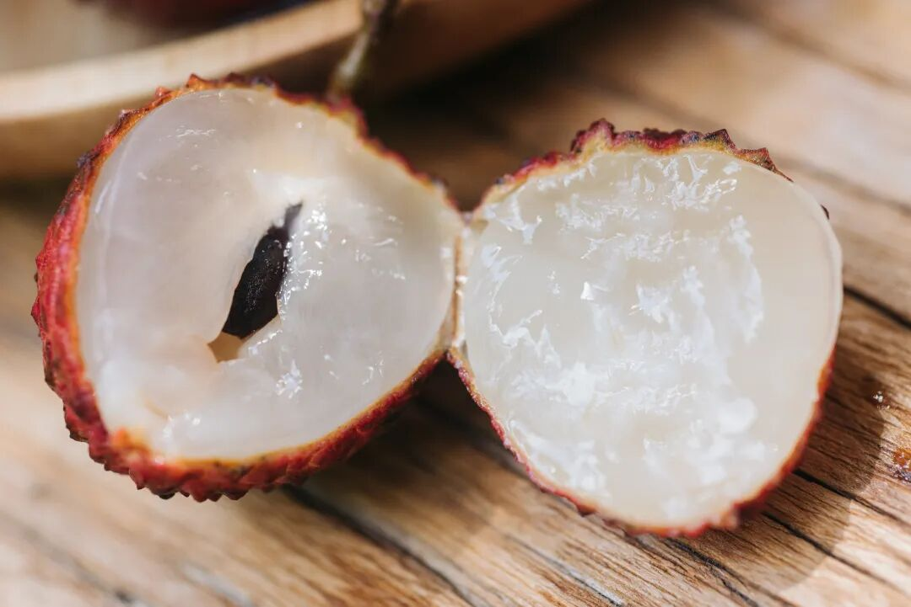

清新甘甜，抓住最后的尾巴，今年只剩不到 10 天！

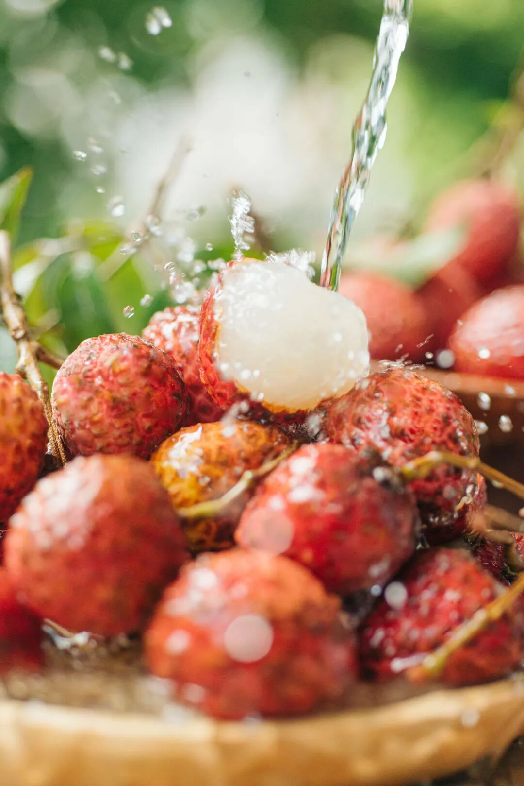

三拼，长这样👇桂味+糯米糍+仙进奉，一颗颗红亮有滋味，
可以每样挑着试试，心有所属再买单品种的三斤装～

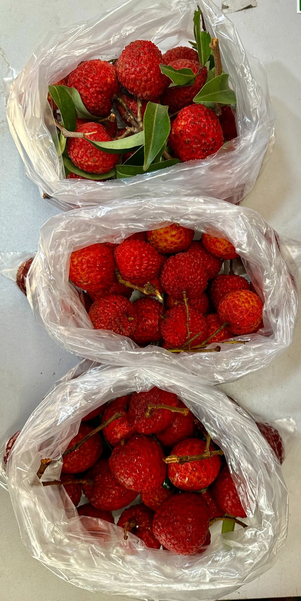

饱记·增城荔枝三拼桂味+糯米糍+仙进奉
购买方式如下
桂味、糯米糍和仙进奉，各 1 斤！小家庭一起尝尝正适合！
戳图即可购买👇

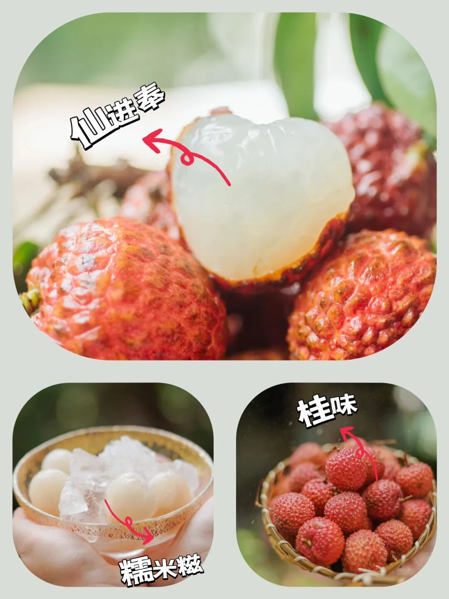

总之，🍚想一颗就吃爽的选「糯米糍」；💦喜欢特别嫩多汁的选「仙进奉」；🌸忠于桂花香味的朋友直接选「桂味荔枝」～最后的数天，吃完一起许愿明年好天气！别那么贵了你！！！

饱记·增城荔枝三种现货！！！购买方式如下
一骑红尘妃子笑，说的就是增城！自古以来的岭南荔枝名产地～桂味、糯米糍和仙进奉，3 个品种，都是 3 斤装，
桂味、糯米糍、仙进奉，都是下单后 5 天内发，
饱记多年合作果园，只让有经验的老农采摘，只选树上熟！甜度高！滋味更饱满！
凌晨采摘，放冷藏预冷，当天直接从果园冷链车运输到机场，
减少荔枝脱温时间，为的就是新鲜！
戳图即可购买👇

题 外

新的一周尝新果！接班阳山白凤的阳山·湖景水蜜桃，晒足了阳光，已然熟成，甜度更高，直甜到心坎儿里去！脆桃党亦有福音！
来自广东连平的鹰嘴桃，
小小一只来袭！「薯薯桃桃」限时早鸟价，86 折！！
还有新疆阿克苏小红杏，
全国最甜的杏子（之一掐指一算也没几天了！最后的 9 折！！
饱记·阳山湖景水蜜桃购买方式如下限时早鸟！！86 折！！

阳山桃中比较晚熟的品种，
花了更多时间在果园里积蓄养分，接班白凤水蜜桃，更为香甜多汁！
🍑「无锡阳山·湖景水蜜桃」两个规格：特级·阳山湖景水蜜桃
单果 6～7 两，一箱共计 8 颗。优级·阳山湖景水蜜桃单果 5～6 两，一箱共计 8 颗。
不建议放入冰箱冷藏，会容易影响口感。阴凉通风处保存，优先食用软桃。

限时早鸟 86 折，到这周五！！

戳图买它👇

或🍑🍑🍑搜索

「艾格吃饱了」

饱记·广东连平鹰嘴桃

脆桃党福音！！

限时早鸟！！86 折！！

广东连平，

岭南有名蜜桃生产基地，

种植历史可以上溯到 400 多年前！

从 110 多种佳果中脱颖而出，

连平鹰嘴蜜桃于 2015 年获得

「岭南十大佳果」殊荣～

形似鹰嘴，小小可爱，

又脆又甜果味浓！

脆桃党抱住不撒手！

规格：

一箱 12 只装，

每只 3～4 两。

限时早鸟 86 折，到这周五！！

戳图买它👇

或🍑🍑🍑搜索

「艾格吃饱了」

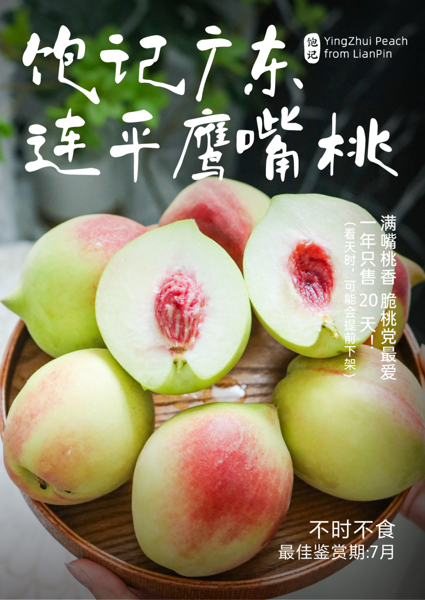

饱记·新疆阿克苏小红杏
购买方式如下最后的 9 折！！！
小白杏根正苗红的接班人！——新疆小红杏，熟成啦！软糯绵甜！！糖度 26 左右，小白杏通常是 19～
长在阿克苏核心产区的小红杏，喝着天山雪水长大，
连肥料都是羔羊粪便混合谷子发酵成的天然农家肥料。
两个规格，都是三斤。家庭装：果子颗数多，但是小一些，单果在 13g 左右；果王装：杏如其名，单果能到 20g！
戳图买它👇

本文的研究员

薯角

只恨财力不足！

用好吃的方式吃一生

祖国各地好风物

文章转载请加微信「baojiclub」

