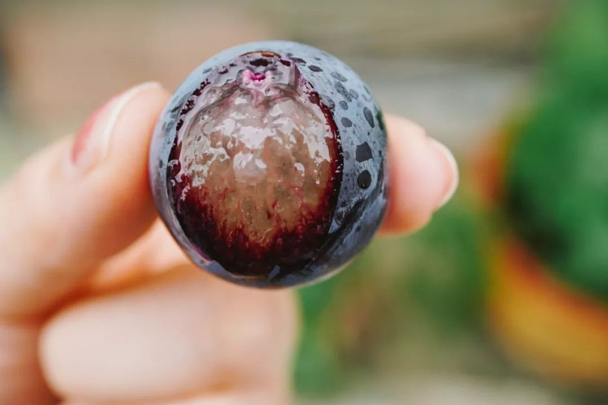
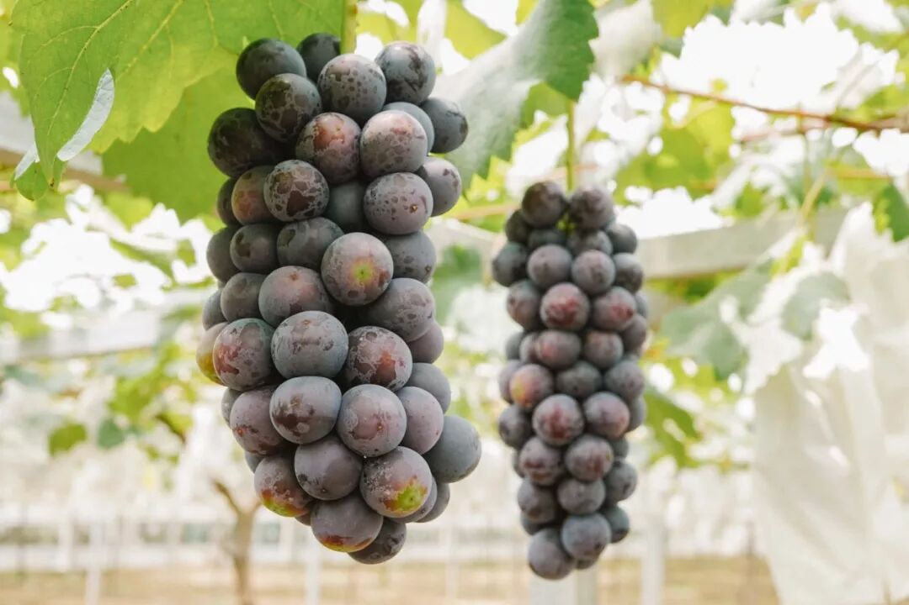
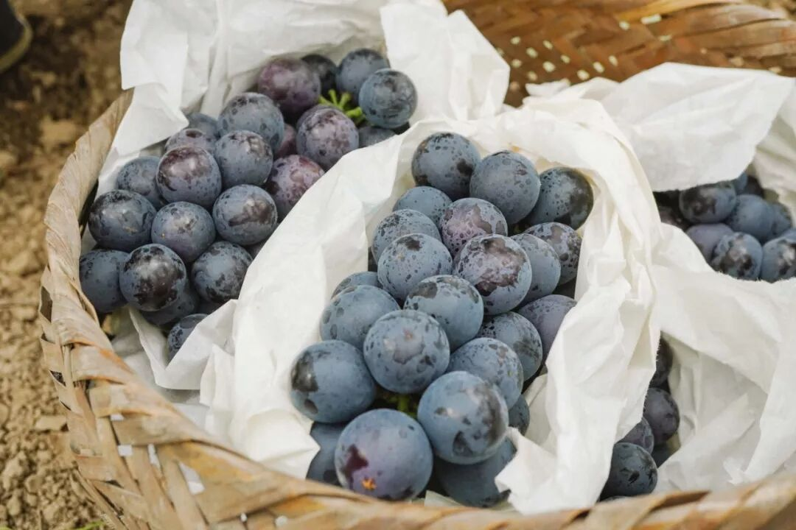
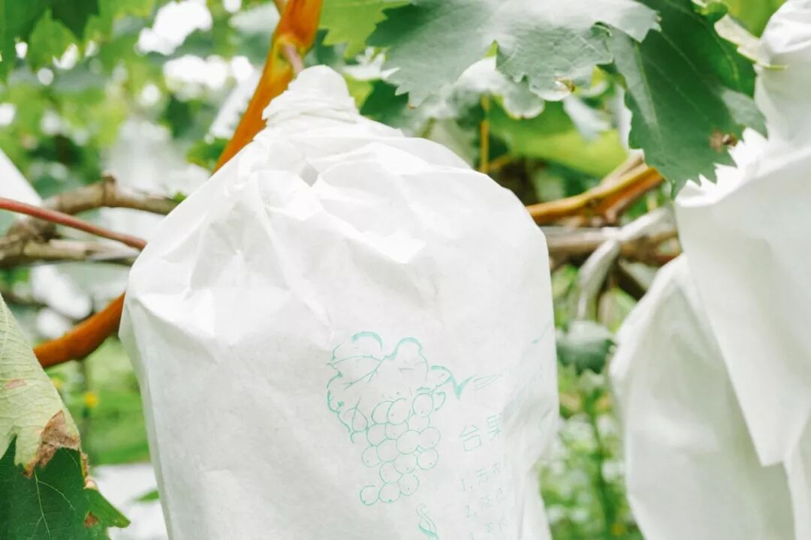
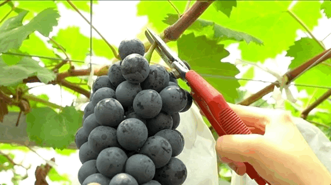
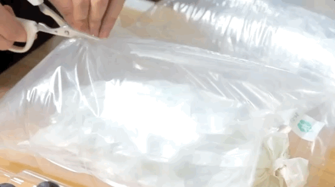
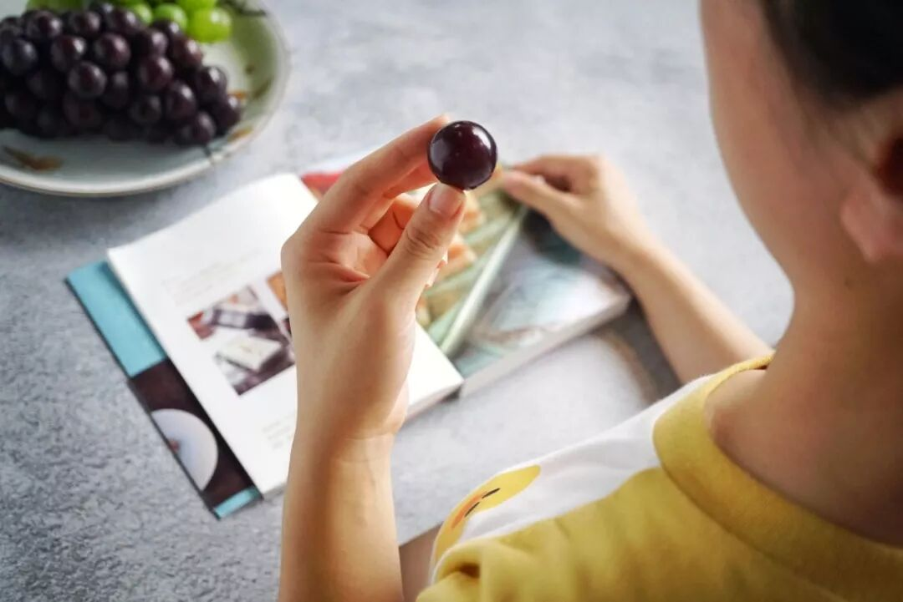

# 葡萄届小黑马，又到尾声

- 原文链接: https://mp.weixin.qq.com/s?__biz=MjM5NTYxODQyMA==&mid=2653456754&idx=2&sn=a7ac15b96e5c16900aa67cdec148826c&chksm=bcd5abf7ee4aa41122764f78a78290ffde9cf3233b24897fdefa2ce3ac0508dc9be3f198dc7b&scene=27#wechat_redirect
- 浏览量: N/A
- 点赞数: N/A
- 评论数: N/A
- 转发数: N/A

## 正文

相聚总有别离

一个尽情安利自我的公众号

以下是没事干研究院的风物研究报告请放心食用

在这司上班，

有时会觉得自己仿佛

一个站在山里的店小二，

每日迎来送往，

看这瓜唱罢那果登场。

一转眼，

上周才刚来的

——上海马陆夏黑葡萄，

这周便到了尾声。

就是这一枚高甜的爆汁小炸弹👇

体面送走它之前，

建议大家重学一下此前的课件，

向这位来自上海吐鲁番的铜奖选手，

送上我们的祝福与尊重👇

（永恒的体育精神🙏

脆甜的夏黑葡萄，

来自上海马陆。此马陆，

非指那在地上爬来爬去的千足虫。

而是位于上海嘉定的马陆镇，

江南地区第一个种植葡萄的地方。

有个说法是：马陆葡萄园 ，

上海吐鲁番。

卷产区，饱记舒适区。

我司指定的果园曾在 2021 年获得马陆镇的葡萄评比铜奖🥉。

在这里，

每一串挂在藤上的葡萄，都保证自然成熟，有足够的时间积累甜度和风味。

干脆利落咬一口夏黑

有微微草莓香气，

肉质细脆，基本无籽 ，

甜度高，是夏黑没错！

哦对，葡萄的甜度和风味，跟成熟度关系很大哈，你在生鲜平台买的，很多是为了方便运输，不等成熟就卖了，饱记给你的是 9 成熟，
确保滋味足够饱满～

咔嚓摘下，装上套袋，称好总重量，充气包装，然后顺丰送上门，到你手中还是新鲜的。

唰唰唰剪开袋子，会有种莫名的快感：

洗净咬开一颗，满嘴都是夏日微醺的果香～

跟老板薅来了尾声 9 折！！！！
眼瞧着后天的 40 度高温，就盼着这么一口冰冰凉凉，让汁水在唇齿间爆开。行吧，可以暂时原谅这个世界👌

饱记·马陆夏黑葡萄购买方式如下尾声 9 折！！

马陆是上海的王牌葡萄产地，
获得了国家农产品地理标志，
饱记选择的果园曾于 2021 年获葡萄评比铜奖。
果肉饱满，风味浓郁。外皮紫黑，皮薄少籽。高甜！！！
🍇「饱记·马陆夏黑葡萄」两个规格：两串装·2.5 斤四串装·5 斤

建议放入冰箱冷藏，3 天内食用完。

戳下图购买👇

题 外

随时可能下架的还有

个大高甜的从化无核荔枝，

真正的报恩水果。

核小且软，可直接吞咽或咬碎。

缺点只有一个，就是巨贵！

所以，打不起折hhhh

推荐搭配增城荔枝尝尝鲜！

目前仅余仙进奉、糯米糍两个品种！

边吃边许愿明年便宜点🙏

饱记·从化无核荔枝

购买方式如下

来自广东从化，

地处北回归线，

气候温和，黄土壤居多，

更适宜荔枝生长～

并蒂双生果核，自然退化，核小且软，可吞咽或咬碎，剥开皆是水灵灵果肉。
凌晨采摘，放冷藏预冷，
当天直接从果园冷链车运输到机场，减少荔枝脱温时间，为的就是新鲜～
五种规格：双拼：无核荔枝 1.5 斤+糯米糍 1.5 斤
无核荔枝 1.5 斤+仙进奉 1.5 斤
糯米糍 1.5 斤+仙进奉 1.5 斤三拼：无核荔枝 1 斤+糯米糍 1 斤+仙进奉 1 斤单品种：无核荔枝 3 斤装
下单后 5 天内发～
戳图买它👇

饱记·增城荔枝仙进奉+糯米糍！！！
购买方式如下
一骑红尘妃子笑，说的就是增城！自古以来的岭南荔枝名产地～
🍚想一颗就吃爽的选「糯米糍」；💦喜欢特别嫩多汁的选「仙进奉」；最后的数天，
吃完一起许愿明年好天气！别那么贵了你！！！
三种规格：双拼：糯米糍 1.5 斤+仙进奉 1.5 斤单品种：糯米糍 3 斤装
仙进奉 3 斤装
下单后 5 天内发～
戳图买它👇

本文的研究员

薯角吃葡萄不吐葡萄皮

用好吃的方式吃一生

祖国各地好风物

文章转载请加微信「baojiclub」

