# 蜜桃爱马仕之阳山湖景，赏味只得 15 天

- 原文链接: https://mp.weixin.qq.com/s?__biz=MjM5NTYxODQyMA==&mid=2653456188&idx=2&sn=5dedbff6f34f8c8439b9f99100b5b588&chksm=bcea292e368dbc032bd848cb6b69efae4fe6a187b7b8bae69b44b7bbdacc964f326c618653f6&scene=27#wechat_redirect
- 浏览量: N/A
- 点赞数: N/A
- 评论数: N/A
- 转发数: N/A

## 正文

一不留神又要没啦？？

一个尽情安利自我的公众号

以下是没事干研究院的风味研究报告请放心食用

不是标题党！

年年此时，

阳山桃在我们吃桃人眼中

（尤其软桃党！

堪称桃中爱马仕

矜贵万分，
是拿得出手的甜蜜蜜～

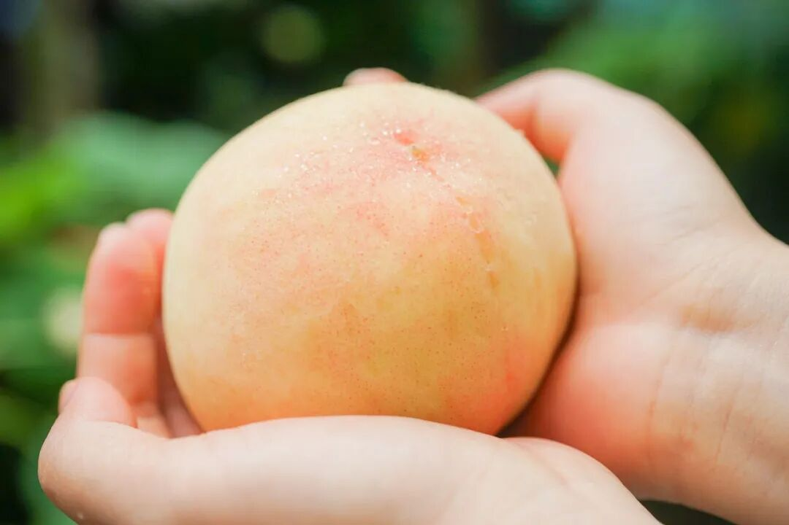

今年的白凤已落市，

好在更甜的阳山湖景水蜜桃，

即刻熟成接班！

但也只有——区区 15 天！

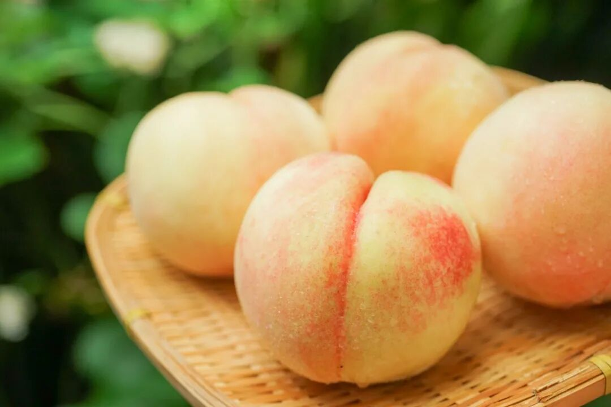

有些桃，一旦错过就不再～

不过你放心，

近期本薯将化身「吃桃」闹钟，

一遍遍地抄提醒，

（《后来》 bgm 起

为什么说湖景桃是水蜜桃必吃榜 No.1👇

同白凤一样，

生长于无锡阳山的湖景水蜜桃，

经火山岩土壤滋润，

丰富的矿物质造就了独有的鲜甜口感。

但湖景晚熟，

花了更多更多时间在果园里积蓄养分，

简直把阳山桃香甜多汁的优势

发挥到了极致！

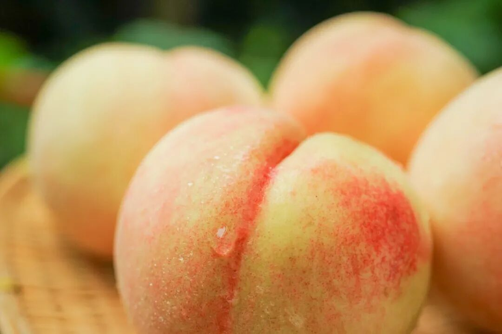

桃味香浓纯粹，

且甜度更高、酸度更低  ，

入口甜糯多汁～

就连无锡人自己也表示，白凤上得厅堂，湖景必须落入自己的胃里hhhh

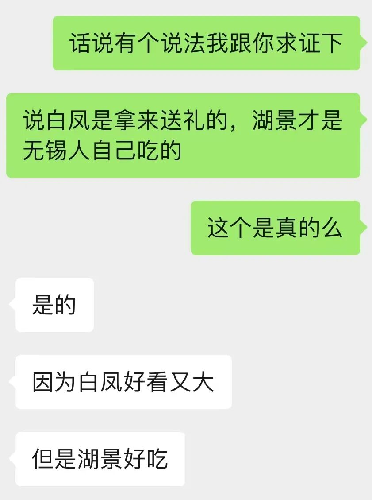

虽没白凤那么艳丽，

但湖景也是果皮乳白，桃缝红润，

看起来又粉又萌！

有独此一份的桃香，

甜蜜滋味下，

只留一丝丝新鲜酸度～

剥开熟果的皮，

猛吮一口！

浓郁的果汁，

带着桃肉独有香气滑入喉咙～

大口大口咬下去，

超丰富的汁水，

猝不及防地沿着手臂流下去。

简直是桃子界的天花板～

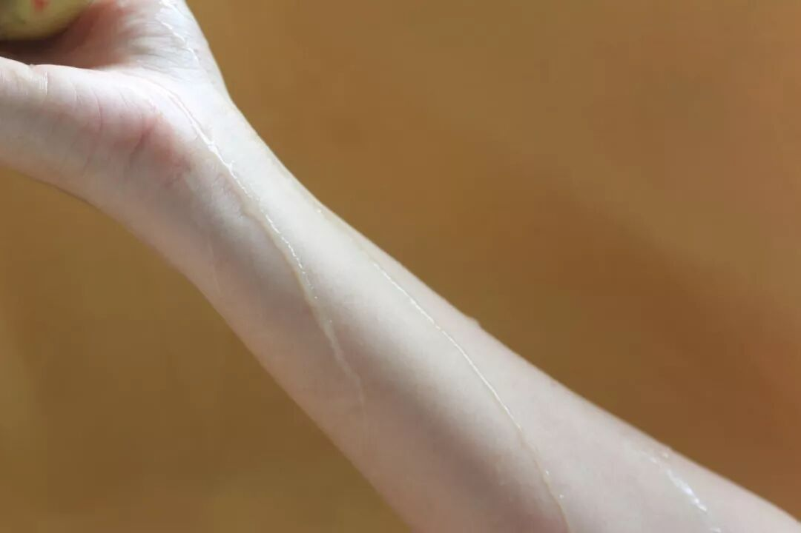

仍然是饱记合作多年的果园，核心产区的基地，地下水喷灌，用机器代替人工，不打除草剂。

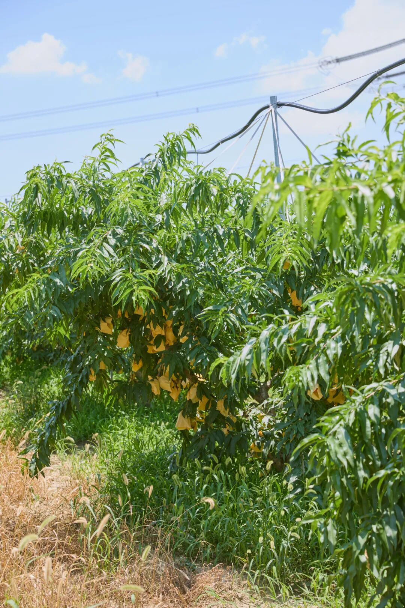

卷产地卷得驾轻就熟，

有桃农协会的授权证书！

每一颗都由人工细心套袋长成，

让蜜桃光照均匀，色艳味美，

物理防虫、防鸟、防晒伤～

（十天前它明明还长这样啊！👇

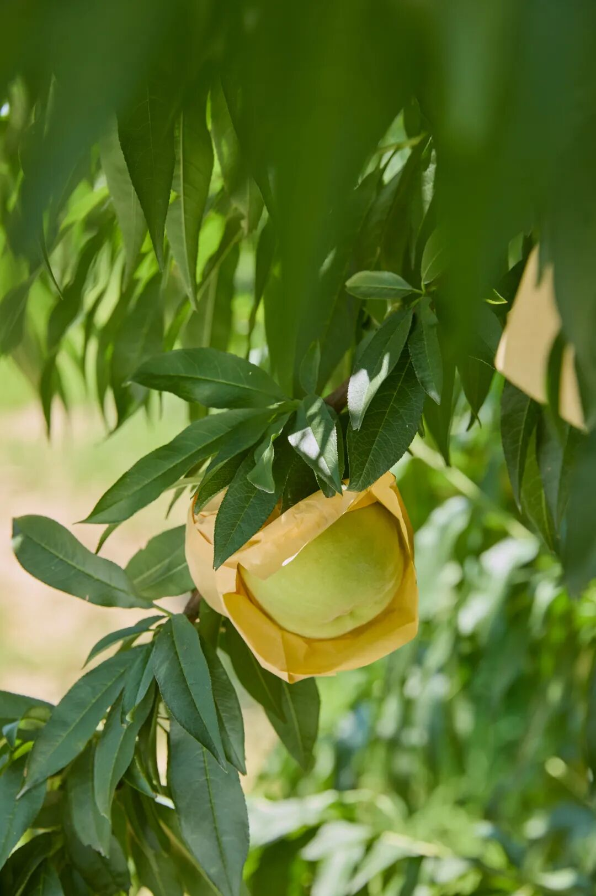

再由当地种植经验丰富的果农

担任挑桃师傅，

经三道人工逐粒筛选，

根据颜色、软硬程度，

只选七八分熟的好果。

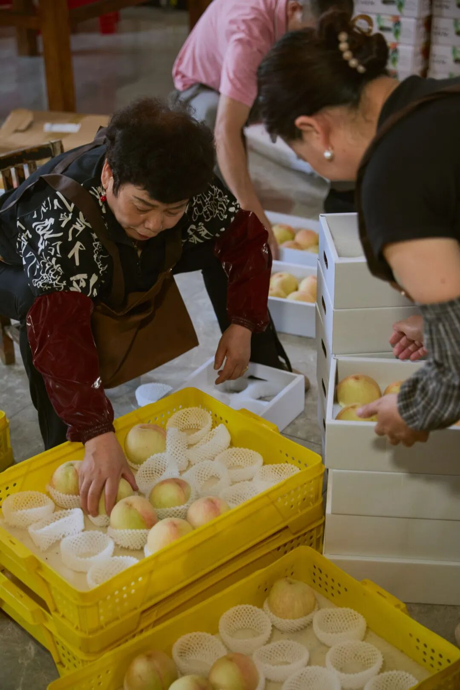

（年年此时，师傅们挑完白凤挑湖景～

（PS：拍摄时挑的是白凤！

缺点也有的，

果季短得很！

符合我们标准的桃子也不多，

一年一会，别错过！

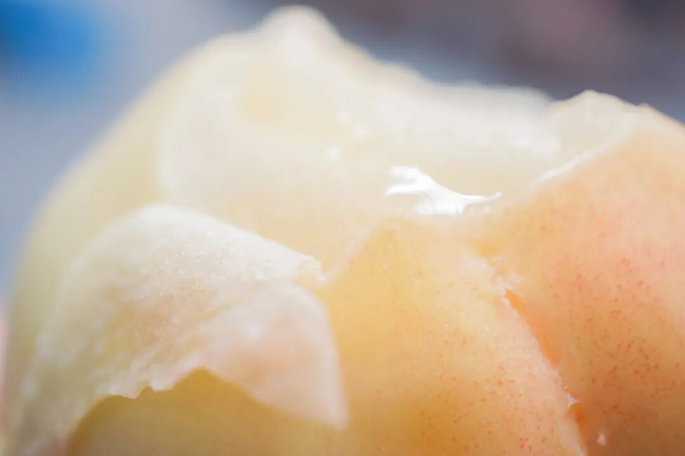

以下是购物须知，一定要看哦~
以下是购物须知，一定要看哦~以下是购物须知，一定要看哦~

🍑食用建议
收到后，及时将桃子从箱中取出或把珍珠棉取出，放在阴凉通风处。大约 3天左右等待桃子变软，建议优先挑软桃直接剥皮食用，味道和水分保留更佳。
🍑吃桃小贴士

* 收到后请将桃子轻拿出，平铺在阴凉通风处保存，放软后剥皮吃掉哦。

* 不建议放入冰箱冷藏，会容易影响口感。

* 清洗后即可食用，建议直接撕皮。不要用力捏桃，桃子会坏掉。

* 如果遇到桃子核有开核情况（呈卡其色或黑色桃胶状），这是正常现象，不影响食用。

* 运输过程中，难免桃子会有磕碰，如果发现桃子有甜斑，并非不新鲜或变质，只是水蜜桃磕碰后果皮和果肉会变色，不影响食用。

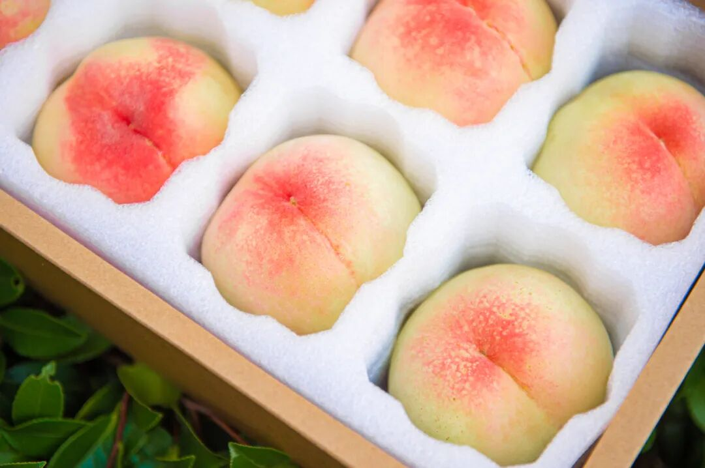

饱记·阳山湖景水蜜桃购买方式如下限时早鸟！！86 折！！
阳山桃中比较晚熟的品种，
花了更多时间在果园里积蓄养分，接班白凤水蜜桃，更为香甜多汁！
🍑「无锡阳山·湖景水蜜桃」两个规格：特级·阳山湖景水蜜桃
单果 6～7 两，一箱共计 8 颗。优级·阳山湖景水蜜桃单果 5～6 两，一箱共计 8 颗。
不建议放入冰箱冷藏，会容易影响口感。阴凉通风处保存，优先食用软桃。

限时早鸟 86 折，到这周五！！

戳图买它👇

或🍑🍑🍑搜索

「艾格吃饱了」

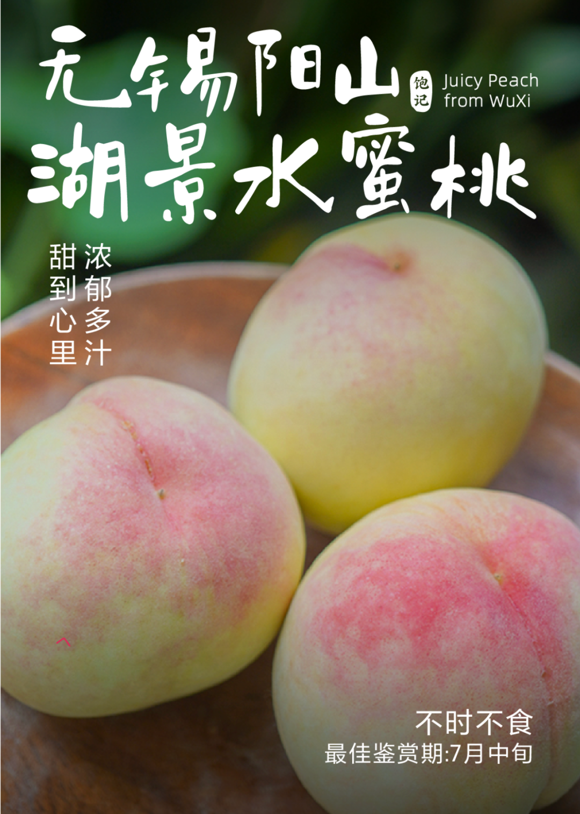

题 外

脆桃党们！！！别说本薯忘了你，来自广东连平的鹰嘴桃，
是产品同事试遍不同产区后精心挑出来的最佳～又脆又香浓～趁老板下乡学习中！持续 86 折！！到本周五！！还有之前单独说过的，一层金桂一层茶的桂花乌龙，单喝便有层叠的花香与茶韵～可搭配桃子和本薯一样剑走偏锋！来一杯桃桃乌龙？？
饱记·广东连平鹰嘴桃
脆桃党福音！！限时早鸟！！86 折！！
广东连平，岭南有名蜜桃生产基地，
种植历史可以上溯到 400 多年前！
从 110 多种佳果中脱颖而出，连平鹰嘴蜜桃于 2015 年获得「岭南十大佳果」殊荣～

形似鹰嘴，小小可爱，
又脆又甜果味浓！脆桃党抱住不撒手！
规格：一箱 12 只装，每只 3～4 两。

限时早鸟 86 折，到这周五！！
戳图买它👇

或🍑🍑🍑搜索

「艾格吃饱了」

饱记·桂花乌龙（小金罐）购买方式如下
安溪戴云山脉深处的六年陈炭焙观音，寒露前后打的新鲜金桂，饱记请来家中五代制茶的福州老茶人，以传统古法窨制，一层金桂一层茶，100 斤的茶要用 300 斤桂花分三次窨制。
观音茶染有花香，金桂衬着茶意～冷泡、热泡皆适宜！升级版小金罐，送礼自留都满足。
两种规格：单罐装：桂花乌龙（1盒），
组合装：
桂花乌龙（1盒）+柚子小种红茶（1盒）。
戳图即可购买👇或打开 🍑🍑🍑 搜索「艾格吃饱了」

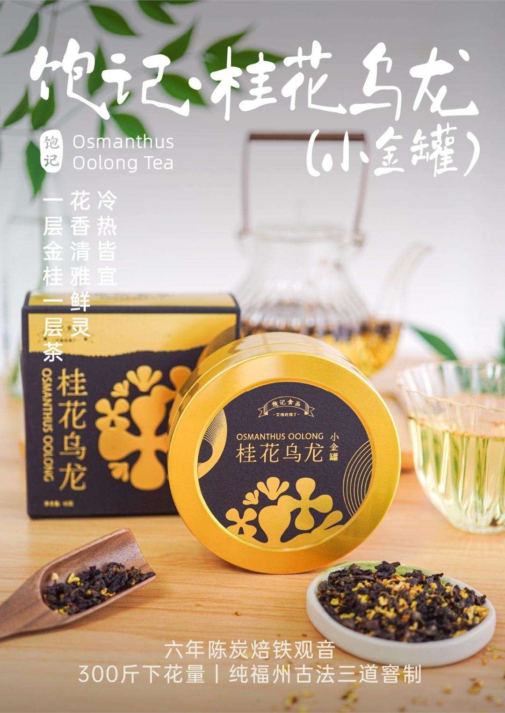

本文的研究员

薯角

软桃党又快乐了

用好吃的方式吃一生

祖国各地好风物

文章转载请加微信「baojiclub」

