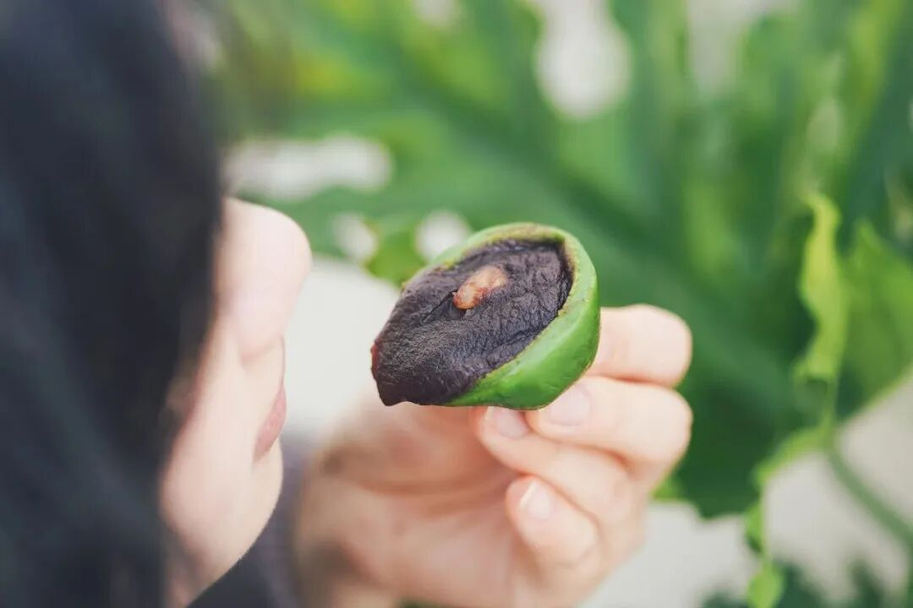
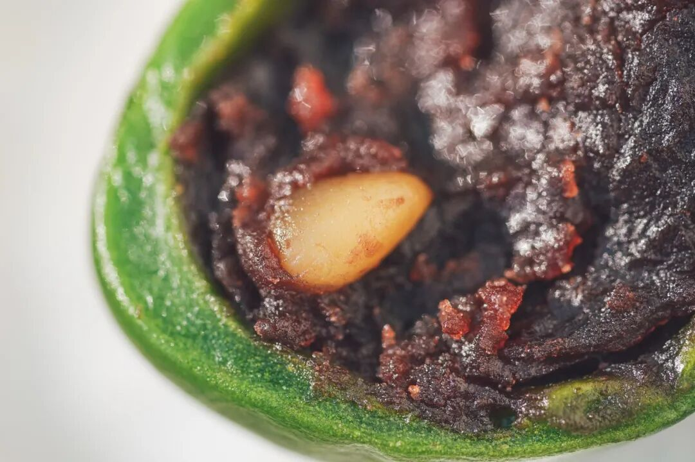
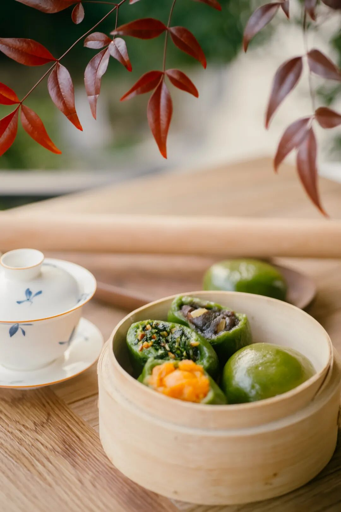
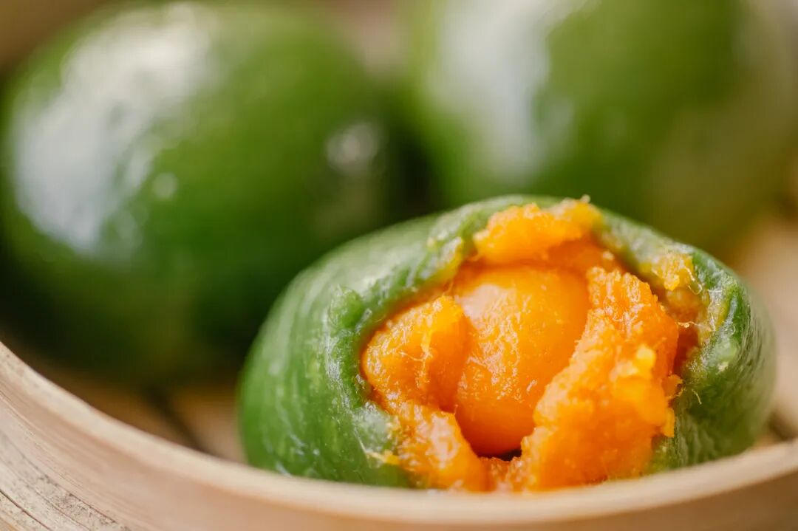
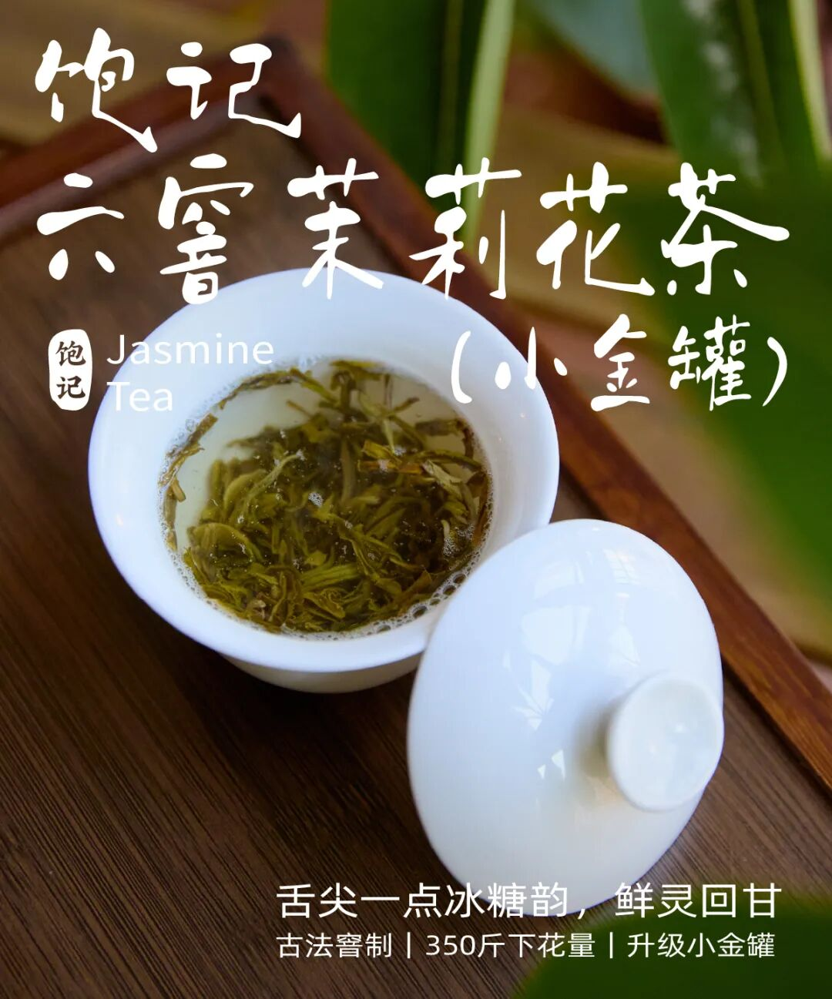

# 要不是青团和好茶都来了，谁想上班。。。

- 原文链接: https://mp.weixin.qq.com/s?__biz=MjM5NTYxODQyMA==&mid=2653467813&idx=1&sn=781b865202cbea4e8bab656dec3c6a17&chksm=bc13704c176bb160c86365ac81e10dbe6334248e1627085d70385dfccdfef55fda68522cd5e1&scene=27#wechat_redirect
- 浏览量: N/A
- 点赞数: N/A
- 评论数: N/A
- 转发数: N/A

## 正文

一年就想这一口

一个尽情安利自我的公众号

以下是没事干研究院的风物研究报告请放心食用
上海这阴沉沉的湿冷天，试问谁想上班。。。还好我司产品同事懂事，把青团和好茶送上门来，
本薯感觉又能吆喝了

先说这青团，还有人没买吗？已经开始发货啦！

大家放心，

今年还是老配方，

品质一点没变。

身边很多朋友都在等这一口，过了年就开始嚷嚷了，然后砸吧砸吧，能想上一年。

怕甜怕油的放心冲，我们调味很克制，亲测吃完一整个都不腻。

皮这么薄，馅这么大，一整颗蛋黄吃到上头，还有新鲜马兰头！（单押每年还只能吃几十天！试问这谁能顶得住啊？？？

来来来，一共三个口味！先跟我尝一枚热乎乎的整颗咸蛋黄肉松，名副其实，肚子里有一整颗咸蛋黄！搭配猪肉松 + 白芝麻，塞得圆滚滚，软糯咸香！有趣。

市面少见的整颗咸蛋黄还是从洞庭湖现运现蒸的！

再来一枚豆沙松子，哟呵，皮又薄又弹，豆沙细腻爽滑，松子香喷喷，一口流心，又是另外一种滋味。爽滑。

豆沙需提前炒制好，再搭配上饱满的松仁。

最绝的是春季限定马兰头香干，（本薯强推！！！
就是江南春天那一盘经典的时鲜菜，比肉都好吃！入口清爽鲜美，一咬开，啧，这不就是春天的味道么？爽了。

马兰头不用多说，春天新鲜采摘，再同卤香干一起，切碎凉拌。

对此我只想说，天南海北你是真不嫌麻烦啊！

当然皮子这一块也没放过，上海传统青团的皮子偏软粘嘴，不如江浙一带青团更带劲儿，糯糯的又不失嚼劲。

所以特别加入了泰国糯米粉，吃起来，QQ弹弹能拉丝。。。。

包好后的青团，就这样，排队等着穿上保鲜膜衣：（食品级耐高温的哈

装盒立马送去 -40 度极冻保鲜 1 小时以上，才最接近新鲜青团的口感。然后装箱发货，来到大家身边。（时间就是美味的敌人啊！！！

你要问配方从哪里来的？嘿嘿独家研制，所以你去外面买不到。所以本薯诚挚邀请，所有爱吃青团的朋友们，来品品我司亲妈青团。。。

和老字号做过对比，您自己看。
饱记青团还是热加工工艺，需冷冻保存，相比市面冷加工青团，蒸好后皮子更为软糯有韧劲！

不愧是饱记积攒多年的亲妈配方，我服！！！

这青团现在已经现货！限时 85 折！！

收到货之后，

强烈建议大家尽快吃掉！

怎么吃？

无需解冻，无需拆保鲜膜，

蒸锅水开上锅蒸 23 分钟左右就行。

如果不立即吃，

收到后请立即放入冰箱冷冻（-18℃以下）保存，

冷冻保存60天。

饱记·妈妈牌青团现货中！限时 85 折！！！
戳图或去🍑🍑🍑搜索「艾格吃饱了」下单购买👇

你若问这青团配什么茶？嘿嘿，当然是入口有冰糖韵的小金罐·六窨茉莉花茶👇

福州乃茉莉花茶的发源地，

我司特地委托了

家中五代制茶的福州老茶人，

以传统古法窨制正宗茉莉花茶！

先要在夏季鲜采数百斤茉莉花，

因为那个时节温度高但雨水少，

茉莉花柔和鲜灵，

运回后再仔细拣选，

只留花苞、颜色、大小合适的茉莉花

与茶叶拼和。

再精选明前茶坯，

六窨一提传统窨制，

下花量高达 350 斤

这还没完！

福州古法做花茶，

见花香不见花，

茉莉花窨完后还要以手工挑除，

只留茶叶与花香～

道道反复工序，

才有最后的舌尖一点冰糖韵，

抿一口茶汤，扑鼻香气～

鲜灵得让人神清气爽，

甘爽醇和，舌尖回甘，

配青团喝喝正合适啊！

升级小金罐包装，

春天拎着当伴手礼，

也显得咱大大方方儿的！

或者和青团摆一起，

就是一席春日的中式下午茶！

现在也给一个限时 9 折！！

冲它！！！

饱记·六窨茉莉花茶购买方式如下春日限时 9 折！！！
戳图购买👇

题 外

朋友们春天好啊！

没吃够的看这里👇昨天上架的红膏梭子蟹买了吗？高级餐厅品质！满满都是膏！趁现在限时早鸟 86 折！刚冒出来的临安天目山雷笋，

米其林餐厅师傅第三年回购，

不焯水就鲜甜！

现在也有限时 9 折！

刚好配真材实料的饱记腊肠，

限时地板价 8 折！

或者试试好吃不贵的

玫瑰露酒腊肉&腊排骨，

更是限时地板价 7 折！

回到童年的铁盒蛋卷，

产品经理卷出来的鸭舌、麻花、猪肉脯，

都给一个限时 7 折！！

还有些适合时令水果👇

上周刚到的卷中卷红玉芒果，

娇艳可人的雷州木瓜，

口味浓甜的蒙自花长虹枇杷，

来自精品小果园的云南沃柑，

好吃不怕胖的广西芭乐，

人称「水果冰淇淋」的凤梨释迦！

清新浓郁的万人迷上海金奖草莓👇

现在也有限时 9 折！

此外 90 天短保质期的大师凤梨酥，

也都有限时 9 折冲冲！

饱记·东海春季红膏梭子蟹

购买方式如下

限时早鸟 86 折！！！

戳图下单购买👇

饱记·2025 临安天目山雷笋

购买方式如下

限时吃笋 9 折！！！

戳图购买👇

饱记·手工腊肠购买方式如下👇限时地板价 8 折！！！！
戳图下单购买👇或🍑🍑🍑搜索「艾格吃饱了」

饱记·玫瑰露酒腊肉&腊排骨购买方式如下👇限时地板价 7 折！！
戳图下单购买👇或🍑🍑🍑搜索「艾格吃饱了」

饱记·海南红玉芒果

购买方式如下

限时吃水果 9 折！！！

戳图购买👇

饱记·湛江雷州木瓜

购买方式如下

限时吃水果 9 折！！

戳图购买👇

饱记·凤梨释迦购买方式如下限时吃水果 9 折！！！
戳图购买👇

饱记·蒙自花长虹枇杷购买方式如下限时吃水果 9 折！！！
戳图购买👇

饱记·云南晚熟沃柑购买方式如下限时吃水果 9 折！！！
戳图购买👇

饱记·广西芭乐

双拼&奶油芭乐

限时吃水果 9 折！！

戳图购买👇

饱记·红颜草莓限时吃水果 9 折！！！节日莓有烦恼！！
戳图购买👇

饱记·限定铁盒酥酥蛋卷

购买方式如下

限时 7 折！！！

戳图购买👇

饱记·年味零食7 折专区！！
购买方式如下
戳图购买👇

饱记·新鲜到货凤梨酥

限时 9 折！！！
戳图购买👇

本文的研究员

薯角我想我知道春天的味道

用好吃的方式吃一生

祖国各地好风物

文章转载请加微信「baojiclub」

