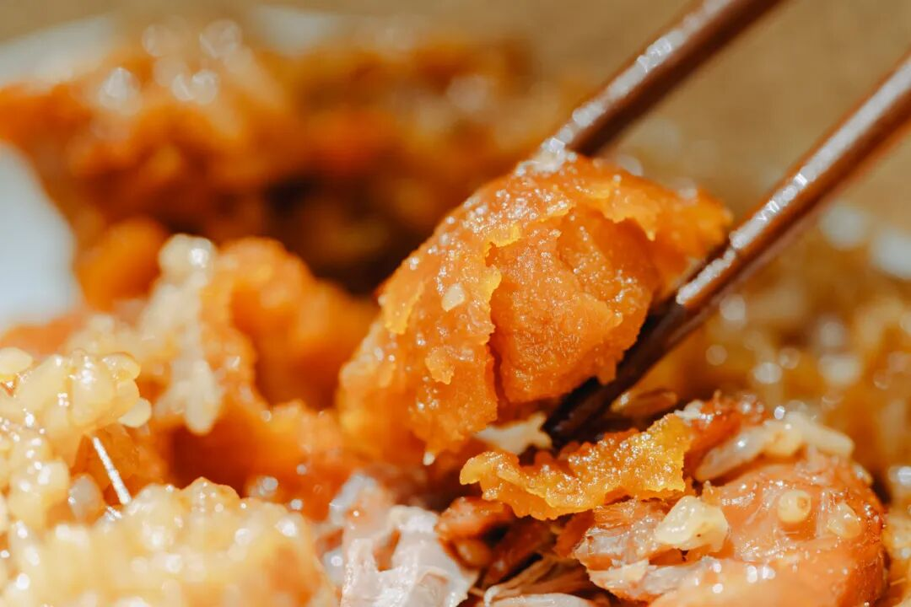
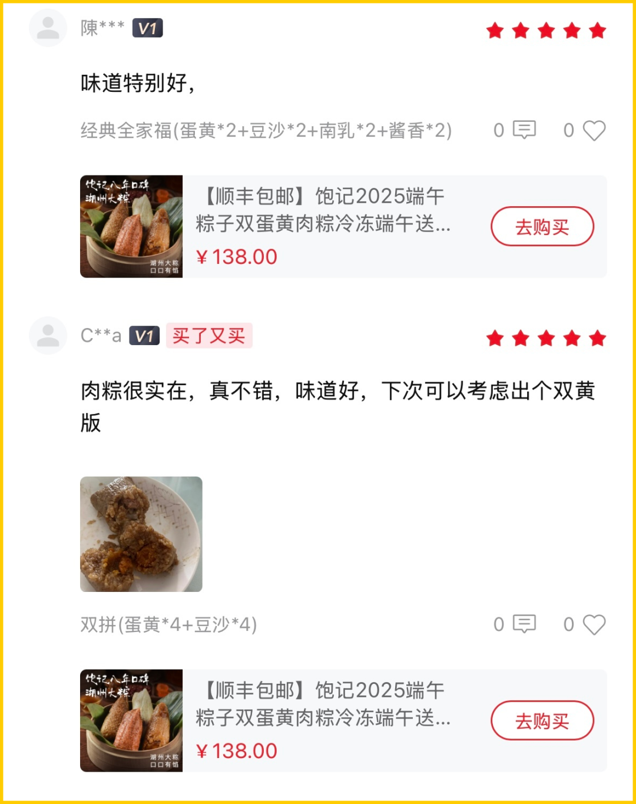
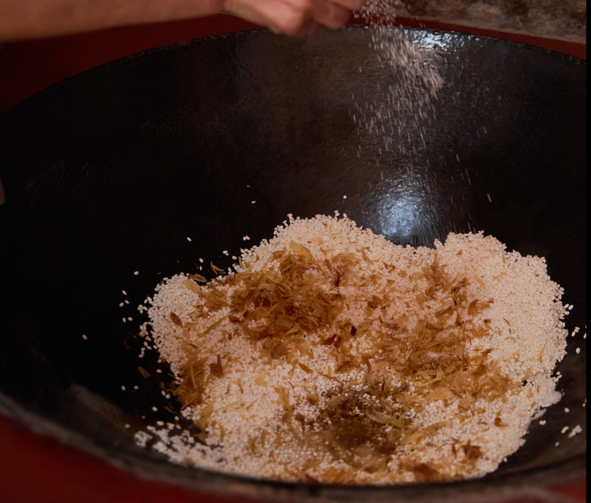
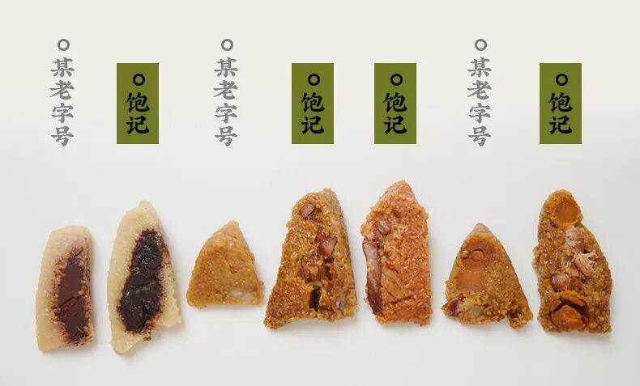
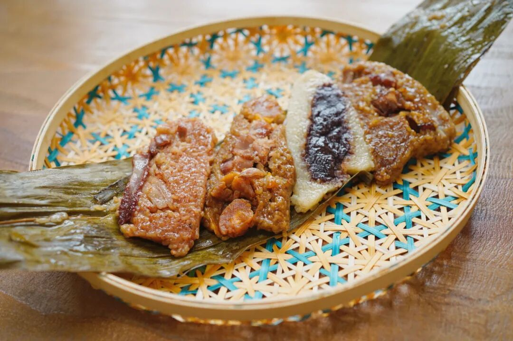

# 近期必吃榜，原来不是吹的啊。。。

- 原文链接: https://mp.weixin.qq.com/s?__biz=MjM5NTYxODQyMA==&mid=2653470672&idx=1&sn=f2cb193ee9697b821cbb8cc3945543b9&chksm=bcf3f6cc29365b3f81b328756072ea8606a9e5328dd69efb99c511a67445ae403b20f1d928fe&scene=27#wechat_redirect
- 浏览量: N/A
- 点赞数: N/A
- 评论数: N/A
- 转发数: N/A

## 正文

外面买不到

一个尽情安利自我的公众号

以下是没事干研究院的风物研究报告请放心食用

这两天一睁眼，

本薯就开始吃粽子！！！！

咸蛋黄流心，豆沙细腻，

现炸葱酥喷喷香，

口口是料

早餐就把自己吃美了～

没错，今年份的我饱记粽子，

已经都是现货了！

今年一共五个口味，

看图，能忍住不买，算你赢。

不是我薯角吹，

看看后台的真实评价，

第一波吃上的朋友如是说👇

🍃🍃🍃粽子全家福五种口味，甜咸一次满足

以防有人是第一次见到这粽子，

本薯吃完坐回了电脑前，

给大家重新梳理下。

（贴心薯角，不怕困难

今年新做的闽南葱香烧肉粽，

我司产品经理找泉州妈妈要的配方，

料超多，馅超足！

用了泉州现榨红葱油、红葱酥

来炒制糯米，

再包入猪五花肉、干贝、

虾米、卤香菇、卤花生粒！

（快给我数不过来了

炸好的红葱油、红葱酥，

拿去炒糯米，

（怕大家吃不惯还是用的包邮区糯米哦～

把葱香和酱油香直接炒到米里。

闽南都是这样的熟米粽，

和包邮区不一样，更像在捏饭团。

鲜香浓郁，

一口下去好满足嘿嘿

剩下都是湖州大粽，经典四个口味，

首先是包邮区的王：高邮咸蛋黄黑猪肉粽！

用高邮鲜挖的咸蛋黄，再称 40 克黑猪后腿瘦肉，10 克腰间肥膘，咸蛋流油起沙，油香混着肉香，市面上完全买不到！！

紧接着就是本薯今年的最爱：

新会三年陈皮豆沙粽！

今年四个口味里的唯一甜粽，甜而不腻。

因为取了正宗的广东新会三年陈皮，

每年端午前现磨包进粽子里。

看不见陈皮，但每一口都能感受到它的存在！

蒸过之后，香气清雅得想吟诗：啊～江南～

还有传统酱香黑猪肉粽，

用了三种酱油去浸米，其中一种是包邮区百年老字号日晒夜露的。
和蛋黄肉粽的米配方完全不同！老板说想要小时候土酱油的烟火气～（我只看得见一大块肉🙏

最后走一下小众复古路线：古法南乳黑猪肉粽，是想致敬包邮区南乳大肉的味道～南乳，就是红腐乳。翻遍包邮区、华北和广东的南乳酱，最后：广东古法南乳酱赛高！米和肉都能吃到咸香带微甜的腐乳味儿：（你看这个红！它是不是寓意着鸿运当头！！（我疯了

🍃🍃🍃九年口碑之作！外面买不到！

要我说，

这个公司的人真的很卷，
一个粽子做了这么多年了，还要打五六次样，老板说什么鸭蛋豆沙都是农产品，粽子调味和包什么都是手工操作，「要看看调味准不准。」

不仅如此，每批大货还要抽样。同事还给了我很多市面上买来的老字号，大品牌，
结果对切之后。。。。哎馅料的比例，你们自己看吧。

难怪粽子除了馅儿多，

（开始背：咸蛋黄、黑猪肉、三年新会陈皮粉、南乳酱。。。

回头客也多啊～

做了九年、卖了 90w+ 只，

攒下来的好口碑，

收获很多年年买的老客户：

毕竟是老板南北来回跑，

请教了很多厉害师傅，

才钻研出来的配方和好料。

我称之为包邮区的粽子弄潮儿！

市面上没有！

外面买不到嘻嘻～

🍃🍃🍃-40℃急速冷冻锁鲜，非真空包装

然后为了锁鲜，

饱记的粽子都用了-40℃ 急速冷冻锁鲜工艺，

保质期内味道和口感几乎不会有改变，

主打的就是你吃到的和现包的没有区别～

每次从冰箱里拿出来蒸一下，

肉都仍然弹嫩，油润～

可能很多人都默认了网购的粽子是真空粽，

但我们之前做过实验。真空肉粽七天后，肉质就开始发硬。15 天后，米香开始流失。1 个月后，感觉吃起来就没有什么香气啦，而且肉质很硬柴，研发说缩水 15% 以上。我们辛辛苦苦挖的蛋黄、磨的陈皮，可不能就这样浪费～

总之，

本薯从不虚言，

早鸟价结束，

现在限时吃粽 9 折！

也划算的！之前催我的朋友们，

立刻给我下单啊啊啊！！

饱记·口碑湖州大粽&闽南葱香肉粽现货中！！限时吃粽 9 折！！！！
戳图买它👇

题 外

朋友们！！！

回归的金山鸡这批还有最后 1 只一年老母鸡！！想当包邮区大孝子的速冲！限时 7 折！时令新鲜的春季茶中「梅家坞」和「蒙顶甘露」性价比高！自家喝不心疼！限时单件 86 折/双件 8 折！上好的「狮峰龙井」送人包体面！限时喝春茶 9 折突然熟了的云南西红柿，小时候阳光里长大的浓郁番茄味儿，
限时早鸟 86 折！！来自湛江的红膏青蟹。不仅有红膏，而且满到蟹壳角角落落。

其他的东海野生海鲜，

肥美银鲳和红膏梭子蟹，

都是高级餐厅水平！

限时吃海鲜 9 折！

还有些只有最近这一阵可吃的水果👇

拿过上海金奖的金山小番茄，

找了七八年才满意的大连蜜甜樱桃，

难得回归的泰国超甜多汁金柚，

瓜肉软糯的翡翠冰淇淋甜瓜，

无渣不麻嘴的海南金钻凤梨，

连盐水都不用泡。

卷中卷红玉芒果，

娇艳可人的雷州木瓜，

现在也有限时 9 折！

饱记·云南稀有品种瓢鸡限时吃鸡 7 折！！！
戳图下单购买👇

饱记·云南西红柿

购买方式如下

限时早鸟 86 折！！

戳图购买👇

饱记·多汁泰国金柚

购买方式如下

限时吃水果 9 折！！

戳图购买👇

饱记·梅家坞龙井&蒙顶甘露

限时单件 86 折！！！

两件 8 折！！

戳图购买👇

饱记·狮峰头采明前龙井

购买方式如下👇

限时喝春茶 9 折！！！

戳图下单购买👇

饱记·金山五彩小番茄购买方式如下限时 9 折！！
戳图购买👇

饱记·大连蜜甜红樱桃购买方式如下限时吃水果 9 折！！
戳图购买👇

饱记·翡翠冰淇淋甜瓜购买方式如下限时吃水果 9 折！！
戳图购买👇

饱记·花香脆甜蓝莓购买方式如下限时吃水果 9 折！！
戳图购买👇

饱记·湛江红膏青蟹购买方式如下限时吃海鲜 9 折！！！
戳图下单购买👇

饱记·海南金钻凤梨

购买方式如下

限时吃水果 9 折！！

戳图购买👇

饱记·海南红玉芒果购买方式如下限时吃水果 9 折！！！
戳图购买👇

饱记·湛江雷州木瓜

购买方式如下

限时吃水果 9 折！！

戳图购买👇

本文的研究员

薯角我想我知道夏天的味道

用好吃的方式吃一生

祖国各地好风物

文章转载请加微信「baojiclub」

