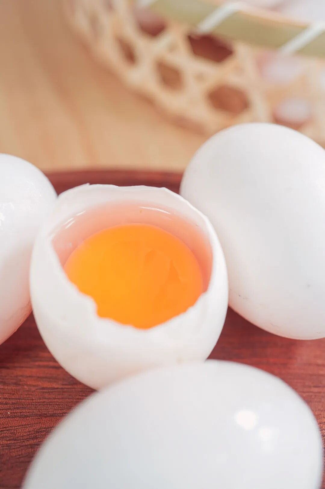
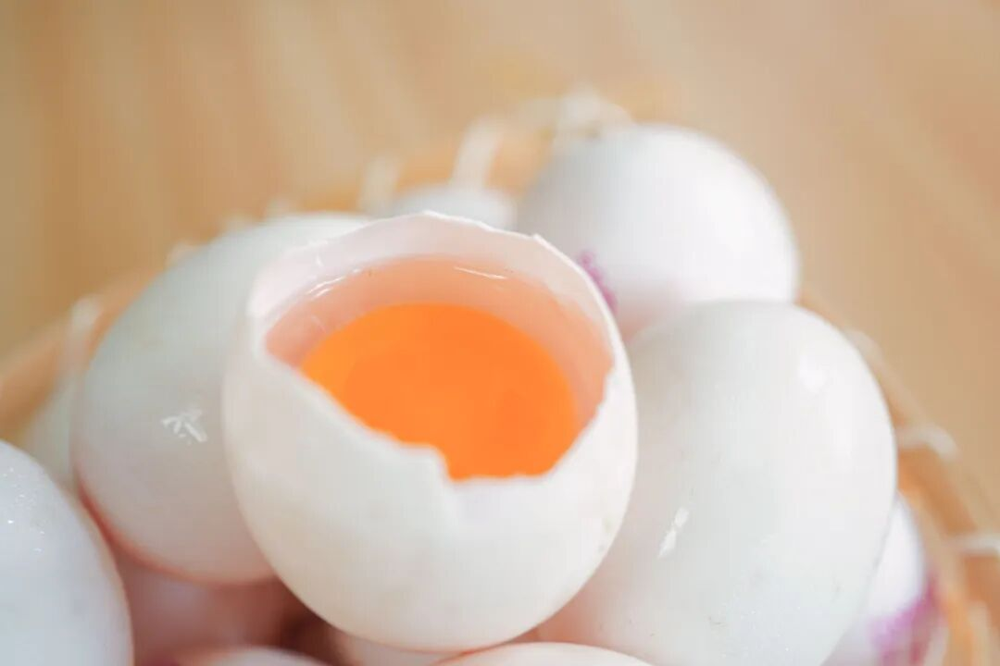
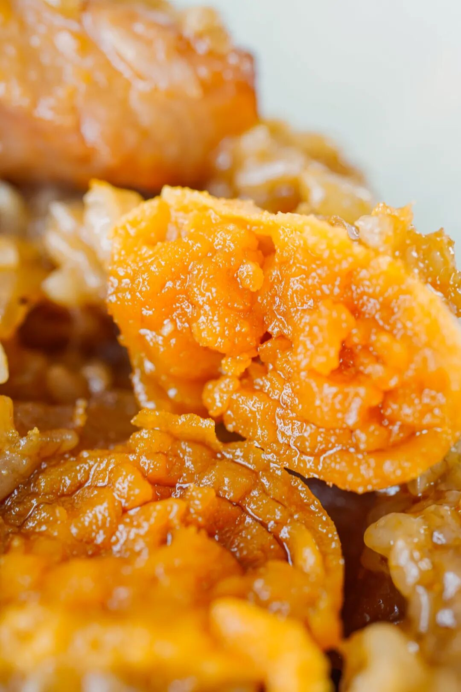
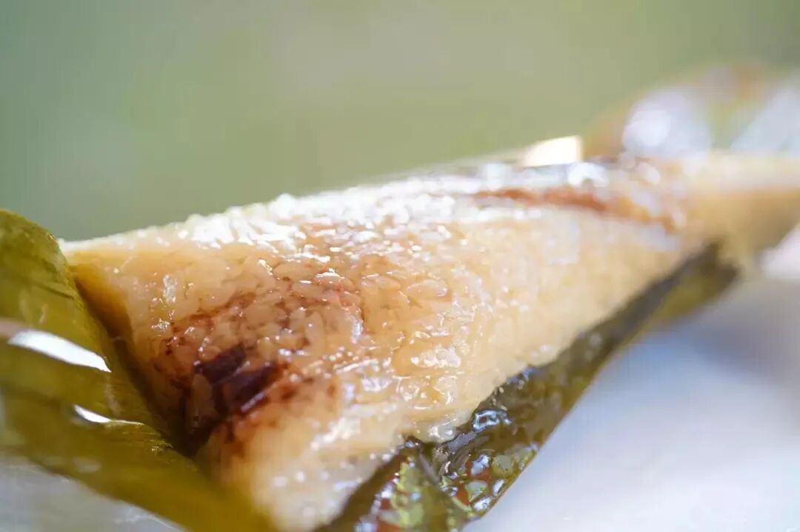
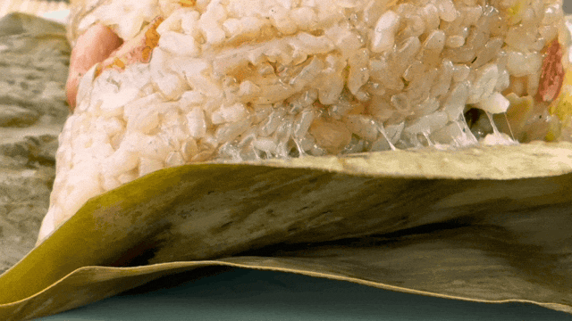
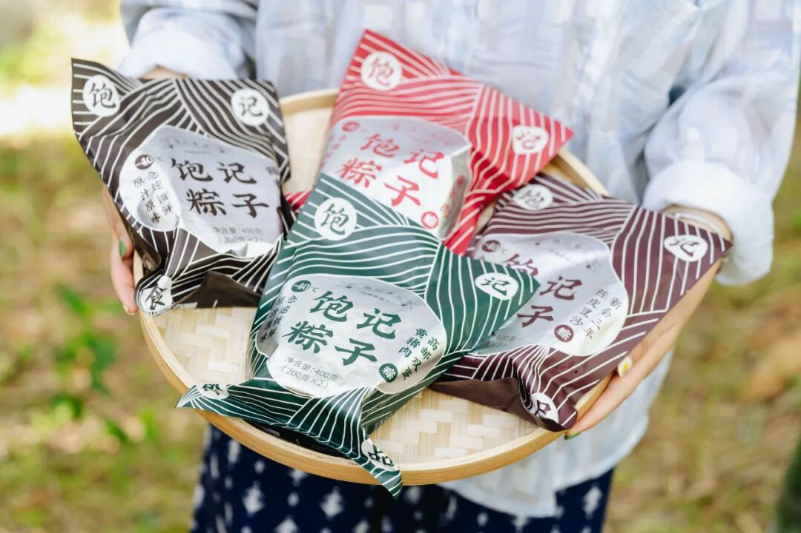

# 这一口，想原地请假的那种好吃

- 原文链接: https://mp.weixin.qq.com/s?__biz=MjM5NTYxODQyMA==&mid=2653471068&idx=1&sn=8edce3e05c52e575d5038fd25360bab2&chksm=bc67e7b34f4c193bfda36c2ef640a7a11c573b205f74625f6700aeb0f0e0ca40904f5e6e1a05&scene=27#wechat_redirect
- 浏览量: N/A
- 点赞数: N/A
- 评论数: N/A
- 转发数: N/A

## 正文

端午吃鸭蛋！

一个尽情安利自我的公众号

以下是没事干研究院的风物研究报告请放心食用
事情是这样的，周末在家下厨房，吃上了我司的两种蛋！就。。。鲜香得想今天请假在家继续吃

是的，饱记连随处可见的蛋也要卷起的。且都是从养鸭子就开始卷啊啊啊啊！请看奇妙好蛋其一👇这一颗清香无腥、大有来头的鸭蛋👇

从养鸭子开始管起！选的福建原产白鹜鸭，养在世界候鸟迁徙胜地明溪，

这里曾经是火山爆发口，

鸭子就在遗址周边的水库长大，

每天吃小鱼小虾、喝山泉水～

因此养出了富含硒元素的鸭蛋，是普通鸡蛋的 2 倍之多。没有乱七八糟的激素、色素、抗生素，老人小孩也放心吃，

我司曾央求中国特级烹饪大师毛水生老师给过一道番茄炒蛋方子。拿这次的鸭蛋试了试，
蛋块弹嫩鲜美，清香没有任何腥气，番茄汁水适中，滋味仍然酸而鲜！菜谱在这里👉蕃茄炒蛋，多加一碗饭

老规矩，给大家产地现捡现发，还有限时早鸟 86 折！一盒吃上半个月差不多，也算是端午必备了！

饱记·富硒白鹜鸭蛋

购买方式如下👇

限时吃蛋 86 折！！！！

戳图买它👇

不过！！！端午更重要的，当然还是要有一颗流油起沙的咸鸭蛋！

就像这样👇

故事要从 2016 年端午，老板心血来潮挖蛋黄讲起。当时我司为了做出一款包邮区之王：高邮咸蛋黄黑猪肉粽，老板就跑到了高邮开始鲜挖蛋黄👇

信不信由你！当时整个包邮区老字号大厂， 就没人做双蛋黄湖州粽，也没人很麻烦地鲜挖蛋黄。（是的这些年他们都是跟风！哼

历史图片：在工厂待清洗的草木灰古法腌制高邮咸蛋，2016 年
直到 9 年后，每年都坚持只用高邮本地品种麻鸭的鲜咸鸭蛋黄一年坚持鲜挖几十万只的，整个包邮区，也没听说有第二家！

而且这个高邮蛋黄，也不是凭空来的。是比较了包邮区、洞庭湖、广东几大咸蛋黄产区的几十家之后，选的最满意的！因为它家是高邮本地品种麻鸭，半散养，在鱼塘吃小鱼虾，市面笼舍养白鸭生的蛋，绝对比不上！！

我司蛋黄，是从鸭子开始管起的！新鲜的鸭蛋，再用白酒和砂糖略为腌制：

不仅如此，饱记还要求咸蛋黄腌久腌透，普通咸鸭蛋腌 28 天左右即可，我饱记要求腌渍 45 天，一定要腌到蛋黄流油起沙：

因为腌得时间特别长，这批咸蛋直接吃非常咸，不能卖，只能给饱记包粽使用，咸蛋流油起沙，咸味渗入米里。。。
市面上完全买不到！！！

来，再给我沉浸式体验一下！

肉也有严格限定标准，每一只都要称重黑猪肉，必有两条计 40 克黑猪后腿瘦肉，10 克腰间肥膘，共计一两。

工厂切肉，条条称重，但全手工操作，会有误差，有任何问题可找客服
咸蛋流油起沙，咸味渗入米里。。。
油香混着肉香，
芜湖～起飞～这便是我司引以为傲的
高邮咸蛋黄黑猪肉粽，外面根本买不到～

除此之外，我司粽子还有：陈皮豆沙粽！今年五个口味里的唯一甜粽，
也是老板 2017 年自己搞了两三个月开发出来的！在包邮区，饱记是原创！（好多人不信气晕本薯

说当时，包邮区老字号们的豆沙粽，猪油总是打不细，吃到很油腻。老板觉得提升点不在打猪油上，
「人力有穷尽」。而在能不能学习广东人，加陈皮给豆沙解腻？

But，不论是和包邮区工厂研发、食品工程老师、还是和米其林大厨讨论，都整不好高压蒸煮过后还能陈皮喷香的方法～
里外里试了几十次吧。

最后老板忽然想起来！在广东江门吃过巨好吃的荔枝柴烧鹅。
当地好吃的秘诀就是：以当地产的新会陈皮，新鲜磨粉涂抹烧鹅，高温烤制后更香！

于是饱记找到这家五代传承的百年烧鹅老店，
请他们代我们新鲜磨制陈皮粉来包粽子！而且一定要正宗的广东新会三年陈皮哦～每年端午前现磨，运至江南：

现在包邮区到处有的陈皮豆沙粽，确实都是跟风饱记的！往往用很廉价的陈皮粉，猪油味完全盖不住。本薯抚摸下巴：这才叫得其形而未得其意，妙！

这个陈皮粉，是烧鹅老店用百年信誉担保的，就是他自己几层楼的厂房里自收自晒的三年新会陈皮。饱记曾经想专门包装来卖一点，老店认为正宗陈皮太难得，不肯哦～

怎么样？？？我饱记又是一个外面买不到！！！
不过很久以后，老板在东莞道滘镇看到当地非遗蒸煮粽也是这个陈皮豆沙做法，不由感慨：既生瑜何生亮啊广东人多教我点！

陈皮豆沙粽的好处，就在于蒸过之后，香气格外清雅：

足足一两豆沙馅料，细腻流心，三年陈皮清香，唇齿留香！

后三款给你们简单介绍下！一是传统酱香黑猪肉粽，用了三种酱油去浸米，其中一种是包邮区百年老字号日晒夜露的。
和蛋黄肉粽的米配方完全不同！老板说想要小时候土酱油的烟火气～

较为小众的古法南乳黑猪肉粽，是想致敬包邮区南乳大肉的味道～南乳，就是红腐乳。好的南乳汁，饱记用来腌粽子肉，也是翻遍包邮区、华北和广东的南乳酱，最后：广东古法南乳酱赛高！

最后是今年新做的闽南葱香烧肉粽，

我司产品经理找泉州妈妈要的配方，

料超多，馅超足！

用了泉州现榨红葱油、红葱酥

来炒制糯米，

再包入猪五花肉、干贝、

虾米、卤香菇、卤花生粒！

（快给我数不过来了

炸好的红葱油、红葱酥，

拿去炒糯米，

（怕大家吃不惯还是用的包邮区糯米哦～

把葱香和酱油香直接炒到米里。

闽南都是这样的熟米粽，

和包邮区不一样，更像在捏饭团。

鲜香浓郁，

一口下去好满足嘿嘿

好了好了！！最后说下包装，每个口味两只一装，粽子煮熟后，再以 -40℃ 急冻锁鲜技术保存，粽子复煮后完全保留好食材的原汁原味。

普通 -18 度不能冻哦米会被冰晶撑破，要专门急冻设备做
因为天🐱618，现在持平早鸟价！

限时吃粽 88 折！

超划算的！之前催我的朋友们，

立刻给我下单啊啊啊！！

饱记·口碑湖州大粽预售中

现货中！！！

限时吃粽 88 折！！！！

戳图买它👇

题 外

朋友们！！！

天🐱618最后一天！

我司🍑平台全场 85 折！大家速冲！

但如果你懒得去🍑下单，

以下为我司小🍊序直通车！

果期极短的苏州东山白玉枇杷，饱记已是第七年！市面上的品质你随便比！限时早鸟 86 折！突然熟了的云南西红柿，小时候阳光里长大的浓郁番茄味儿，
限时早鸟 86 折！！

还有些只有最近这一阵可吃的水果👇

拿过上海金奖的金山小皇冠西瓜，

爆汁清甜还有瓜鲜味！

也拿过上海金奖的金山小番茄，

难得回归的泰国超甜多汁金柚，

瓜肉软糯的翡翠冰淇淋甜瓜，

无渣不麻嘴的海南金钻凤梨，

连盐水都不用泡。

卷中卷红玉芒果，

娇艳可人的雷州木瓜，

现在也有限时 86 折！

饱记·苏州东山白玉枇杷

购买方式如下

限时早鸟 86 折！！

戳图购买👇

饱记·梅家坞龙井&蒙顶甘露限时单件 86 折！！！两件 8 折！！

戳图购买👇

饱记·金山小皇冠西瓜

购买方式如下

限时早鸟 86 折！！！！

戳图买它👇

饱记·云南西红柿

购买方式如下

限时早鸟 86 折！！

戳图购买👇

饱记·多汁泰国金柚

购买方式如下

限时吃水果 86 折！！

戳图购买👇

饱记·金山五彩小番茄购买方式如下限时 86 折！！
戳图购买👇

饱记·翡翠冰淇淋甜瓜购买方式如下限时吃水果 86 折！！
戳图购买👇

饱记·花香脆甜蓝莓购买方式如下限时吃水果 86 折！！
戳图购买👇

饱记·海南金钻凤梨

购买方式如下

限时吃水果 86 折！！

戳图购买👇

饱记·海南红玉芒果购买方式如下限时吃水果 86 折！！！
戳图购买👇

饱记·湛江雷州木瓜

购买方式如下

限时吃水果 86 折！！

戳图购买👇

本文的研究员

薯角我想我知道夏天的味道

用好吃的方式吃一生

祖国各地好风物

文章转载请加微信「baojiclub」

