# 这东西有什么牛的。。。

- 原文链接: https://mp.weixin.qq.com/s?__biz=MjM5NTYxODQyMA==&mid=2653463571&idx=1&sn=45c62dd2b916c975aaf0be724fc81307&chksm=bc82817a1ff5435317525ef66ea32aee4647cac98076b11ee94403dcf706dca9fa165c9e676f&scene=27#wechat_redirect
- 浏览量: N/A
- 点赞数: N/A
- 评论数: N/A
- 转发数: N/A

## 正文

打工人的下饭神器！

一个尽情安利自我的公众号

以下是没事干研究院的风物研究报告请放心食用
还有人不知道吗？今年双十二，今晚 8 点就要开始了啊啊啊！依我司惯例，不管天🐱咋整，我有赞都直接给到全年地板价！

总之：

天🐱：今晚 8 点满 300-40，

小🍊序：直接全年地板价！

现在买就是最划算！

你们要抓紧薅老板羊毛啊！

薯角我率先打个样，给大家吆喝几样过冬好风味！首先就是我司这米其林餐厅师傅都年年订货的饱记·手工腊肠！今天就来说说，这东西到底厉害在哪里！

这腊肠回头客众多，堪称有钱人家的掌门富二代与本薯的共同爱好？（不是先给大家展现一条后台真情实感的好评👇

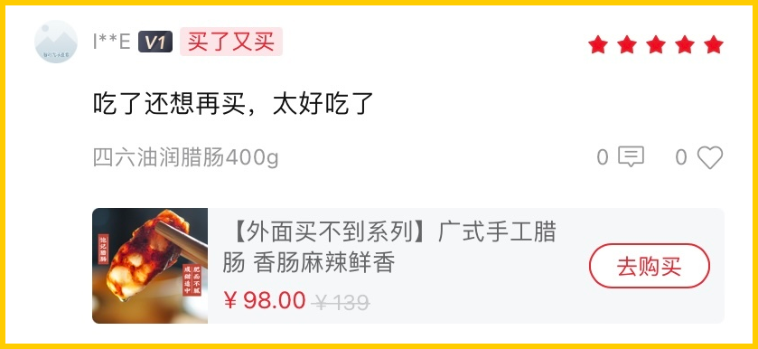

好吃，真材实料的那种好吃！要不是同事只知道埋头苦卷产品，根本不吆喝，哪能轮到本薯上蹿下跳。。。

这腊肠一共三种选择！口味一：手工广式腊肠，

有四六和二八这两个肥瘦比例可选。

口味二：滇式腊肠

用了不少贵价的辛香料，各种香味在唇齿间乱窜。亲测怕辣的人也能吃！

聪明如我，总结此肠优点四条，恰好对应上互联网家人们对腊肠的一些疑惑！

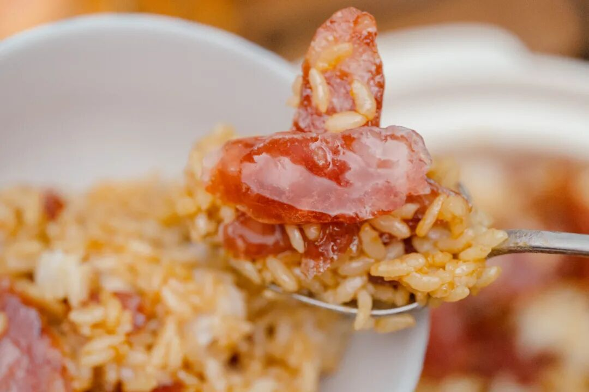

优点一：真材实料！纯黑猪肉+天然肠衣

风味暂且按下不表。就说这食材方面，我司一向没在怕的，都是真材实料！用的纯黑猪肉，产品同事说现在外面很多电商腊肠，都会加入部分大豆蛋白，和猪肉比起来简直成本可忽略不计。而这种添加甚至可以在配料表上并不体现。。。

除了猪肉，腊肠的肠衣也有讲究！饱记就是用中国人民几百年晒腊肠用的，猪肠衣。成本高，但是架不住口感好！嚼起来 Q 弹有韧劲，最后又会在口腔里化开。而便宜货可以用科技品：胶原蛋白肠衣。就是蒸完嚼不大烂可以整条脱下来吐出来的那种！

天然肠衣一眼就能看出来，比较薄和透
优点二：甜口的手工广式腊肠与咸辣的滇式腊肠，咸党甜党辣党都有得选！
两种手工广式腊肠是甜口的，

即大家更熟悉的广府糖酒风调味。

滇式腊肠则偏咸辣，肉香&麻香&辣香&酒香交织。

先说广式手工腊肠，这个调味的配方是我们独有的！经过了十几次调配。最后选定的这款，入口是那种天然的清甜感，余下柔软的酒香萦绕在鼻尖，嚼起来还有丰富汁水，
香啊～～～

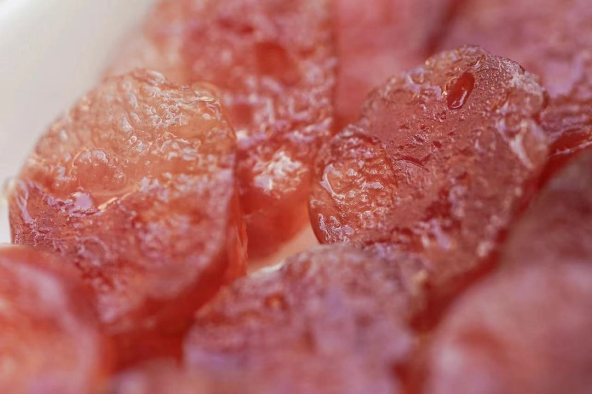

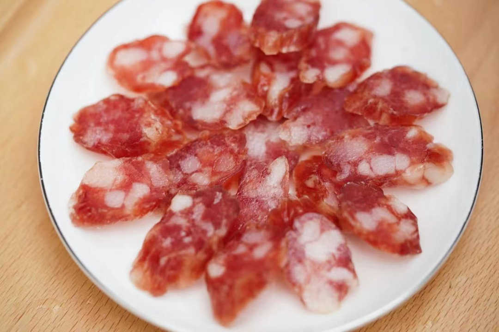

再说滇式腊肠，实打实放了很多香辛料，（都是精选的贵价好料辣椒、大红袍花椒、黑胡椒...丝丝缝缝都填满。本薯强推大家拿它下酒啊！

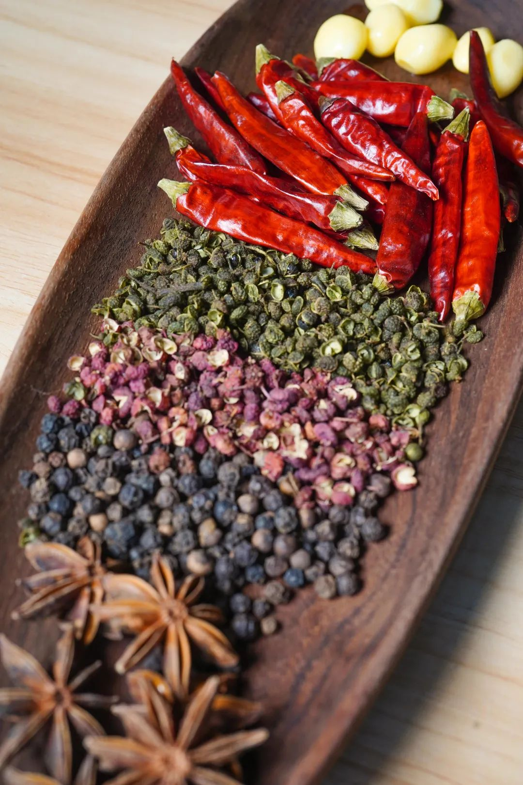

因为这腊肠一入口，非常有滋味！既有辣椒的香，胡椒的辛，还有花椒的麻。不同风味一层又一层涌来，带着隐隐的酒香，（是的，滇式腊肠也加了白酒，口味层次很丰富但又和谐得很！

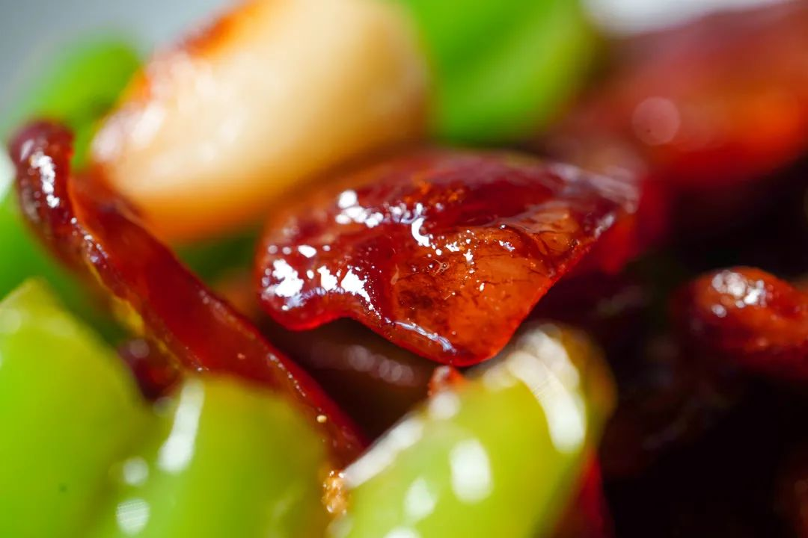

优点三：肥瘦由人！
选二八（二分肥八分瘦）或四六（四分肥六分瘦）皆好！

其实本薯试下来，

两款肠风味差异不大，

亲测都能蒸了直接吃！

大家按需选择就好了。

偏好肉香迷人就选二八，

更想要脂油清甜则选四六！

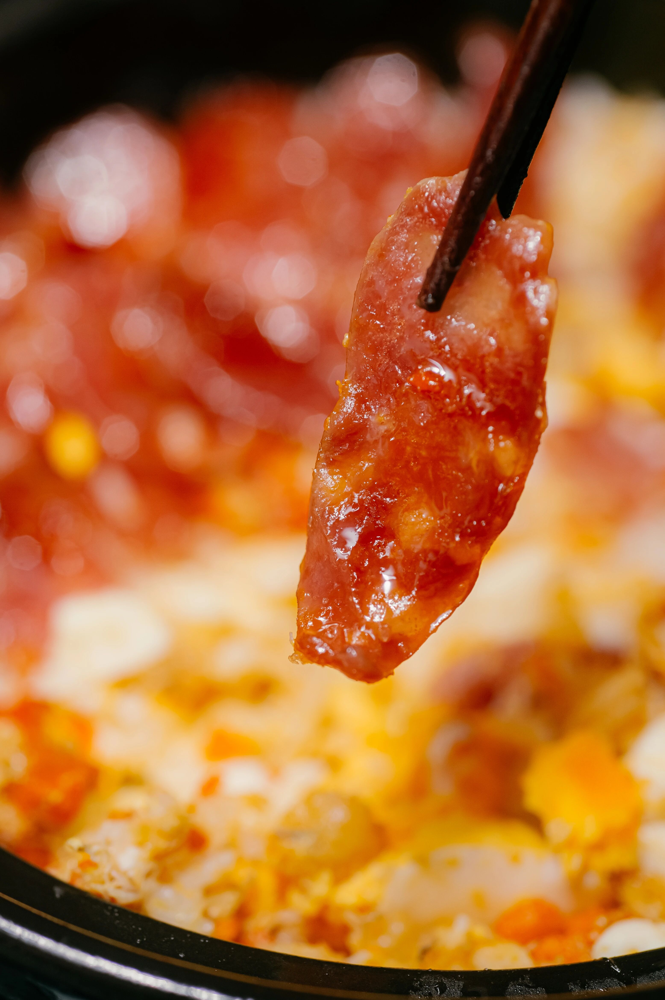

「二八酒香香肠」。

瘦肉多，

入口更爽脆，

直接煎了吃或者煲饭香绝👇

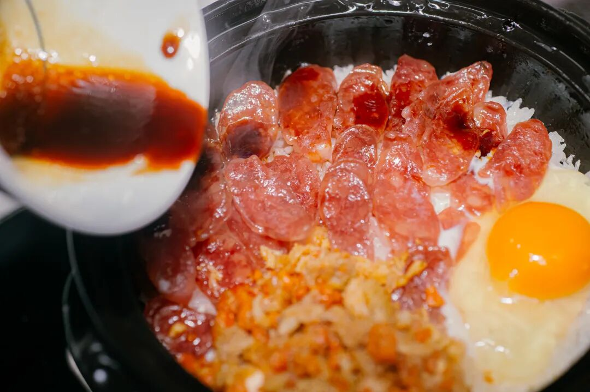

「四六油润香肠」，

稍肥润些，滋滋冒油，

直接煎也不柴，

炒各种蔬菜都契合！

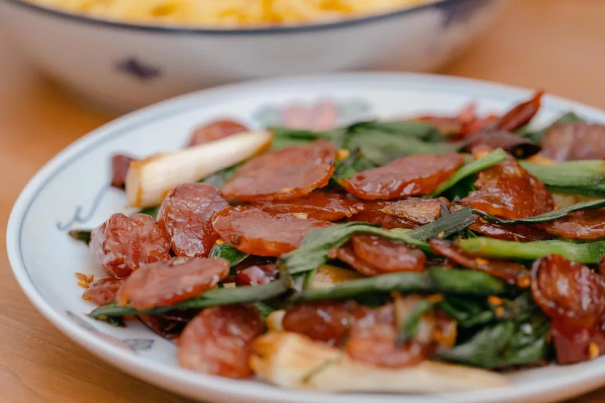

如我一般懒惰的干饭人看这里，三种肠煮饭的时候都可以随意放几根，就是一绝！

还有同事用滇式香肠来做西班牙海鲜饭，得到反馈，「香气直接升华！！！」
优点四：油而不腻，鲜且有嚼劲
三款肠中肥油最多的还是

「四六油润香肠」，

但因为我司食材卷飞起，

所以这油脂带着清甜的香气，瘦肉部分又鲜且有咬劲，
入口平衡得恰到好处。

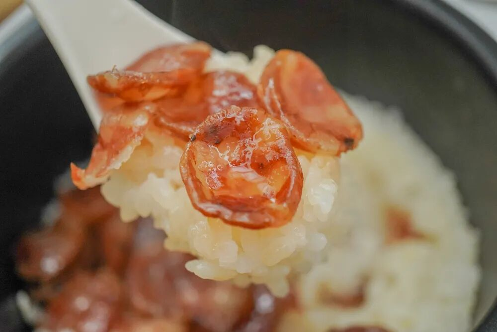

但不管哪个口味，

腊肠都有微微的咸味，

可以空口吃！但不太建议，

吃几块就会觉得渴了。

还是让腊肠作为厨房最强辅助，

可蒸，可焖，

也可以和青菜炒，

实在懒得摆弄，简单蒸熟，

用来下酒，都很适宜。

一样东西，能有千万种变化，全凭心意。

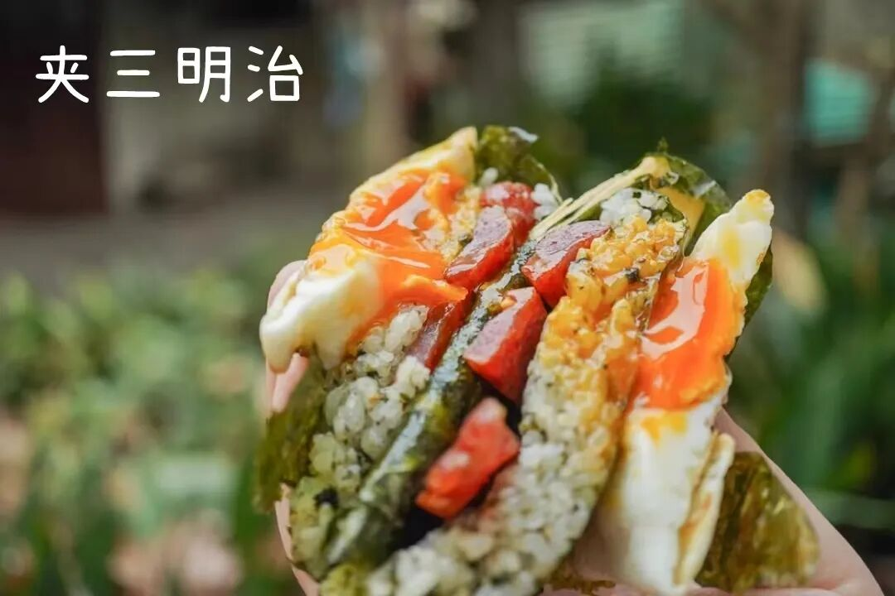

吆喝完毕！天冷犯懒，正适合囤一些肉肉肉肉肉！每一款都是满满一盒，
抱在手里沉甸甸。趁今年最后一波限时地板价！冲！

饱记·手工腊肠

购买方式如下👇

双十二限时全年地板价

戳图下单购买👇

或🍑🍑🍑搜索

「艾格吃饱了」

别急，还有！

这道腊排骨火锅，

是地道的云南丽江美食。

热气腾腾中带着肉的原香和烟熏味，

我愿将其与辣火锅、牛肉火锅

并为冬天的三大火锅

不到百元，教你在家复刻！

就是把腊排骨放锅里炖煮 1 个半小时，

直到炖煮到这样的浓汤。

加入韭黄番茄大葱玉米，

腊排骨的汤底就完成了！

其他和吃火锅一样，

想涮什么下什么，

菌类啦蔬菜啦都很好，

还能带来一点甜味。

最好再调一个蘸水！

云南风味的灵魂！

蒜泥+香菜+辣椒粉+腐乳+线椒，

最后淋上一点腊排骨的汁即可。

提醒一下，

排骨提前浸泡 3-4 个小时再下锅煮，

否则会太咸。总之，

不需要任何厨艺，

不到一百块钱，

你就能做出这样的冬日暖锅！

同样限时全年地板价！！！

冲！

饱记·腊排骨

购买方式如下👇

双十二限时全年地板价

戳图下单购买👇

或🍑🍑🍑搜索

「艾格吃饱了」

以上肉肉肉肉肉，
直接戳图片就能买！不怕麻烦的就点开🍑🍑🍑趁满 300-40，薯角我之前就算了 3 个购物车出来，腊肠、腊排骨和午餐肉约等于不要钱，

PS：这里说的不要钱，只是相对于原价来说，指的是天猫大促凑单满减折扣，真正拍下还是会显示支付金额的～
1. 「腊肠不要钱」购物车

简单明了的优等生作业在此👇

搭配清新松脆的青森苹果，

这个季节必吃的包邮区大闸蟹，

还有懒人囤货首选之午餐肉肉片，

搭配着买腊肠等于白送。

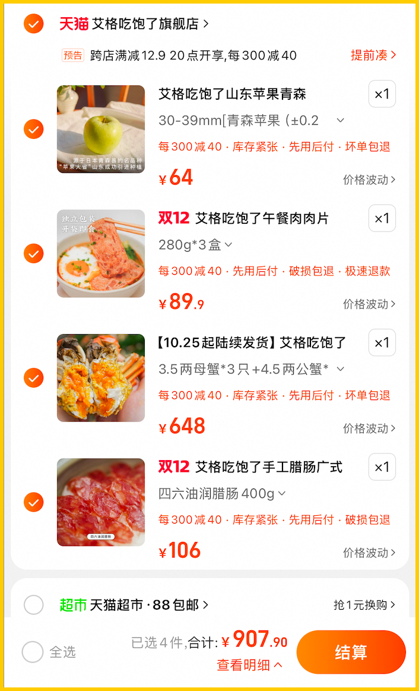

2. 「腊排骨不要钱」购物车

五款搭着买，

可以在家复刻丽江风味的

腊排骨等于白送👇

从午餐肉罐头到金桔酒、山核桃，

都是我司有口皆碑的人气王！

甚至还有冬天最美味水果（之一）的

象山红美人！

入口似果冻般嫩嫩滑滑～

吸溜着抿一下，

在暖气房、空调房里吃它的快乐谁懂？？

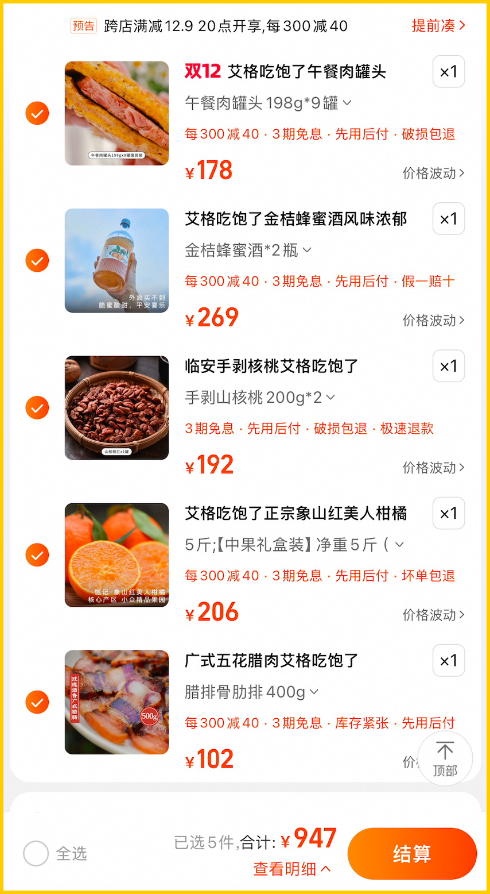

3. 「午餐肉罐头不要钱」购物车

针对连腊肠都觉得略麻烦的

高层次懒人们！

薯角我给出午餐肉罐头的建议！

红美人、山核桃再加手撕牛肉片以及

可以吃到真·凤梨果肉的大师凤梨酥！

都 0 厨艺要求！

直接省下午餐肉的钱，

也给你算好了👇

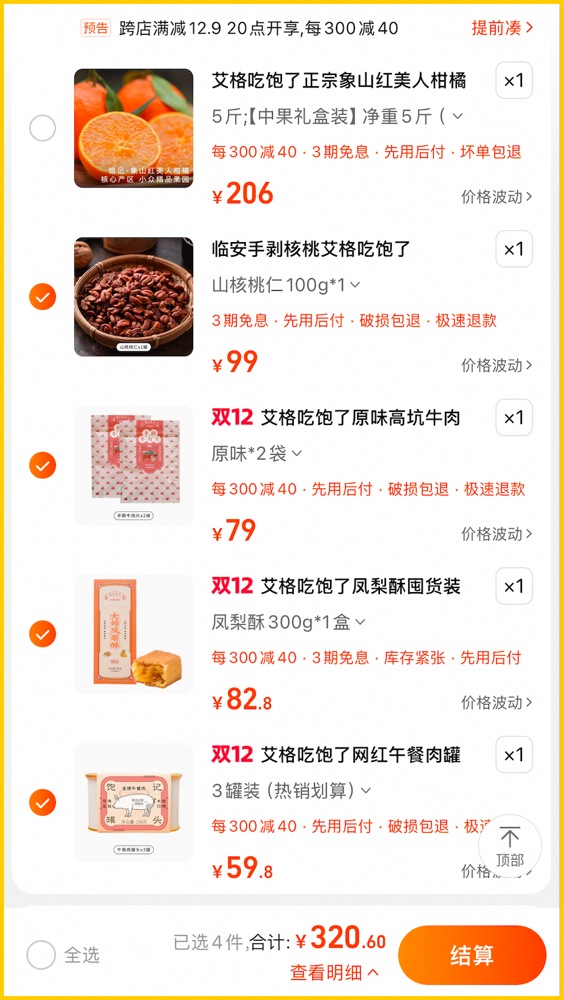

给你们指路完毕！

再说一次：

直戳小🍊序购买

或者去天🐱凑单都可以！

想在哪里买都行，

来人！把这公司搬空！！！

题 外

还有还有！

其他太值得一吃的时令风味看这里👇

不用凑单不用研究，

通通给到双十二全年地板价！

上周刚来的涌泉蜜桔，

米其林同款！但价格却帮大家打了下来！

真正的汁水如泉涌！空调房里吃正合适！

此外还有今年份的象山红美人，

入口似果冻般嫩嫩滑滑～

外面买不到的金山瓢鸡，

只剩一个规格！

这批卖完下次得等半年了！

苏南蟹标杆美味：太湖流域大闸蟹

苏北蟹宝藏性价比之选：洪泽湖大闸蟹

有小时候番茄味的云南西红柿（快没了，

还有打遍天下无敌手的山核桃！我司卷中卷产品，拿到外面去都能打得很！具体你们看商详，今年再薅老板一回！冲！

饱记·云南稀有品种瓢鸡

购买方式如下

双十二地板价 7 折！！

只剩它了！！！6 月龄母鸡净重 2 斤以上。
下单前请注意：此鸡蛋白质含量丰富，宰杀时已尽量放血，但少量余血开包时气味仍会比较大，请冲洗再食用！鸡皮不发粘，就绝非变质～～～

戳图下单购买👇

或🍑🍑🍑搜索「艾格吃饱了」

饱记·洪泽湖大闸蟹

购买方式如下

双十二限时 86 折！！！

满足装洪泽湖大闸蟹：

3 两母蟹，4 两公蟹。

性价比之选！

劲爽装洪泽湖大闸蟹：

3.5 两母蟹，4.5 两公蟹。

饱记热销款。

尊享装洪泽湖大闸蟹：

4 两母蟹，5 两公蟹；

或 5 两母蟹，6 两公蟹。

实际超重，量极极极少，送礼佳品。

人工精挑，

上岸后静养一两日更鲜美，

每日限量 100 箱。

顺丰快递发货，新鲜看得见。

戳图下单购买👇或🍑🍑🍑搜索「艾格吃饱了」

饱记·太湖流域大闸蟹

购买方式如下

双十二限时 86 折！！！

三种搭配：

满足装，

3-3.4 两母蟹，4-4.4 两公蟹，

吃过解馋。

劲爽装，

3.5-3.9 两母蟹，4.5-4.9 两公蟹，

可以拍照发朋友圈争奇斗艳。

尊享装，

4-4.4 两母蟹，5-5.4 两公蟹，

顶格水准，适合送礼。

人工精挑，

上岸后静养一两日更鲜美，

每日限量 50 箱。

拼的就是手速。

顺丰快递发货，

新鲜看得见。

戳图下单购买👇或🍑🍑🍑搜索「艾格吃饱了」

饱记·涌泉蜜桔购买方式如下

双十二限时 86 折！！！

戳图购买👇

饱记·象山红美人柑橘购买方式如下

双十二限时 86 折！！！

戳图购买👇

饱记·云南西红柿购买方式如下

双十二限时 86 折！！！

戳图购买👇

饱记·临安山核桃

购买方式如下👇

双十二单罐 9 折！！！

双罐 86 折！！！

戳图买它👇

或到🍑🍑🍑

搜索「艾格吃饱了」

本文的研究员

薯角多吃点，好过冬

用好吃的方式吃一生

祖国各地好风物

文章转载请加微信「baojiclub」

