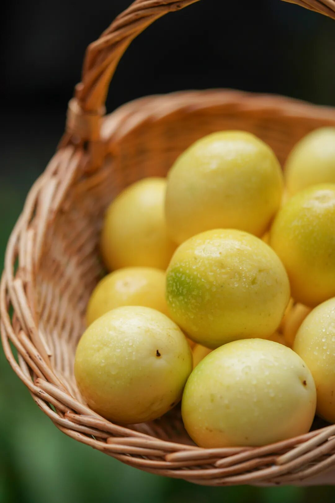
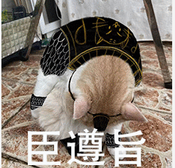
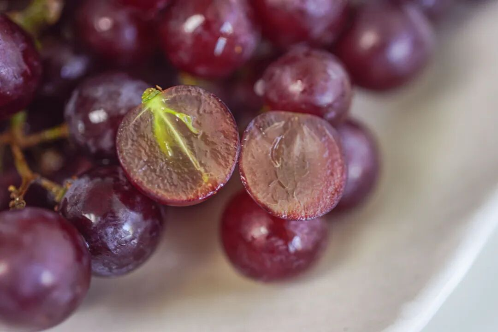
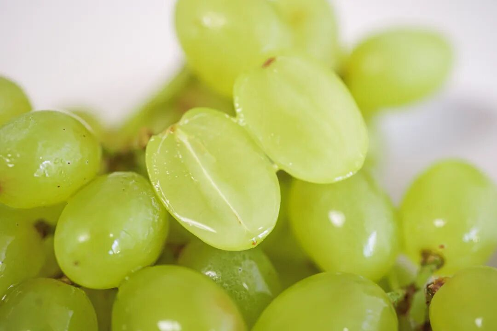

# 这么好吃，再远都给你运回来

- 原文链接: https://mp.weixin.qq.com/s?__biz=MjM5NTYxODQyMA==&mid=2653457840&idx=1&sn=11f96506fe8a4f36da56537e1f070ccd&chksm=bc3e8043fc3fa2855494a6c0a5532934a3ba330e60127ab73f697f0bc1ebf17155a2a95c8fcf&scene=27#wechat_redirect
- 浏览量: N/A
- 点赞数: N/A
- 评论数: N/A
- 转发数: N/A

## 正文

夏日香甜小炸弹

一个尽情安利自我的公众号

以下是没事干研究院的风物研究报告请放心食用

只要东西好吃，

山高水远都得去吃。

这——便是饱记精神！

今天说的便是这一枚，

香味可绕梁三日的

——饱记·黄金百香果！

不同于市面上的普通品种，

我司卷的是正儿八经的钦蜜 9 号，据说是农科院研制品种，还是海南核心产区。

钦蜜 9 号声名在外

常有假货。

当地种植大哥说：

有的人会拿小黄金、大黄金来冒充。

便宜，但就适合饮品店怼糖浆，纯吃不行，口感一般。

饱记这个品种正宗，而且还是海南的陵水县种植，北纬 18 度，超适合热带水果种植。树上熟采摘，另外还要经过饱记两轮筛选，这样果肉饱满，假熟的基本上都被剔掉了。（假熟，就是你买来果肉干瘪的那种                  ——by 果园合作伙伴

甜，超甜，

可以直接挖着吃，

不涩不酸。

在糖度和香气上，

和市面上的紫皮、黄皮，

都随便比。

以前就上过架，不少读者还想继续买，这不就又可以吃了！
（下班后别走！！

买吧，顺丰，海南原产地直发，老规矩早鸟 86 折！那么远都给你运回来，咱们和从前等着贡品的王公贵族，又有什么区别？

饱记·海南黄金百香果购买方式如下限时早鸟 86 折！！
正宗钦蜜 9 号，来自海南热带水果原产地
不同于紫皮品种，吃的就是这口甜。
戳图买它👇

吃完百香果，

还有非常懂事的

新疆三色葡萄！

三种葡萄拼成一箱，

从酸甜慢慢过渡到纯甜，

没有籽，嘎嘣脆还会爆汁！

来自新疆吐鲁番，

都是露天葡萄，

打从一出生就沐浴在阳光中，

再加上得天独厚的昼夜温差，

包甜！

（只是分享新疆风光！不是吐鲁番！

小红——玻璃翠，

果如其名，

外皮又薄又脆，

如玛瑙一般圆润通透。

咬开是噗呲噗呲的口感，

难得的是水分还超级足👇

小紫——无核紫，

外皮挂着一层果霜，

又被称为自然里的紫宝石👇

果粒呈椭圆形，

皮薄肉厚，口感偏软嫩～

糖度比玻璃翠高一些，

通常在 20 左右，

以下为我司摄影师实测👇

压轴登场的是小青——无核白，

迷你绿色小珍珠，

入口爽脆。

本薯亲测以后，

强烈建议三色里最先吃它！

甜中带一点酸，

不涩不腻～

我：老板，新疆这么远，

这果子必须大卖啊！

老板：好了知道了，

最多 9 折。

要不说我们心有灵犀呢！！

能薅的都给大家薅了，

限时的折扣，

快冲！！

饱记·新疆三色葡萄
购买方式如下
限时 9 折！！！

来自新疆吐鲁番的甜，
三种葡萄，三重风味，一次拼配。玻璃翠·无核紫·无核白。
不吐皮不吐籽，嘎嘣脆还爆汁！

甜度从低到高，自酸甜过渡到纯甜，完整体验不同酸甜配比惊喜。

戳图下单购买👇或到🍑🍑🍑搜索「艾格吃饱了」

题 外 一

还有一些好折扣，

薯角我一并呈上！

外面买不到的奶黄月饼，

半岛嘉某楼奶黄月饼的创始配方，

邀请米其林大厨调整减糖，

趁还在预售，早鸟 86 折！！

卷了三年的云腿酥，

嚼得出宣威火腿的鲜甜，

限时 9 折！！！

还以及配料无比干净，
中药房看了也没毛病的免煮酸梅汤，趁还高温，直播价最后一天！

饱记·奶黄月饼礼盒
预售中！！！限时早鸟 86 折！！
饱记独家配方，外面买不到！
🥮 新鲜手作，外皮酥脆，内里奶香浓郁～
每日限量 100 份。预计八月底按下单顺序发货～
戳图买它👇

饱记·滇式云腿小酥
现货！！！限时 9 折！！
传统滇味经典，新鲜手作，浓情四溢。
🥮四个口味：经典云腿、蛋黄云腿，黑松露云腿、白松露云腿。
🥮三种规格：云腿酥礼盒全家福（四个口味各 2 枚）云腿酥礼盒双拼（经典云腿小酥*4 枚+蛋黄云腿小酥*4 枚）
云腿酥礼盒囤货装
（经典云腿小酥*30 枚）
戳图买它👇或到🍑🍑🍑搜索「艾格吃饱了」

饱记·免煮酸梅汤

限时三天直播价

购买方式如下

乌梅、橘皮、山楂、薄荷，

玫瑰茄（洛神花）、甘草、桂花，

只佐以冰糖中和酸味，

配方干净用料足。

三角茶包设计，

免煮冲饮！

热泡回甘足，冷饮透齿凉！

戳图买它👇

或🍑🍑🍑搜索

「艾格吃饱了」

题 外 二

有时真为一些食物不平，
这么好吃怎么无人问津？？两个口味的招牌梅饼，
天然酸甜的黄桃干与空心山楂球，
越啃越香脆的圆墩墩玉米浪，还有扎扎实实的午餐肉片～以及招牌南乳香葱蛋卷等，含泪临期清仓，都是实打实的折扣！！无需凑满减！⚠️PS：清仓产品临近效期，介意慎拍～

饱记·临期清仓专区
5 折起！

清仓产品临近效期，所以巨折，但自家吃吃没问题！介意慎拍～
「临期清仓」专区，5 折起！！清仓产品临近效期，介意慎拍哦～戳图买它们！！👇

本文的研究员

薯角吃完人生和百香果一样甜

用好吃的方式吃一生

祖国各地好风物

文章转载请加微信「baojiclub」

