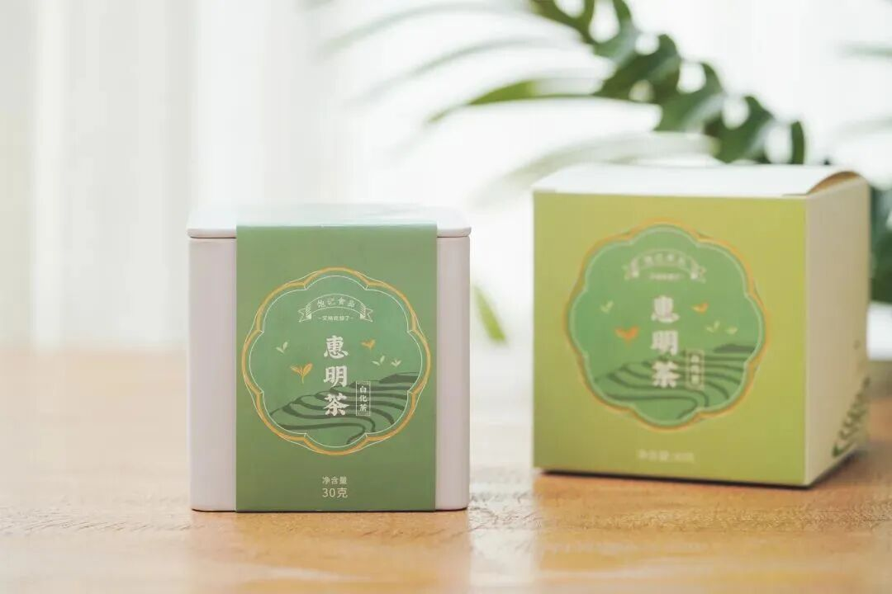
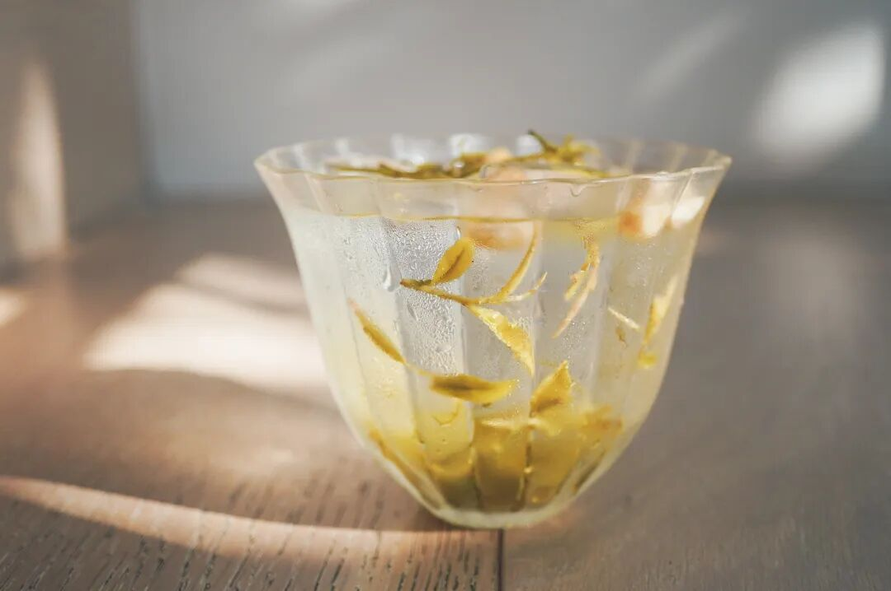
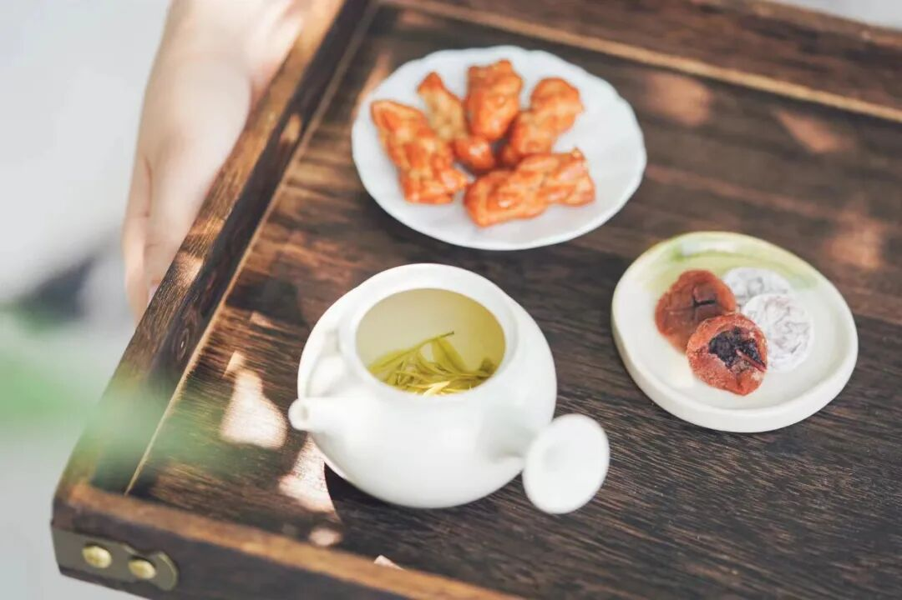
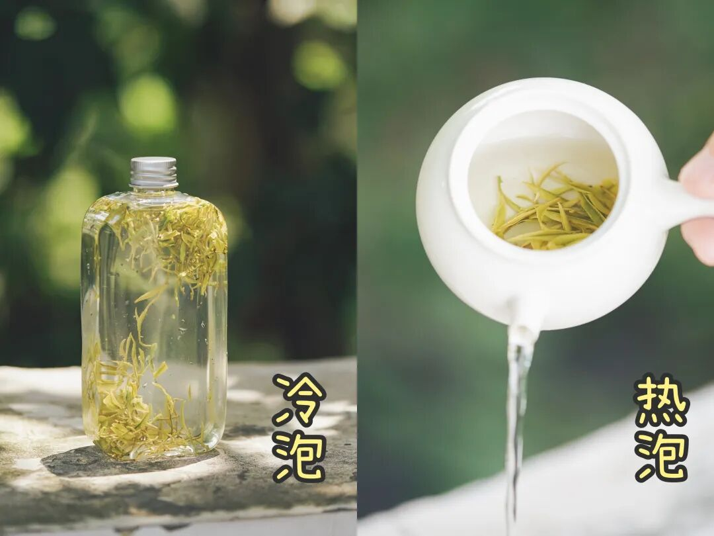
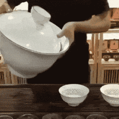
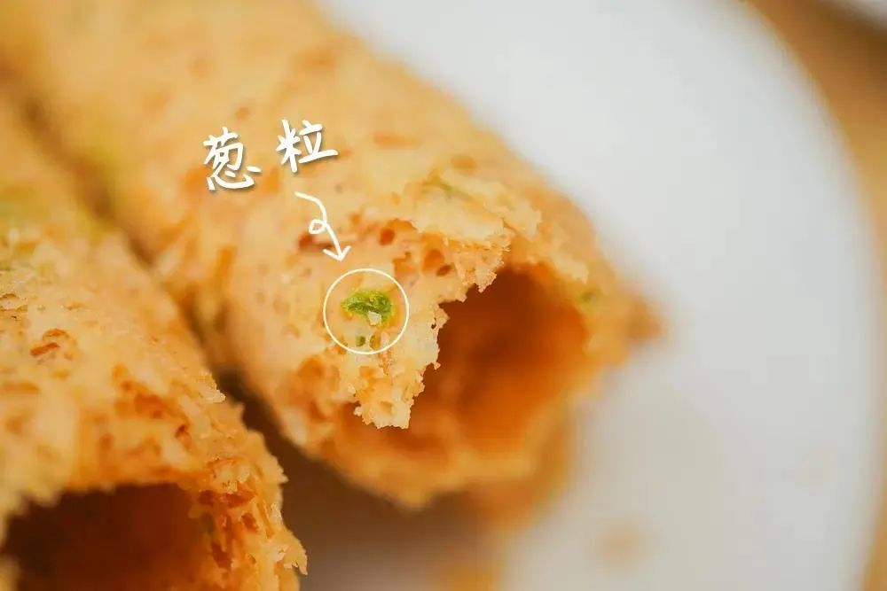
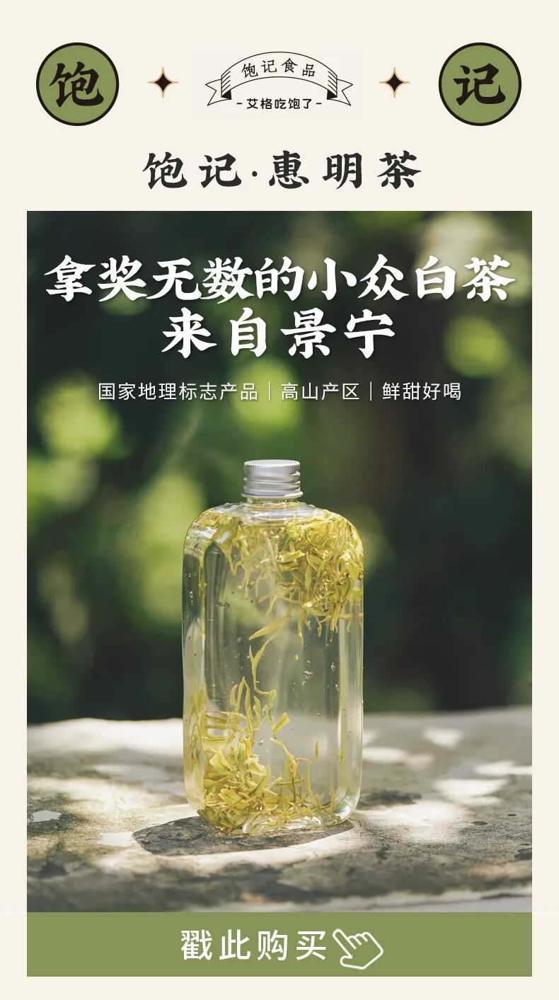

# 这么甜，却要消失。。。。

- 原文链接: https://mp.weixin.qq.com/s?__biz=MjM5NTYxODQyMA==&mid=2653459780&idx=1&sn=91f0984731d4908cc3f1cec551e220e2&chksm=bc4f78f527fef8649e3d6be88ee7f5e2b7151a180b971a089f2c024155cfa22fb0eeaad10a89&scene=27#wechat_redirect
- 浏览量: N/A
- 点赞数: N/A
- 评论数: N/A
- 转发数: N/A

## 正文

好茶呀

一个尽情安利自我的公众号

以下是没事干研究院的风物研究报告请放心食用

今天清货一个茶，

是老板表示喝遍各产区，

最喜欢的绿茶之一！是的她说比她杭州龙井

清甜，还平价得多～

但又有什么用，不照样两年没卖掉，

现在开始一次性清货哈哈哈哈哈

饱记惠明茶，

是老板参加外地合作社进上海活动时

喝到的。

非常小众，其实是白茶，

浙江丽水景宁畲族高山生态茶园，历史可上溯唐朝，后来在巴拿马万国博览会跟茅台同一年，拿下了一等奖！

就连年轻的丽水朋友，也说没怎么听过。因为产区交通不便，所以好像一直没能出圈。

这茶特点，就是 super 清甜！有淡淡兰花和水果香，关键是好甘甜呐，感觉像清泉哗哗流过喉咙。夏季冷泡甜，现在入秋热泡了，还是甜。

饱记这款茶还来自非遗传承人，品质靠得住。

好喝又悠长。且价格划算，平时提得太少，生产日期 23 年 7 月 23 日，保质期 25 年 1 月 23 日，清货，一口价限时 7 折！性价比高得很！囤起来当口粮茶正正好啊！

还有南乳蛋卷，给你一起配茶吃，
搭着买省心又省钱！

市面上其他地方没有这款，是饱记原创配方，

好吃的秘诀无它，

就是舍得下料，手工制作！

新鲜鸡蛋含量高达 27 %，入口化沙。

喝着热茶配一口酥脆蛋卷，啧啧这小日子。好了，不多说，剩下的你们自己看看商详，买吧！

饱记·惠明茶购买方式如下限时 7 折！！！
戳图买它👇

题 外

前阵子问山核桃的朋友何在？

它已经来了！

一期一会，都是今年刚炒的新货，

现在还是预售，

这两天就可以开始发货

即将没了的限时早鸟价，

单罐 9 折！两罐 8 折！

还有 9 月新鲜到仓的大师凤梨酥，

果肉含量大于40%，

一入口就能吃到浓浓的凤梨本味。

还有一些值得买的时令早秋风物，

生怕大家错过，

整了一个专区，

从东海野生黄鱼到秋月梨，

限时 8 折起！

速冲！

饱记·临安山核桃

购买方式如下👇

限时早鸟单罐 9 折

两罐 8 折！！！

戳图买它👇

饱记·大师凤梨酥
购买方式如下👇新鲜到货！！
戳图买它👇

饱记·早秋时令风物
购买方式如下👇限时 8 折起！！
戳图买它👇
或🍑🍑🍑搜索
「艾格吃饱了」

本文的研究员

薯角大人请用茶

用好吃的方式吃一生

祖国各地好风物

文章转载请加微信「baojiclub」

