# 这么说吧，能找到更好吃的算我输

- 原文链接: https://mp.weixin.qq.com/s?__biz=MjM5NTYxODQyMA==&mid=2653463639&idx=1&sn=d61426480f749d9cf8aba07dcfd07141&chksm=bccdfc91d3b21e68fd6a5de75eb658faba1067c47f8ae90de9d15bfa099bdc4a8c3b49cc8957&scene=27#wechat_redirect
- 浏览量: N/A
- 点赞数: N/A
- 评论数: N/A
- 转发数: N/A

## 正文

神奇风味

一个尽情安利自我的公众号

以下是没事干研究院的风物研究报告请放心食用
如题。说的正是我司打遍天下都不怕的饱记·临安山核桃！不知不觉卷到第十一年，是真不想赘述背景啊工艺啊，
反正懂的都懂～

今天再吆喝一次，主要为提醒大家冲双十二折扣！（嘿嘿抓住每一次薅我老板羊毛的机会这山核桃真材实料成本高，平日里折扣不多，这次已经是全年地板价，不管怎么算，现在买就是最划算！

在我司这种卷到飞起的环境里，它能长期当顶流也是有原因的！
首先香得不得了。本薯入冬尤其喜欢拿它配茶，又脆又酥，还有坚果本身那种油脂和回甘！配一壶红茶或者乌龙都美得不行～

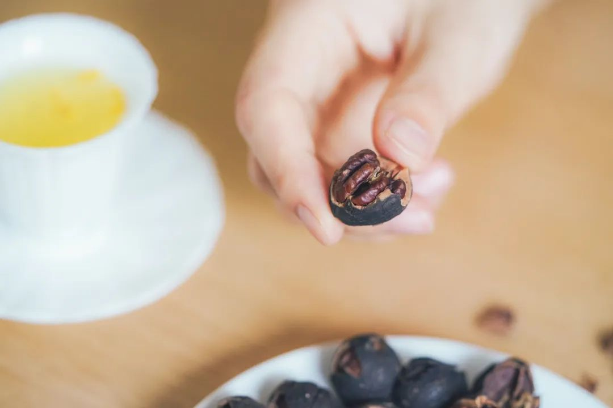

不仅是我为了写稿子买了二三十种市面货觉得没有饱记的好吃，浙江农林大山核桃系的老师有一年开全国专家会时也盲买市面上二三十种全部撕掉标签盲测，还是这司的第一。

观察了一下大家购买时的问题，主要有三！本薯今天就来一一解答。别让大家的疑惑阻挡了薅老板羊毛的脚步。

问题一：是今年秋天下来的新货吗？

当然！这山核桃是十一年前老板自己都还在打工时，

就找到浙江农林大山核桃系科班开发的。

我们商定用临安山核桃品种。从小吃到大的杭州人（比如我老板）都只认临安产的。

农林大校址就在临安。

直径、克重和日晒时间都有山核桃系本系的专业要求，浙江农林大信誉保证！

为了让每位客人都尝到最好口感，产品经理严格把每个批次生产日期，控制在最新鲜的 45 天内！每次都是小批量上货。

问题二：好吃吗？会涩吗？会咸吗？
市场上一些山核桃普遍靠糖撑重量。我司主张调味轻！减糖！这样做损耗增加、成本上升。因为必须山核桃本身风味超级足，原料好味道香，才能经得住这种调味。如果掺一点陈货或者外区的原料进去，立即就藏不住了！

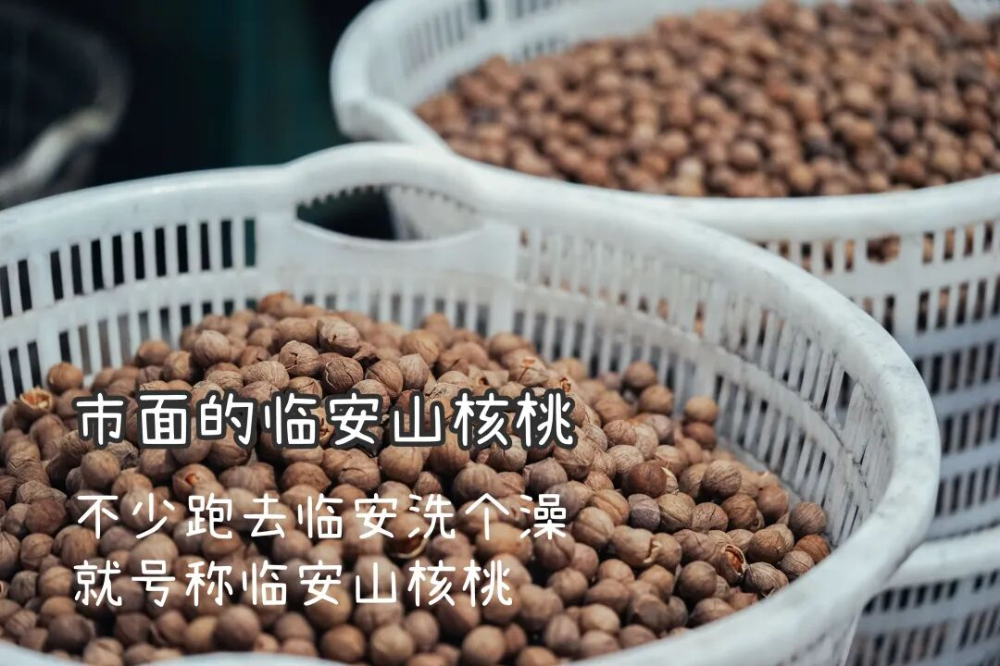

盐添加很少，糖也添加很少，爸妈吃了都要说好！问了一下老板才知道，
这山核桃早在十一年前产品开发阶段，就已经开始要求轻调味。多轻呢？每 100 斤只给放 1.5 斤糖，因为健康。

调味轻了，糖少了，核桃仁容易碎。而带壳的呢，需要把原料日晒到比同行更多的时间，减少水分，「浓缩」风味。这样才架得住轻调味。于是，本来就挺贵的核心产区山核桃原料，首先重量上就比同行产生近多 1/3 的损耗。

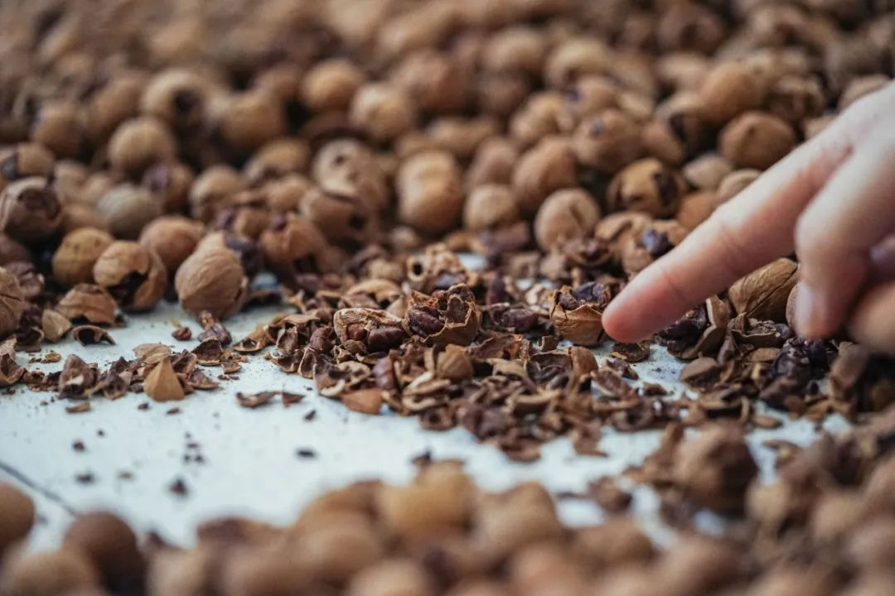

为此，农林大在和我们合作中花了好几年来改进机器的效率。

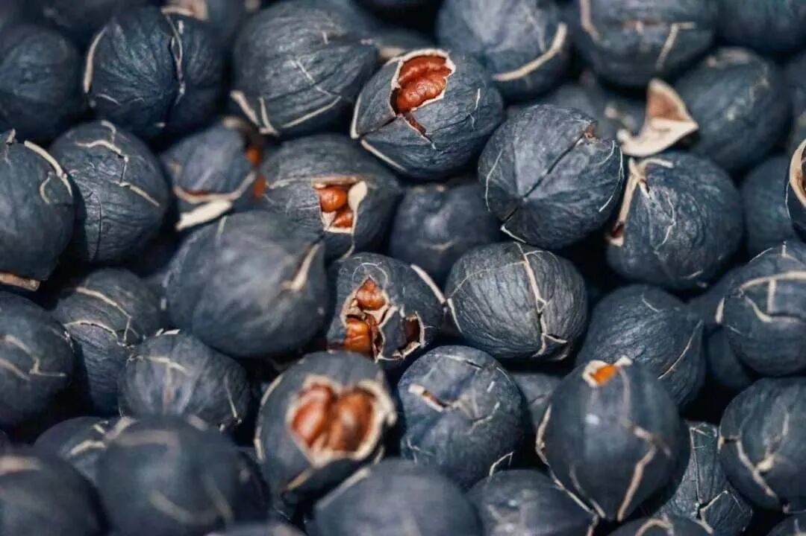

总之，这样讲究着炒出来的山核桃，果仁吃起来才是焦香松脆，饱满油润，无陈味薅味。

我同事安利我，最嚣张的吃法是蘸泡芙里吃，果真又奶又香，好吃极了！

有厨艺的朋友们，也可以把它往曲奇上加，或者撒一点到冬日热饮上增加风味。

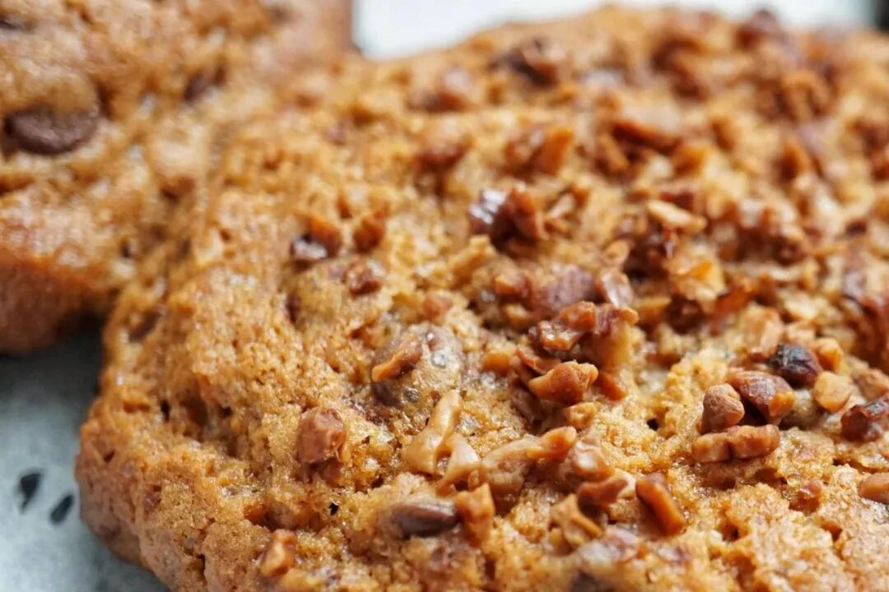

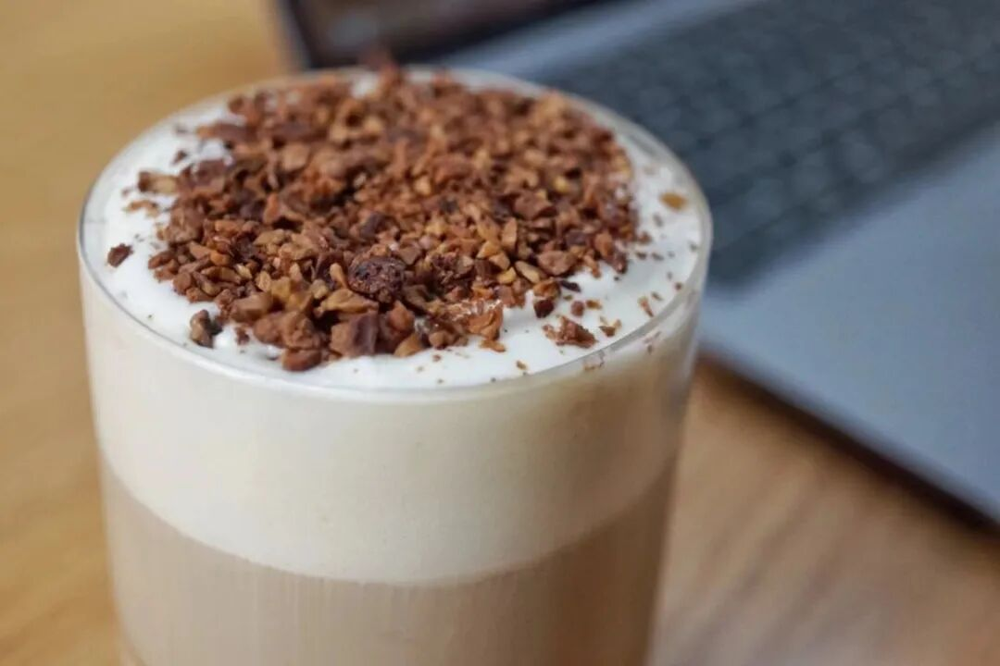

问题三：好剥开吗？

贴心如产品同事，

给到两种选择！

可以买手剥版一颗一颗剥着吃，

又原始又清香！

当然也可以直接上懒人版，

简单省事的山核桃仁，

一把一把往嘴里丢！

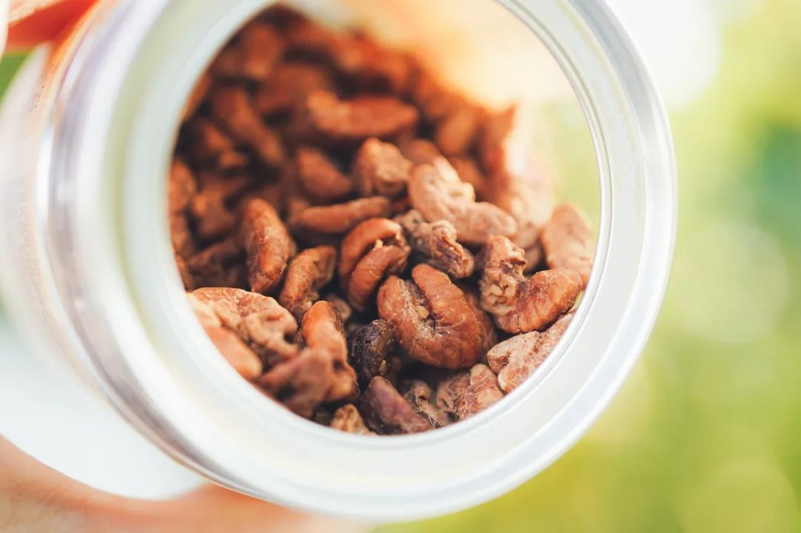

以往剥坚果，真的不容易，有开果器也是个技术活。

但我饱记山核桃，就特好剥。手指尖拨一下就能卸下外壳～

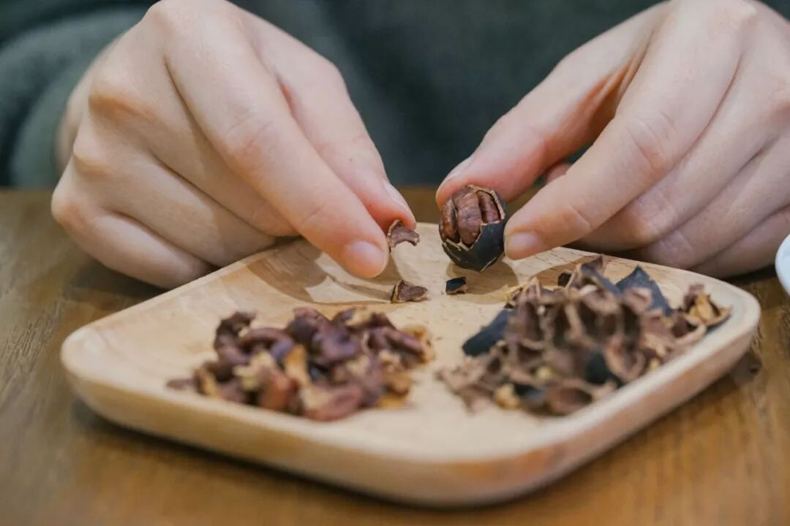

当然了，如果有人会剥好给你吃，也行

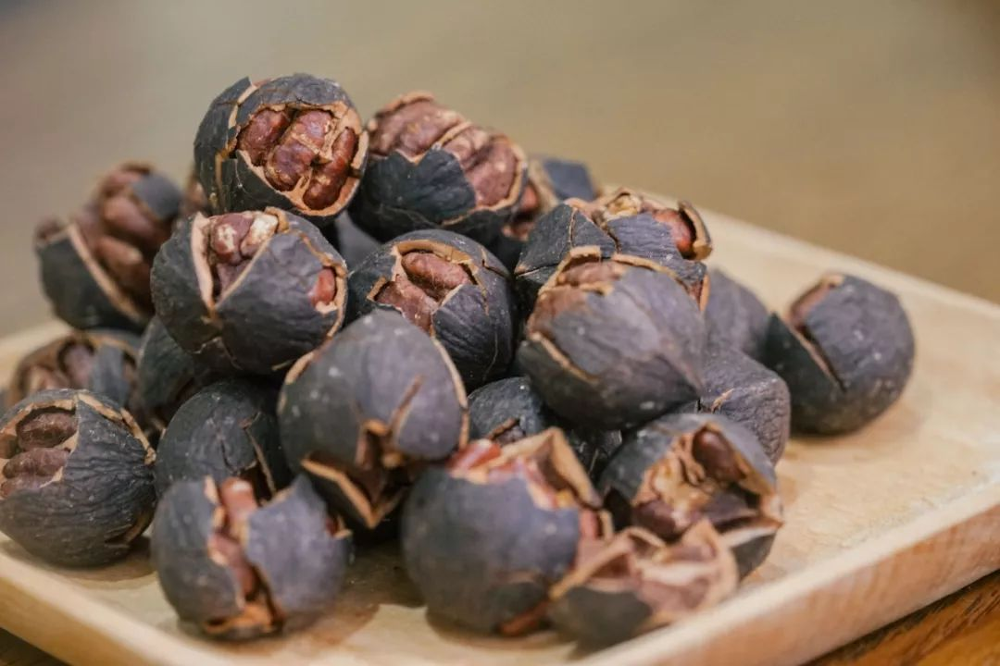

好了，趁此机会囤起来！总之：

天🐱：满 300-40，

小🍊序：直接全年地板价！

现在买就是最划算！

饱记·临安山核桃

购买方式如下👇

双十二单罐 9 折！！！

双罐 86 折！！！

戳图买它👇

或到🍑🍑🍑

搜索「艾格吃饱了」

关于天🐱满减如何凑，本薯算了两个「山核桃不要钱」购物车！给大家打个样，只要价格差不多都可以凑～

PS：这里说的不要钱，只是相对于原价来说，指的是天猫大促凑单满减折扣，真正拍下还是会显示支付金额的～
1. 「山核桃单罐不要钱」购物车

👇可用来作为冬日待客暖茶的

柚子小种红茶与桂花乌龙，

再加一份这个时令必吃的包邮区大闸蟹，

搭配着买单罐山核桃等于白送。

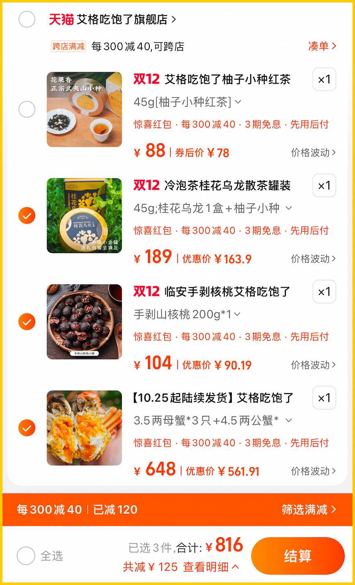

2. 「山核桃双罐不要钱」购物车

这个购物车算下来，

约等于两罐山核桃不要钱！

搭配大闸蟹与桂花乌龙，

甚至还有冬天最美味水果（之一）的

象山红美人！

入口似果冻般嫩嫩滑滑～

吸溜着抿一下，

在暖气房、空调房里吃它的快乐谁懂？？

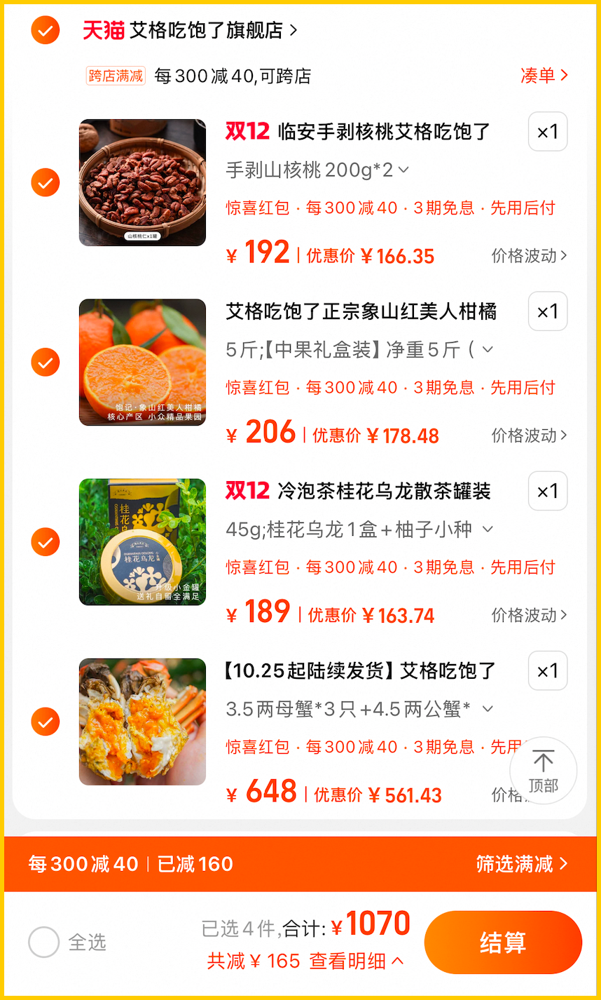

指路完毕！再说一次：

直戳小🍊序购买

或者去天🐱凑单都可以！

今年最后一次薅老板羊毛！

别让她毫发无伤啊啊啊啊！！

题 外

还有还有！

其他值得一吃的时令风味看这里👇

不用凑单不用研究，

通通给到双十二全年地板价！

上周刚来的涌泉蜜桔，

米其林同款！但价格却帮大家打了下来！

真正的汁水如泉涌！空调房里吃正合适！

此外还有今年份的象山红美人，

入口似果冻般嫩嫩滑滑～

外面买不到的金山瓢鸡，

只剩一个规格！

这批卖完下次得等半年了！

坚持真材实料、天然肠衣的手工腊肠，
能做煲仔饭和火锅的玫瑰露酒腊肉&腊排骨

苏南蟹标杆美味：太湖流域大闸蟹

苏北蟹宝藏性价比之选：洪泽湖大闸蟹

有小时候番茄味的云南西红柿（快没了，

我司卷中卷产品，
拿到外面去都能打得很！具体你们看商详，今年再薅老板最后一回！冲！

饱记·云南稀有品种瓢鸡

购买方式如下

双十二地板价 7 折！！

只剩它了！！！6 月龄母鸡净重 2 斤以上。
下单前请注意：此鸡蛋白质含量丰富，宰杀时已尽量放血，但少量余血开包时气味仍会比较大，请冲洗再食用！鸡皮不发粘，就绝非变质～～～

戳图下单购买👇

或🍑🍑🍑搜索「艾格吃饱了」

饱记·手工腊肠

购买方式如下👇

双十二限时全年地板价

戳图下单购买👇

或🍑🍑🍑搜索

「艾格吃饱了」

饱记·腊排骨

购买方式如下👇

双十二限时全年地板价

戳图下单购买👇

或🍑🍑🍑搜索

「艾格吃饱了」

饱记·洪泽湖大闸蟹

购买方式如下

双十二限时 86 折！！！

满足装洪泽湖大闸蟹：

3 两母蟹，4 两公蟹。

性价比之选！

劲爽装洪泽湖大闸蟹：

3.5 两母蟹，4.5 两公蟹。

饱记热销款。

尊享装洪泽湖大闸蟹：

4 两母蟹，5 两公蟹；

或 5 两母蟹，6 两公蟹。

实际超重，量极极极少，送礼佳品。

人工精挑，

上岸后静养一两日更鲜美，

每日限量 100 箱。

顺丰快递发货，新鲜看得见。

戳图下单购买👇或🍑🍑🍑搜索「艾格吃饱了」

饱记·太湖流域大闸蟹

购买方式如下

双十二限时 86 折！！！

三种搭配：

满足装，

3-3.4 两母蟹，4-4.4 两公蟹，

吃过解馋。

劲爽装，

3.5-3.9 两母蟹，4.5-4.9 两公蟹，

可以拍照发朋友圈争奇斗艳。

尊享装，

4-4.4 两母蟹，5-5.4 两公蟹，

顶格水准，适合送礼。

人工精挑，

上岸后静养一两日更鲜美，

每日限量 50 箱。

拼的就是手速。

顺丰快递发货，

新鲜看得见。

戳图下单购买👇或🍑🍑🍑搜索「艾格吃饱了」

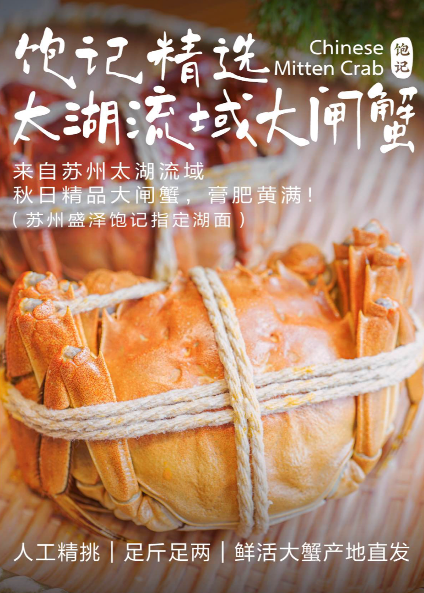

饱记·涌泉蜜桔购买方式如下

双十二限时 86 折！！！

戳图购买👇

饱记·象山红美人柑橘购买方式如下

双十二限时 86 折！！！

戳图购买👇

饱记·云南西红柿购买方式如下

双十二限时 86 折！！！

戳图购买👇

本文的研究员

薯角多吃点，好过冬

用好吃的方式吃一生

祖国各地好风物

文章转载请加微信「baojiclub」

