# 这次是真的瘦了。。。

- 原文链接: https://mp.weixin.qq.com/s?__biz=MjM5NTYxODQyMA==&mid=2653459536&idx=1&sn=fb41283acc8a49d711da198145fb09c6&chksm=bccc44b0e89dcd2e63fc49e14f599648e2d967f25f333b0fb062ba75e7d370a2c8fb5b163cbe&scene=27#wechat_redirect
- 浏览量: N/A
- 点赞数: N/A
- 评论数: N/A
- 转发数: N/A

## 正文

想吃！非常想吃！

一个尽情安利自我的公众号

以下是没事干研究院的风物研究报告请放心食用

要不是来了这司，

薯角我都不知道，

这年头地里已经卷成这样了。。。

从土壤卷到品种，从种植再卷到风味，要香要甜要软糯，

最好还健康不怕胖！

没想到吧，以上这些点，我司都做到了

今天给大家介绍的新朋友长这样👇

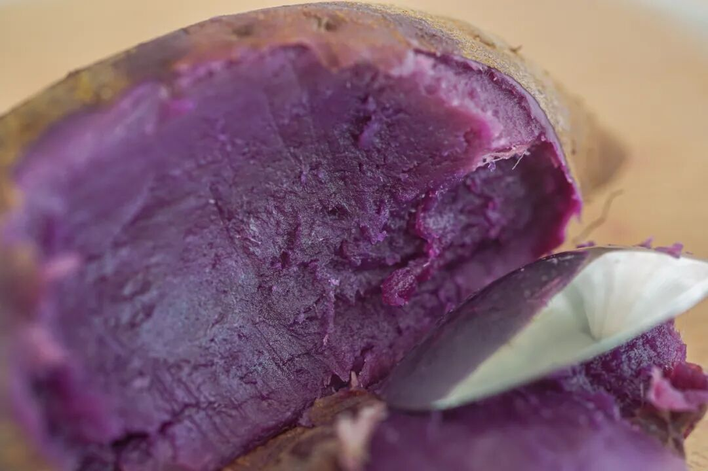

来自云南建水！在沙土地里长大，海拔高、日晒充足，所以种出来的紫薯又甜又香！

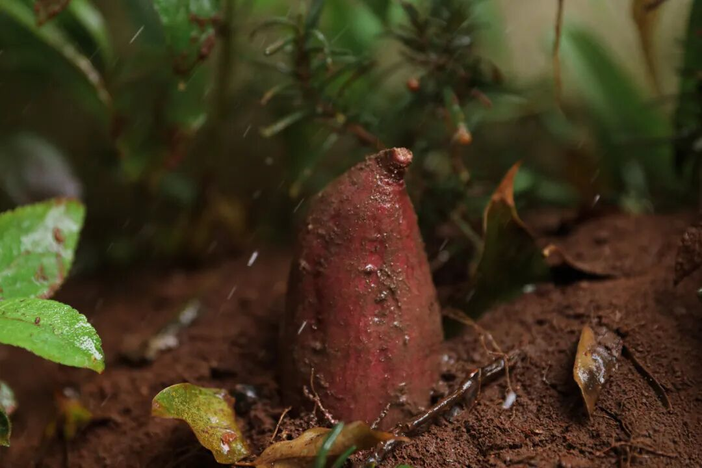

看！新鲜得很！

从地里挖出来，

直接顺丰运到餐桌上，

还挂着点泥土。

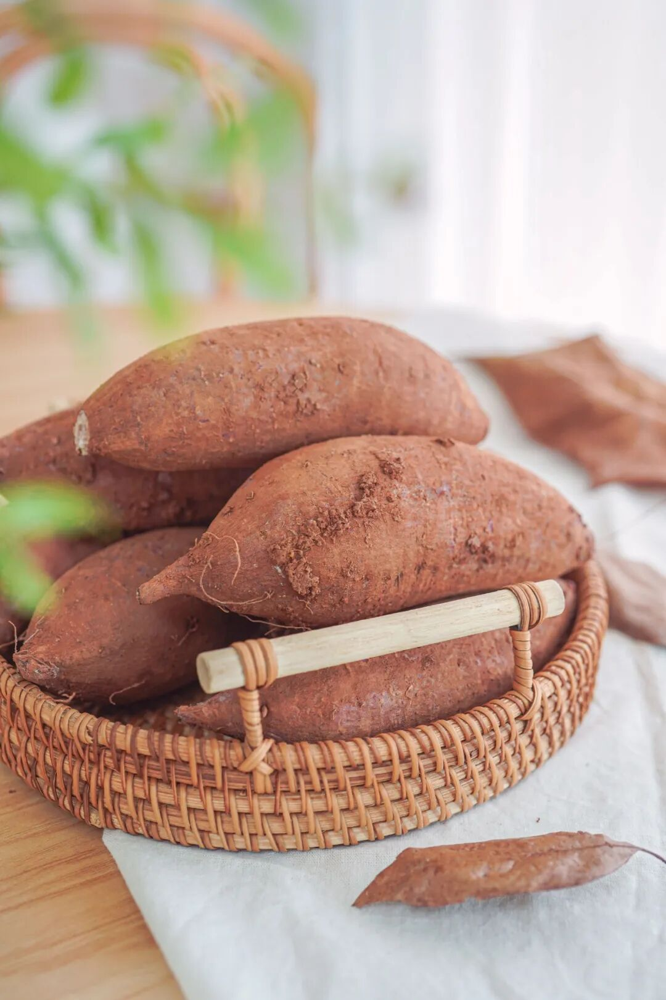

听当地农户说，

这紫薯的生长周期长得很，

还只能使用农家肥，

满足这些条件，

味道才会更好！

直接烤或者拿水煮就好吃，建议煮久煮透一些更好吃！比如中大果最好煮个 45 分钟以上，但你绝对不会后悔！

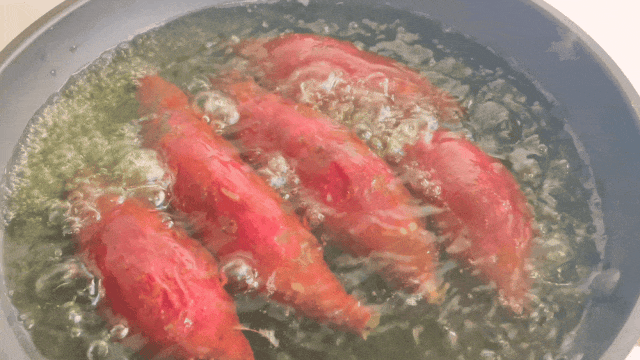

又粉又糯，

带一点微微的红枣香气，

当主食吃也毫无负担～

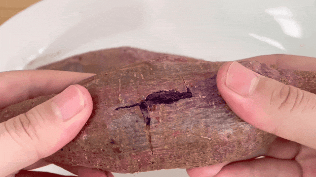

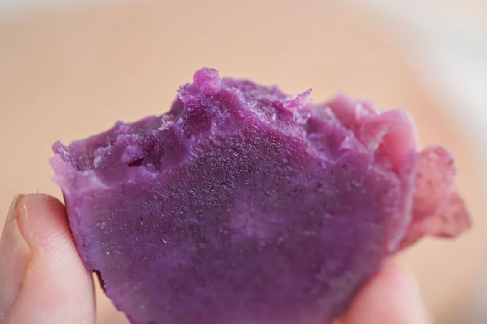

入口甜得很，

糖度能达到 28！

紫薯天然的甘甜，

所以甜而不腻。

不怕麻烦的，还可以把它塞进烤箱，（同样建议烤久一点！烤到这种外皮韧弹内里软糯的程度，降温的早上吃一个，
又暖又治愈～

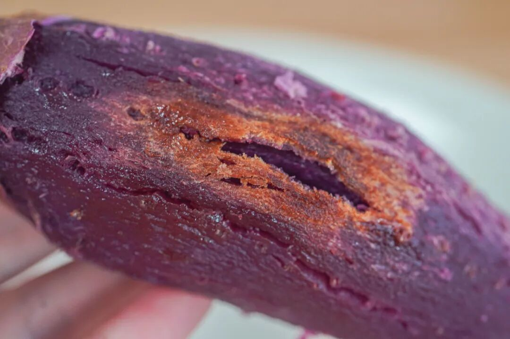

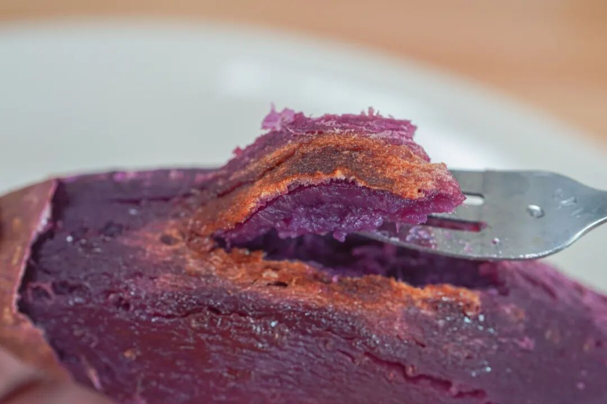

老规矩，限时三天早鸟 86 折！这么好吃，偏偏还这么健康！这个秋天的早餐就是你了！

饱记·云南沙地紫薯

购买方式如下限时三天早鸟 86 折！！！
戳图买它！！👇

健康之选其二，

是我们的老朋友

——吉田鎏金红薯，

因为农户种了更多地，

有了更多产量，丰收！

所以它比一开始降价了！！！

现在只要 59 哦！

巨巨甜的咖啡杯，糖度能到 48！
什么概念呢？
一般糖度 15 以上的水果，我们就觉得是王炸产品。48 ，那得是爆表级的啊！！！！一包蜜！！！

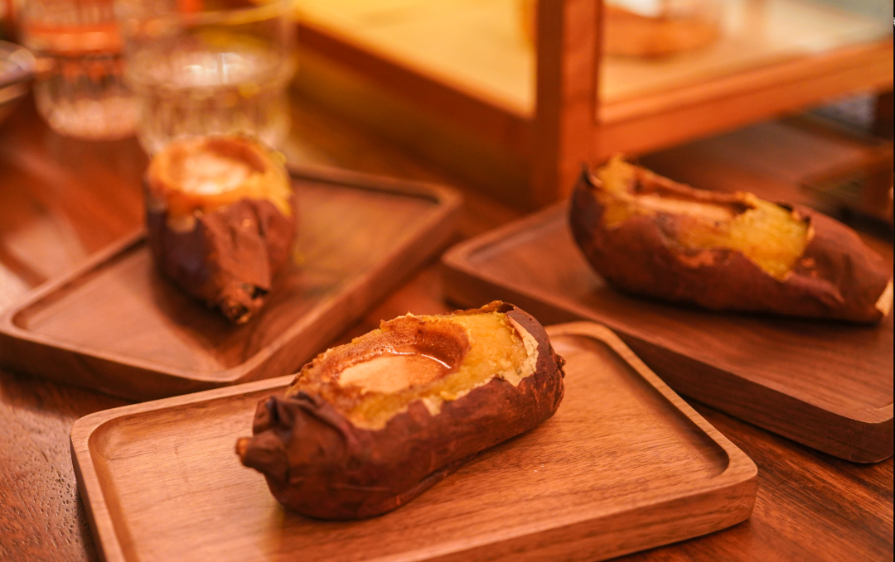

卷王红薯是个混血儿，专挑市面上认可度最高的品种来杂交。（取精华去劣势，会玩会玩把红薯的甜度、口感、果形卷完了。

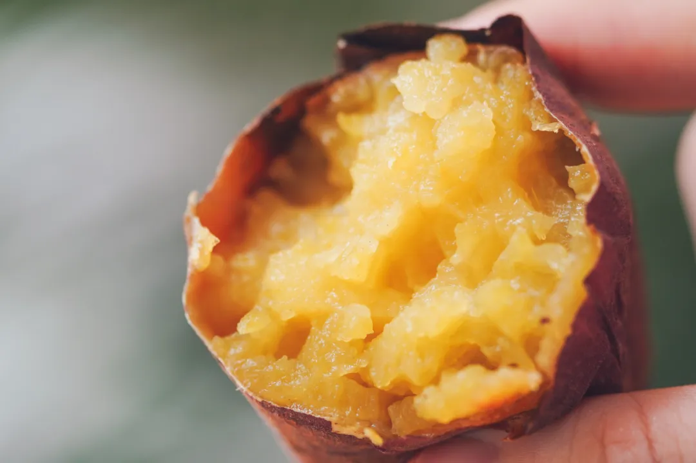

红尧甜，鸣门金口感好，玛莎莉果形好，好，那就统统拿来杂交培育，变成我吉田地瓜的。（更卷的是，比红尧更甜了，是业内认可的高甜度

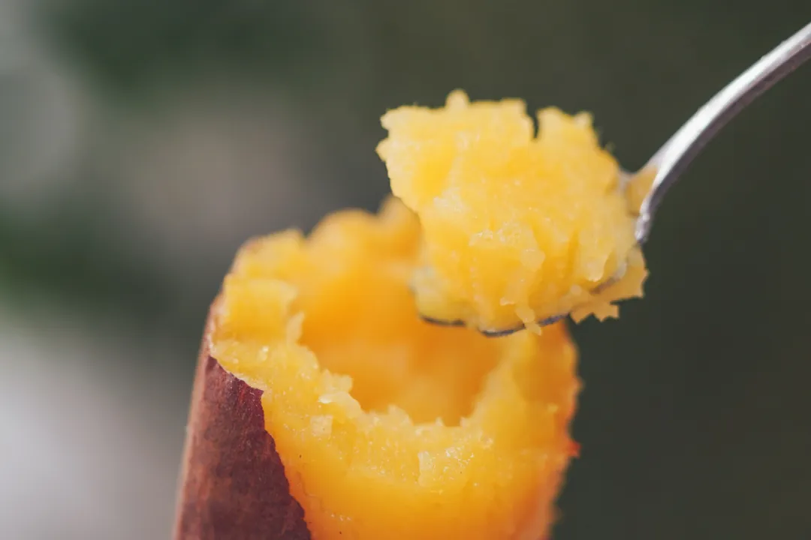

这个矜贵小品种，对土壤挑剔得很。试用三年，从海南到山东都不行，最后在云南，划了一块地，七分泥三分沙，红土地里给种了出来。

新鲜现挖，到手还带着红沙土。18 天高温自然糖化处理再发货，拿到的就是最佳口感了。

吆喝完了，剩下的你们看看详情。紫薯有红枣的香甜，红薯有板栗的糯甜，看自己的口味选！包好吃的～都不会出错！

饱记·吉田鎏金红薯购买方式如下降价了！！！
戳图或去🍑🍑🍑搜索「艾格吃饱了」下单购买👇

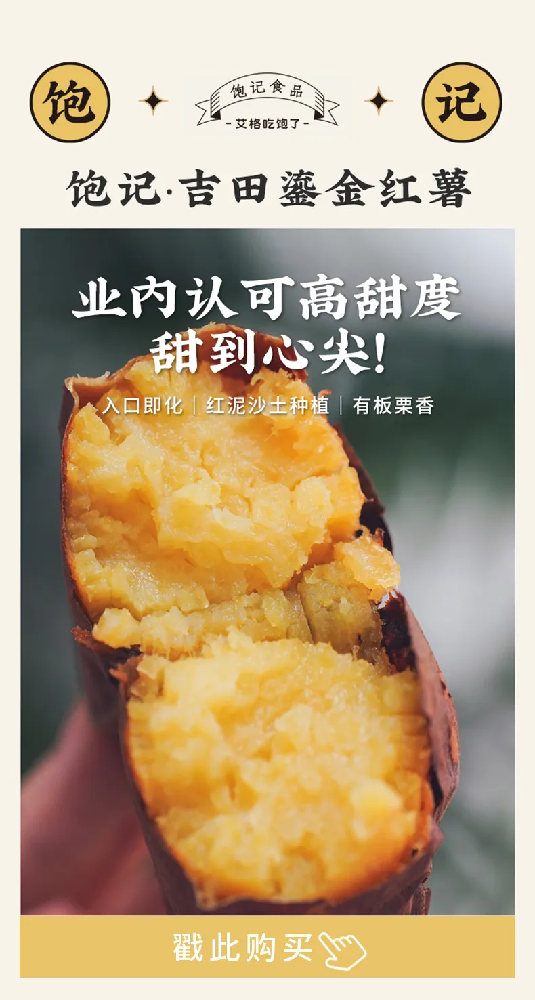

题 外

两场台风，

彻底把上海的夏天吹跑了！

薯角我庆祝入秋，

献上三款早秋好风味！

一是来自云南石林核心产区的

不一样人参果，

清甜多汁，还有浓郁奶香。

二是云南30年老树上的

绿籽石榴，

果味极浓且层次丰富！

都还有限时早鸟 86 折！

三是比高级餐厅都好吃的

上海马陆阳光玫瑰！

来自我司合作多年的马陆铜奖果园，

有很好的玫瑰的香气，

市面上的随便比！

给大家薅一个限时 9 折！

不时不食！快吃！

饱记·云南不一样人参果

购买方式如下限时早鸟 86 折！！！
戳图买它！！👇

饱记·云南老树绿籽石榴
购买方式如下限时早鸟 86 折！！！
戳图买它！！👇

饱记·马陆阳光玫瑰
购买方式如下👇限时 9 折！

皮薄多汁，

爽脆又清新，

口感一级棒，

基本上是全国的天花板👍

发的顺丰，

让大家省心安心。

每箱都是充气包装，

尽可能减少运输途中的磕碰

戳图买它👇

本文的研究员

薯角秋天要瘦成闪电！

用好吃的方式吃一生

祖国各地好风物

文章转载请加微信「baojiclub」

