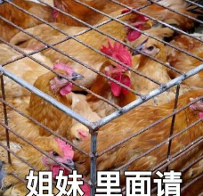
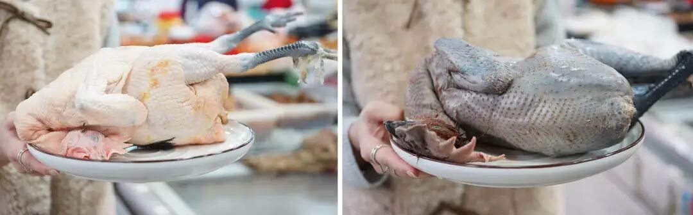
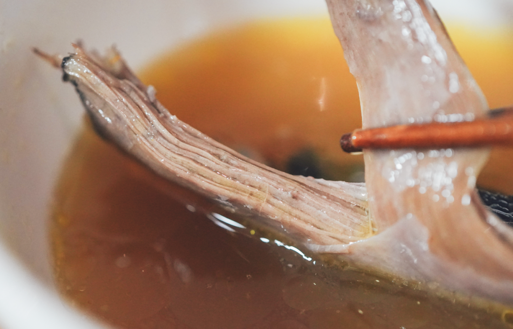

# 这种好东西，要广东人服气才可以

- 原文链接: https://mp.weixin.qq.com/s?__biz=MjM5NTYxODQyMA==&mid=2653462921&idx=1&sn=7f23d88ede31ccec16fc894ef0566529&chksm=bc22f541bf78c2f67a951cdac787696e61ec1377bea61f328e555e36b1f204d7a0d43e7ef91e&scene=27#wechat_redirect
- 浏览量: N/A
- 点赞数: N/A
- 评论数: N/A
- 转发数: N/A

## 正文

来自包邮区的震撼

一个尽情安利自我的公众号

以下是没事干研究院的风物研究报告请放心食用
据说，
如果广东人要办一间粤菜博物馆，里面理应挂满了胡建人。哦不是，是鸡鸡鸡鸡鸡🐔

广东人对鸡保有赤子般的忠诚，令薯角我欣喜的是，他们也认可了我司的这只！甚至直接连买两次，大家知道这意味着什么吗。。。毕竟他们可是有自己的清远鸡的人啊！！！（且众所周知的挑剔哈哈哈哈

老客人想必认出来了，
此鸡大有来头！来自云南的稀有品种黑脚鸡，上海金山区引进金尊玉贵地养着，
鲜甜不腥，有鸡味！

五六个月才能长成一批！

下一波预计等半年！

外面根本买不到！

很荣幸我们饱记被选中，成为此鸡目前销售的前锋主力军！划一下重点：这一批分为两个档位，第一档：6 月龄公鸡净重 3.4 斤以上 70 只，6 月龄母鸡净重 2.5 斤以上 140 只。第二档：
6 月龄公鸡净重 3 斤以上 160 只，6 月龄公鸡净重 2 斤以上 140 只。

之前总有客户问，母鸡公鸡哪个好啊？公鸡能不能炖汤啊？我们给大家做完实验了，结论是完全可以啊！

上面的是母鸡，下面的是公鸡，一样是加矿泉水煮的，大家看汤色对比。

公鸡肉多！油少！还清甜！

强烈建议之前没试过公鸡的这次选它，炖汤一样无碍！(本薯作为年轻人，甚至更喜欢公鸡的汤hh

母鸡就不说了，肉眼可见的油脂含量丰富，

这是母鸡炖出来的汤色，金汤。。。
总之这鸡买过的都说好，（之前给家里人寄了两只，他们直接搬出了花雕酒来做，说这样才不浪费。。。

不熟悉的朋友，本薯简单和大家复习一下，
此鸡曲折的前世今生。～～～

👇

它长相俊美，生性好斗，通体乌黑

（但不是乌鸡哦。。。

市面上极其少见，

是非常小众稀有的品种。

坊间还有爱称，“人间小凤凰”。

长得壮！

所以，

建议别轻易在家尝试剁鸡，

我是拿到菜市场找阿姨帮忙的。

并且，

还请阿姨拿了她摊头上最大的土鸡来对比，

完全不是一个量级。

感受一下差距。。。

其实，这个鸡，

我薯角从去年年底拿到产品资料，

就已经被它深深震憾了！

这么尊贵的出身？也是我配染指的么
本在云南逍遥，2020 年成了上海援滇对口协作的产物！「飞出大山、落户金山」。四年的时间里，金山区一直是满心满眼地扑在养殖和育种技术上，「没有怎么关注销售」。

这鸡来了金山，全区上下是金尊玉贵地养着：比如为了保留它的野性和肉质，金山区直接在养殖区域内模拟了云南林地地貌，搭起了高床，让它能撒欢，打架，睡觉。

比如这鸡在老家喜欢呆在树上，就专门搞了运动场和栖息架，满足它喜欢运动打架的天性。（哈哈哈哈哈哈是战斗鸡一枚呀

比如平时，还要搭配玉米、豌豆、高粱这种天然粗粮和青绿蔬菜去喂。

光是这样还不够！金山区又进行了一系列努力，比如筛除致病基因，提高蛋白百分点，经过一轮一轮地淘汰，最终，把它养得比在云南老家还好吃！

实地看过了，真活力十足！
所以这鸡，吃起来一点腥味都没有！

油脂和胶原蛋白含量都非常丰富。

区里自己拿回家做过实验，这鸡完全可以支持加水烧上六次，到了后期，汤色会变白，冷却之后，QQ弹弹，duang~duang~duang~

养生的事我不懂，

总之，完全没有任何厨艺，

只用一只鸡，及水，

丢进高压电饭锅炖了40分钟，

出来的效果是这样的。。。

肉质极其弹牙紧实，

完全不是烂烂的口感。。。

解释一下，真是用电饭锅炖的，摄影师为了拍照好看转移到了砂锅中。。
要我说，

“这么好的东西，

云南人怎么没早点送到上海来啊？？？？”

公鸡母鸡都好，大家按需选择！本薯跟老板薅来了突破价 7 折！
现在买过个暖冬！！你们随意！

饱记·云南稀有品种瓢鸡

购买方式如下

限时突破价 7 折！！

规格第一档：6 月龄公鸡净重 3.4 斤以上 70 只，6 月龄母鸡净重 2.5 斤以上 140 只。规格第二档：
6 月龄公鸡净重 3 斤以上 160 只，6 月龄公鸡净重 2 斤以上 140 只。
下单前请注意：此鸡蛋白质含量丰富，宰杀时已尽量放血，但少量余血开包时气味仍会比较大，请冲洗再食用！鸡皮不发粘，就绝非变质～～～

戳图下单购买👇

或🍑🍑🍑搜索「艾格吃饱了」

题 外

大家好，

这个时节好东西不少（单押

今天的心意折扣直接来！

不用凑单不用研究！

苏南蟹标杆美味：太湖流域大闸蟹苏北蟹宝藏性价比之选：洪泽湖大闸蟹现在都有吃蟹 9 折！！
坚持真材实料、天然肠衣的手工腊肠，
能做煲仔饭和火锅的玫瑰露酒腊肉&腊排骨

有小时候番茄味的云南西红柿（快没了，

还有打遍天下无敌手的山核桃！我司卷中卷产品，拿到外面去都能打得很！具体你们看商详，最重要是还有些限时返场折扣再薅老板一回！冲！

饱记·云南西红柿购买方式如下限时 86 折！！
戳图购买👇

饱记·太湖流域大闸蟹购买方式如下👇限时 9 折
戳图下单购买👇或🍑🍑🍑搜索「艾格吃饱了」

饱记·洪泽湖大闸蟹购买方式如下👇限时 9 折
戳图下单购买👇或🍑🍑🍑搜索「艾格吃饱了」

饱记·手工腊肠

购买方式如下👇

戳图下单购买👇

或🍑🍑🍑搜索

「艾格吃饱了」

饱记·玫瑰露酒腊肉&腊排骨

购买方式如下👇

戳图下单购买👇

或🍑🍑🍑搜索

「艾格吃饱了」

饱记·临安山核桃

购买方式如下👇

戳图买它👇

或到🍑🍑🍑

搜索「艾格吃饱了」

本文的研究员

薯角识听不识讲

用好吃的方式吃一生

祖国各地好风物

文章转载请加微信「baojiclub」

