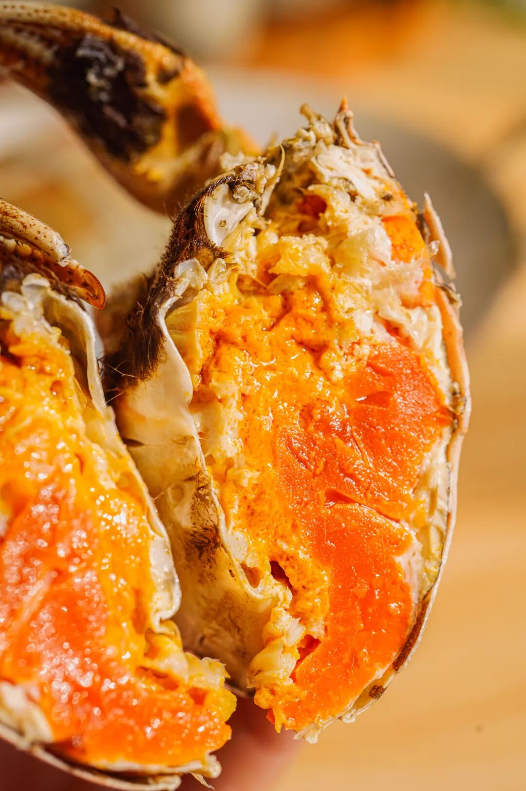
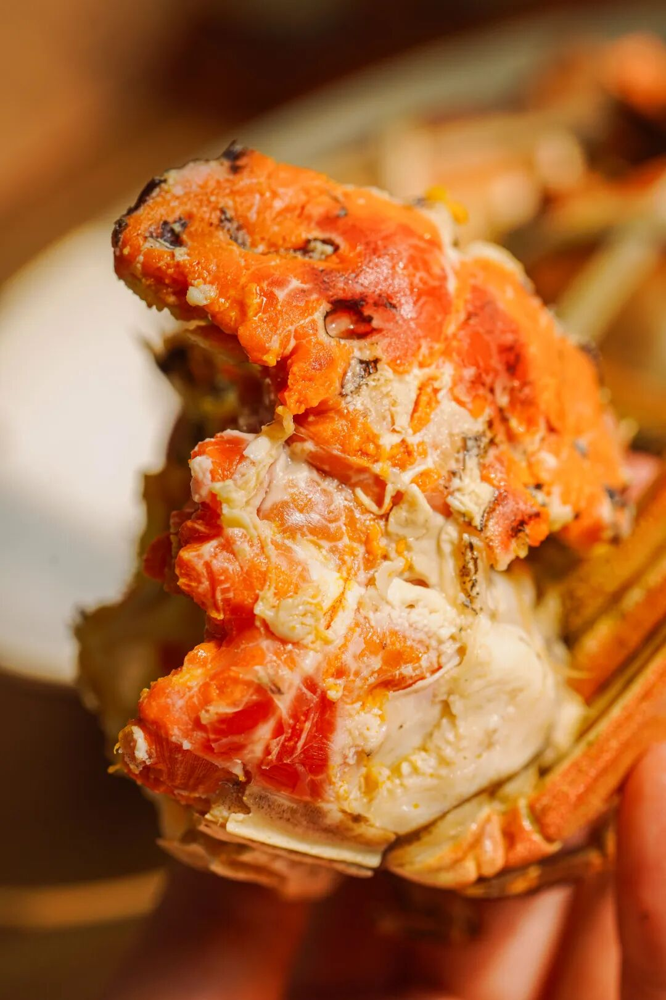
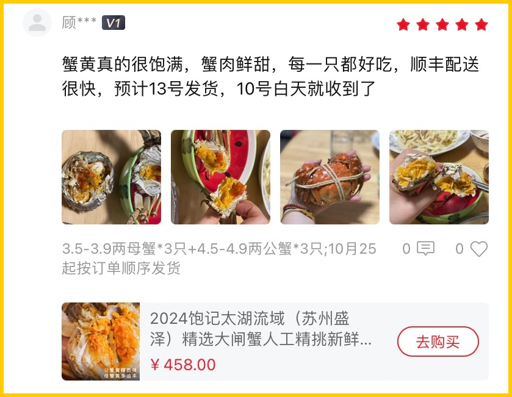
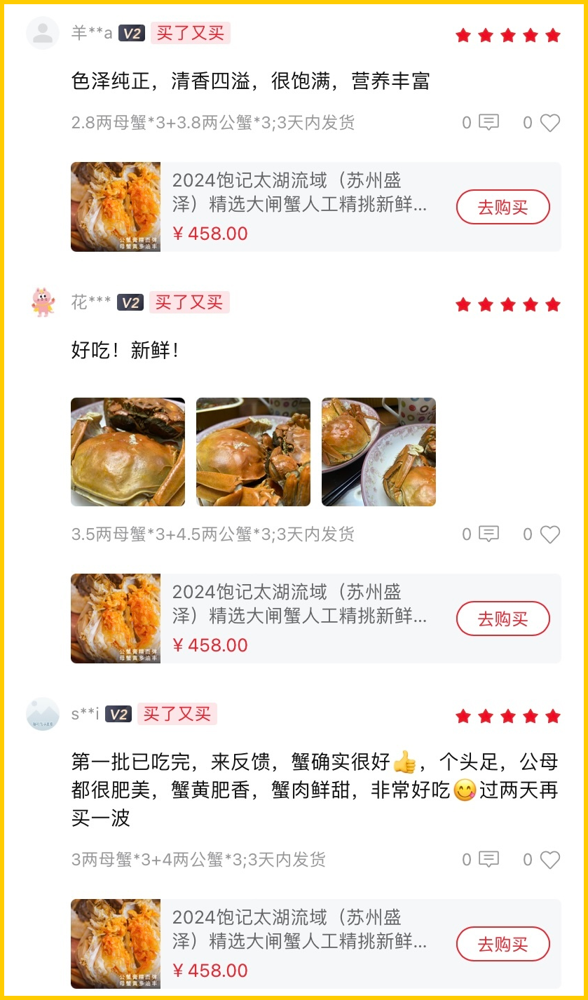
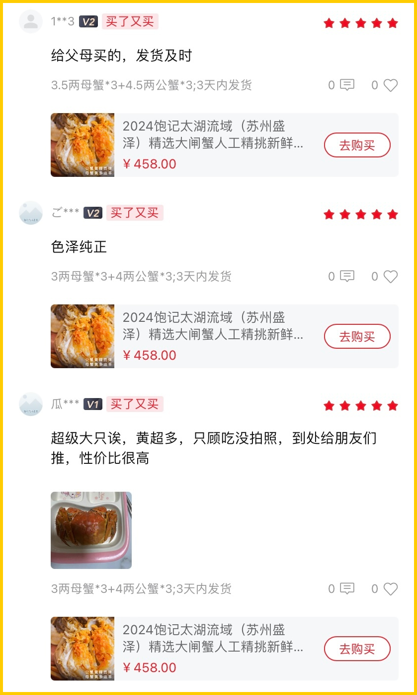
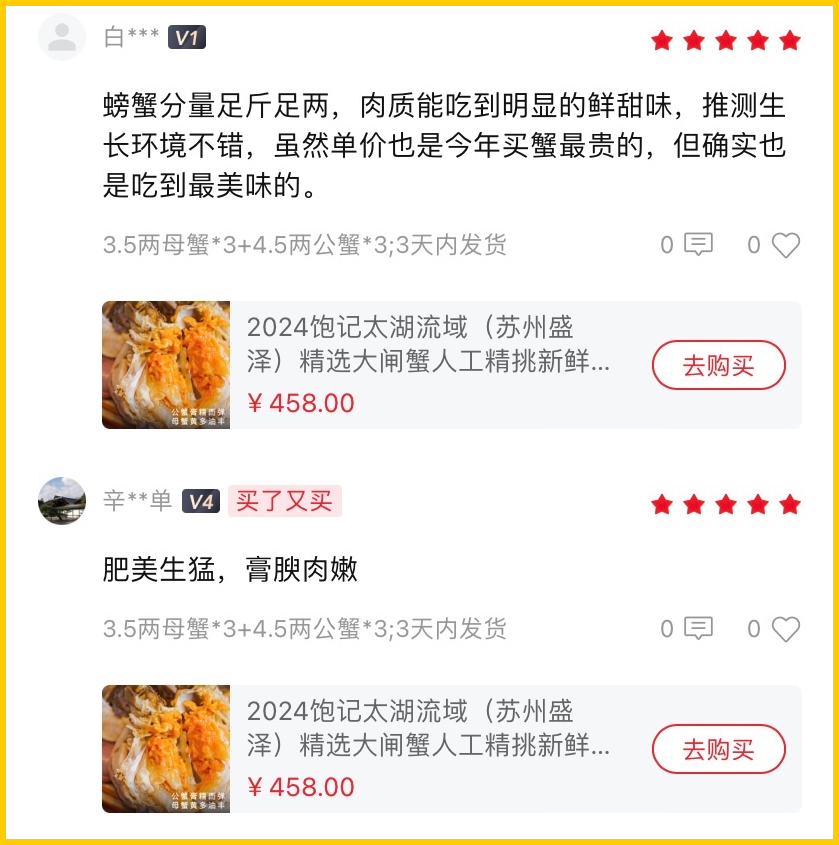
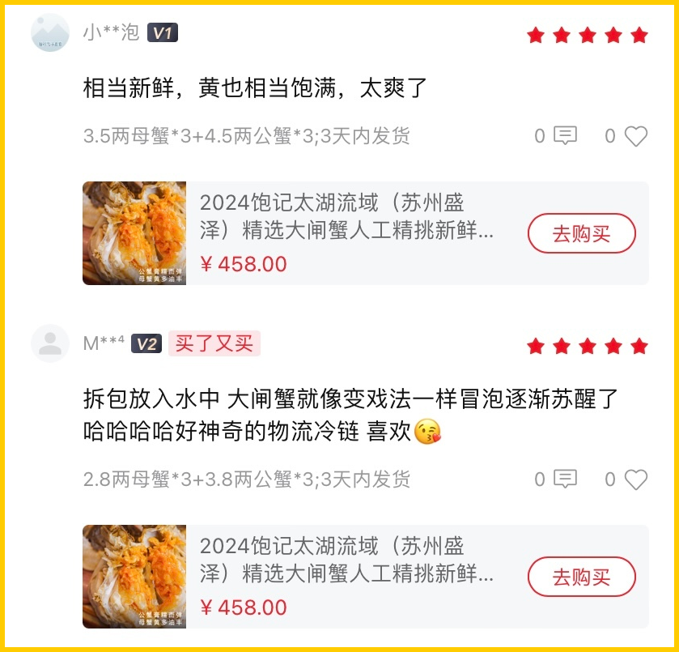
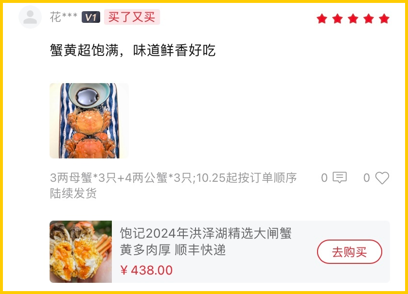
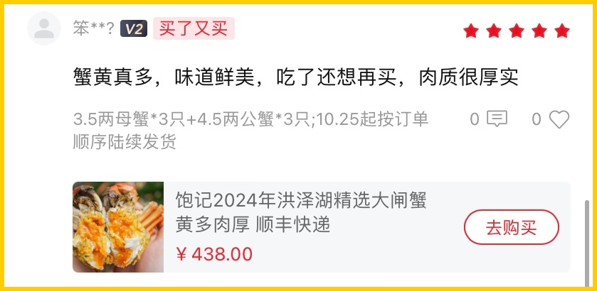
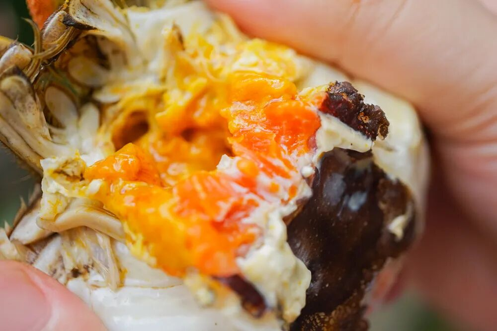

# 这种好评，使我冲动消费。。。

- 原文链接: https://mp.weixin.qq.com/s?__biz=MjM5NTYxODQyMA==&mid=2653462576&idx=1&sn=059cb55cd2c1446588974c29e006d466&chksm=bc69ffa7e183a2f690d0330d55b52eb38da919b1e0be59a6ed65a9b3804245f7e6f77801f378&scene=27#wechat_redirect
- 浏览量: N/A
- 点赞数: N/A
- 评论数: N/A
- 转发数: N/A

## 正文

啃起来不心疼

一个尽情安利自我的公众号

以下是没事干研究院的风物研究报告请放心食用
啊啊啊啊啊啊啊啊，每到周五就不想干活啊！！今天本薯摸个鱼！把键盘递给了尊贵的饱记客人们，老实说，比我写的好多了。。。。。。你们要是因此花钱也别怪我！

先说这送礼请客两相宜的苏南标杆美味太湖流域大闸蟹吧！今年刚挖掘的宝藏产区，即使在包邮区也都横着走！

毕竟连上海老牌吃蟹国营大店王宝和也说

自己的蟹是「太湖流域」

后台好评一波接一波，夸得最多就是蟹黄超级饱满！毕竟我司这蟹在指定的 3000 亩湖里长大，

活溪入水，清水整湖放养。

是正儿八经的湖蟹，

（溏蟹勿扰，完全比不了🙏

蟹肉、蟹黄吃得出明显的清甜滋味。

好吃、鲜甜！吃完一批还想买，早吃早享受啊！

还有给父母和朋友们推的！这蟹除了本身产区好，
我们还要求人工精挑，只要最优秀的前 10%！且信誉有盛泽当地村里的书记保证！

书记不时就去帮咱们亲自视察和监督，

保证只只都万无一失，

送礼请客就显得咱都大大方方儿啊！

此外，

上岸的螃蟹，我们还要求再养几天！

喂一喂玉米，让螃蟹把苦水都出来，

才给大家发哦！

这样收到的螃蟹蒸出来就是甜的！

不苦不腥！

不过成本就又上去了，

所以价格也稍微上去了。。。

懂的会懂👇

卖了这阵子，

除了少量死蟹，

（签收时联系客服按只赔付

没什么风味上的差评！！

什么蟹王府、王宝和，老板通通试过，

真的不如我们嘿嘿～

这阵子正是一年里最肥的时候，

新增 6 只装，

帮大家把价格也打了下来！！

再给一个限时三天 88 折！

大家伙儿一起吃起来啊！！

饱记·太湖流域大闸蟹购买方式如下👇限时三天 88 折
戳图下单购买👇或🍑🍑🍑搜索「艾格吃饱了」

除了苏南标杆美味，再给大家伙儿整上一些性价比之选，贴贴秋膘过过瘾！最重要的是：价格美丽，啃起来不心疼！

看满屏的蟹黄黄黄黄黄黄…...
来自一个宝藏小众产区：淮安洪泽湖！总的来说就是，好吃！不贵！自家猛吃好爽！

自己说不算，后台的真实好评奉上啊👇

比起阳澄湖动不动近 200 元一对，且货源真假难辨，洪泽湖不仅价格更美丽，
品质也都稳定靠谱多了！

洪泽湖大闸蟹，主打一个「鲜」字！

吃起来自带微咸，

蟹味是汹涌的鲜浓。

推荐搭配镇江香醋，把鲜味简单钓出来，就很香很香很香很香很香！

我司专门委托的挑蟹佬，

一辈子都在与螃蟹打交道，

看一眼、摸一摸就知道这蟹好不好。

合作伙伴同时供货上海国营大酒店，

是行业内专业人士认可的货源！

但饱记要的发货品质比酒店还要更好（骄傲脸

只要湖里顶尖蟹的前 10%。

挑完了，还有至关重要的一步：上岸吐苦水！

不急着发货，

上岸了再精养两三天喂喂玉米，

让螃蟹把苦水都吐出来，

这样你们收到后吃起来就只有鲜和甜！

总之，溢价少，肉质好，性价比高。在苏北蟹里，品质更高，规格更大，口碑更硬。

啊啊啊啊啊啊啊，这种可以把蟹黄挖出来堆成一座小山的快乐，希望大家都能体会！

同样给大家薅来一个
限时三天的周末 88 折！（快夸我快夸我快夸我现在买更划算，
这种多年口碑之选，只看想不想吃，无需再问好不好吃，嘻嘻～

饱记·洪泽湖大闸蟹购买方式如下👇限时三天 88 折
戳图下单购买👇或🍑🍑🍑搜索「艾格吃饱了」

题 外

大家好，

这个时节好东西不少（单押

双十一过后的心意返场折扣直接来！

不用凑单不用研究！

外面买不到的金山瓢鸡，

这批卖完下次得等半年了！

坚持真材实料、天然肠衣的手工腊肠，
能做煲仔饭和火锅的玫瑰露酒腊肉&腊排骨

有小时候番茄味的云南西红柿（快没了，

我司卷中卷产品，
拿到外面去都能打得很！具体你们看商详，最重要是还有些限时返场折扣再薅老板一回！冲！

饱记·云南稀有品种瓢鸡

购买方式如下

限时早鸟价 7 折！！

规格第一档：6 月龄公鸡净重 3.4 斤以上 70 只，6 月龄母鸡净重 2.5 斤以上 140 只。规格第二档：
6 月龄公鸡净重 3 斤以上 160 只，6 月龄公鸡净重 2 斤以上 140 只。
下单前请注意：此鸡蛋白质含量丰富，宰杀时已尽量放血，但少量余血开包时气味仍会比较大，请冲洗再食用！鸡皮不发粘，就绝非变质～～～

戳图下单购买👇

或🍑🍑🍑搜索「艾格吃饱了」

饱记·云南西红柿购买方式如下双十一同价 86 折！！
戳图购买👇

饱记·手工腊肠

购买方式如下👇

戳图下单购买👇

或🍑🍑🍑搜索

「艾格吃饱了」

饱记·玫瑰露酒腊肉&腊排骨

购买方式如下👇

戳图下单购买👇

或🍑🍑🍑搜索

「艾格吃饱了」

饱记·临安山核桃

双十一同价

单罐限时 9 折！

双罐限时 8.5 折！

戳图买它👇

或到🍑🍑🍑

搜索「艾格吃饱了」

本文的研究员

薯角冻成冰角了

用好吃的方式吃一生

祖国各地好风物

文章转载请加微信「baojiclub」

