# 这种店是只有上海养得活吗。。。

- 原文链接: https://mp.weixin.qq.com/s?__biz=MjM5NTYxODQyMA==&mid=2653467721&idx=1&sn=e3f884cb0c10c7958393e667b0625515&chksm=bc16007bc8087f94d9429efd4eadeebb61ac5764d3caf670adfa9c8e45c16638691edb0745ed&scene=27#wechat_redirect
- 浏览量: N/A
- 点赞数: N/A
- 评论数: N/A
- 转发数: N/A

## 正文

小酒馆

没有广告软文

所有消费笔记均经多次匿名测试请放心食用

上个月摸进这家店，

是因为据点评显示，这家「小酒馆」

当时离我只有 100 米。。。

虽然我几年没喝清酒，

但我想吃点下酒菜啊～～～

走到门口，颇有惊艳：

一头大一头窄的老建筑，

窄的这头甚至只有这么宽！

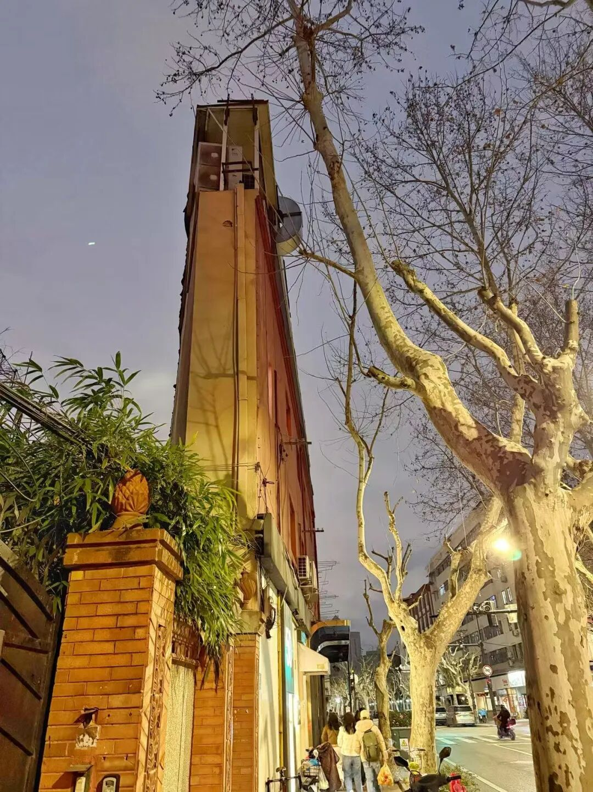

店在三楼，二楼是个寿司店。

我便想当然地以为它是二楼开的小酒馆，

因为贵店同时开个小店，

共用一些高汤和食材处理人手，

是很常见的节省成本的方式。

结果没想到，

这个店的厨房，是和日料完全不同的

融合西餐底子，而且道道都好吃！

比如这个上海羌饼三明治，

就非常科班和正规：

羌饼，是上海早餐葱油大饼的一种，

你可以看成是上海版的披萨（无馅料

葱香、芝麻香和油香逼人，

外脆里软咸度高，

被拿来做三明治的面包，

非常有意思！

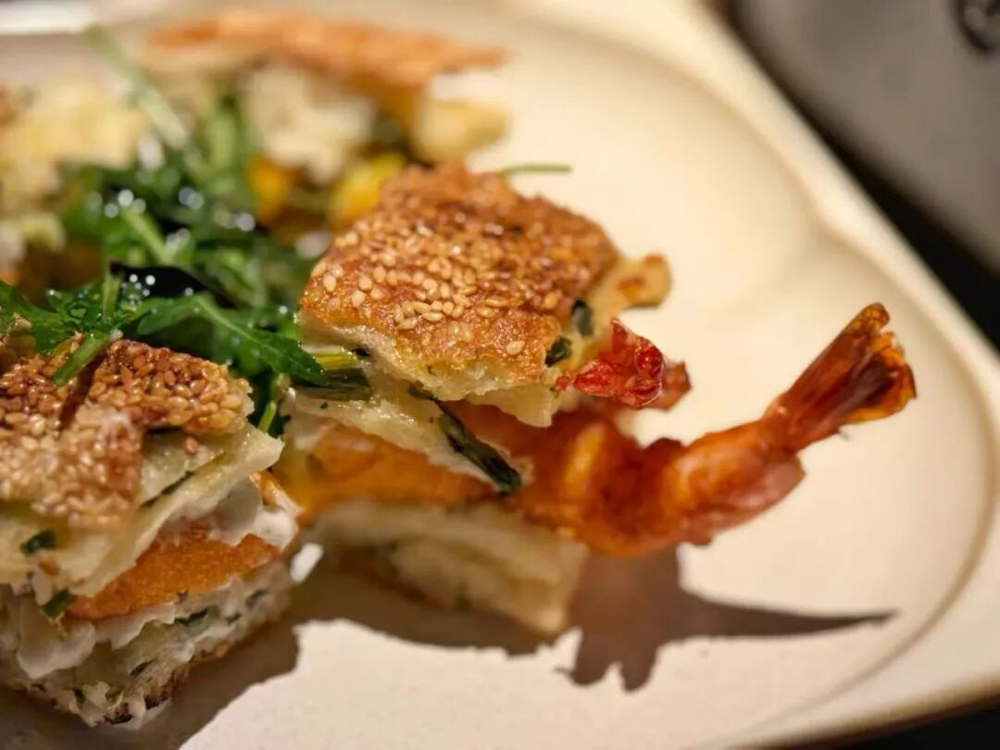

三明治的夹馅儿则是弹嫩大虾、煎蛋，

酱汁是现点现做的：

因为有一次厨房忘记做，

告知我们从酱汁开始做完一套要 50 分钟

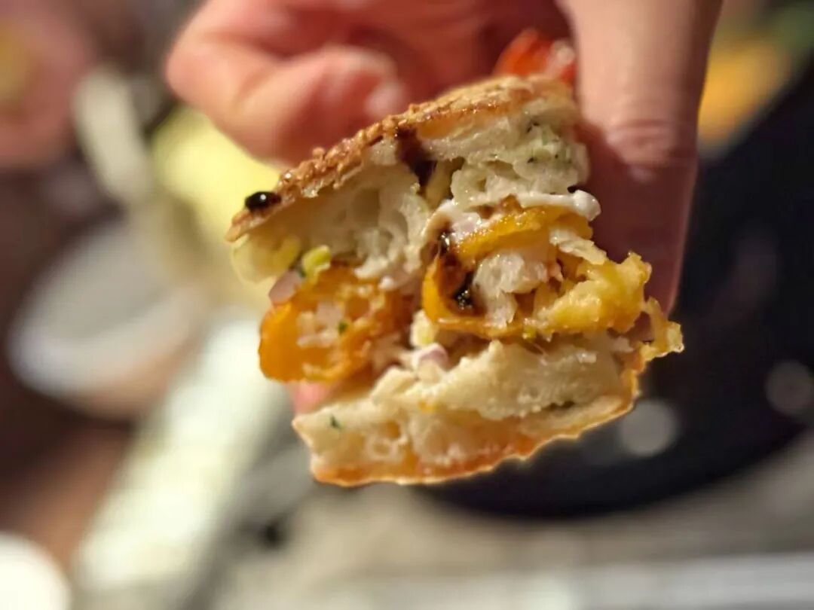

至于他们招牌的清酒吧概念，

确实还蛮专业的！

我自己有一个 WSET 三级证，

又请了一位有唎酒师证和一位米其林餐厅股东去试过，

都说他们清酒体验单很有意思，

价格合理，

中国台湾唎酒师小哥也非常专业和周到。

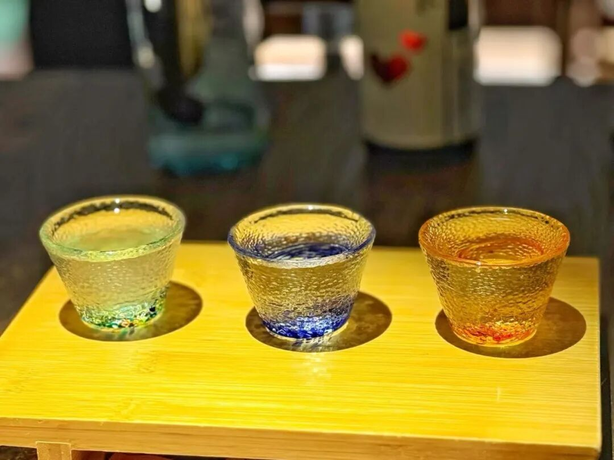

他们每过一段时间就换一批酒让来宾体验，

米其林股东说他觉得这种店的好处就是

点多杯体验套餐，换新酒喝。

确实，

我喝下来果断喜欢一个酿清酒时加入啤酒酵母的酒，

有浓郁的、天然产生的荔枝香气！

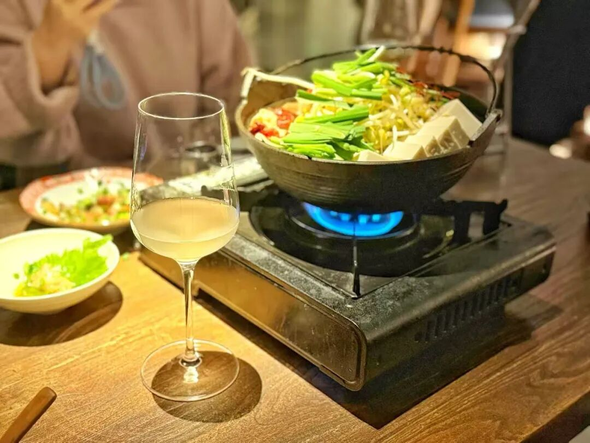

点单杯他们就给你葡萄酒杯倒清酒，闻香气和手温不沾染，合理的

然后这个和清酒搭配的牛肠锅，

优质西餐厨师的功底发力了！

日本居酒屋给你做的牛肠，

每一个都是咬不动的。。。。

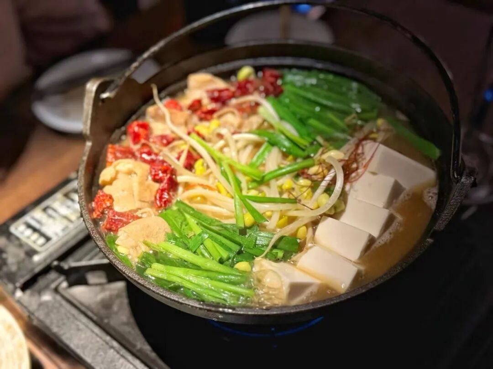

但是他们给了双色牛肠，

红色的这个是熏烤过的，

一咬香气直冲大脑。

白色的极为柔嫩又毫无腥膻，

加上极为克制的味噌汤底，

（是的我就在吐槽日本平价小店对味噌超级咸的乱用，也不知道点在哪里。。。。

这个锅配上有荔枝香气的清酒，

美爆炸了！！

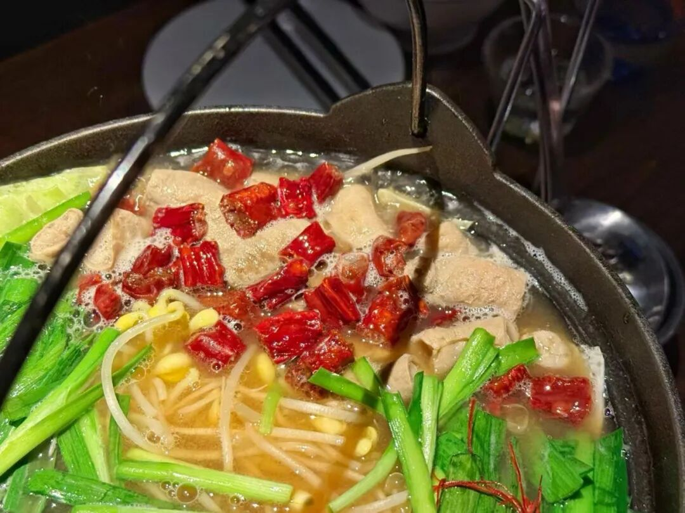

这个油浸鸡杂，

在一家上海梧桐区地址店，

只要 38 块！！！

就是西班牙式的厚锅、滚油浸大葱、

花椒和新鲜鸡杂！

（当然加上调味

还是超级香～～～

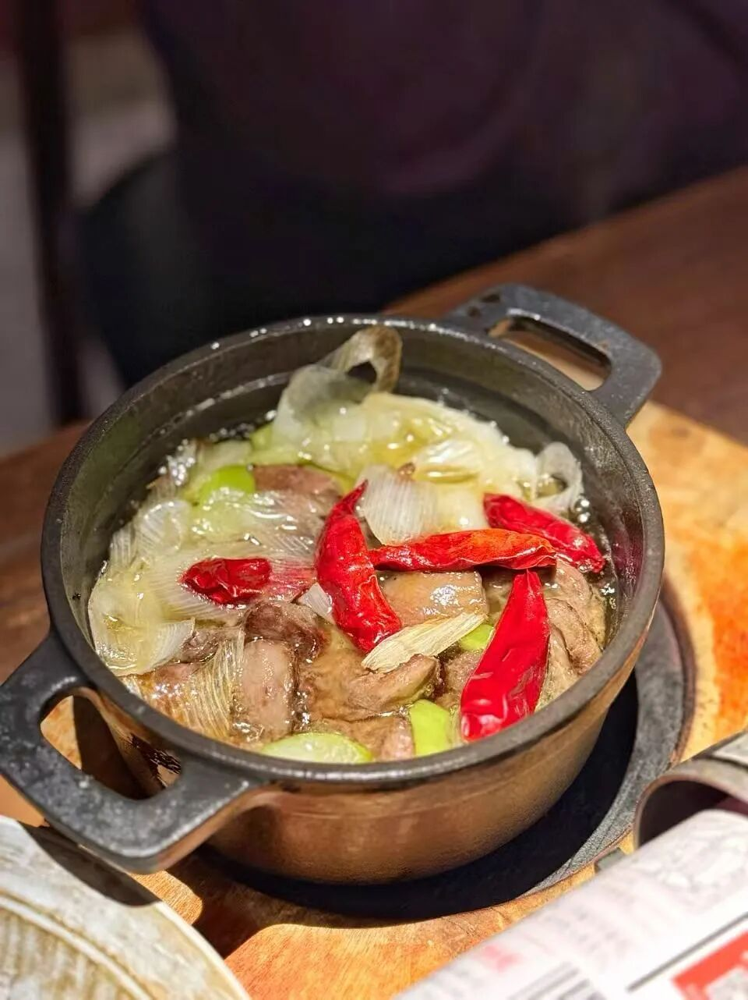

最感人的是，他们这个独立厨房，

居然现杀鳗鱼来烤，

(而不是用到处可见的鳗鱼半成品

(其实我觉得有些福建好厂出的比一般小店都好多了

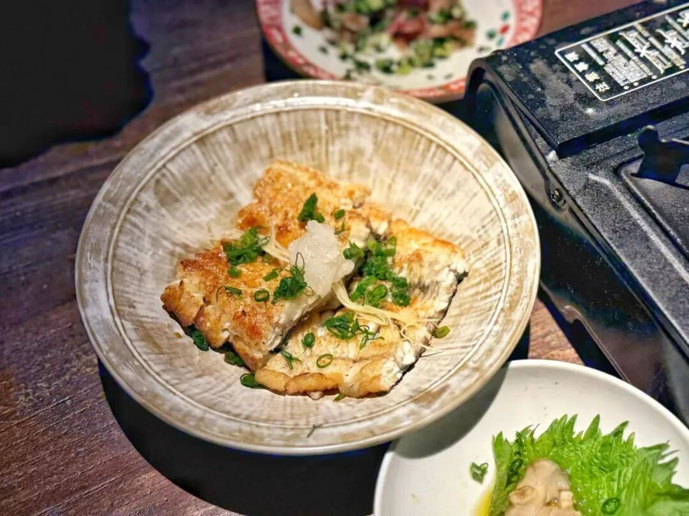

可能是用了法餐厨师的片鱼法吧hhh

烤得很香又柔嫩，酱汁则非常中国，

比一般日本活杀鳗鱼店的一味咸复杂优雅多了，

有厨师自己的想法，我很喜欢。

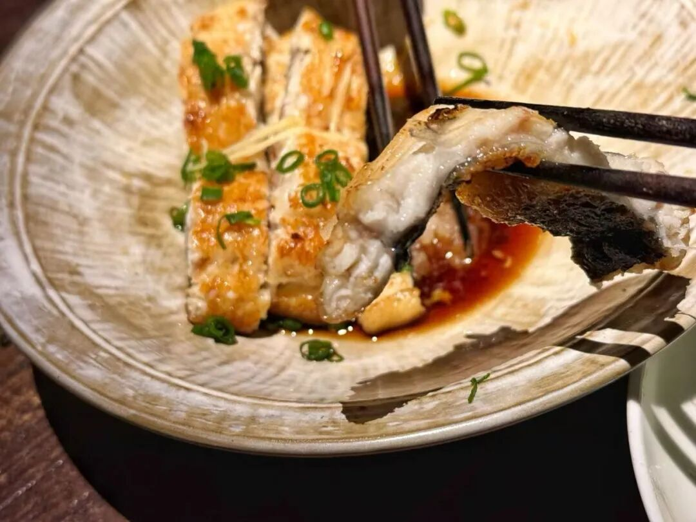

其它还有什么可以点的菜？

烤鸡腿，38 块便宜又大份：

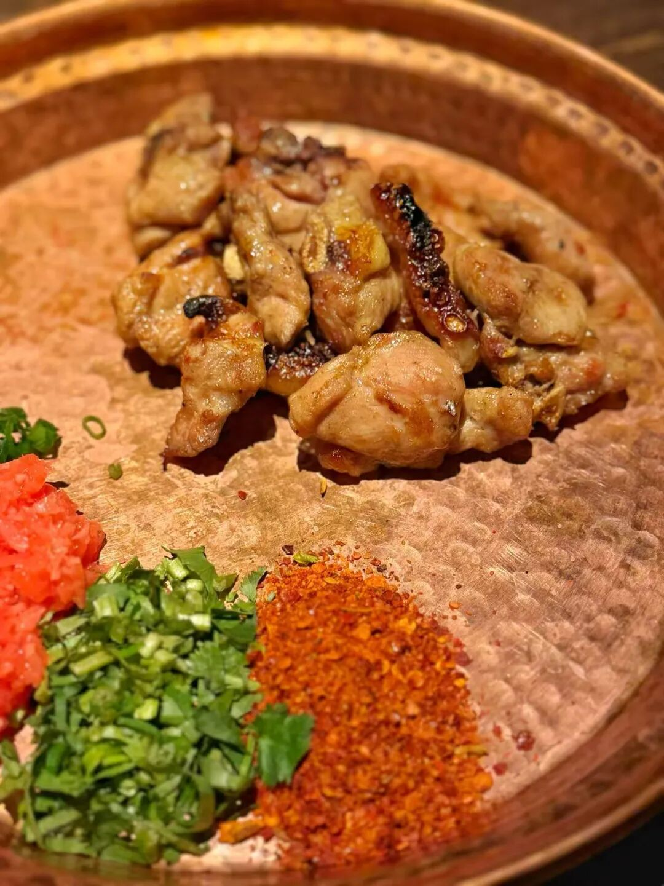

素面，樱花虾一只只烤过，

汤头很鲜但是面条一般，

好想安利我们推荐过的本帮面馆

君东记的定制面条，

不过人家确实是定制的算了hh

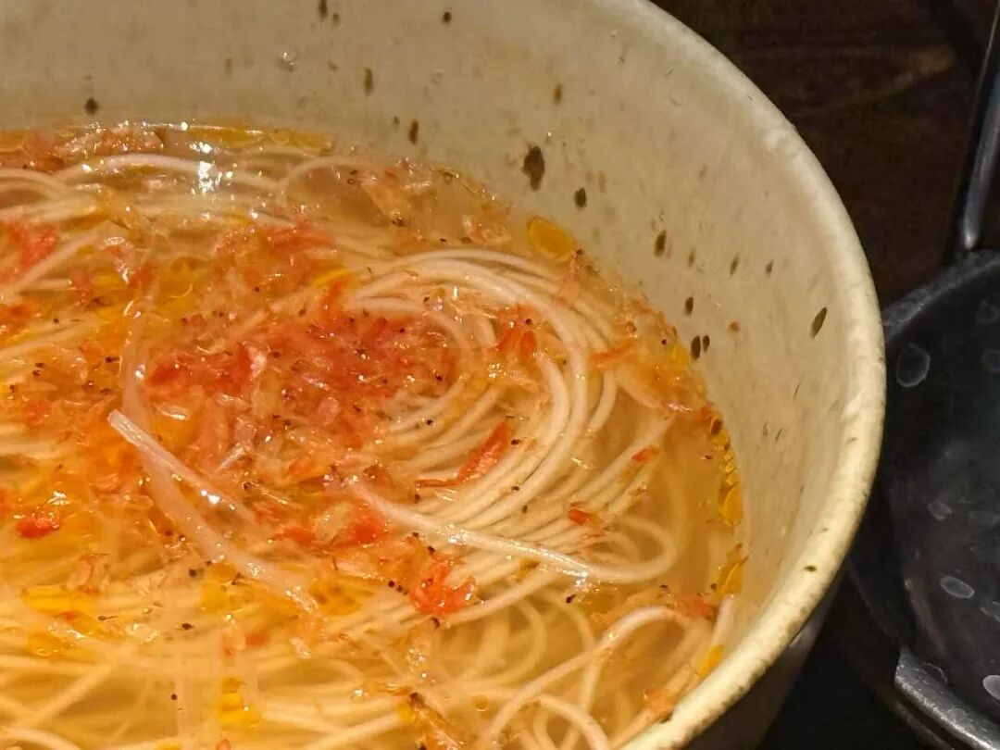

烤牛肉片包胸口捞，

日式串儿的烤法但这个柔嫩 + 脆 + 牛油香的

做法绝对是法餐厨师最爱的材质复合。

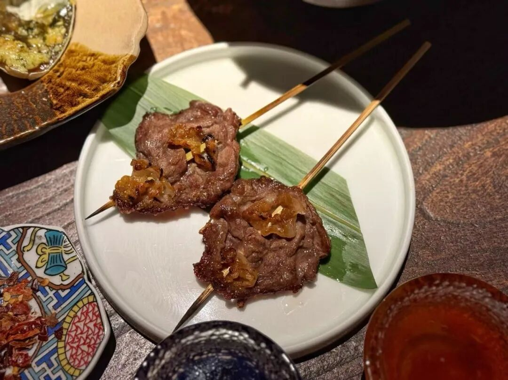

烤猪鼻嘴，毫无腥味，

猪拱嘴有种烟熏腊味又脆嫩，

外面盖了两种葱花和淋了调味的香油！

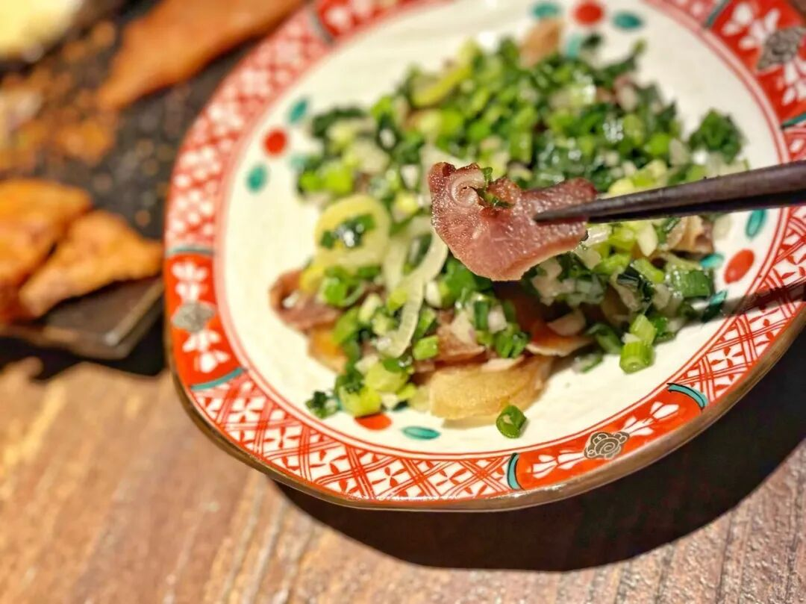

总之，

这是一个可能每个菜都不踩雷的小店！

而且我回忆起来，

两年前我来过这家店，

但当时真的对菜没印象。。。

所以厨师团队可能是一直在精进。

不容易的。

和米其林餐厅股东讨论说，

北京有没有可能有这种店。

他结论是很难。

「清酒的分装和体验容易，

但是厨房团队几年如一日地研究菜式，

提升菜品，也不为拿星什么的现实鼓励。。。。」

放全球哪个大都会都挺难的吧！

这家店，你来上海一定试试！

店名：自慢酒家

题 外 一

专门写这段题外，

是我预感有位美食公关搞不好又要继续造我的谣言了。因为我亲爱的小伙伴雨前羽街搬到上海了！！！我们每周一起吃一次新馆子，如果喜欢的话两人都会发～但我们全是匿名测试的。没收到餐厅一分钱。所以无论你怎么造谣，请不要说我和雨前在合伙干餐饮公关好吗？

是这样的，几年来，我已经收到七八个业界好心人对我同样的提醒（包括我们的投资人？？？）就是这位女士不知道为什么很仇视你。比如餐厅业主说为什么开业不请你，她说艾格很疯，吃得不好就会写负评。我：？？？我写过吗？十几年来我只写过一家，就是气到我的头灶而已啊。明明是你感觉说服不了我为什么这家餐厅值得我去吧。。。

还有很多言论，不一而足。据说她的原话是，不这么说，艾格就会抢她公关生意了。在此我想正告一下这位所谓「著名咨询公司」出身的餐饮公关，（这抬头也没啥了不起的）（我认识的复旦毕业校友如果去了你这家公司，都不敢带炫耀的好吧。。。）

我本人对餐饮公关生意毫无兴趣，绝不会抢你生意：）））以及造谣最后都是有反作用的，不然你试试呗。
题 外 二

朋友们春天好！

以下是我薯角的时令推荐👇早春糯唧唧顶流，我饱记青团买了吗？目前已经是现货，

趁现在限时 85 折！

刚冒出来的临安天目山雷笋，

米其林餐厅师傅第三年回购，

不焯水就鲜甜！

现在也有限时 9 折！

刚好配真材实料的饱记腊肠，

限时地板价 8 折！

或者试试好吃不贵的

玫瑰露酒腊肉&腊排骨，

更是限时地板价 7 折！

还有些适合空调房吃吃的水果👇

上周刚到的卷中卷红玉芒果，

娇艳可人的雷州木瓜，

风味很浓的蒙自花长虹枇杷，

个头基本在18mm+的云南露天蓝莓，

微甜饱腹的广西双拼芭乐，

现在也有限时 9 折！

此外 90 天短保质期的大师凤梨酥，

外面买不到的75%木姜子黑巧，

也都有限时 9 折冲冲！

饱记·妈妈牌青团

现货！！

限时 85 折！！！

戳图或去🍑🍑🍑搜索

「艾格吃饱了」

下单购买👇

饱记·2025 临安天目山雷笋

购买方式如下

限时 9 折！！！

戳图购买👇

饱记·手工腊肠购买方式如下👇限时地板价 8 折！！！！
戳图下单购买👇或🍑🍑🍑搜索「艾格吃饱了」

饱记·玫瑰露酒腊肉&腊排骨购买方式如下👇限时地板价 7 折！！
戳图下单购买👇或🍑🍑🍑搜索「艾格吃饱了」

饱记·海南红玉芒果

购买方式如下

限时吃水果 9 折！！！

戳图购买👇

饱记·蒙自花长虹枇杷购买方式如下限时吃水果 9 折！！！
戳图购买👇

饱记·湛江雷州木瓜

购买方式如下

限时吃水果 9 折！！

戳图购买👇

饱记·云南高原蓝莓

限时吃水果 9 折！！！

戳图购买👇

饱记·广西双拼芭乐

限时吃水果 9 折！！

戳图购买👇

饱记·红颜草莓限时吃水果 9 折！！！
戳图购买👇

饱记·新鲜到货凤梨酥限时 9 折！！！
戳图购买👇

饱记·云南木姜子75%黑巧克力购买方式如下限时 9 折！！
戳图下单购买👇或🍑🍑🍑搜索「艾格吃饱了」

本文的研究员

闻 佳就是那个研究院嘴里「挑剔的老板」。关于食物，不是比你懂得更多一些，只是比你花了更多的冤枉钱。

用好吃的方式吃一生

祖国各地好风物

文章转载请加微信「baojiclub」

