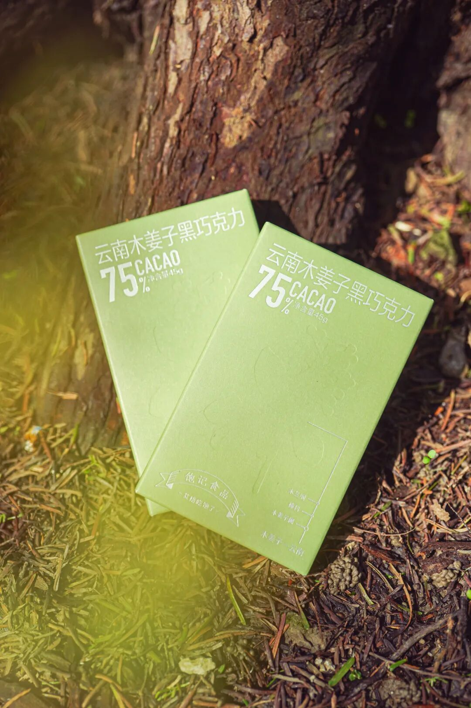
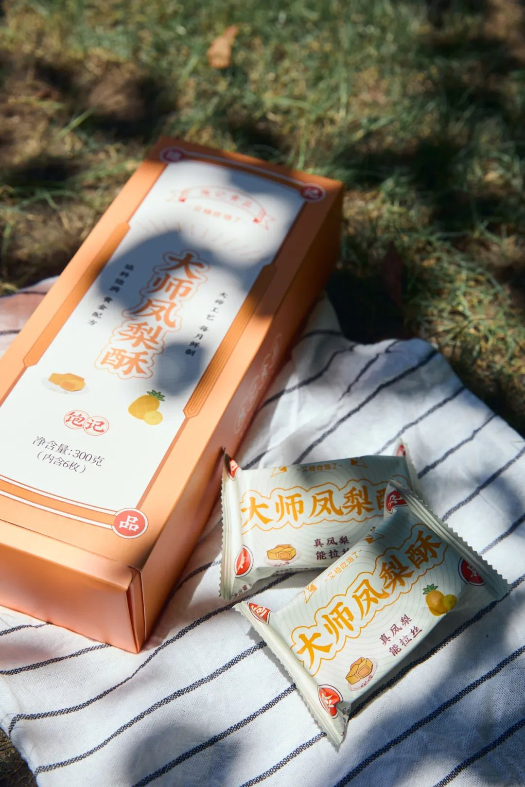
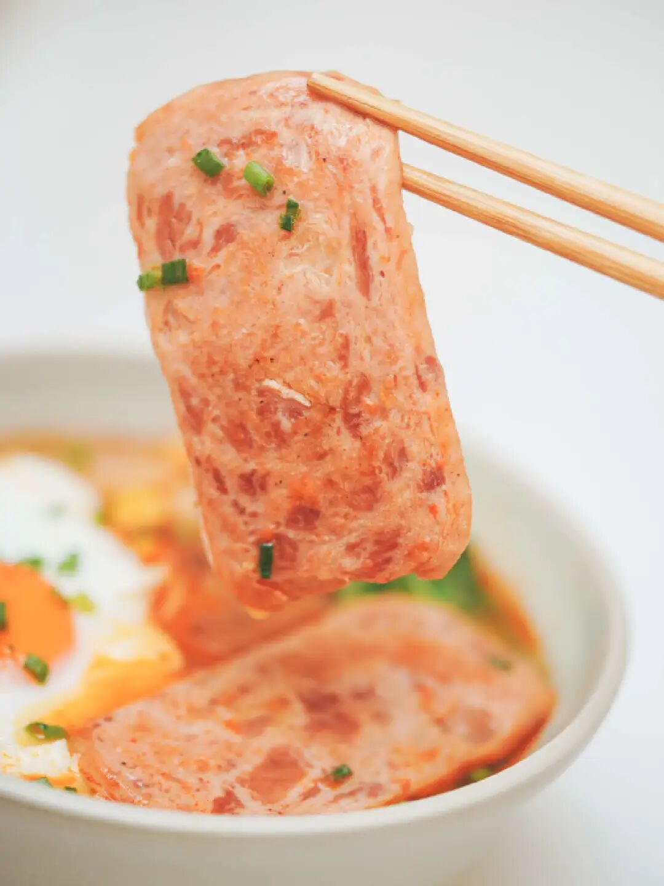
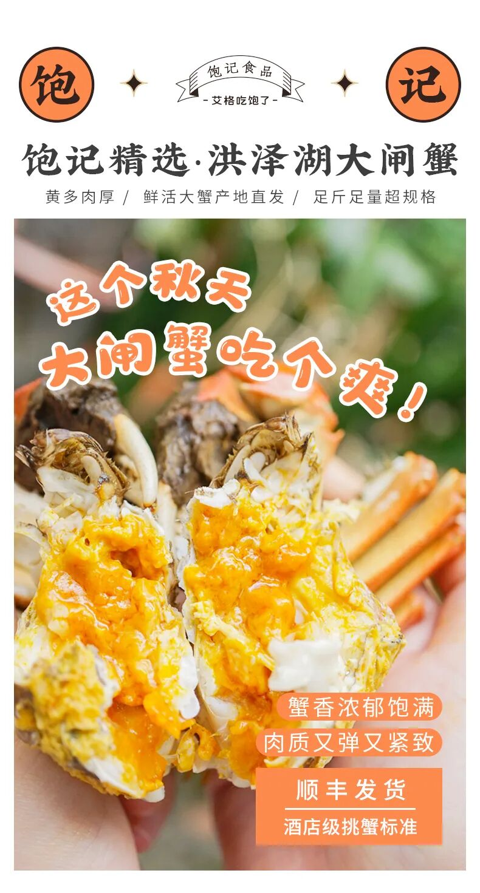

# 进来呗，今晚可以薅羊毛了

- 原文链接: https://mp.weixin.qq.com/s?__biz=MjM5NTYxODQyMA==&mid=2653464758&idx=2&sn=48d470cc3ee663cd16522d3eb31e4f89&chksm=bc91236d3fea5af564c8a218ccf11a0768c1c88d8e2189485b26f0487297ef96d16a2f819caf&scene=27#wechat_redirect
- 浏览量: N/A
- 点赞数: N/A
- 评论数: N/A
- 转发数: N/A

## 正文

新年新折扣

一个尽情安利自我的公众号

以下是没事干研究院的风物研究报告请放心食用

大家好

喜闻乐见的天猫年货节大促，

（宰老板环节！！！

今晚正式开始啦！

之前付定金的朋友，

本薯赶来说一声，

今晚 8 点付尾款哦！

老板的羊毛薅起来，

能省一点是一点啊哈哈哈哈哈。

年货节定金尾款
今晚八点开启

来，我司四样稀奇货，

运营同事给的优惠表格直接看，

不管平台怎么算，

总之要让你到手更划算！

懒得等的也可以有赞直接买！

都先给一个现货 9 折！

这款被问了八百遍的

饱记·云南木姜子 75% 黑巧克力！外面根本买不到！（所以后台天天有人催。。。薯角我悄悄努力半个多月，终于给大家补上货！

重要的话放前面说！配料表简单，没有大家关心的“代可可脂”

来，配料表都给大家直接呈上👆
产品同事这次在开发的时候，只想纯粹去还原大家心中可可该有的感觉！香味要足，入口不过分甜腻也不会涩口。最后选的这款 75% 的高可可含量奶巧，包容度更高，适口度更好，平衡奶巧的甜和黑巧的苦且保证顺滑，
总之，就是那种方方面面都让家长顺心顺意的“好小孩”！

这款黑巧的特别之处，就在于加入了云南香料木姜子油！常吃西南菜的朋友一嚼就会想起来了。
木姜子的香气清新得不得了，有点像柠檬和香茅的结合体？这次调试了很多次，
最后让木姜子主要呈现出的就是香气，尤其尾调，醇厚的可可过后，有明亮欢快的木姜子清香收尾！

每盒里有 4 小块，聚餐饭后给朋友分分，夺松弛惬意的小甜点啊～

有在进行身材管理的朋友，

这款一盒 45g 的参考热量是 281 卡，大家自行判断哈！

饱记·云南木姜子 75% 黑巧克力

购买方式如下

有赞现货 9 折！！

天🐱地板价 189/8 盒

尾款结算满 200-30

戳图下单购买👇或🍑🍑🍑搜索「艾格吃饱了」

再说这款好评如流水的

大师凤梨酥！用料实在，所以只有 90 天短保质期哦。

用的是台湾凤梨酥盲品大赛冠军配方，选的都是新鲜土凤梨馅，果肉含量大于 40%！你一入口就能吃到浓浓的凤梨本味。

我司很喜欢吃凤梨酥的同事说，吃过很多种凤梨酥，芝士味浓郁的、果肉纤维多的、奶香味重的，但都没有一口咬下去酸甜跳跃的凤梨酥来得印象深刻。是的，我饱记凤梨酥，能让人吃出欣喜雀跃的感觉！

酸甜可口，果香浓郁，真实会拉丝。酥皮奶香饱满，酥润化渣，像是在吃松软的黄油曲奇。

老人小孩也都能吃，
送人或自家吃吃都挺好哇～日常价是 82.8 一盒，这次立省快 50 元，
再等尾款凑满减，超划算！

饱记·大师凤梨酥

购买方式如下

有赞现货 9 折！！

天🐱地板价 199/3盒

尾款结算满 200-30

戳图下单购买👇或🍑🍑🍑搜索「艾格吃饱了」

还有我司回购率极高的桂花乌龙小金罐！

福州同事的原话：

这茶完全经得起盖碗的考验！

和市面上都是细末的调味茶不是一回事，

必须细细品味！

来自后台用户的

真实反馈👇

茶叶用的是六年陈炭焙铁观音，

同事专程跑到福建安溪，在平均海拔超过 1200 米的戴云山脉深处卷出来。茶农分三次焙火逼出茶香，最后陈放六年，耐心等待火气褪去，把蜜韵养足～

金桂，是每年寒露前后新鲜打的，早上五六点日出前打下来，运回后剔除花梗树叶，仔细拣选后才可与茶叶拼和。

然后请来福州当地家中五代制茶的老茶人，以传统古法窨制，一层金桂一层茶～100 斤的茶要用300 斤桂花分三次窨制！！

用盖碗泡，哇～桂花的香气完全被激发，直窜入鼻尖！带着一点花的自然甜味～入口茶汤微稠，舌侧香气余韵不绝，观音茶的回甘源源不断！

饱记·桂花乌龙（小金罐）

购买方式如下

有赞现货 9 折！！

天🐱地板价 199/2 盒

尾款结算满 200-30

戳图下单购买👇或🍑🍑🍑搜索「艾格吃饱了」

最后是

午餐肉罐头&午餐肉片组合

超多肉！！看得见的那种，

只选优质去皮猪后腿精瘦肉，

鲜香弹牙，没有面粉感！

随时随地大满足，

片装版和罐装版一样，

是常温储存的。

从此，你就可以坐在工位上啃肉了。

（但更好的生活方式还是六点就下班回去

你可以这么吃：

这么吃：

这么吃：

（都来自我的亲手制作，我不会下厨

再放送一些顾客真诚的好评：

饱记·午餐肉组合

购买方式如下

有赞现货 9 折！！

天🐱地板价 149/7 盒

尾款结算满 200-30

戳图下单购买👇或🍑🍑🍑搜索「艾格吃饱了」

本薯简单总结，以上四样好东西，直戳有赞购买现货 9 折，
愿意等等的，天🐱今晚 8 点付尾款，总之都能薅老板一波啊！新的一年，走你～

题 外

敲锣打鼓，

千呼万唤的饱记年货礼盒，

天🐱有赞同折扣！

限时单盒立减 58 元！

双盒立减 126 元！

今年冬天的富平柿饼也现货了！

年货节限时 85 折！

适合空调房吃吃的水果也看这里👇

拿过金奖的上海白鹤红颜草莓，

来自广西融安的脆蜜金桔。足以颠覆自小到大的金桔风味印象！

一次尝俩的广西双拼芭乐，

扎实的冰激凌球口感！

还有今年份的象山红美人，

入口似果冻般嫩嫩滑滑～

现在都有限时 9 折！

最后今年大闸蟹已到尾声！

苏南蟹标杆美味：太湖流域大闸蟹

苏北蟹宝藏性价比之选：洪泽湖大闸蟹马上就没！

饱记·年货礼盒

单盒立减 58 元

双盒立减 126 元

天🐱有赞同折扣

戳图下单购买👇或🍑🍑🍑搜索「艾格吃饱了」

饱记·富平柿饼购买方式如下年货节限时 85 折！！！
戳图下单购买👇或🍑🍑🍑搜索「艾格吃饱了」

饱记·融安脆蜜金桔

限时吃水果 9 折！！！

新年大桔大利！！！

戳图购买👇

饱记·红颜草莓限时吃水果 9 折！！！新年莓有烦恼！！
戳图购买👇

饱记·象山红美人柑橘

限时吃水果 9 折！！！

戳图购买👇

饱记·广西双拼芭乐限时吃水果 9 折！！！
戳图购买👇

饱记·太湖流域大闸蟹

购买方式如下

三种搭配：

满足装，

3-3.4 两母蟹，4-4.4 两公蟹，

吃过解馋。

劲爽装，

3.5-3.9 两母蟹，4.5-4.9 两公蟹，

可以拍照发朋友圈争奇斗艳。

尊享装，

4-4.4 两母蟹，5-5.4 两公蟹，

顶格水准，适合送礼。

人工精挑，

上岸后静养一两日更鲜美，

每日限量 50 箱。

拼的就是手速。

顺丰快递发货，

新鲜看得见。

戳图下单购买👇或🍑🍑🍑搜索「艾格吃饱了」

饱记·洪泽湖大闸蟹

购买方式如下

满足装洪泽湖大闸蟹：

3 两母蟹，4 两公蟹。

性价比之选！

劲爽装洪泽湖大闸蟹：

3.5 两母蟹，4.5 两公蟹。

饱记热销款。

尊享装洪泽湖大闸蟹：

4 两母蟹，5 两公蟹；

或 5 两母蟹，6 两公蟹。

实际超重，量极极极少，送礼佳品。

人工精挑，

上岸后静养一两日更鲜美，

每日限量 100 箱。

顺丰快递发货，新鲜看得见。

戳图下单购买👇或🍑🍑🍑搜索「艾格吃饱了」

本文的研究员

薯角多吃点，好过冬

用好吃的方式吃一生

祖国各地好风物

文章转载请加微信「baojiclub」

