# 连续买了很多年的稀奇货，好香好甜。。。

- 原文链接: https://mp.weixin.qq.com/s?__biz=MjM5NTYxODQyMA==&mid=2653471030&idx=1&sn=ccf819429c89bdcd9342998f8dd22652&chksm=bcf32a86e59aa637e6d53481fff791b53188e4a028748743facfdc36770908a99cd2f96814de&scene=27#wechat_redirect
- 浏览量: N/A
- 点赞数: N/A
- 评论数: N/A
- 转发数: N/A

## 正文

啧，真好喝

一个尽情安利自我的公众号

以下是没事干研究院的风物研究报告请放心食用
天🐱618开始了！然而本薯算不明白数学题。。。给大家直接打折啊啊啊啊！比如今天的这款好茶，单件 86 折两件 8 折走起！咕咚咕咚囤着喝。

正是这一杯：蒙顶甘露！
历史很悠久，但如今已算比较小众。茶味娇嫩清香，还有独有的鲜爽滋味，四川朋友们应该更熟

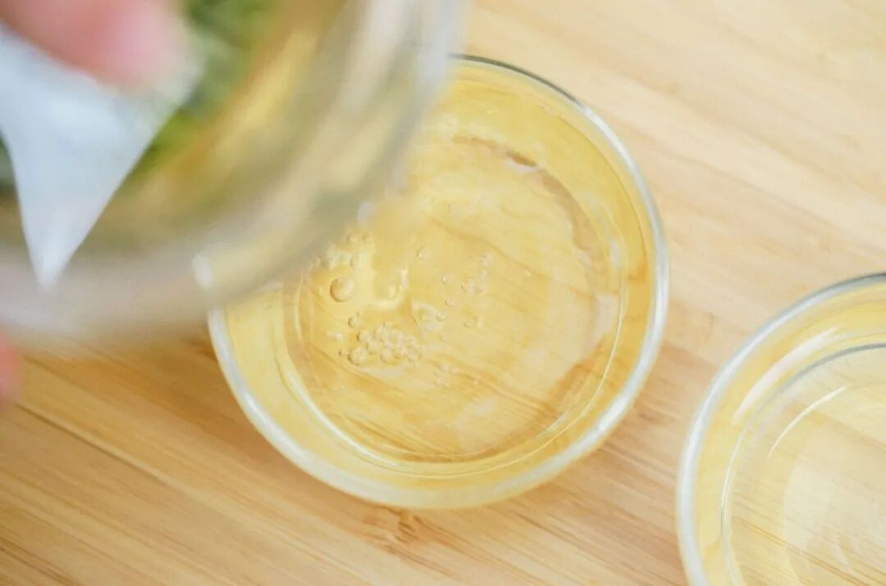

重点先说：我饱记的蒙顶甘露，均为审评特级茶。远高于市面普通茶品质，在四川的普通茶馆也喝不到。（以下来自茶学硕士前同事的认证

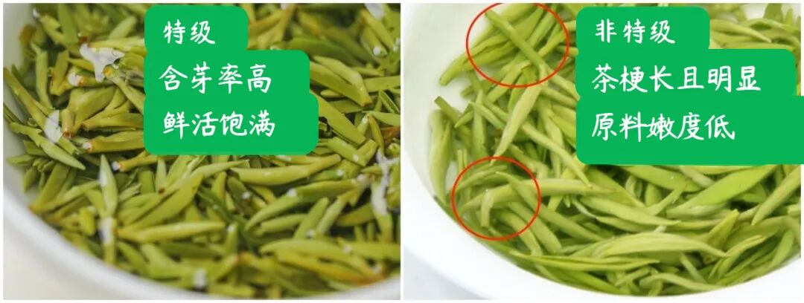

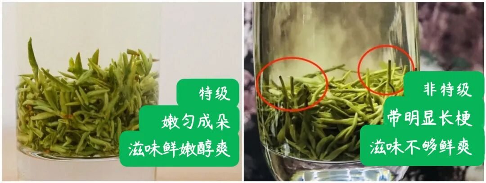

特级蒙顶甘露啥味道呢？真的好鲜！
因为蒙顶甘露制茶时需要保有的叶片白毫，含有的大量氨基酸物质。真的好甜！老茶人传统制茶，入口清香，回味微甜，千年前就这么甜。

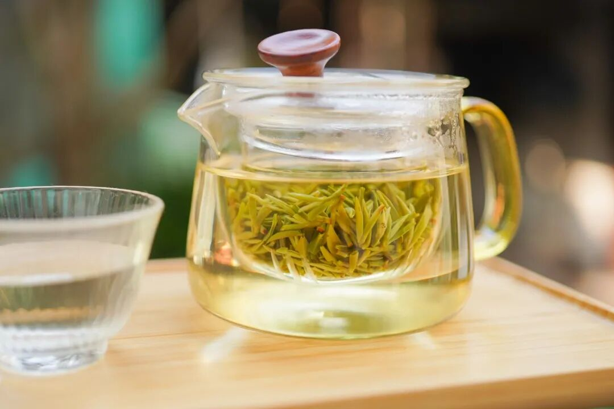

四川蒙山是茶马古道的起源地。唐代起蒙山茶就是「贡茶」。每年早春，我司指定海拔 800 米以上的茶园，（海拔高产出的茶才好喝只采早春最娇嫩的芽头，
才有这蒙山顶上的甘露。

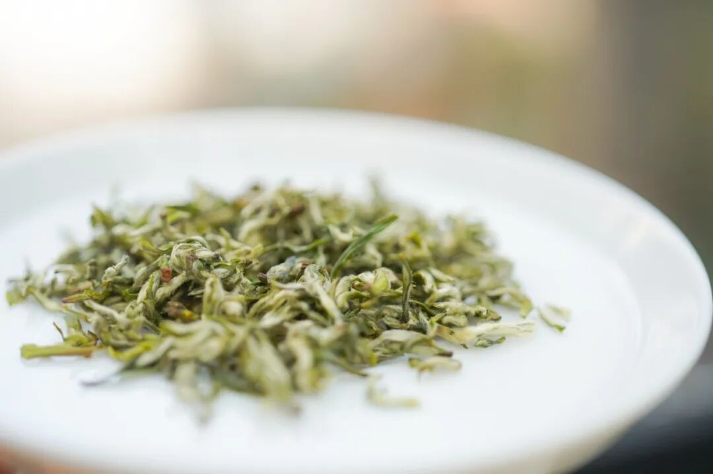

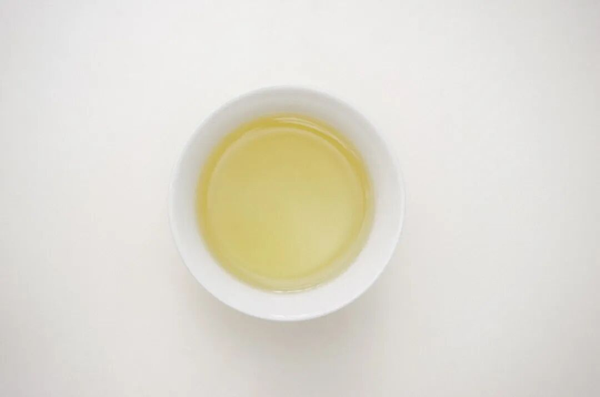

因为柔嫩，茶娘只能以指腹轻触采摘，
不然就破坏了轻灵的嫩芽。

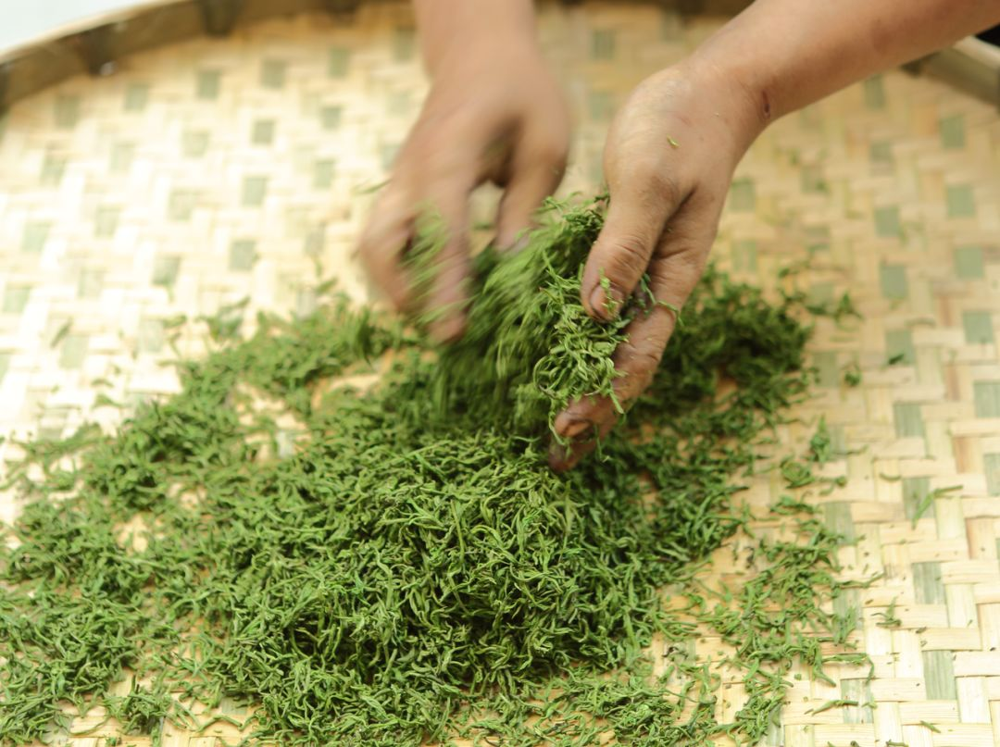

娇嫩细小的芽头，

要经三炒三揉，

手制成卷曲的样子，

喝的时候可以欣赏下茶汤中的毫！

（就是这些可爱的白色小绒毛👇

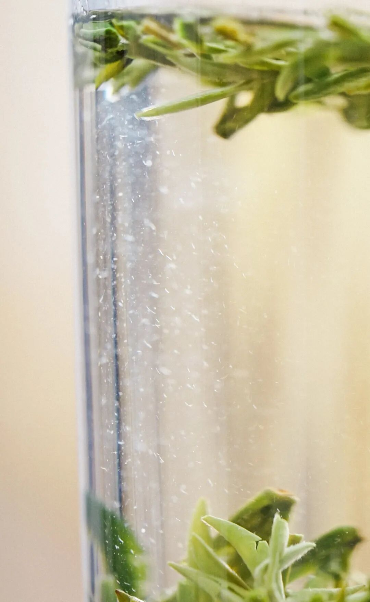

倒一杯出来，

香啊～～～

能闻到非常幽美的茶香，

绿茶的清香、炒熟栗子的香，

还有一点点非常细微的花香！

（你品你细品

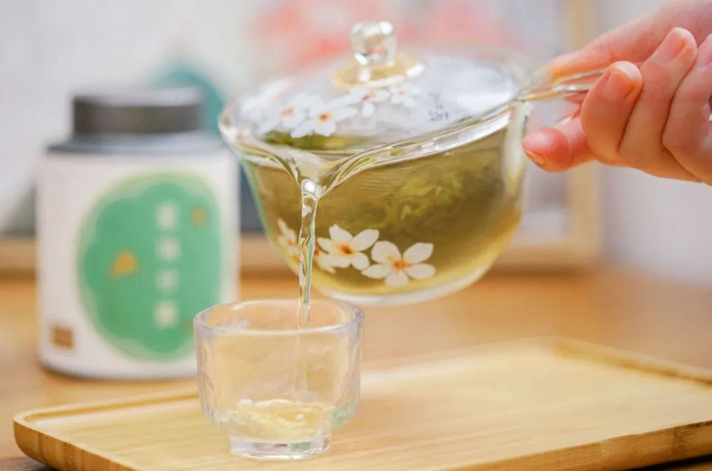

蒙顶甘露芽叶娇嫩，推荐大家用「上投法」冲泡：杯中先注七分 85 度热水，投入 3 克茶叶，很快能看到茶像下雪似的

天热则可以直接装矿泉水瓶冷泡，
清爽解腻真的绝！

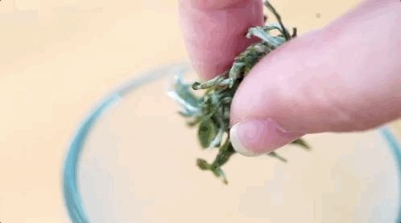

或者在家整上冰块，

还是之前去去贵餐厅吃饭学来的泡法👇

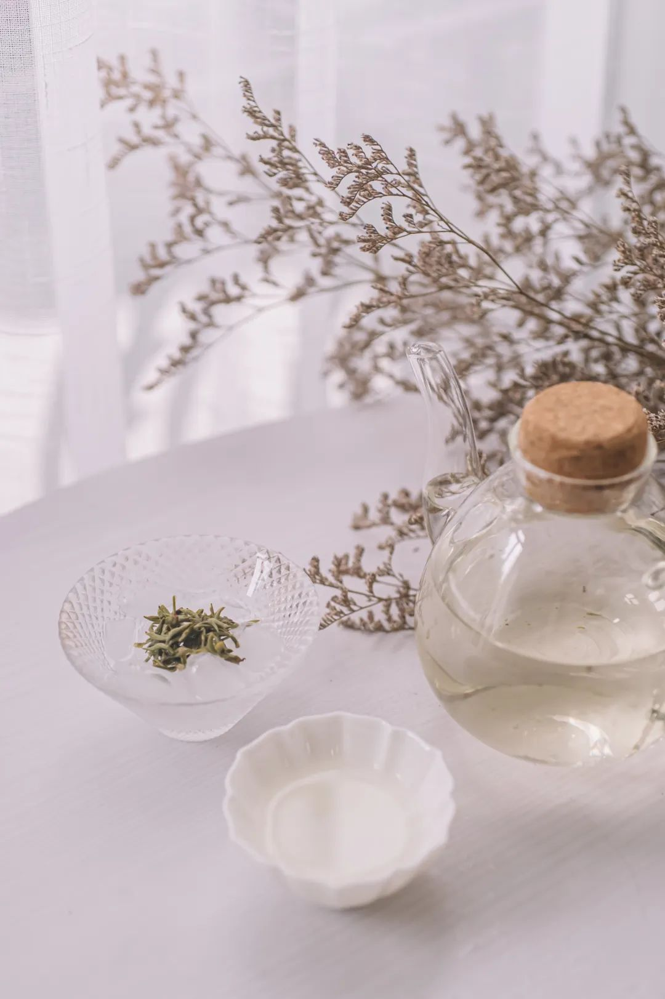

好了，

剩下的你们自己去看商详吧！

今年新茶数量不算多，

限时单件 86 折双件 8 折！

饱记·蒙顶甘露购买方式如下限时单件 86 折/双件 8折
戳图购买👇

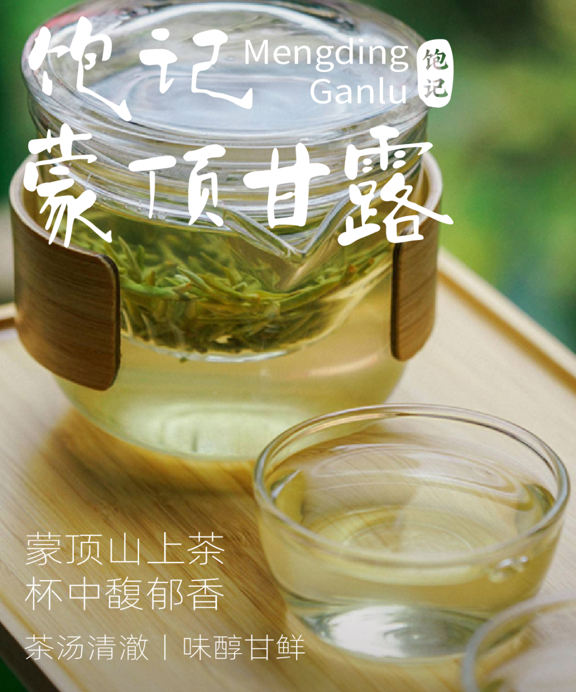

不想囤货的，也可以凑上今年份的梅家坞龙井！同样单件 86 折双件 8 折！

梅家坞的明前龙井。杭州人自家会喝的龙井茶，性价比高。其实算下来单杯比奶茶还便宜。。。

独有的豆花香浓郁，与微甘的单宁味在一起，余韵悠长。许多人喜欢上龙井，都是从这款开始入坑的。

想喝喝看来自核心产区的正宗西湖龙井是什么样，从这款入门是一个很好的味觉基准线

五大核心产区中，梅家坞产量大，是西湖龙井性价比之选。老杭州人心目中的「硬通货」，不是最贵，但绝对拿得出手。

我司今年还是和往年一样。做龙井，就是简单点：产区在哪里，有没有西湖龙井标，骗不得人。每一盒都要以标为证。这个证，只有西湖龙井协会产区认证的供应商才有！（戳开商详就可以看到！

梅家坞，也自有梅家坞的骄傲。制好茶从茶青开始，就要严格筛选。梗长，多叶，泛紫都不行，唯有标准的两叶一芯，芽头高于两叶，才会入选。

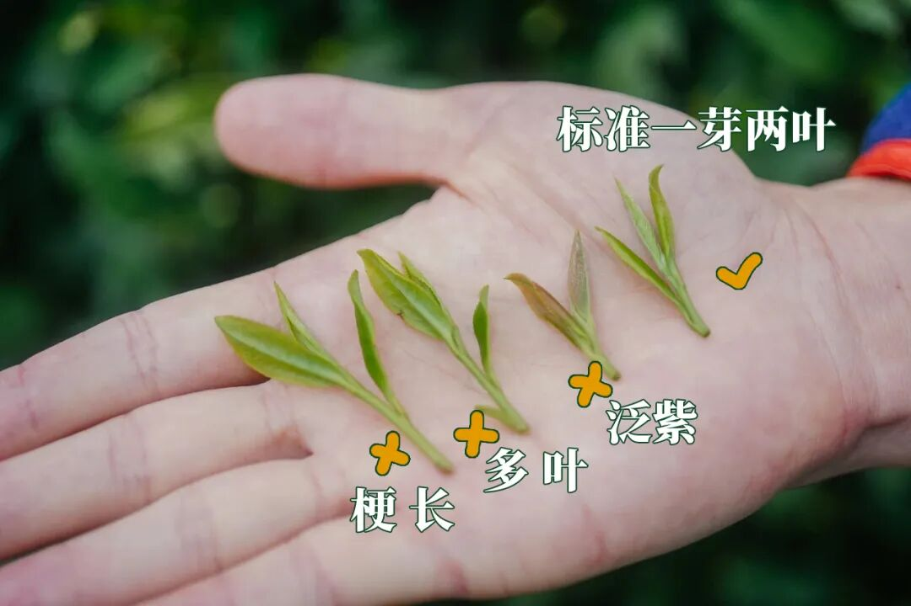

茶娘穿过茶田，采摘回的鲜叶平铺在竹编大箕，入摊青架摊放，闻一闻，有清冽香气。

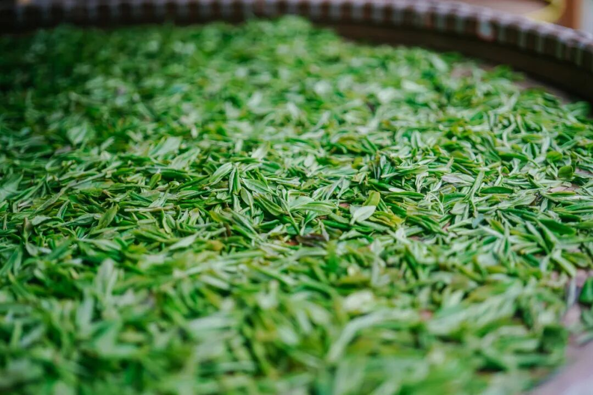

为了追求入门和性价比，和去年一样，芽叶用的二采。二采对自用来说，性价比其实很好。二采之后，芽叶味道又要差一截。品相定了一级，是很适合自用的核心产区明前龙井茶了。

现在直接买它，限时单件 86 折，再搭配今年的蒙顶甘露，限时两件 8 折！嘿嘿，钱包也能减减重

饱记·梅家坞龙井&蒙顶甘露限时单件 86 折！！！两件 8 折！！

戳图购买👇

题 外

朋友们！！！

天🐱618开始了！

我司🍑平台全场 85 折！大家速冲！

但如果你懒得去🍑下单，

以下为我司小🍊序直通车！

今年的饱记粽子！限时吃粽 88 折！果期极短的苏州东山白玉枇杷，饱记已是第七年！市面上的品质你随便比！限时早鸟 86 折！突然熟了的云南西红柿，小时候阳光里长大的浓郁番茄味儿，
限时早鸟 86 折！！

还有些只有最近这一阵可吃的水果👇

拿过上海金奖的金山小皇冠西瓜，

爆汁清甜还有瓜鲜味！

也拿过上海金奖的金山小番茄，

难得回归的泰国超甜多汁金柚，

瓜肉软糯的翡翠冰淇淋甜瓜，

无渣不麻嘴的海南金钻凤梨，

连盐水都不用泡。

卷中卷红玉芒果，

娇艳可人的雷州木瓜，

现在也有限时 86 折！

饱记·口碑湖州大粽预售中

现货中！！！

限时吃粽 88 折！！！！

戳图买它👇

饱记·苏州东山白玉枇杷

购买方式如下

限时早鸟 86 折！！

戳图购买👇

饱记·金山小皇冠西瓜

购买方式如下

限时早鸟 86 折！！！！

戳图买它👇

饱记·云南西红柿

购买方式如下

限时早鸟 86 折！！

戳图购买👇

饱记·多汁泰国金柚

购买方式如下

限时吃水果 86 折！！

戳图购买👇

饱记·金山五彩小番茄购买方式如下限时 86 折！！
戳图购买👇

饱记·翡翠冰淇淋甜瓜购买方式如下限时吃水果 86 折！！
戳图购买👇

饱记·花香脆甜蓝莓购买方式如下限时吃水果 86 折！！
戳图购买👇

饱记·海南金钻凤梨

购买方式如下

限时吃水果 86 折！！

戳图购买👇

饱记·海南红玉芒果购买方式如下限时吃水果 86 折！！！
戳图购买👇

饱记·湛江雷州木瓜

购买方式如下

限时吃水果 86 折！！

戳图购买👇

本文的研究员

薯角我想我知道夏天的味道

用好吃的方式吃一生

祖国各地好风物

文章转载请加微信「baojiclub」

