# 都说是世界上最好的牛肉，没有之一

- 原文链接: https://mp.weixin.qq.com/s?__biz=MjM5NTYxODQyMA==&mid=2653467092&idx=1&sn=8090a8ef0f2ff25d1afcc52c6e8258ed&chksm=bc9e503a1a1feb54f4229eda65b470a865b166a6f115e0e1c320910825391210410a9b4d4371&scene=27#wechat_redirect
- 浏览量: N/A
- 点赞数: N/A
- 评论数: N/A
- 转发数: N/A

## 正文

西班牙的肉肉啊

没有广告软文

所有消费笔记均经多次匿名测试请放心食用

今天要讲一堆吃过的好吃牛肉，

最喜欢的那款，

来自西班牙。

虽然澳、美和日本把牛肉做成高价硬通货，

但是欧洲各国都有自己钟爱的牛肉。

英国人吃苏格兰的，

比如去年去了苏格兰著名夏季

度假胜地罗蒙湖 Loch Lomond：

当地豪华酒店餐厅的牛排馆就提供

苏格兰高地两家农场指定的牛～

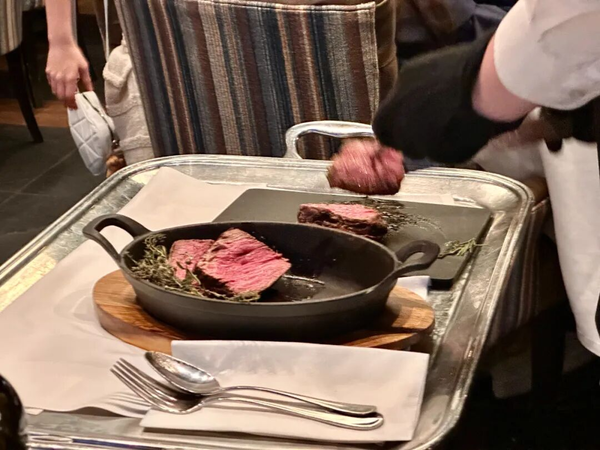

草饲牛，还需要 21-45 天干式熟成，

就是大概在这样自由吃草的小牛牛：

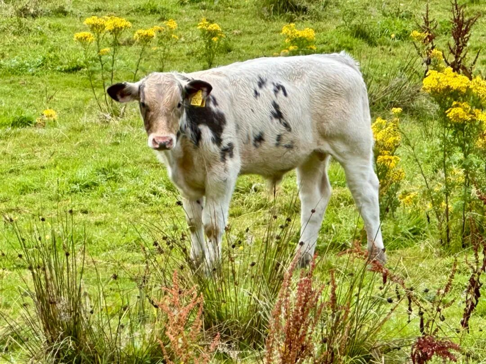

太过可爱有点内疚不是。。。

而且他们特别强调的

切割方式是 Chateaubriand，

就是只在菲力的中心，切最嫩的一条，

大约 16-24oz，

所以煎得很嫩也极具风味，非常多汁！

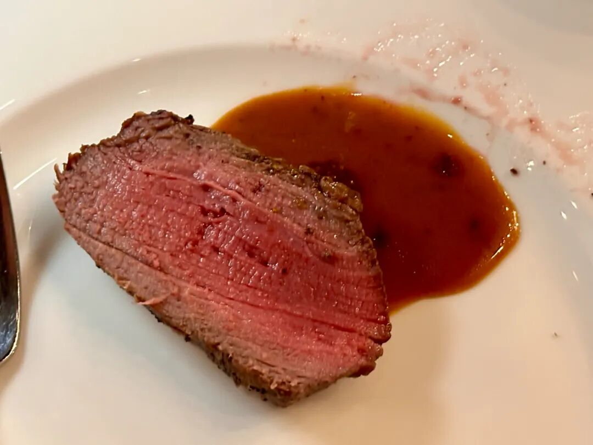

法国、意大利都有自己的本地牛，

但吃来吃去，

我还是觉得西班牙的牛最对我胃口！

以上结论是和美国、澳洲，

以及欧洲各国的比。。

日本和牛咱不比，

那是另外一个超然的物种，

但是人家是吃烤肉，

而不是像这样的牛排对不？

放一个最近吃过的和牛，

是东京一家坐满有钱人和其家人的店：

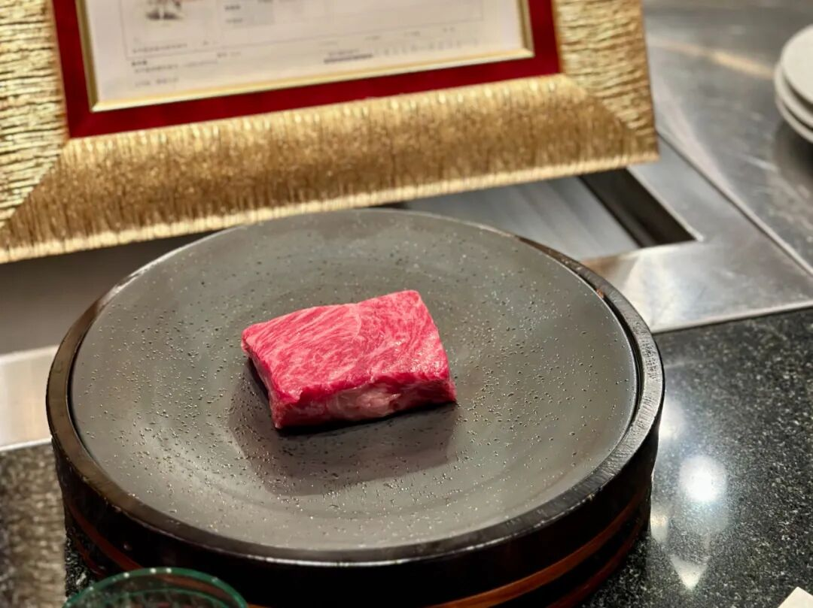

店名叫石垣吉田，

做有证书的冲绳石垣牛：

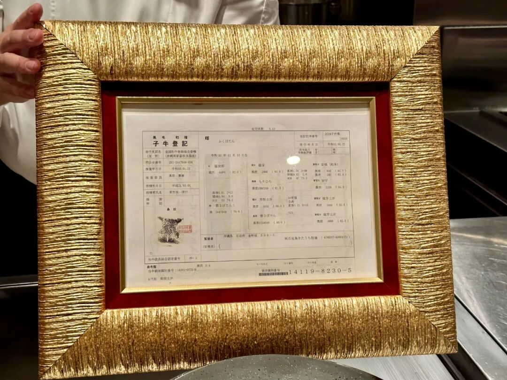

店里坐的每个贵妇和儿媳妇都有爱马仕！

除了和牛我超喜欢他家的鲍鱼和肝酱面hh

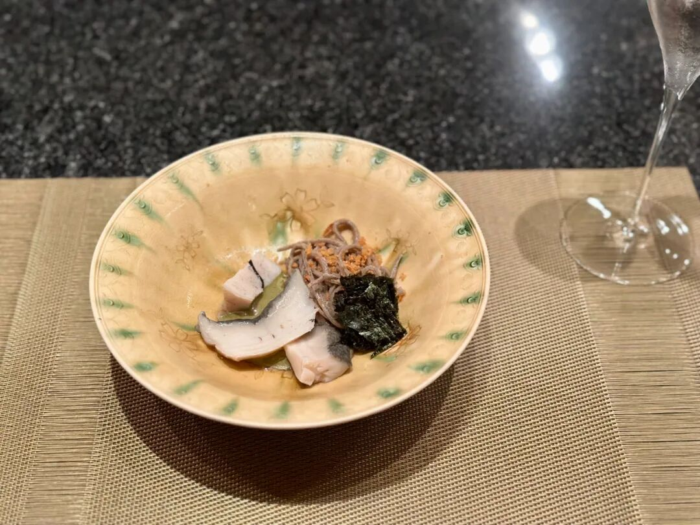

西班牙牛肉

我首先是在伦敦被惊艳到的～

叫 Rubia Gallega 加利西亚金发牛，

只产自西班牙西北部的加利西亚地区，

天然草饲，要养到 10 岁以上才会屠宰，

肉味极其浓郁但很柔嫩！

我在伦敦这个店里大吃一客 14 岁的，

简直吃昏过去hhhh

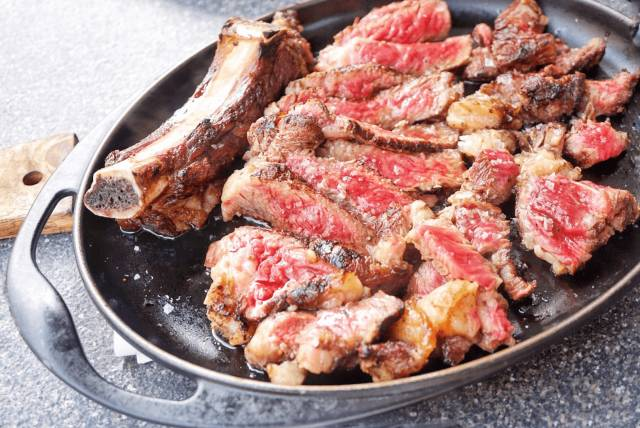

实际上

Netflix 纪录片《Steak Revolution》、

《Times》、英国卫报和《华尔街日报》

都评过它是「世界上最好的牛肉」，

赢过日本和牛（我作为亚洲胃保留意见

BTW，这家伦敦餐厅叫 Lurra ，

2017 年时由伦敦金融城的

高薪小伙伴推荐给我，

这篇里写的有些店至今还可以去！（戳一下

香港也有餐厅做这种 Rubia Gallega 牛肉，

只要你查到有，可以放心吃！

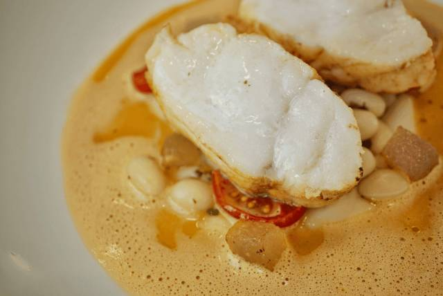

但是春节去西班牙，

我的旅游 Planner 小伙伴

给我推荐了格兰纳达的一家牛排店，

结果我吃到了

肯定比伦敦香港那款更好吃的牛肉：

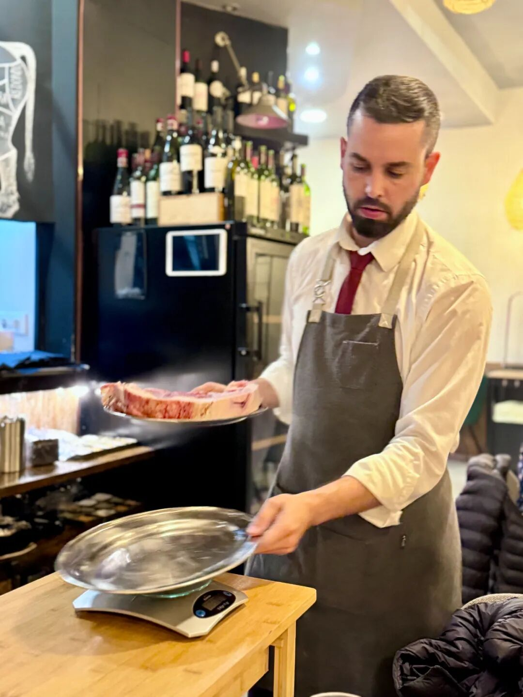

经过西班牙农业部认证，

4 岁以上的 Rubia Gallega 公公牛，

必须经过 60-90天的长期干式熟成！！

你看 gpt 翻译的菜单，

BUEY certificado 就是

比 Rubia Gallega 贵很多！

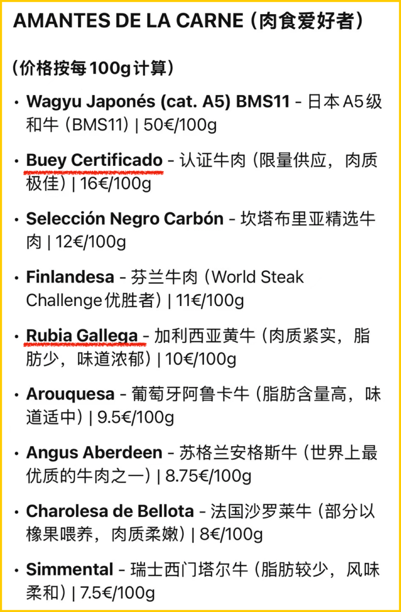

餐厅名字就叫「黑炭」，

是餐厅自己定制的葡萄藤炭，

服务员大力推荐炭火直烤的三分熟，

也就是这种外面带焦壳子、里面柔嫩的状态：

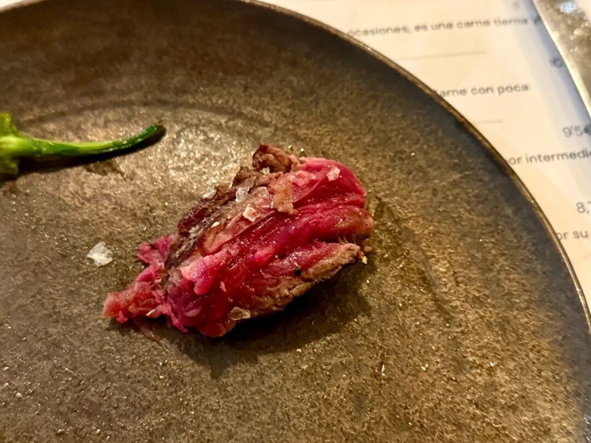

但是绝对没有一点血腥味，

你只能闻到直冲大脑的牛肉香，

咬到柔嫩的一点都没有渣的牛肉，

只有鲜味和浓郁的牛油香味，

还是温热的一点不腻！

总之它就是一个完美的

热腾腾炭火香版牛肉刺身啊，

真的是世界上最好的牛肉了～～

我觉得此生绝对值得吃一次的那种！

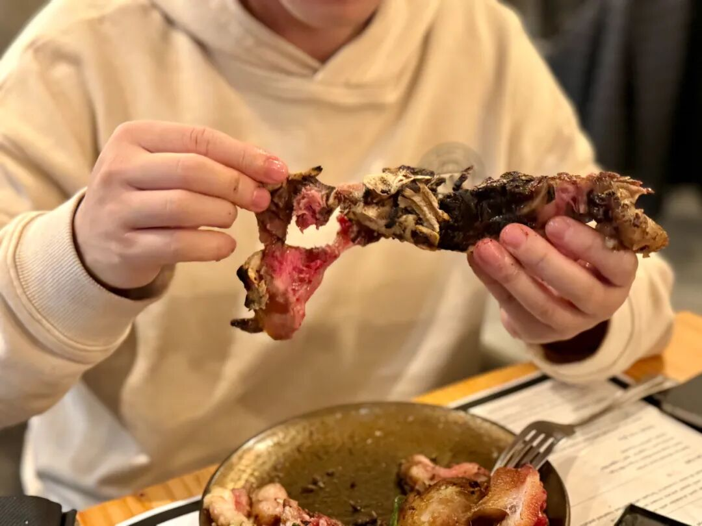

小伙伴还把骨头啃了，说这骨边肉简直是大美味～～

餐厅本身在马德里、马拉加都有分店，

但马德里有更有趣的餐厅可以吃。

所以来格兰纳达，

一定要把它纳入行程！

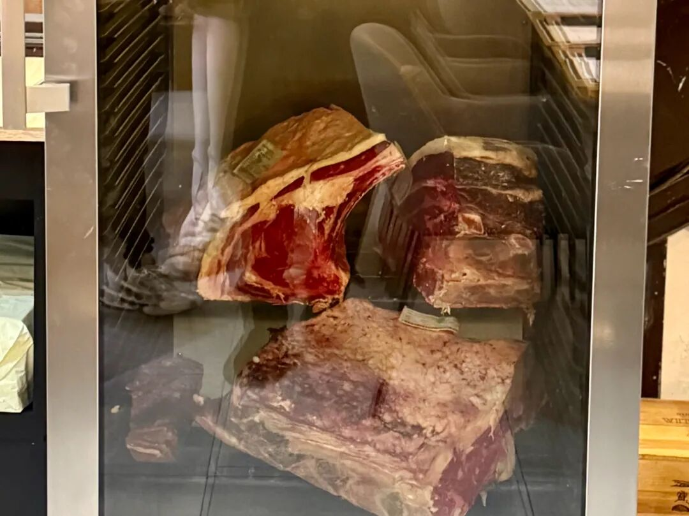

餐厅的熟成牛肉柜，现在看还馋得不行。。。

最后我要推荐一下我的旅游计划小伙伴，

这是他的公众号：

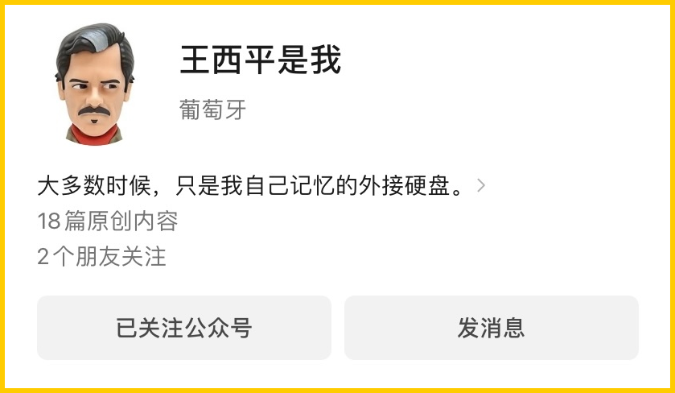

这是他的小红书：

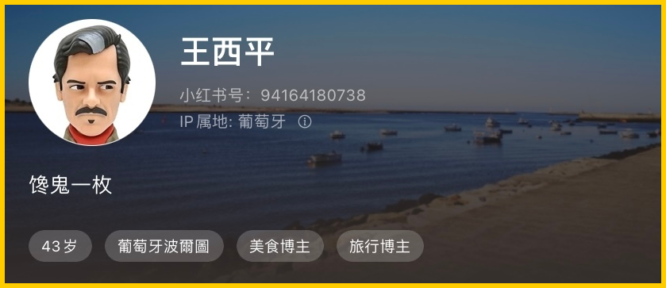

不仅是因为他常驻葡萄牙十几年，

是欧洲酒店客，

（但完全不和我聊什么积分薅羊毛什么的麻烦事儿

会给我推荐服务极好的 007 老酒店：

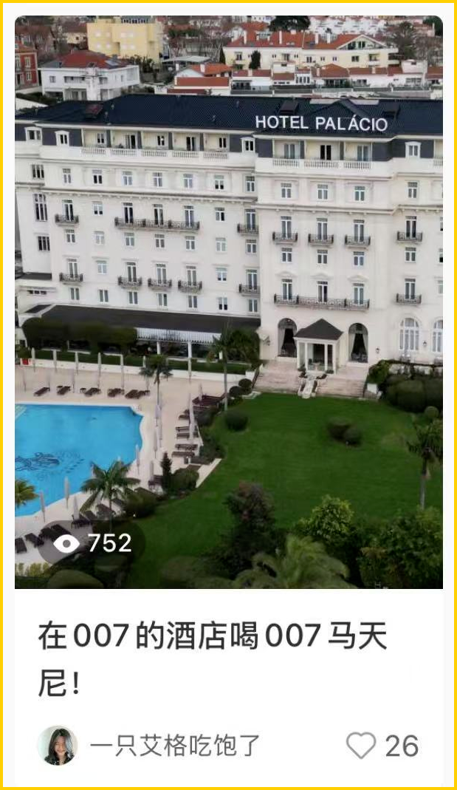

葡萄牙阿尔加维省

（大概就是欧洲三亚，但比三亚美多了

我压根不知道的富人豪宅酒店：

同行小伙伴当天的航拍就这样哦～

而且他是我司很早期的用户，

饱记海外小伙伴聊天群的忠实读者，

曾经花半年回国把我司的

城市指南（戳一下）都吃了一遍，

——这甚至是他的减肥之旅，

因为他说这些店他都走着吃

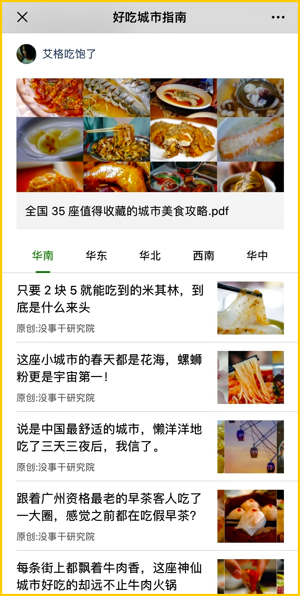

此人在行程计划里推荐的餐厅，

我这次试下来，

好用和内行程度

超过米其林和 google 地图餐厅 review。

hhhh 这个我吐槽的米其林餐厅就是我自己找的，他作为本地内行压根没考虑过

感兴趣点这篇：你人真好，但好离谱啊。。。。。

所以基本上他就是

帮我把酒店、餐厅串在一起，

规划了整个旅游路线，

实在喜欢，

也很骄傲我们饱记的客人都这么厉害

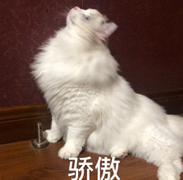

希望饱记客人多多互相认识，

爱你们

以及有空也把我的小红书

「一只艾格吃饱了」关注起来哦～

最近变成重度用户了hh

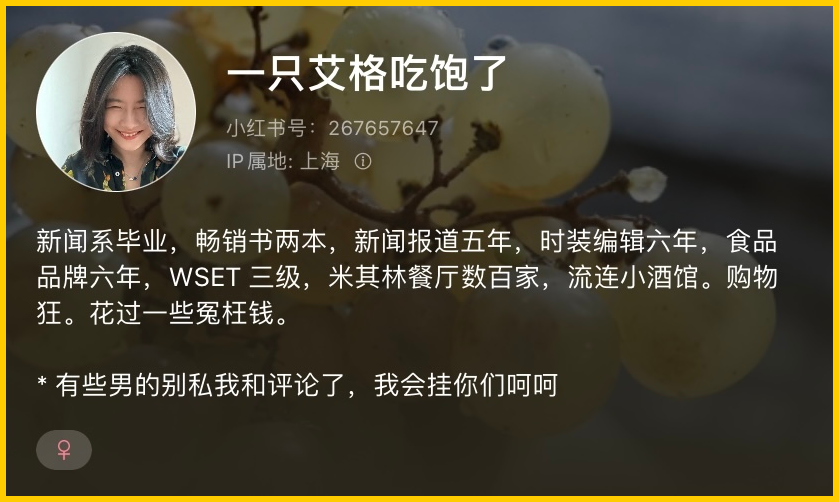

题 外

暂时吃不上欧洲的牛肉，

看看我薯角从天南地北搜罗的好东西哇！

这司还得是本薯会敲锣打鼓～

月底就下架的富平柿饼，

再见就是下一个冬天！

尾声限时 85 折！

上周刚冒出来的临安天目山雷笋，

米其林餐厅师傅第三年回购，

不焯水就鲜甜！

现在也有限时 9 折！

刚好配真材实料的饱记腊肠，

限时地板价 8 折！

或者试试好吃不贵的

玫瑰露酒腊肉&腊排骨，

更是限时地板价 7 折！

回到童年的铁盒蛋卷，

产品经理卷出来的鸭舌、麻花、猪肉脯，

都给一个限时 7 折！！

还有些适合空调房吃吃的水果👇

风味很浓的蒙自花长虹枇杷，

清新浓郁的万人迷上海金奖草莓👇

个头基本都在18mm+的云南露天蓝莓，

微甜饱腹、没啥热量的广西双拼芭乐，

现在也有限时 9 折！

此外 90 天短保质期的大师凤梨酥，

外面买不到的稀奇货75%木姜子黑巧，

也都有限时 9 折冲冲！

饱记·富平柿饼

购买方式如下

尾声限时 85 折！！！

戳图购买👇

饱记·2025 临安天目山雷笋

购买方式如下

限时 9 折！！！

戳图购买👇

饱记·手工腊肠购买方式如下👇限时地板价 8 折！！！！
戳图下单购买👇或🍑🍑🍑搜索「艾格吃饱了」

饱记·玫瑰露酒腊肉&腊排骨购买方式如下👇限时地板价 7 折！！
戳图下单购买👇或🍑🍑🍑搜索「艾格吃饱了」

饱记·蒙自花长虹枇杷

购买方式如下

限时吃水果 9 折！！！

戳图购买👇

饱记·限定铁盒酥酥蛋卷购买方式如下限时开门红 7 折！！！
戳图购买👇

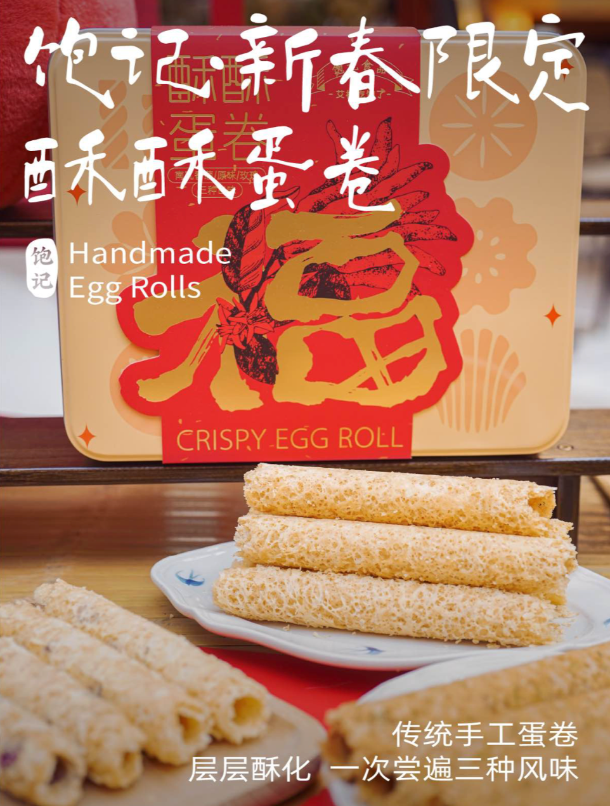

饱记·年味零食

7 折专区！！

购买方式如下

戳图购买👇

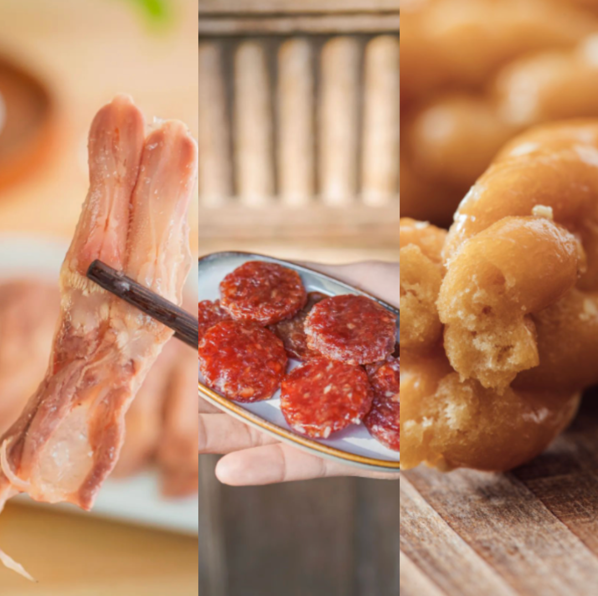

饱记·红颜草莓限时吃水果 9 折！！！新年莓有烦恼！！
戳图购买👇

饱记·云南高原蓝莓限时吃水果 9 折！！！新年莓开眼笑！！！
戳图购买👇

饱记·广西双拼芭乐限时吃水果 9 折！！新年健康快乐！！！
戳图购买👇

饱记·新鲜到货凤梨酥限时 9 折！！！
戳图购买👇

饱记·云南木姜子75%黑巧克力购买方式如下限时 9 折！！
戳图下单购买👇或🍑🍑🍑搜索「艾格吃饱了」

本文的研究员

闻 佳就是那个研究院嘴里「挑剔的老板」。关于食物，不是比你懂得更多一些，只是比你花了更多的冤枉钱。

用好吃的方式吃一生

祖国各地好风物

文章转载请加微信「baojiclub」

