# 都这时候了，你们吃儿点好的吧。。。

- 原文链接: https://mp.weixin.qq.com/s?__biz=MjM5NTYxODQyMA==&mid=2653463032&idx=1&sn=1efc2215d70c3224602581c475dfd3d9&chksm=bcefdf5899e1e57cd4a06c6d69f1e03940486f5d3310ac71a503bceeaf0f7fadc64c4ee732d6&scene=27#wechat_redirect
- 浏览量: N/A
- 点赞数: N/A
- 评论数: N/A
- 转发数: N/A

## 正文

馋是真馋

一个尽情安利自我的公众号

以下是没事干研究院的风物研究报告请放心食用
即将又撑过一周，本薯在这里和大家互道一声喜啊！今天这班差不多就上到这里，给你们准备了一些时令里的顶流美味，周末吃点儿好的！

包邮区犒劳自己的首选，有且必须有这个时节
只只黄多油丰的大闸蟹！

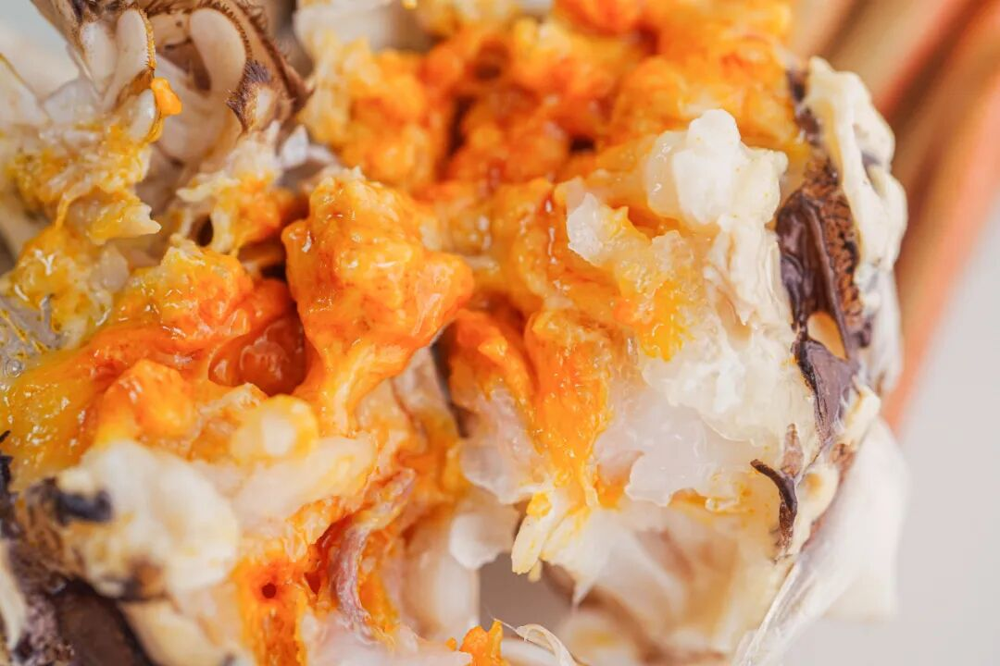

我司兜兜转转了八年，
在整个包邮区筛出两个宝藏产区，一是来自太湖流域的精挑大闸蟹！送礼请客都体体面面没在怕！二是洪泽湖大闸蟹，性价比的王！好吃多啃不心疼！

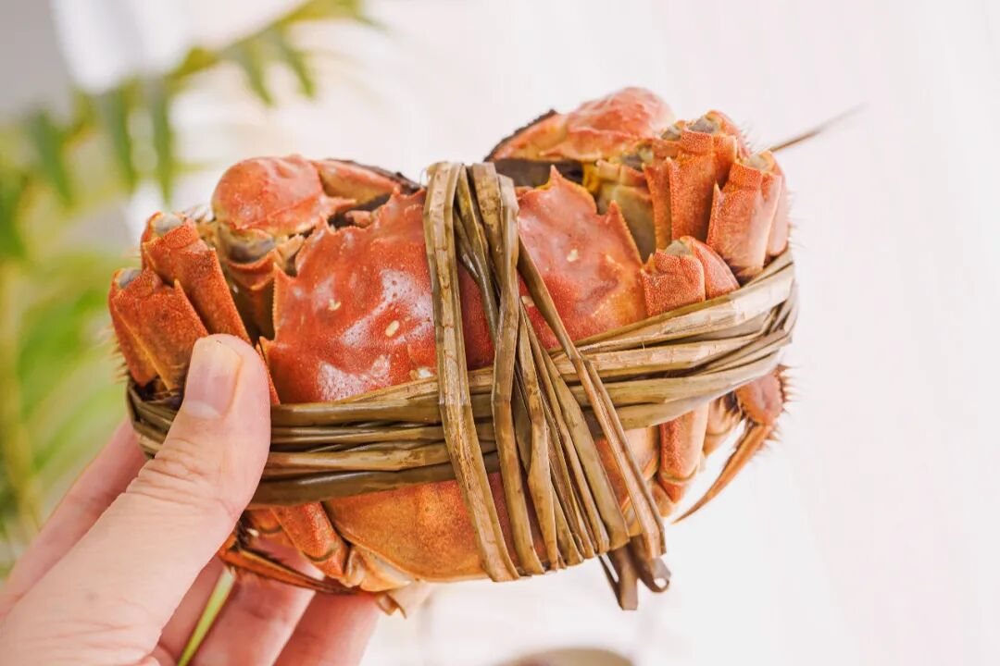

今天收集了几个问题，来答读者问，客官请往下看👇

新鲜吗？

关于这问题，只能说我司在时令生鲜方面，
从来都是卷！新鲜只是基础中的基础。

不管太湖流域还是洪泽湖，都是从产地安排顺丰快递，只只都按去绳净重、足斤足两发货。太湖流域每日限量 50 箱，
洪泽湖每日限量 100 箱，拼的就是手速

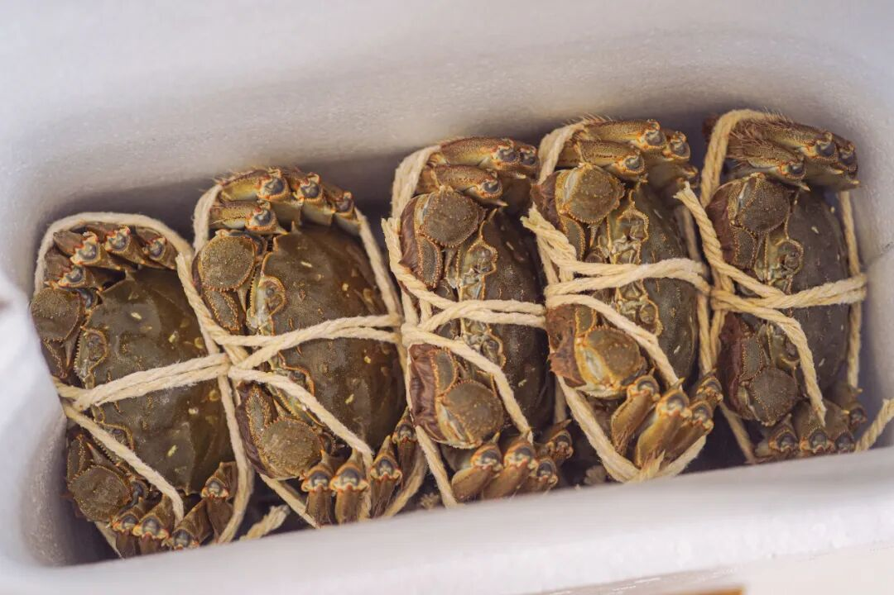

品质怎么样？
先说太湖流域大闸蟹。

苏州吴江盛泽这块，

产正宗的清水大闸蟹，

如今乃苏南蟹的标杆美味！

连上海老牌吃蟹国营大店王宝和也说

自己的蟹是「太湖流域」。

为什么不追赫赫有名的「阳澄湖」呢？

原因很简单，

阳澄湖不给养啊。。。

现在很多自称阳澄湖的，

其实都是岸上塘养的，

虽然有标，但根本就是塘蟹啊。

一个热知识：大闸蟹分两种——湖蟹和塘蟹，

湖蟹是在天然湖泊中围网养殖，

塘蟹是在人工水塘中养殖。

味道根本比不了。

很多米其林黑珍珠餐厅也都因为阳澄湖禁养，

在用各个流域的蟹，

比如金湖，「太湖流域」等。。。

（因为真正的太湖湖底也禁养了

这蟹在我司指定的 3000 亩湖里长大，

活溪入水，清水整湖放养。

湖底与阳澄湖底类型近似👇

所以不容易有土腥气！

蟹肉、蟹黄吃得出明显的清甜滋味。

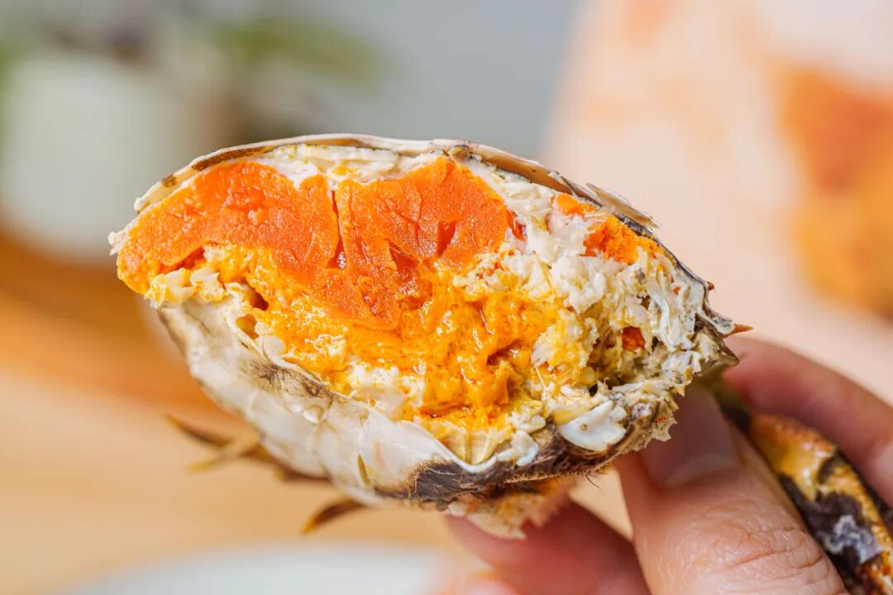

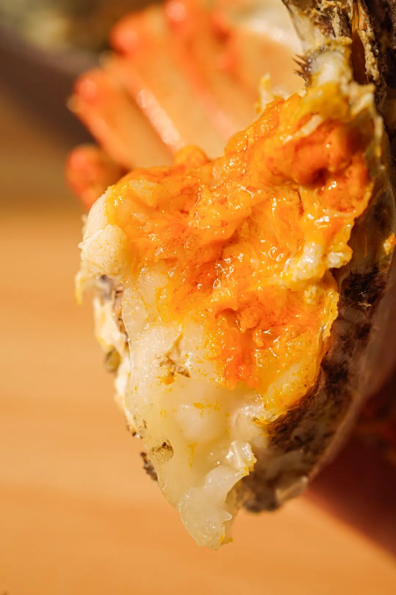

其实呢，
每个湖里都可以有好吃的螃蟹，关键还是得人工精挑！

我司的信誉，有盛泽当地村里的书记保证！

为了给村民谋福利，

书记不时就去帮咱们亲自视察和监督，

大家现在看到的和最后收到的没啥区别！

「每一只都要挑选，确保万无一失」。

（书记原话👆

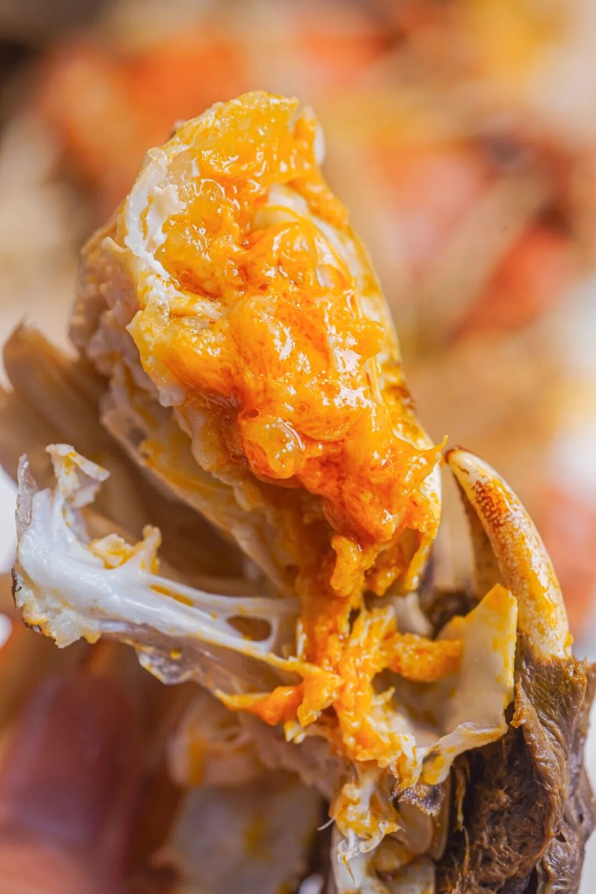

当地经验丰富的蟹农挑 2 遍以上，

饱记只要最优秀的前 10%！

壳一定要硬，黄一定要满，

人工一只只掀开看，

确认了膏黄油丰才发货嘿嘿～

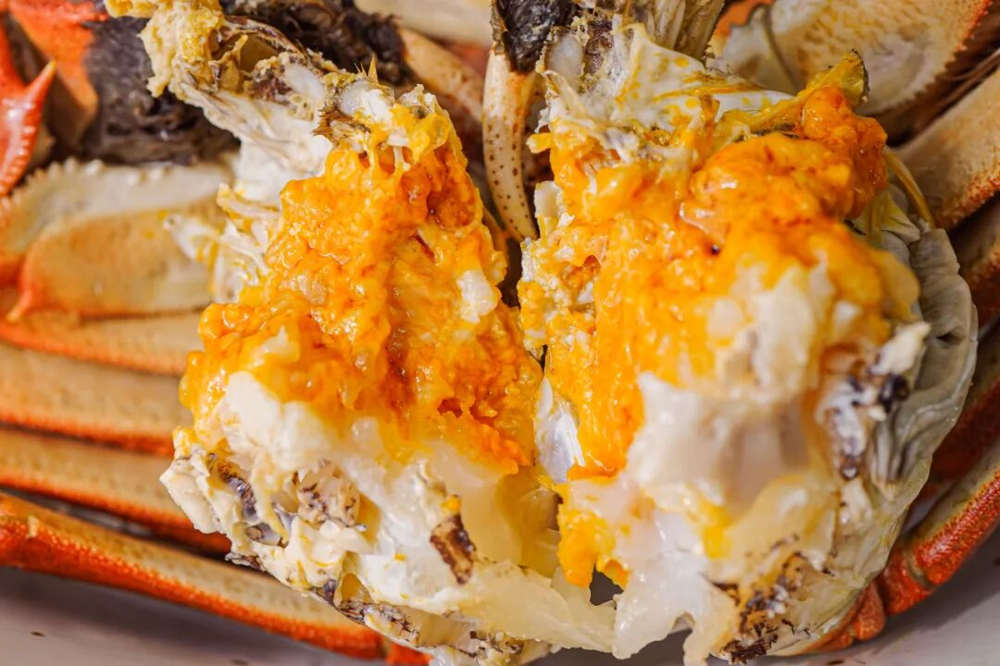

而且！

上岸的螃蟹，还会再养几天！

喂一喂玉米，

让螃蟹把苦水都出来，

才给大家发哦！

这样收到的螃蟹蒸出来就是甜的！

不苦不腥！

虽然成本又上去了呵呵。。。。。。

而淮安洪泽湖的大闸蟹，和太湖流域那边一样的是，
我司同样要求精挑+吐苦水！

合作伙伴同时供货上海国营大酒店，

是行业内专业人士认可的货源！

但饱记要的发货品质比酒店还要更好（骄傲脸

只要湖里顶尖蟹的前 10%。

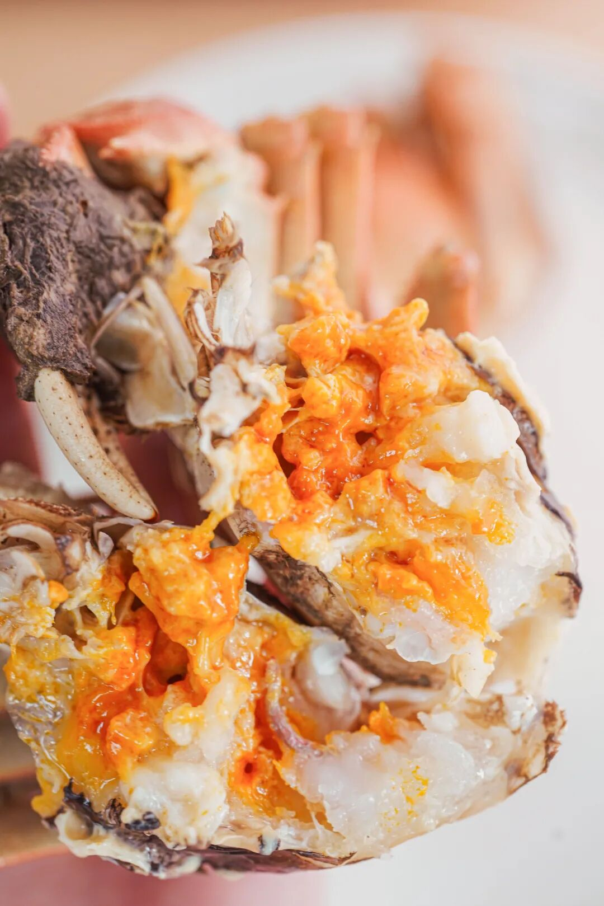

洪泽湖本身湖大水深、风高浪急，（不查不知道，一查竟在中国五大淡水湖里排第四位！所以这蟹生存不易，

基本上是半野生的状态。

图源@洪泽政府网

每一只上岸后精养几天吐苦水，

顺丰直发，

收到没苦味，鲜甜得嘞～

总之，溢价少，肉质好，性价比高。在苏北蟹里，品质更高，规格更大，口碑更硬。

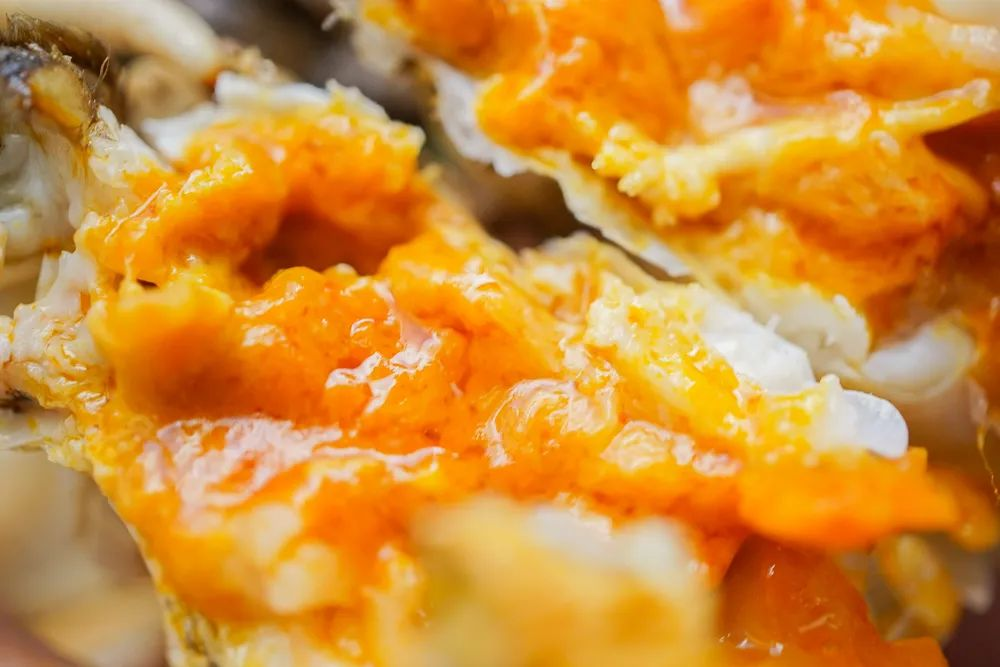

好吃吗？
风味的问题，从来见仁见智！但是本薯可以简单说一下两蟹的风味区别，供大家伙儿参考一二～

太湖流域大闸蟹，

是阳澄湖、太湖蟹口味流派，

蟹肉微微带甜，

一股子清新的蟹腥气久久不散，

吃完后指尖闻得到！

（不过别担心，当地人教我们用牙膏洗一洗即可！

母蟹的蟹黄金灿，

入口鲜美干香。

公蟹肉更多！

肉质甜嫩，入口蟹膏糯而弹👇

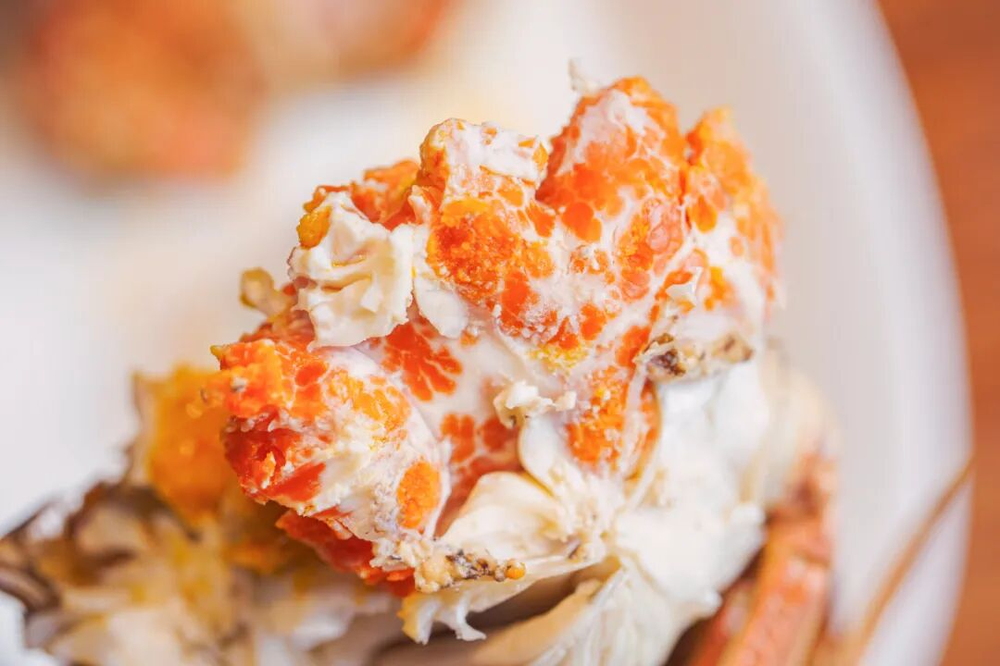

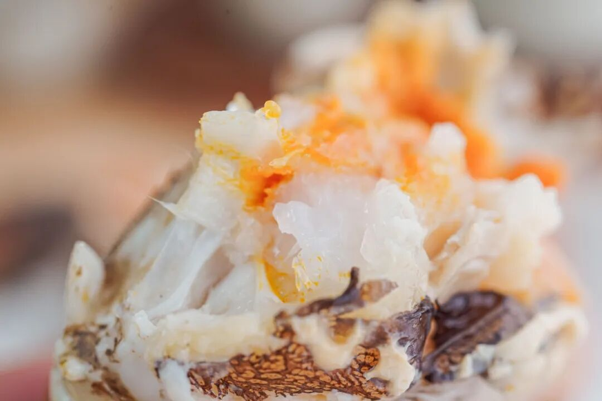

蟹腿也是只只饱满，

软弹鲜甜！

啊～幸福到要晕倒！

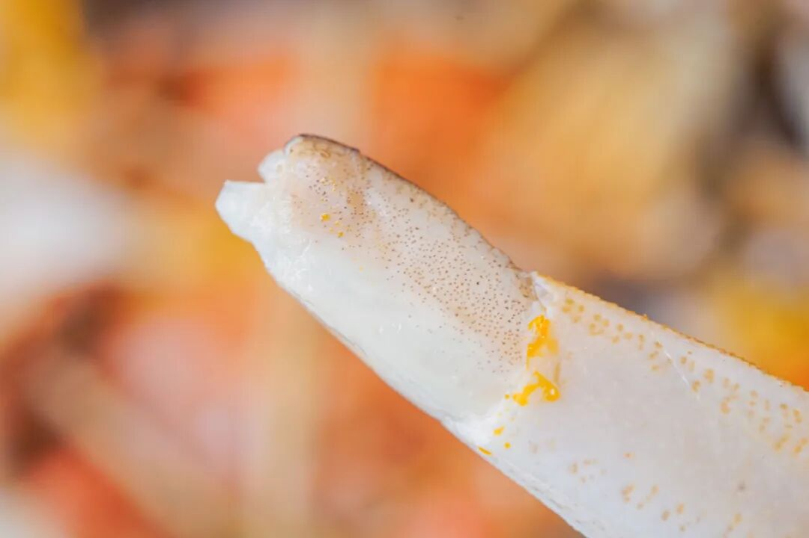

而洪泽湖大闸蟹，比起太湖流域大闸蟹的甜，更明显的是鲜！

吃起来自带微咸，

蟹味是汹涌的鲜浓。

推荐搭配镇江香醋，把鲜味简单钓出来，就很香很香很香很香很香！

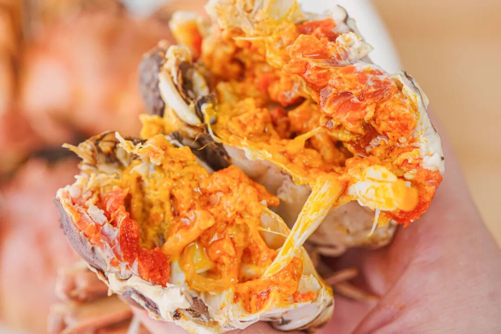

总之，

洪泽湖的性价比高些，

蟹味鲜浓！

太湖流域的送礼超体面！

蟹肉微微带甜。

周末给大家都薅来限时三天 88 折！

两种口味大家各取所需！

Peace&love!

饱记·太湖流域大闸蟹

购买方式如下

限时三天 88 折

三种搭配：

满足装，

3-3.4 两母蟹，4-4.4 两公蟹，

吃过解馋。

劲爽装，

3.5-3.9 两母蟹，4.5-4.9 两公蟹，

可以拍照发朋友圈争奇斗艳。

尊享装，

4-4.4 两母蟹，5-5.4 两公蟹，

顶格水准，适合送礼。

人工精挑，

上岸后静养一两日更鲜美，

每日限量 50 箱。

拼的就是手速。

顺丰快递发货，

新鲜看得见。

戳图下单购买👇或🍑🍑🍑搜索「艾格吃饱了」

饱记·洪泽湖大闸蟹

购买方式如下

限时三天 88 折

满足装洪泽湖大闸蟹：

3 两母蟹，4 两公蟹。

性价比之选！

劲爽装洪泽湖大闸蟹：

3.5 两母蟹，4.5 两公蟹。

饱记热销款。

尊享装洪泽湖大闸蟹：

4 两母蟹，5 两公蟹；

或 5 两母蟹，6 两公蟹。

实际超重，量极极极少，送礼佳品。

人工精挑，

上岸后静养一两日更鲜美，

每日限量 100 箱。

顺丰快递发货，新鲜看得见。

戳图下单购买👇或🍑🍑🍑搜索「艾格吃饱了」

题 外

还有还有！

昨天刚上的今年份的象山红美人，

大家买了吗？

我不允许任何人错过它啊啊啊啊！

堪称整个冬天最好吃的水果（之一

现在还有难得的限时早鸟 86 折！买它！

此外外面买不到的金山瓢鸡，

这批卖完下次得等半年了！

坚持真材实料、天然肠衣的手工腊肠，
能做煲仔饭和火锅的玫瑰露酒腊肉&腊排骨

有小时候番茄味的云南西红柿（快没了，

还有打遍天下无敌手的山核桃！我司卷中卷产品，拿到外面去都能打得很！具体你们看商详，最重要是还有些限时返场折扣再薅老板一回！冲！

饱记·象山红美人柑橘购买方式如下限时早鸟 86 折！！
戳图购买👇

饱记·云南稀有品种瓢鸡

购买方式如下

限时突破价 7 折！！

规格第一档：6 月龄公鸡净重 3.4 斤以上 70 只，6 月龄母鸡净重 2.5 斤以上 140 只。规格第二档：
6 月龄公鸡净重 3 斤以上 160 只，6 月龄公鸡净重 2 斤以上 140 只。
下单前请注意：此鸡蛋白质含量丰富，宰杀时已尽量放血，但少量余血开包时气味仍会比较大，请冲洗再食用！鸡皮不发粘，就绝非变质～～～

戳图下单购买👇

或🍑🍑🍑搜索「艾格吃饱了」

饱记·云南西红柿购买方式如下限时 86 折！！
戳图购买👇

饱记·手工腊肠

购买方式如下👇

戳图下单购买👇

或🍑🍑🍑搜索

「艾格吃饱了」

饱记·玫瑰露酒腊肉&腊排骨

购买方式如下👇

戳图下单购买👇

或🍑🍑🍑搜索

「艾格吃饱了」

饱记·临安山核桃

购买方式如下👇

戳图买它👇

或到🍑🍑🍑

搜索「艾格吃饱了」

本文的研究员

薯角蟹蟹侬

用好吃的方式吃一生

祖国各地好风物

文章转载请加微信「baojiclub」

