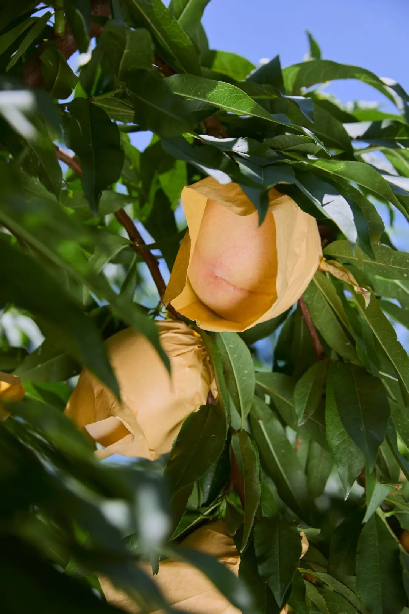
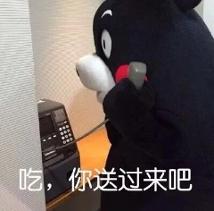
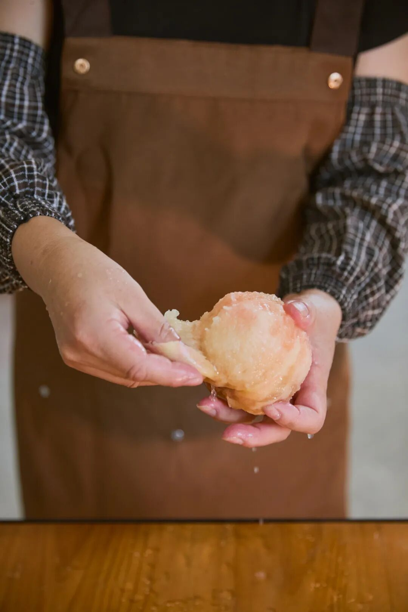
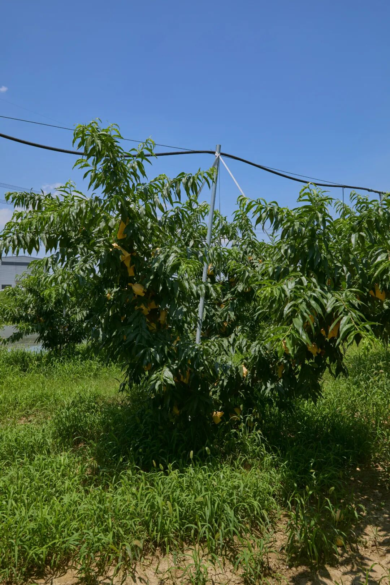
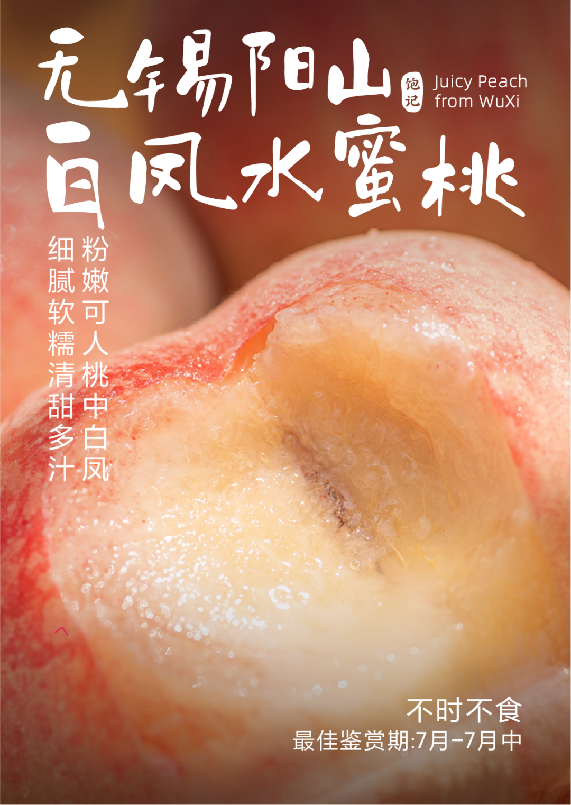

# 阳山白凤水蜜桃，最后 48 小时

- 原文链接: https://mp.weixin.qq.com/s?__biz=MjM5NTYxODQyMA==&mid=2653456064&idx=2&sn=5e6e44c56b7d0d30d0c4e2e291f92fb1&chksm=bc45e86ebd0f04e4f17b5432521032666401702210e6eeb23247fdc15945fbf211c384640002&scene=27#wechat_redirect
- 浏览量: N/A
- 点赞数: N/A
- 评论数: N/A
- 转发数: N/A

## 正文

正宗阳山水蜜桃

一个尽情安利自我的公众号

以下是没事干研究院的风物研究报告请放心食用
矜贵万分的阳山白凤水蜜桃～
才吃了没几天，
一不留神，只剩最后的 48 小时了！！

不舍，目送它离开之前，最后再吃两口～今年因为天气原因桃子减产，特级·阳山白凤前两天卖空，今天终于补到了一些！！但只有限量 100 份！！！优级·阳山白凤，也有
一盒 8 颗装，现在都 9 折！！

如果你第一次听说，
再来抄复习一下之前的稿子吧！！！（已经学过的直接拉最下方买即可！

首先饱记多年合作的果园，
每一颗桃子都是人工精挑，级别的区分主要看桃子的个头和重量，果肉风味其实不受影响～

（梅雨季过后，桃子在树上晒足一两天才发货，更甜～
阳山白凤之所以闻名，主要因其个大形美，水灵灵，沉甸甸，白中微微透出一些粉，年年此时，都是外貌协会送礼首选～

吃起来嘛，最明显的是香气，桃林里刚摘下来，一进室内便散发浓郁的芬芳蜜香。且汁多清甜，
撕皮时像拧了水龙头，举起来吃桃汁直流到胳膊肘！

熟果徒手捏软后，

轻轻一挤就爆汁～

甜，但不是那种蜜蜜甜，入口是清爽的软嫩细腻，所以一个人也可以吃完一整颗，甜而不腻～

不同年份因为天气原因，
风味会有些许的差异，但随手拿几颗测测，糖度基本都在 12-13 左右。

不过吃阳山桃，还得分辨一下真假。市面上的阳山水蜜桃大多是假的，因为正宗阳山水蜜桃只占市场 30%，核心种植面积就那么 2w 多亩～

但卷产地这件事嘛～我司向来无所畏惧，首先是桃农协会的授权证书！

饱记合作多年的果园，是核心产区的基地，地下水喷灌，用机器代替人工，不打除草剂。

每一颗都由人工细心套袋长成，

让白凤水蜜桃光照均匀，色艳味美，

物理防虫、防鸟、防晒伤～

再由当地种植经验丰富的果农

担任挑桃师傅，

经三道人工逐粒筛选，

根据颜色、软硬程度，

只选七八分熟的好果。

虽经过精挑，

但为了避免果子在长途运输中过熟软烂，

收到手时会有一部分青绿色（左），

一部分白粉色（右），

优先食用软桃熟果，

较脆硬的果子可在通风干燥处存放 3-5 天。

优级单果 5-6 两，现货，

一箱 8 颗，

顺丰水蜜桃专线，

直接从果园送到你的手中！

本薯的差从不白出，

在果园里汗如雨下，

反手跟老板薅来一个高温折扣，

「这么热的天我还要卖货我容易吗？」

所以阳山白凤水蜜桃，现在 9 折！！

老板上火我降温！冲啊！！！

饱记·无锡阳山白凤水蜜桃购买方式如下👇限时 9 折！！
一年一季，久别重逢。
纯正无锡阳山核心产区，
一个枝头只结一只果。
每日清晨壮年树上现采，7-8 分熟，
挖一勺，像吃浓郁冰淇淋！
两种规格：特级·阳山白凤，单果 6 两，限量 100 份！优级·阳山白凤，单果 5-6 两，
一盒 8 颗装，留家自己尝尝。

戳图买它！！！👇

或到🍑🍑🍑搜索

「艾格吃饱了」

题 外

和桃子很配的是什么？
没想到吧！正是我们的桂花乌龙！！邀来福州老茶人窨制，一层金桂一层茶，随手冷泡一杯，往里挤点儿桃汁，再舀两勺果肉，和外面的果茶没区别，甚至更天然有滋味嘻嘻～

饱记·桂花乌龙（小金罐）

限时最后 1 天！

单罐天🐱限时 9 折！

组合装全平台限时 9 折！！

安溪戴云山脉深处的六年陈炭焙观音，寒露前后打的新鲜金桂，饱记请来家中五代制茶的福州老茶人，以传统古法窨制，一层金桂一层茶，100 斤的茶要用 300 斤桂花分三次窨制。
观音茶染有花香，金桂衬着茶意～冷泡、热泡皆适宜！升级版小金罐，送礼自留都满足。

两种规格：

单罐装：桂花乌龙（1盒），

天🐱买 9 折，到今天～

组合装：

桂花乌龙（1盒）+柚子小种红茶（1盒），

全平台打 9 折！！也只到今天～

都是我薯角给你们搞来的折扣

戳图即可购买👇

本文的研究员

薯角

软桃党有话说！

用好吃的方式吃一生

祖国各地好风物

文章转载请加微信「baojiclub」

