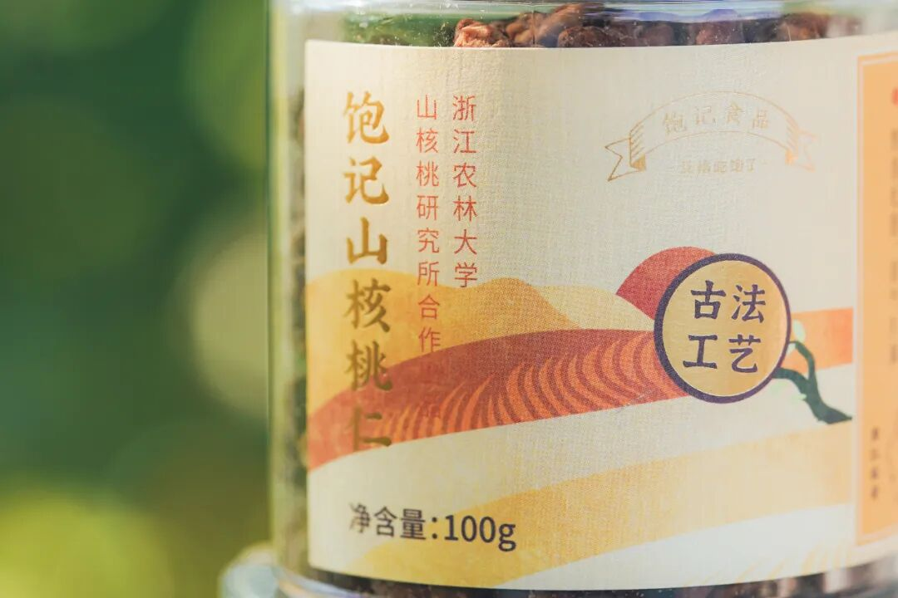
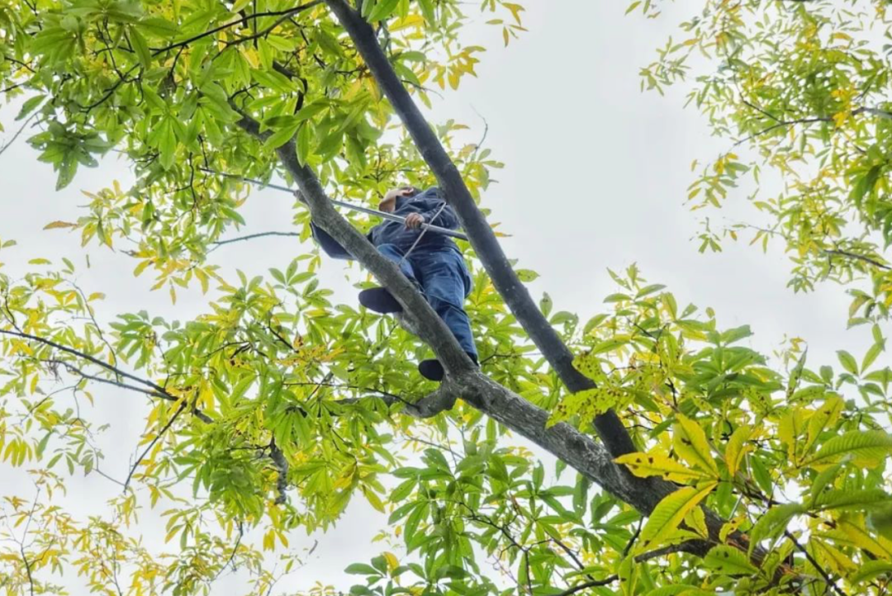
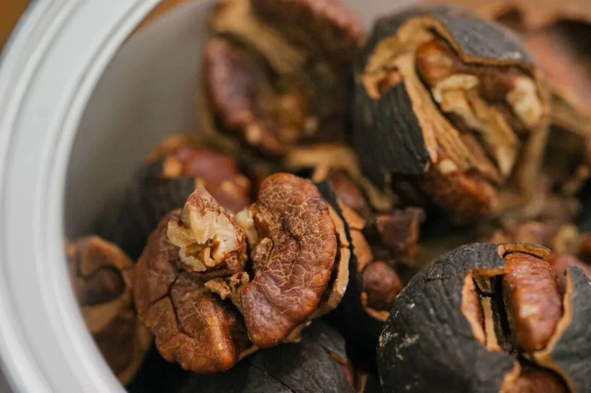
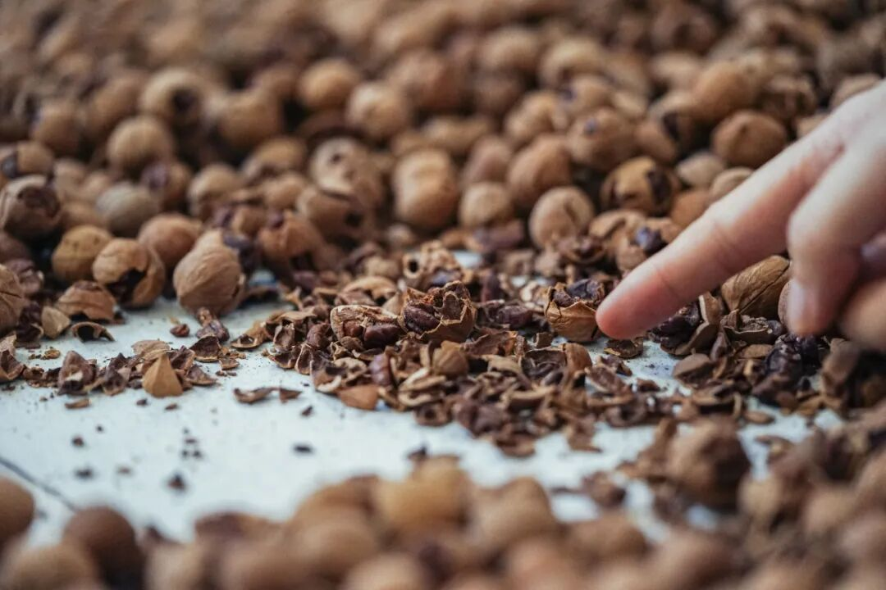
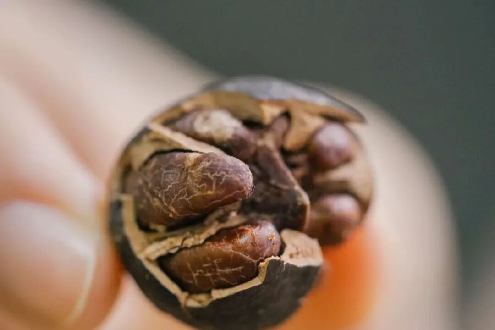
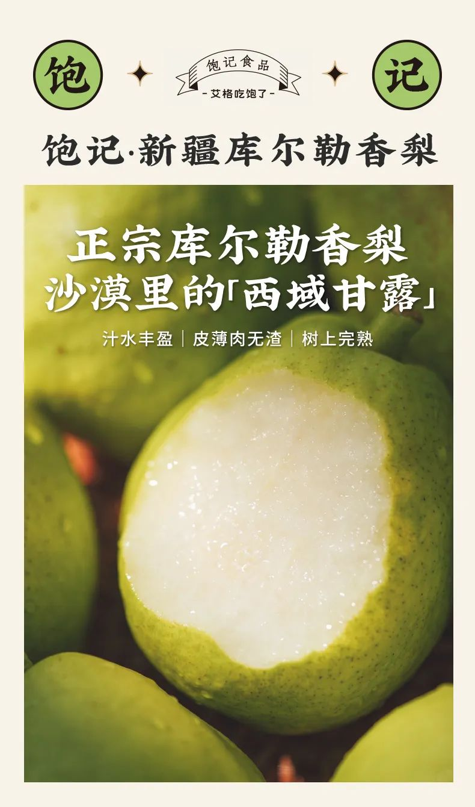
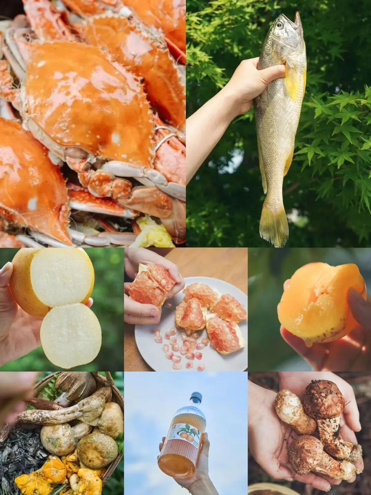

# 饱记的初心，一个杭州人对它的梦

- 原文链接: https://mp.weixin.qq.com/s?__biz=MjM5NTYxODQyMA==&mid=2653460193&idx=1&sn=4c40640006af750a0786c674a1948c71&chksm=bc95df6f154a2134359c6fe971d1087f97d260b6f84ff11184823ba40f66219252004ea9c413&scene=27#wechat_redirect
- 浏览量: N/A
- 点赞数: N/A
- 评论数: N/A
- 转发数: N/A

## 正文

打遍天下无敌手

一个尽情安利自我的公众号

以下是没事干研究院的风物研究报告请放心食用

啊啊啊啊啊，

大周末的还上班，

为了一期一会的山核桃，

薯角我真是拼了！

据说入秋后每个杭州人，

都心心念念着这一口酥脆，

跟老板（土生土长杭州人）求证了下👇

果真是颇有地位！

大概就如同栗子之于北京人？

馋专业如我老板，

因为觉得市面上的临安山核桃不行，

干脆自己喊上浙江农林大学

山核桃研究所的老师们来整！

细数下来，

也有 11 个年头了～

我可以淡定地说，打遍天下无敌手。

看看后台

近期出炉的新鲜好评👇

有一年浙江农林大山核桃系

开全国专家会议时，老师们买了二三十个品牌全部撕掉标签盲测。测完结果揭晓，据说老师们纷纷表示：这个结果不能往外说，不然大家以为我们夸自己呢。。。

老师们不好意思说，

薯角我可没在怕！

今天就来大说特说

这山核桃的优点有三！

一是超新鲜，都是当季新货

产品经理严格把每个批次生产日期，控制在最新鲜的 45 天内！

今年第一批已经卖空了，
现在在炒第二批，预计 15 号左右可以陆续按顺序发出～

二是农大合作出品，靠谱：我们商定用临安山核桃品种，直径、克重和日晒时间都有山核桃系本系的专业要求，浙江农林大信誉保证！

足斤足两，超克重：不是看淘宝上的「问大家」，我还不知道卖山核桃会有短斤缺两这种事。。。。

三是调味轻，保留原香：某些大品牌为了省成本，山核桃仁 100 斤要加 15 斤糖，等于你用山核桃的价格在买糖！有人每 100 斤加 4 斤糖就在讲自己好了，我们是 1.5 斤糖。十一年前就这样。

这背后不仅是成本，

还有大量桃仁碎掉的损耗，

为此，

农林大在和我们合作中花了好几年

来改进机器的效率。

不过，

今年山核桃产量因为天气原因，
只有去年的四分之一！

农户那边原料价格大涨，
像我司这种不掺外地籽和陈货的

影响就很大。。。
没办法，价格比去年贵一点点，

两种选择！

可以买手剥版一颗一颗剥着吃，

又原始又清香！

当然也可以直接上懒人版，

简单省事的山核桃仁，

一把一把往嘴里丢！

趁老板最近都在忙别的，

（之后会来说！敬请期待！

薯角我自主大家薅来一个

限时 9 折！

（把公司搬空嘿嘿

第二批 15 号开始陆续发！

这种必吃美味，

划算的！

饱记·临安山核桃

购买方式如下👇

限时 9 折！！

戳图买它👇

或到🍑🍑🍑搜索「艾格吃饱了」

题 外

昨天新上的丑苹果和库尔勒香梨，

大家买上了吗？来自云南的蒙自西北勒小苹果，
甜中带有酸度，果味极其浓郁，甚至还有溏心！喝天山雪水长大的新疆库尔勒香梨，又甜又润，嫩得连皮也能吃！

现在都有限时早鸟 86 折！！

就这几天，冲！

此外还有云南石林核心产区的

不一样人参果，

云南 30 年老树上的绿籽石榴，

东海的梭子蟹与野生大黄鱼，

云南的野生菌及鲜松茸，

即将说再见。

十月风物，限时 9 折起！

不时不食！快吃！

饱记·西北勒小苹果
购买方式如下限时早鸟 86 折！！
戳图买它！！👇

饱记·新疆库尔勒香梨
购买方式如下限时早鸟 86 折！！
戳图买它！！👇

饱记·十月时令风物

购买方式如下限时 9 折起！！！
戳图买它！！👇

本文的研究员

薯角香啊

用好吃的方式吃一生

祖国各地好风物

文章转载请加微信「baojiclub」

