# 香晕了，好解腻，一年总得喝一次

- 原文链接: https://mp.weixin.qq.com/s?__biz=MjM5NTYxODQyMA==&mid=2653466185&idx=1&sn=da96fe0337667c880e732a93019d91c4&chksm=bcd60c5e68876f081008ac27de0e669b003e9e806d5f3234d8931924f1c07b3e91643865e6b3&scene=27#wechat_redirect
- 浏览量: N/A
- 点赞数: N/A
- 评论数: N/A
- 转发数: N/A

## 正文

啧，真好喝

一个尽情安利自我的公众号

以下是没事干研究院的风物研究报告请放心食用
朋友们都开工了吗？新的一年，我薯角回来啦！（假装很受欢迎的样子过年大鱼大肉想必都吃腻了吧，今天给大家力荐几款「刮油」好茶，都又香又甜又润，趁折扣囤着随时开喝！

开年好茶其一：入口有冰糖韵的小金罐·六窨茉莉花茶👇

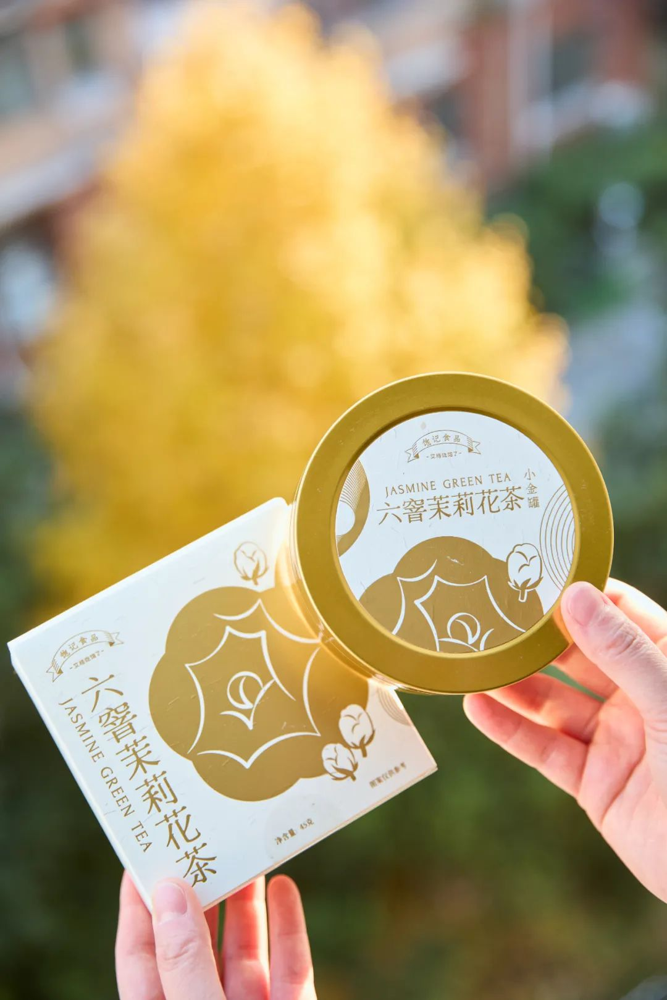

福州乃茉莉花茶的发源地，

我司特地委托了

家中五代制茶的福州老茶人，

以传统古法窨制正宗茉莉花茶！

先要在夏季鲜采数百斤茉莉花，

因为那个时节温度高但雨水少，

茉莉花柔和鲜灵，

运回后再仔细拣选，

只留花苞、颜色、大小合适的茉莉花

与茶叶拼和。

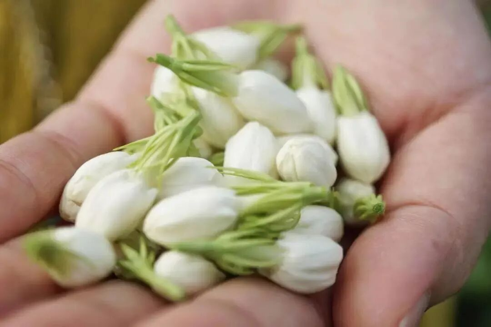

再精选明前茶坯，

六窨一提传统窨制，

下花量高达 350 斤

这还没完！

福州古法做花茶，

见花香不见花，

茉莉花窨完后还要以手工挑除，

只留茶叶与花香～

道道反复工序，

才有最后的舌尖一点冰糖韵，

抿一口茶汤，扑鼻香气～

鲜灵得让人神清气爽，

甘爽醇和，舌尖回甘，

饭后喝喝正合适啊！

升级小金罐包装，

拎着当伴手礼，

也显得咱大大方方儿的！

限时开门红 9 折！！

冲它！！！

饱记·六窨茉莉花茶购买方式如下开门红限时 9 折！！！
戳图购买👇

开年好茶其二：

我司回购率极高的桂花乌龙小金罐！

福州同事的原话：

这茶完全经得起盖碗的考验！

和市面上都是细末的调味茶不是一回事，

必须细细品味！

来自后台用户的

真实反馈👇

茶叶用的是六年陈炭焙铁观音，

同事专程跑到福建安溪，在平均海拔超过 1200 米的戴云山脉深处卷出来。茶农分三次焙火逼出茶香，最后陈放六年，耐心等待火气褪去，把蜜韵养足～

金桂，是每年寒露前后新鲜打的，早上五六点日出前打下来，运回后剔除花梗树叶，仔细拣选后才可与茶叶拼和。

然后请来福州当地家中五代制茶的老茶人，以传统古法窨制，一层金桂一层茶～

早期刚开始，我们做的是一窨一提（下花量 70 斤），后来再到两窨一提（下花量 230 斤），这次老板下了血本，直接做了三道窨制的（下花量300斤）！100 斤的茶要用300 斤桂花分三次窨制！！

（洒的不是花，是钱。。。
但懂的都懂，老福州人做花茶，讲究见花香不见花，饱记也是同样标准，桂花萎蔫后都会以手工挑除，只在烘干后额外洒入干桂花～费时费力得很！

（这么好看，不要命啦？
用盖碗泡，哇～桂花的香气完全被激发，直窜入鼻尖！带着一点花的自然甜味～入口茶汤微稠，舌侧香气余韵不绝，观音茶的回甘源源不断！

总之，闻起来是甜的，喝起来却有烤过的醇厚滋味！本当它是办公茶叶，没想到茶底这么好，还耐泡得很！立即决定囤几罐在家！

还可以搭着柚子小种红茶买！组合更划算！用的是武夷山的花香小种红茶。茶叶鲜度很高，传统手工精制，一芽一叶。

泡出来是这样的，远远都能闻到饱满的柚子香气！冷热皆可。但同样最推荐盖碗泡法！

当然你也可以像董洁一样，（是的它可是上了董洁直播间！一个人的时候拿出喜欢的杯子品品，给自己小小的仪式感？总之优雅永不过时

饱记·桂花乌龙（小金罐）&柚子小种红茶
购买方式如下👇开门红限时 9 折！

升级版小金罐，送礼自留都满足。
两种规格：单罐装：桂花乌龙（1盒）组合装：
桂花乌龙（1盒）+柚子小种红茶（1盒）
戳图即可购买👇或打开 🍑🍑🍑 搜索「艾格吃饱了」

开年好茶其三，上过亚运会国宴茶清单的饱记·桂花九曲红梅，同样升级了小金罐！

这茶喝起来，就一个词，鲜甜！是那种水润、嗓子非常舒服的甜。
桂花巨巨巨香，暖而不涩，
一杯能泡四五泡，
像我这种人就能喝一天！

平时不大喝茶的摄影师直接被俘获，当场拎了一罐走，这就是那种不需要你多懂茶就能品出来的简单直接的好喝！

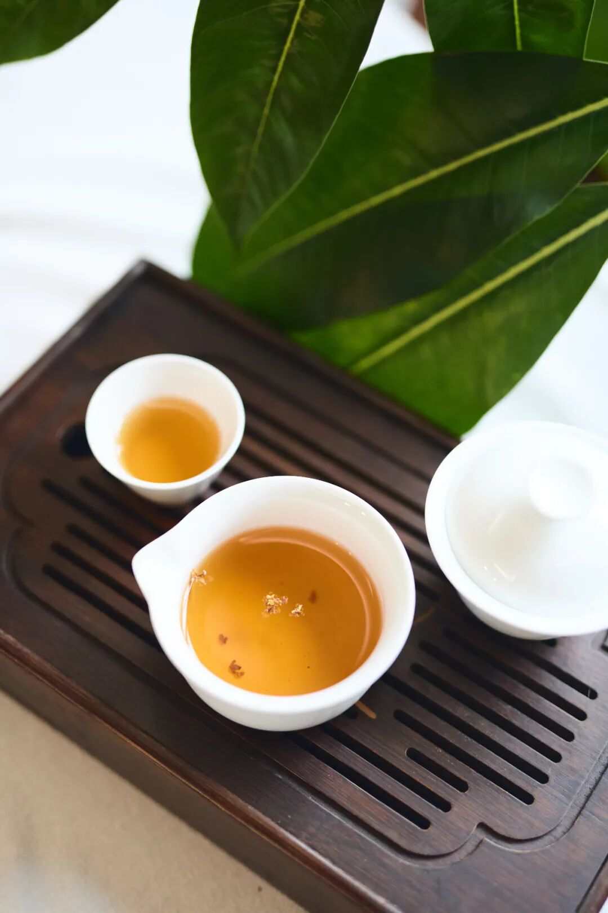

可以直接拿喜欢的杯子冲，也可以和本薯一样取盖碗泡，更能激出茶叶本身的甜香韵。茶汤红亮，空气里到处是花香和茶香👇

九曲红梅是红茶的一种，属于杭州人民的口粮茶！我饱记这款，
用钱塘产区鲜采龙井发酵制作的红茶，再采杭州市花银桂，1小时内送去窨制。

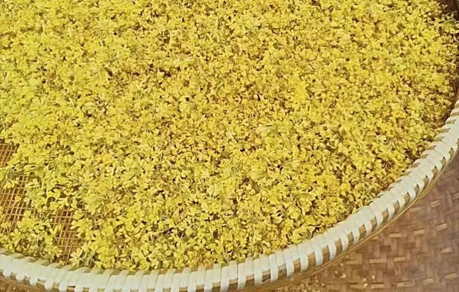

有 30 年制茶经验的老师傅，

以 2 斤桂花、10 斤茶的配比，

古法窨制 24 小时，

所以比普通窨制的花香更浓！

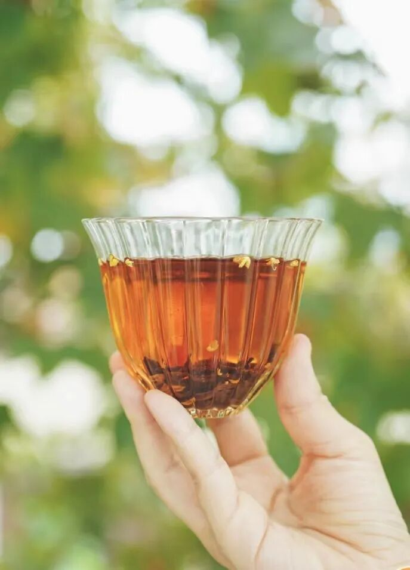

配料表超级干净，仅有九曲红梅和桂花！

大家放心喝起来啊！

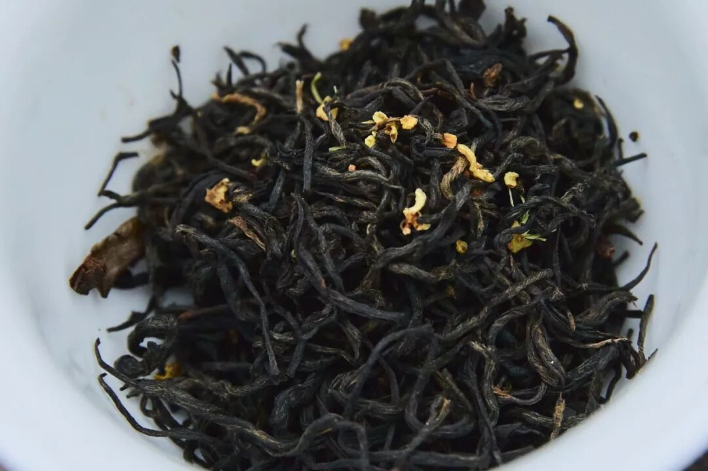

由于此茶风味接受度颇高，

喝过的人都喜欢！

尤其推荐拿它当冬日里的待客暖茶。

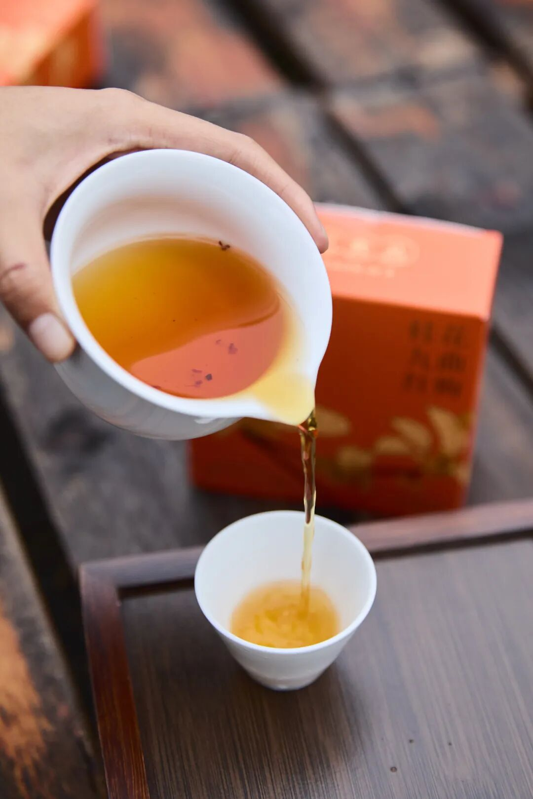

同样给大家薅来

限时开门红 9 折！

趁现在入手正正好啊！

桂花花期短暂，每批产量不大，

错过就要再等明年啦～

饱记·桂花九曲红梅（小金罐）购买方式如下👇限时开门红 9 折！！
戳图即可购买👇或打开 🍑🍑🍑 搜索「艾格吃饱了」

开年好茶其四：

新上的饱记·罗汉果普洱！

宅家时爱不释手，

是一杯容易被低估的小甜水。

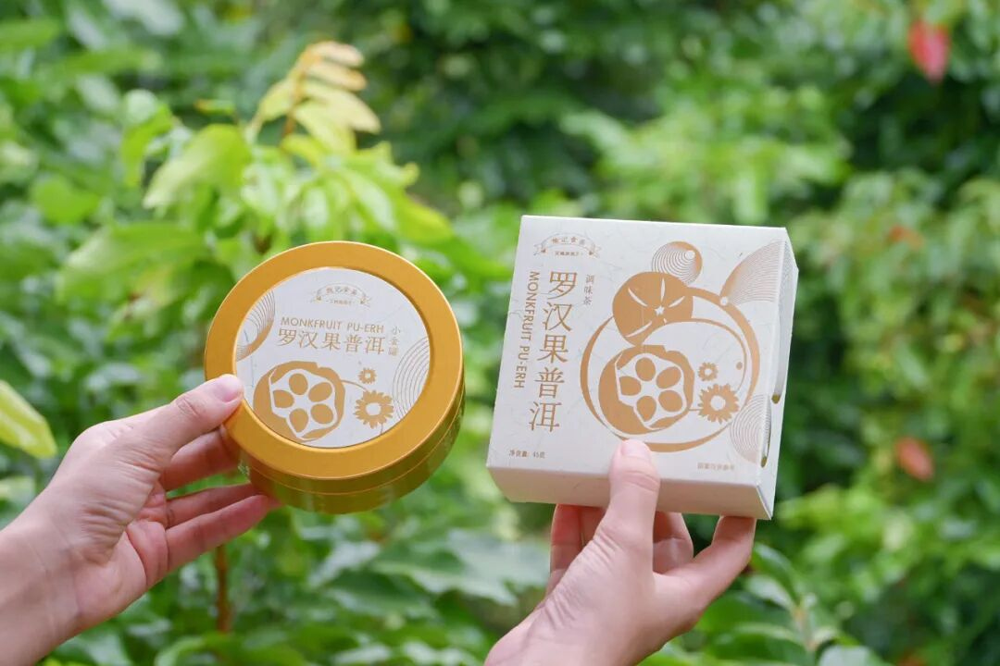

里面是晒干了的罗汉果、

云南陈年熟普还有浙江胎菊！

没有另外加糖，

入口却甘润清新，

不自觉就一口接一口喝了好多！

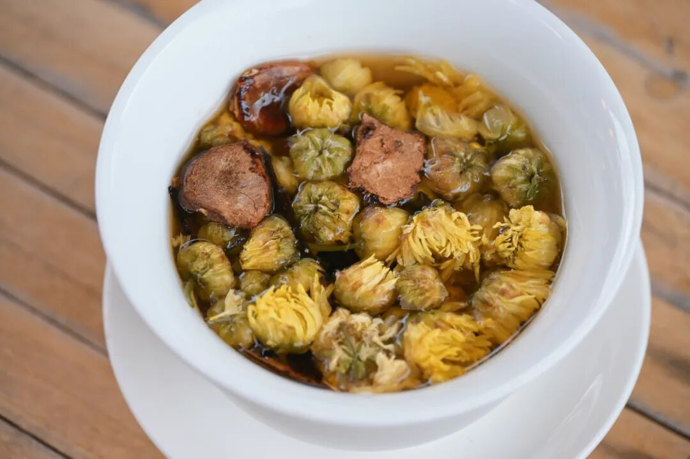

茶叶这东西，

做不了假，

好喝全来自于真材实料。

比如这枚神奇的罗汉果，

产自广西金江村。

有着香蕉和花生的清甜味。

金江村地处龙脊镇东部，

是前往桂林龙脊梯田景区的必经之地，

当地几乎家家户户都在种罗汉果，

平时就用山泉水浇灌它们。

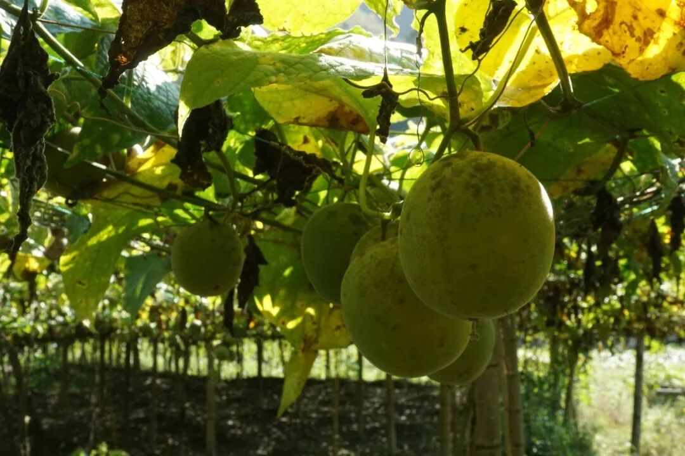

当地人会把罗汉果烤干之后，

直接泡水喝。

我们就用这种整颗敲碎、再烤干的罗汉果，

来入茶！

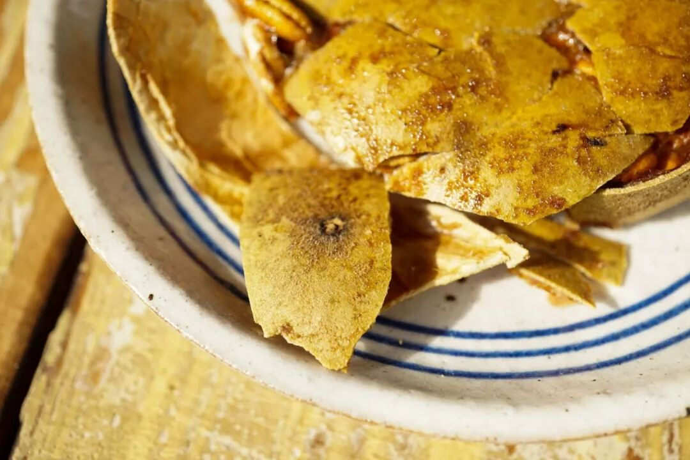

选用云南临沧凤庆

陈放七八年的熟普洱，

条索紧细匀整，色泽红褐润显毫。

再配以整朵的上等胎菊，啊好美～金黄灿烂像秋天～

习惯性拿盖碗来泡，

倒茶，注水，

很快空气里就漫出普洱茶的香气～

入口有很明显的胎菊清甜，

罗汉果在其间若隐若现，

带一点点冰凉感，

像给嘴巴开了加湿器？

会回甘的甜，

怎么喝都不会腻。

小金罐包装，

送礼也显得咱大大方方儿的！

（此处代入东北口音👆

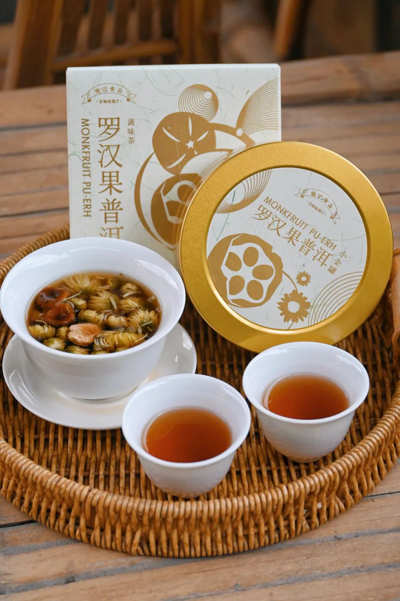

凑热闹也给到一个

限时开门红 9 折！

信我！冬天必须喝起来！

饱记·罗汉果普洱（小金罐）购买方式如下👇限时开门红 9 折！！
戳图即可购买👇或打开 🍑🍑🍑 搜索「艾格吃饱了」

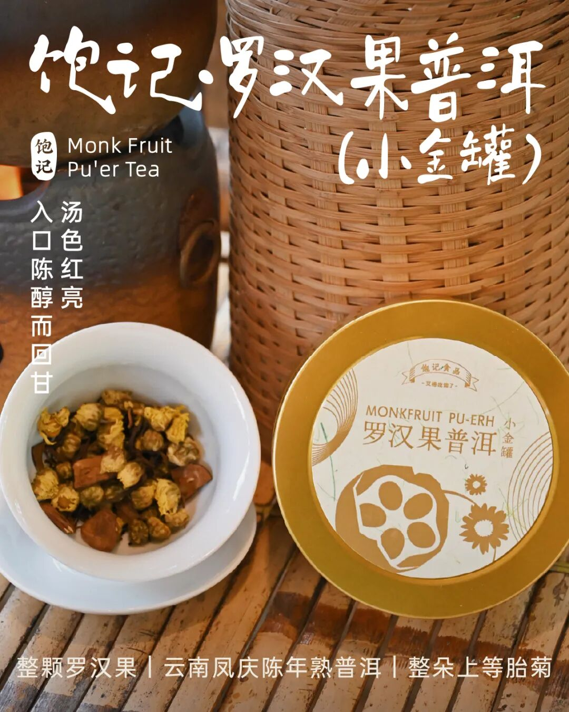

题 外

来来来！

过年没吃够的朋友看这里👇敲锣打鼓，

吃到元宵没问题的饱记年货礼盒，

天🐱有赞同折扣！

限时开门红限时 85 折！

今年冬天的富平柿饼现货中！

新年限时 85 折！

还有些适合空调房吃吃的水果看👇

难得一寻的蜜蜜甜冬日葡萄，

拿过金奖的上海白鹤红颜草莓，

还有今年份的象山红美人，

入口似果冻般嫩嫩滑滑～

现在都有限时 9 折！

此外稀奇货 75% 木姜子黑巧克力，

90 天短保质期的大师凤梨酥，

还有刚补货新到的饱记腊味们，

也都有限时 9 折冲冲！

饱记·年货礼盒

购买方式如下

开门红限时 85 折！！

戳图下单购买👇

饱记·富平柿饼

购买方式如下

限时 85 折！！！

戳图购买👇

饱记·冬日蜜蜜甜葡萄

限时吃水果 9 折！！！

新年紫气东来！！！

戳图购买👇

饱记·红颜草莓限时吃水果 9 折！！！新年莓有烦恼！！
戳图购买👇

饱记·象山红美人柑橘限时吃水果 9 折！！！
戳图购买👇

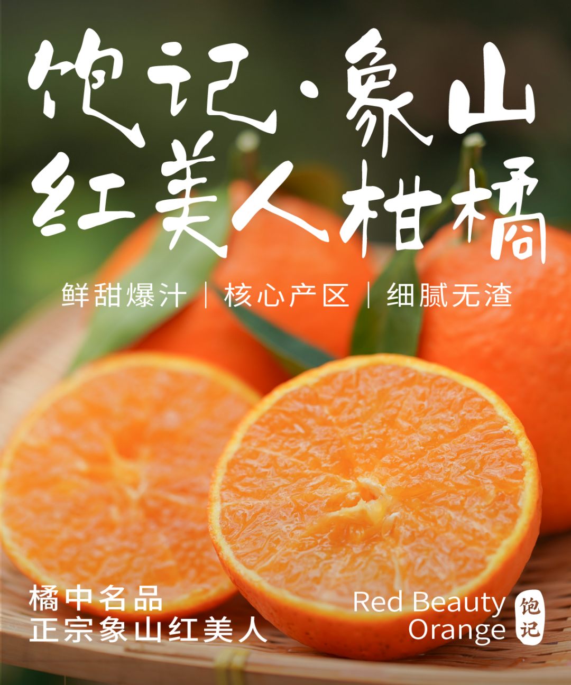

饱记·新鲜到货凤梨酥

限时 9 折！！！
戳图购买👇

饱记·云南木姜子75%黑巧克力

购买方式如下

限时 9 折！！

戳图下单购买👇

或🍑🍑🍑搜索

「艾格吃饱了」

饱记·手工腊肠

购买方式如下👇

限时全年地板价

戳图下单购买👇

或🍑🍑🍑搜索

「艾格吃饱了」

饱记·玫瑰露酒腊肉&腊排骨

购买方式如下👇

限时全年地板价

戳图下单购买👇

或🍑🍑🍑搜索

「艾格吃饱了」

本文的研究员

薯角多吃点，好过冬

用好吃的方式吃一生

祖国各地好风物

文章转载请加微信「baojiclub」

